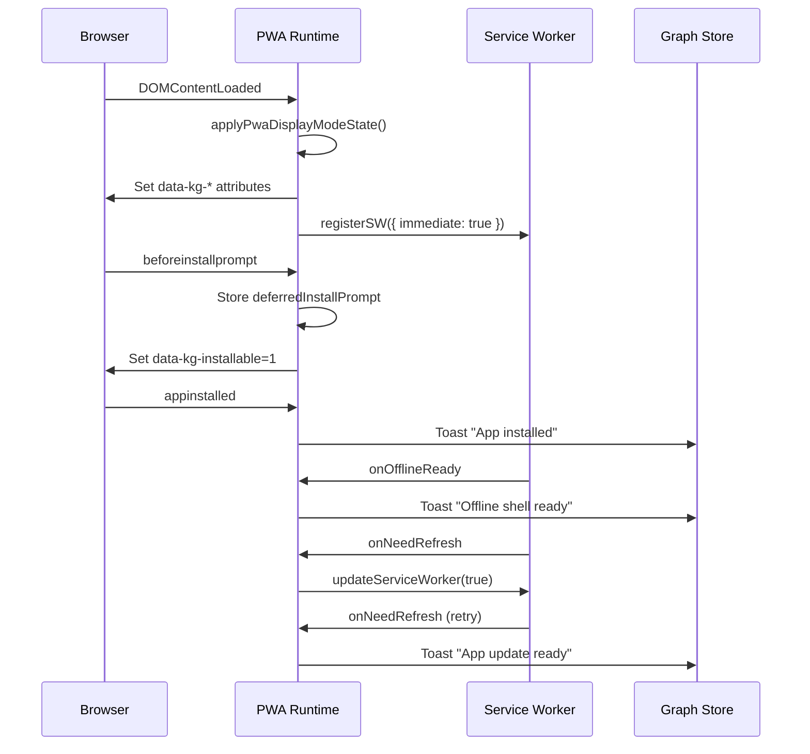

# Knowgrph Progressive Web App (PWA)

**Context**: Browser-based knowledge graph canvas deployed on Cloudflare Pages at `airvio.co/knowgrph`.
**Intent**: Enable install-to-homescreen, offline shell caching, deferred install UX, and Web Share API integration.
**Directive**: Use `vite-plugin-pwa` with Workbox generateSW; keep manifest, service worker, and runtime in one upstream source; forbid duplicate PWA configs, stale SW registrations, and conflicting deploy-time `_headers` ownership.

---

**Version**: 1.0.0
**Date**: 2026-05-08
**Status**: Deployed (manifest, SW, install button, share target, regression tests)
**Owner**: Knowgrph canonical docs
**Cross-references**: `knowgrph-storage-sync-document.md` (deployment topology), `agentic-canvas-os/todo/2026-05.md` (migrated 2026-05-08 planning history)

## Companion Files

| File | Scope |
|---|---|
| `knowgrph-storage-sync-document.md` | Cloudflare Pages deployment, D1 sync, publish topology |

---

## Architecture

```mermaid
flowchart TB
  subgraph Build["Vite Build (vite-plugin-pwa)"]
    A[index.html] --> B[manifest.webmanifest]
    A --> C[sw.js + workbox-*.js]
    D[apple-touch-icon.png] --> B
    D --> C
    E[assets/*.{js,css,woff,woff2,ttf}] --> C
  end

  subgraph Runtime["Browser Runtime"]
    F[main.tsx] --> G[installPwaRuntime]
    G --> H[registerSW]
    H --> I[Service Worker]
    G --> J[beforeinstallprompt listener]
    J --> K[deferredInstallPrompt]
    G --> L[appinstalled listener]
    G --> M[Display mode observer]
  end

  subgraph UI["Canvas UI"]
    N[Toolbar.tsx] --> O[Install Button]
    O -->|isInstallable| K
    O -->|onClick| P[promptPwaInstall]
    Q[CanvasQueryBootstrapRuntime] --> R[Share Handler]
    R -->|?share=1| S[Toast: shared content]
  end

  subgraph Cloudflare["Cloudflare Pages"]
    T[huijoohwee/_headers] -->|no-cache| C
    T -->|no-cache| B
    T -->|Service-Worker-Allowed: /| C
  end
```

## Component Inventory

| Layer | Component | File / Module | Status |
|-------|-----------|---------------|--------|
| Build config | VitePWA plugin | `canvas/vite.config.ts` | Deployed |
| Manifest | Web app manifest | `manifest.webmanifest` (generated) | Deployed |
| Service worker | Workbox generateSW | `sw.js` + `workbox-*.js` (generated) | Deployed |
| Runtime | PWA boot + install capture | `canvas/src/lib/pwa/runtime.ts` | Deployed |
| UI | Install button | `canvas/src/components/Toolbar.tsx` | Deployed |
| Bootstrap | Share query handler | `canvas/src/features/canvas/CanvasQueryBootstrapRuntime.tsx` | Deployed |
| HTML | Meta tags + icon links | `canvas/index.html` | Deployed |
| Headers source | Preview header template | `canvas/public/_headers` | Deployed |
| Headers authority | Shared Pages header surface | `huijoohwee/_headers` | Deployed |
| Icon | Apple touch icon | `canvas/public/apple-touch-icon.png` | Deployed |
| Labels | UI label constant | `canvas/src/lib/config-copy/uiMeta.ts` | Deployed |
| Query params | Share param constants | `canvas/src/lib/routing/queryParams.ts` | Deployed |
| Tests | Regression assertions | `canvas/src/__tests__/pipelinePwaEnhancementsRegression.test.ts` | Deployed |

---

## Manifest Configuration

| Field | Value | Rationale |
|-------|-------|-----------|
| `name` | `knowgrph` | Full app name |
| `short_name` | `knowgrph` | Home screen label |
| `id` | `/knowgrph/` (prod) or `/` (dev) | Scope isolation per deployment |
| `start_url` | `.` | Relative to manifest location |
| `scope` | `.` | Same directory scope |
| `display` | `standalone` | Native app feel |
| `display_override` | `window-controls-overlay, standalone, browser` | Desktop PWA window controls |
| `orientation` | `any` | Support all device orientations |
| `background_color` | `#0b1220` | Match app theme |
| `theme_color` | `#0b1220` | Match app theme |
| `categories` | `productivity, utilities, developer` | Store categorization |
| `shortcuts` | Canvas, Editor workspace | Quick-launch entries |
| `icons` | `favicon.svg` (any, maskable), `apple-touch-icon.png` (180x180) | Cross-platform icons |
| `share_target` | `GET ./?share=1` with `title, text, url` params | Web Share API integration |

`canvas/index.html` must reference the manifest through `%BASE_URL%manifest.webmanifest` so a
rewrite from `/` to `/knowgrph/` cannot bind the page to an apex-root manifest by accident.

---

## Service Worker Strategy

### Precache (Workbox generateSW)

| Pattern | Rationale |
|---------|-----------|
| `index.html` | App shell entry |
| `manifest.webmanifest` | PWA manifest |
| `favicon.svg` | Brand icon |
| `apple-touch-icon.png` | iOS install icon |
| `assets/*.{js,css,woff,woff2,ttf}` | Hashed production assets |

### Precache Exclusions

| Pattern | Rationale |
|---------|-----------|
| `assets/monaco-*.js` | Oversized editor bundle (>3 MB limit) |
| `assets/mermaid-*.js` | Oversized diagram bundle (>3 MB limit) |

### Runtime Caching

| Destination | Handler | Cache Name | Max Entries | Max Age |
|-------------|---------|------------|-------------|---------|
| `script, style, worker` | StaleWhileRevalidate | `kg-assets` | 160 | 14 days |
| `image, font` | CacheFirst | `kg-static` | 120 | 30 days |
| Same-origin `.json, .jsonld, .webmanifest` | StaleWhileRevalidate | `kg-data` | 80 | 7 days |

### Configuration

| Setting | Value | Rationale |
|---------|-------|-----------|
| `maximumFileSizeToCacheInBytes` | 3 MB | Exclude oversized bundles from precache |
| `navigateFallback` | `index.html` | SPA routing support |
| `registerType` | `autoUpdate` | Auto-activate new SW on reload |
| `injectRegister` | `null` | Manual SW registration in runtime |

---

## PWA Runtime

### Module: `canvas/src/lib/pwa/runtime.ts`

**Responsibility**: Bootstrap SW registration, track display mode, capture install prompt, publish state to DOM.

**Exported API**:

| Function | Signature | Purpose |
|----------|-----------|---------|
| `installPwaRuntime` | `() => void` | Boot SW, attach listeners, publish state |
| `getDeferredInstallPrompt` | `() => BeforeInstallPromptEvent \| null` | Check if install prompt is available |
| `promptPwaInstall` | `() => Promise<boolean>` | Trigger install dialog, return accepted |

**DOM State Attributes** (set on `<html>`):

| Attribute | Values | Consumer |
|-----------|--------|----------|
| `data-kg-display-mode` | `browser, standalone, fullscreen, minimal-ui` | CSS overscroll-behavior |
| `data-kg-installed` | `0, 1` | CSS touch-target sizing |
| `data-kg-offline-ready` | `0, 1` | Future offline indicator |
| `data-kg-update-ready` | `0, 1` | Future update badge |
| `data-kg-installable` | `1` (when set) | Toolbar install button visibility |

**Event Flow**:



---

## Install Button

### Location: Toolbar (after theme toggle)

**Visibility guard**: `MutationObserver` on `data-kg-installable` attribute → `isInstallable` state.

**Click handler**: Calls `promptPwaInstall()` which triggers the native install dialog.

**Icon**: `Download` from lucide-react.

**Label**: `UI_LABELS.installApp` = `"Install App"`.

---

## Web Share Target

### Manifest Declaration

```json
{
  "share_target": {
    "action": "./?share=1",
    "method": "GET",
    "params": { "title": "title", "text": "text", "url": "url" }
  }
}
```

### Handler: `CanvasQueryBootstrapRuntime`

**Trigger**: URL contains `?share=1` on app launch.

**Behavior**:
1. Read `title`, `text`, `url` query params
2. Show toast with shared content (`pwa:share-received`, 8s TTL)
3. Clean all share params from URL via `history.replaceState`
4. Guard against double-handling with `handledShareRef`

---

## Cloudflare Headers

| Path | Header | Value | Rationale |
|------|--------|-------|-----------|
| `/knowgrph/sw.js` | `Cache-Control` | `no-cache, no-store, must-revalidate` | Prevent stale Knowgrph SW |
| `/knowgrph/manifest.webmanifest` | `Cache-Control` | `no-cache, no-store, must-revalidate` | Instant manifest updates |
| `/knowgrph/apple-touch-icon.png` | `Cache-Control` | `public, max-age=86400` | 1-day icon cache |

`canvas/public/_headers` remains a build-time preview artifact, but deployed authority lives in
the shared Pages root `huijoohwee/_headers`. Nested mirrored `_headers` files inside
`content/knowgrph` are not authoritative and should be excluded from publish sync.

---

## iOS-Specific Support

| Feature | Implementation |
|---------|---------------|
| Home screen icon | `<link rel="apple-touch-icon" href="/apple-touch-icon.png" />` |
| App capable | `<meta name="apple-mobile-web-app-capable" content="yes" />` |
| Status bar | `<meta name="apple-mobile-web-app-status-bar-style" content="black-translucent" />` |
| Title | `<meta name="apple-mobile-web-app-title" content="knowgrph" />` |
| Icon format | 180x180 PNG (brand palette: `#0A0B0D` bg, `#32F08C` diamond) |

---

## Dev-Mode Safeguard

In development (`!import.meta.env.PROD`), `main.tsx` unregisters all existing service workers on localhost to prevent stale Vite dependency chunks from being served by a cached production SW.

---

## Regression Tests

Six test functions in `pipelinePwaEnhancementsRegression.test.ts`:

| Test | Assertions |
|------|-----------|
| `testPwaShellPrecachesHashedAssetsAndCachesLocalJson` | Precache glob, exclusions, runtime cache, shortcuts, apple-touch-icon, share_target |
| `testPwaRuntimeTracksStandaloneInstallAndUpdateState` | Display modes, appinstalled, DOM attributes, SW events, auto-update, beforeinstallprompt, deferred install exports |
| `testPwaIndexHtmlIncludesInstallMeta` | apple-touch-icon link, manifest link, base-aware manifest path |
| `testPwaHeadersIncludeSwAndManifestCacheControl` | sw.js headers, Service-Worker-Allowed, manifest headers |
| `testPwaToolbarInstallButtonWiresDeferredPrompt` | Toolbar imports, installable state, UI_LABELS |
| `testPwaShareQueryParamsHandledInBootstrap` | Query param constants, bootstrap import, toast, URL cleanup |

---

## CID Reference Table

| Context | Intent | Directive |
|---------|--------|-----------|
| Assets | Cache hashed production assets | Precache `assets/*.{js,css,woff,woff2,ttf}`; exclude oversized Monaco/Mermaid bundles |
| Headers | Prevent stale SW and manifest | Set `no-cache` on `sw.js` and `manifest.webmanifest`; add `Service-Worker-Allowed: /` |
| Icons | Support cross-platform install | Provide SVG favicon (any, maskable) and 180x180 PNG apple-touch-icon |
| Install | Enable deferred install UX | Capture `beforeinstallprompt`, export `promptPwaInstall()`, render toolbar button conditionally |
| Manifest | Declare PWA identity and capabilities | Single manifest with name, icons, shortcuts, display override, share_target |
| Offline | Cache app shell for relaunch | Precache index.html + hashed assets; runtime-cache scripts/styles/images/fonts |
| Runtime | Track PWA state on DOM | Publish `data-kg-display-mode`, `data-kg-installed`, `data-kg-offline-ready`, `data-kg-update-ready`, `data-kg-installable` |
| Share | Receive shared content via Web Share API | Declare `share_target` in manifest; handle `?share=1` params in bootstrap runtime; show toast; clean URL |
| iOS | Support Add to Home Screen | Add apple-touch-icon link, mobile-web-app-capable meta, black-translucent status bar |
| Dev | Prevent stale SW in development | Unregister all SWs on localhost when not in production |
| Tests | Guard PWA contracts via regression | Six test functions covering manifest, runtime, headers, toolbar, share handler |
