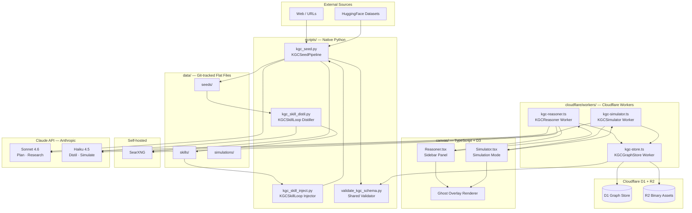
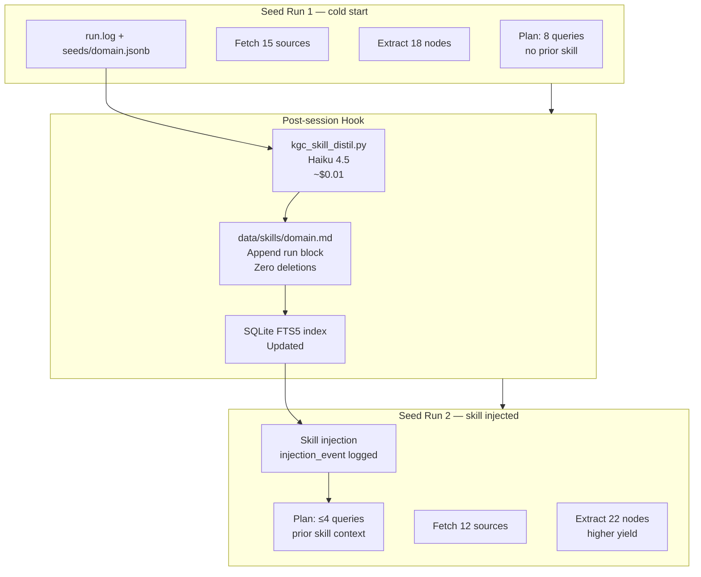

# Knowgrph Research Agent — PRD + TAD (Proposed)

> **Document ID**: `{{doc_id}}` · **Version**: `{{version}}` · **Status**: `{{status}}`  
> **Scope**: Native in-repo AI research capabilities for the knowgrph Knowledge Graph Canvas  
> **Pipeline**: Dev (`{{repo_dev}}`) → Prod (`{{repo_prod}}`) → Cloudflare (`{{deploy_url}}`)

---

## Phase 0 — Problem Discovery

### Problem Hypothesis (Falsifiable)

> *Knowgrph canvas users — starting with the solo founder — spend 60–80% of graph-building time on manual data gathering, source-to-node translation, and cross-session re-research, because the canvas has no native pipeline connecting external knowledge to the graph schema. If a structured enrichment pipeline, a canvas-side research loop, a session-memory flywheel, and a scenario simulation mode are added as native in-repo capabilities, graph population time will drop by ≥60% and canvas session depth (nodes added per session) will increase by ≥2×.*

### Personas

| ID | Persona | Role | Job-to-be-done | Primary Pain |
|----|---------|------|----------------|--------------|
| P1 | Solo Founder | airvio operator; primary builder and user | Populate and maintain knowledge graphs for product intelligence and client work without a research team | Manual web → node translation takes hours per graph; no memory between sessions |
| P2 | Knowledge Worker | External knowgrph user (future) | Build and explore knowledge graphs for domain research | Cold-start friction; no AI-assisted enrichment |
| P3 | AI Analyst | Uses KGC for scenario planning and advisory work | Model how domain changes propagate through a knowledge graph | No simulation layer; static graph cannot answer "what if" questions |

### Problem Metrics (Baseline)

| Metric | Observed Baseline | Acceptable Target |
|--------|-------------------|-------------------|
| Time to populate a 30-node domain graph | ~4–6 hours manual | ≤45 minutes with Seeder |
| Nodes added per 30-minute canvas session | ~5–8 (manual) | ≥15 (with Reasoner) |
| Re-research rate across sessions (same domain) | ~70% of queries re-issued | ≤20% with Skill Loop |
| Time to run a scenario diff on a 50-node graph | N/A (not possible) | ≤3 minutes with Simulator |

### Scope Boundary

**In scope**: four native in-repo capabilities (Seeder, Reasoner, Skill Loop, Simulator) operating against the existing `canvas/`, `cloudflare/`, `configs/graphrag/`, `data/` stack using the `kgc-computing-flow/v1` schema.

**Out of scope**: external agent framework dependencies (DeerFlow, MiroFlow, Hermes, OpenClaw); fine-tuned model hosting; GPU inference; paid SaaS tool APIs (Serper, E2B); multi-tenant auth; any capability not expressible within the existing Cloudflare-native + PocketBase + Yjs stack.

---

# Part 1 — Product Requirements Document (PRD)

---

## EPIC-01: KGC Seeder — Graph Enrichment Pipeline

### Problem Statement

Solo founders and knowledge workers cannot efficiently translate external domain knowledge (web sources, documents, datasets) into the `kgc-computing-flow/v1` graph schema. The gap between "I want to map this domain" and "the graph has 30 well-linked nodes" currently costs 4–6 hours of manual research, copy-paste, and schema formatting per domain. The opportunity is a structured pipeline that accepts a seed query, autonomously plans and fetches relevant sources, extracts graph primitives, and emits `@node/@edge/@cluster` JSONB payloads directly into the knowgrph store — without any external agent framework.

### Personas

Primary: **P1** (Solo Founder). Secondary: **P2** (Knowledge Worker).

### User Journey — P1: Populate a domain graph

| Stage | Action | Touchpoint | Pain Point | Opportunity |
|-------|--------|------------|------------|-------------|
| Trigger | Decides to map a new domain (e.g. "SEA AI regulation landscape") | Canvas empty state / CLI | Blank canvas; no starting point | One-command seed invocation |
| Discover | Issues seed query with domain + target cluster | `scripts/kgc_seed.py` CLI or canvas UI trigger | Manual URL hunting; unclear what to fetch | Planner step selects sources automatically |
| Engage | Reviews proposed nodes/edges in data/ output | `data/seeds/{domain}.jsonb` + canvas overlay | Schema formatting errors; missing relationships | Structured extractor enforces kgc-computing-flow/v1 |
| Complete | Accepts output into graph store | PocketBase/D1 ingest | Ingest friction; schema mismatches | Typed JSONB schema validated at emit time |
| Return | Re-seeds updated domain weeks later | Seeder CLI | Starts from scratch each time | Skill Loop injects prior run context |

### User Stories

**EPIC-01-S01**: As a solo founder, I want to issue a seed query for a domain and receive a set of validated `@node/@edge/@cluster` graph primitives, so that I can populate a 30-node domain graph in under 45 minutes without manual web research.

**EPIC-01-S02**: As a solo founder, I want the seeder to plan its fetch strategy before issuing web requests, so that the resulting nodes reflect a deliberate coverage strategy rather than the first search results returned.

**EPIC-01-S03**: As a solo founder, I want the seeder to manage its own context window during long runs, so that deep seed runs (20+ sources) do not degrade extraction quality due to context overflow.

**EPIC-01-S04**: As a knowledge worker, I want seeder output files to be stored in `data/seeds/` as flat-file JSONB in `kgc-computing-flow/v1` format, so that I can inspect, diff, and version the raw seed output before committing it to the graph store.

### Acceptance Criteria

**EPIC-01-S01-AC01**  
Given a seed query string and a target cluster name,  
When `kgc_seed.py` completes a run,  
Then `data/seeds/{domain}.jsonb` contains ≥10 valid `@node` entries, ≥5 `@edge` entries, and ≥1 `@cluster` entry, each conforming to `kgc-computing-flow/v1` schema, with no `null` required fields.

> **`/goal` translation**: `data/seeds/{domain}.jsonb` exists, contains ≥10 @node, ≥5 @edge, ≥1 @cluster entries, and `python scripts/validate_kgc_schema.py data/seeds/{domain}.jsonb` exits 0 with no schema errors reported

**EPIC-01-S02-AC01**  
Given a seed query,  
When the seeder initializes,  
Then a planning step executes first and emits a `plan.json` artifact listing target source types, search queries, and estimated coverage before any web fetch is issued.

> **`/goal` translation**: `data/seeds/{domain}_plan.json` exists and contains `source_types`, `queries`, and `coverage_estimate` fields before any fetch log entry appears in `data/seeds/{domain}_run.log`

**EPIC-01-S03-AC01**  
Given a seed run exceeding 10 source fetches,  
When the context window reaches 80% capacity,  
Then the seeder drops the oldest K−5 tool results from the active context (retaining the 5 most recent) and logs a `context_trim` event to the run log, without terminating the run.

> **`/goal` translation**: `data/seeds/{domain}_run.log` contains a `context_trim` event for runs with >10 fetches, and the run completes without a context-overflow error, verified by exit code 0

**EPIC-01-S04-AC01**  
Given a completed seed run,  
When the output is written,  
Then `data/seeds/{domain}.jsonb` is a valid newline-delimited JSON file where every record passes `python scripts/validate_kgc_schema.py` without errors, and a corresponding `data/seeds/{domain}_meta.md` file with YAML frontmatter is generated.

> **`/goal` translation**: `python scripts/validate_kgc_schema.py data/seeds/{domain}.jsonb` exits 0 and `data/seeds/{domain}_meta.md` exists with non-empty YAML frontmatter, verified by `grep -c "^---" data/seeds/{domain}_meta.md` returning 2

### Success Metrics

| Metric | Baseline | Target | Timeline |
|--------|----------|--------|----------|
| Time to 30-node domain graph | 4–6 hours | ≤45 minutes | End of EPIC-01 build |
| Schema validation pass rate (first run) | N/A | ≥90% | Week 2 |
| Nodes per seed run (avg) | N/A | ≥15 | Week 2 |
| Context overflow errors per 20-source run | N/A | 0 | Week 2 |

### MoSCoW Priority

| Priority | Item | Rationale |
|----------|------|-----------|
| Must | Planning step before fetch | Without it, extraction coverage is unpredictable |
| Must | kgc-computing-flow/v1 schema validation at emit | Downstream ingest depends on schema integrity |
| Must | Recency-windowed context management (K=5) | Prevents context blowout on real-world domains |
| Must | Flat-file JSONB output to `data/seeds/` | Git-as-SSOT; enables diff/review before ingest |
| Should | Parallel source fetching (max 3 concurrent) | Reduces run time; not blocking for v0.1 |
| Should | SearXNG self-hosted integration (zero search cost) | Cost reduction; fallback to Jina Reader acceptable initially |
| Could | Gradio/canvas UI trigger for seed runs | CLI sufficient for solo dev use |
| Won't | Fine-tuned extraction model | Out of TCO constraint; Claude API sufficient |

### Out of Scope

- External agent framework orchestration (DeerFlow, LangGraph, CrewAI)
- Paid search API dependencies (Serper, Bing Search API)
- GPU-hosted extraction models
- Multi-tenant seed isolation
- Real-time streaming of seed progress to canvas (Phase 2+)

### Dependencies

- Claude Sonnet 4.6 API (planning + extraction); Claude Haiku 4.5 (schema validation)
- SearXNG self-hosted instance (Cloudflare Workers or local Docker) or Jina Reader API (fallback)
- `scripts/validate_kgc_schema.py` — new utility, built as part of EPIC-01
- `data/` directory with write access in both Dev and Prod environments
- `kgc-computing-flow/v1` schema reference (existing `markdown-syntax-guidelines.md`)

### Open Questions

- OQ-01: Should SearXNG be deployed on Cloudflare Workers (zero egress, $0) or as a Docker sidecar on Oracle Always Free? Impacts run latency.
- OQ-02: What is the maximum acceptable seed run time before the user expects async notification? (Hypothesis: 3 minutes synchronous, 10 minutes async with webhook.)
- OQ-03: Should `data/seeds/` outputs auto-ingest to PocketBase, or require explicit user confirmation? (Conservative default: require confirmation.)

---

## EPIC-02: KGC Reasoner — Canvas Deep Research

### Problem Statement

When a knowledge worker is building a graph in the canvas and encounters a node they want to expand (related concepts, missing relationships, contradicting sources), there is no in-canvas mechanism to issue a deep research query scoped to that node's context. The user must context-switch to a browser, manually research, and translate findings back into the graph schema. The opportunity is a canvas sidebar panel that accepts the currently selected node(s) as seed context, runs a structured multi-step research loop using Claude tool-use, and presents candidate nodes and edges as ghost overlays directly in the canvas — with one-click accept/reject per suggestion.

### Personas

Primary: **P1** (Solo Founder). Secondary: **P2** (Knowledge Worker).

### User Journey — P1: Expand a canvas node

| Stage | Action | Touchpoint | Pain Point | Opportunity |
|-------|--------|------------|------------|-------------|
| Trigger | Selects a node with few edges; wants to expand it | Canvas node context menu | No in-canvas research path | "Research node" action in context menu |
| Discover | Opens Reasoner sidebar; sees node context loaded | Canvas sidebar panel | Manual copy-paste of node content to browser | Node metadata auto-loaded from graph schema |
| Engage | Types a research question; optionally injects a domain constraint mid-run | Sidebar chat + variable injection input | Research diverges from graph context | Interactive scaling: user injects variable without restarting loop |
| Complete | Reviews ghost overlay nodes/edges on canvas; accepts/rejects each | Canvas ghost overlay + sidebar accept/reject controls | Schema mismatch on manual additions | Suggestions already formatted as kgc-computing-flow/v1 primitives |
| Return | Returns to same node after new information emerges | Canvas + sidebar | Starts research from scratch | Skill Loop injects prior research context for same node domain |

### User Stories

**EPIC-02-S01**: As a solo founder, I want to select one or more canvas nodes and open a sidebar research panel, so that I can issue a domain question scoped to those nodes without leaving the canvas.

**EPIC-02-S02**: As a solo founder, I want to inject a domain constraint mid-research-loop (e.g. "focus on Southeast Asia only") without restarting the session, so that I can steer the research direction in response to what emerges without losing prior context.

**EPIC-02-S03**: As a solo founder, I want accepted research suggestions to be committed to the graph store as `@node/@edge` primitives in `kgc-computing-flow/v1` format, so that the canvas graph updates immediately upon acceptance.

**EPIC-02-S04**: As a knowledge worker, I want the Reasoner to display its chain-of-thought as a streaming log in the sidebar, so that I can trust and audit the reasoning behind each suggested graph primitive.

### Acceptance Criteria

**EPIC-02-S01-AC01**  
Given one or more selected canvas nodes,  
When the user activates the Reasoner sidebar,  
Then the sidebar loads the selected nodes' `@node` metadata (id, type, label, cluster, existing edges) into the research context within 500ms, and displays a ready state.

> **`/goal` translation**: sidebar component renders with `node_context` populated from selected nodes' JSONB within 500ms of activation, verified by `console.log` of context load time ≤500ms in dev tools

**EPIC-02-S02-AC01**  
Given an active Reasoner research loop (≥1 tool call already issued),  
When the user types a variable injection string into the constraint input,  
Then the loop incorporates the constraint on the next tool call cycle without clearing prior tool results, and logs `injection_event: {constraint}` to the session trace.

> **`/goal` translation**: session trace file contains `injection_event` entry with the injected constraint string, and prior tool call results remain present in the session context object, verified by `grep injection_event data/sessions/{session_id}_trace.json` returning 1 match

**EPIC-02-S03-AC01**  
Given the user clicks "Accept" on a suggested `@node` ghost overlay,  
When the acceptance is processed,  
Then the node is written to the graph store (PocketBase/D1) as a valid `kgc-computing-flow/v1` record within 2 seconds, and the ghost overlay is replaced by a solid node in the canvas.

> **`/goal` translation**: `python scripts/validate_kgc_schema.py --single-record {accepted_node_id}` exits 0 and the D1 record count for the target cluster increases by 1, verified within a 2-second window after acceptance click

**EPIC-02-S04-AC01**  
Given an active Reasoner research loop,  
When the Claude API returns a reasoning step,  
Then the sidebar displays each chain-of-thought token as a streaming text log with a `[tool_call]` marker before each tool invocation and a `[result]` marker before each tool result, with no buffering delay >100ms per token.

> **`/goal` translation**: sidebar streaming log contains at least one `[tool_call]` and one `[result]` marker per research cycle, verified by DOM inspection showing marker elements present in rendered sidebar HTML

### Success Metrics

| Metric | Baseline | Target | Timeline |
|--------|----------|--------|----------|
| Nodes added per 30-min canvas session | 5–8 | ≥15 | End of EPIC-02 build |
| Context-switch rate (canvas → browser during research) | ~100% | ≤20% | Week 3 |
| Accept rate on suggested primitives | N/A | ≥60% | Week 4 |
| Session restart rate due to missing variable injection | N/A | ≤5% | Week 4 |

### MoSCoW Priority

| Priority | Item | Rationale |
|----------|------|-----------|
| Must | Node context auto-load from canvas selection | Core UX; without it users manually re-enter node data |
| Must | Streaming chain-of-thought log in sidebar | Trust signal; without it suggestions feel opaque |
| Must | Ghost overlay accept/reject per suggestion | Safety gate; prevents unreviewed nodes entering graph |
| Must | kgc-computing-flow/v1 formatting of all suggestions | Downstream ingest integrity |
| Should | Mid-loop variable injection (interactive scaling) | High value; not day-1 blocker |
| Should | Parallel sub-agent for web browsing (max 2 concurrent) | Performance; sequential acceptable for v0.1 |
| Could | Session history persisted across canvas reloads | Nice-to-have; SQLite session store adds complexity |
| Won't | Real-time multi-user Reasoner (Yjs sync of research results) | Out of scope; single-user session in v0.1 |

### Out of Scope

- Fine-tuned reasoning model hosting
- Auto-accept mode (all suggestions require explicit user review)
- Reasoner invoked outside the canvas (CLI-only mode)
- Cross-session knowledge accumulation (delegated to EPIC-03 Skill Loop)

### Dependencies

- Claude Sonnet 4.6 API with tool use (web_search + custom `emit_graph_primitive` tool)
- Canvas sidebar component (new UI component in `canvas/`)
- Ghost overlay rendering (D3 force graph extension in `canvas/`)
- PocketBase/D1 write API (existing `cloudflare/` integration)
- EPIC-01 KGC Seeder (graph must have initial data for Reasoner to expand)
- `data/sessions/` directory for session traces

### Open Questions

- OQ-04: Should the Reasoner use extended thinking (Claude `thinking` parameter)? Improves quality but increases latency and token cost ~3–5×. Decision gate: benchmark with and without on a standard test graph before committing.
- OQ-05: What is the maximum number of concurrent tool calls acceptable for the sidebar UX? (Hypothesis: 2 concurrent; more causes sidebar log to feel chaotic.)
- OQ-06: Should ghost overlays expire after a session ends, or persist as "pending" nodes until explicit reject?

---

## EPIC-03: KGC Skill Loop — Self-Improving Session Memory

### Problem Statement

Every Seeder and Reasoner run generates implicit knowledge: which source types work best for a given domain, which extraction prompts yield high-quality nodes, which search queries return relevant results. This knowledge is lost at session end. The next run for the same domain starts from zero. The opportunity is a post-run hook that captures session trajectories, distils them into reusable skill documents in `kgc-computing-flow/v1` markdown format, stores them in `data/skills/`, and injects them as context into future runs for the same domain — creating a compounding flywheel that reduces planning overhead and improves extraction quality over time.

### Personas

Primary: **P1** (Solo Founder).

### User Journey — P1: Benefit from session memory

| Stage | Action | Touchpoint | Pain Point | Opportunity |
|-------|--------|------------|------------|-------------|
| Trigger | Completes a Seeder or Reasoner run | Post-run hook (.githooks/post-session) | Run ends; knowledge is discarded | Hook fires automatically; no manual action |
| Discover | Skill document generated in data/skills/ | `data/skills/{domain}.md` | User unaware prior runs exist | Skill is surfaced in next run's planning output |
| Engage | Runs Seeder again for same domain weeks later | CLI seed command | Re-research same sources; same planning overhead | Skill injected as context; planning step shortened |
| Complete | Seeder achieves same coverage in fewer tool calls | Shorter run log; higher node yield | N/A | Measurable reduction in tool calls per run |
| Return | Skill document improves with each run | `data/skills/{domain}.md` (additive updates) | Static documentation drifts out of date | Additive-only updates: zero-deletion principle applied |

### User Stories

**EPIC-03-S01**: As a solo founder, I want a post-run hook to automatically capture each Seeder and Reasoner session trajectory and distil it into a skill document, so that I do not have to manually document what worked in each run.

**EPIC-03-S02**: As a solo founder, I want skill documents stored in `data/skills/` in `kgc-computing-flow/v1` markdown format with YAML frontmatter, so that they are versioned by Git, diffable, and injectable as context without any database dependency.

**EPIC-03-S03**: As a solo founder, I want prior skill documents for a domain to be automatically injected into the planning step of future Seeder runs for that domain, so that each successive run requires fewer tool calls to achieve equivalent or better node coverage.

**EPIC-03-S04**: As a solo founder, I want skill documents to be additive-only (never overwriting prior content), so that the skill library obeys the zero-deletion principle and historical run knowledge is preserved.

### Acceptance Criteria

**EPIC-03-S01-AC01**  
Given a completed Seeder or Reasoner run,  
When the post-run hook fires,  
Then `data/skills/{domain}.md` is created or appended within 60 seconds of run completion, containing a YAML frontmatter block with `domain`, `run_id`, `run_date`, `source_types_effective`, and `extraction_quality_score`, plus a markdown body with annotated best-performing query examples.

> **`/goal` translation**: `data/skills/{domain}.md` exists and `grep -c "run_id" data/skills/{domain}.md` returns ≥1 within 60 seconds of run completion, verified by checking file modification time

**EPIC-03-S02-AC01**  
Given an existing `data/skills/{domain}.md`,  
When `python scripts/validate_kgc_schema.py --skill data/skills/{domain}.md` is executed,  
Then it exits 0 and reports the file as a valid kgc-computing-flow/v1 skill document.

> **`/goal` translation**: `python scripts/validate_kgc_schema.py --skill data/skills/{domain}.md` exits 0 with output containing `valid: true`

**EPIC-03-S03-AC01**  
Given a `data/skills/{domain}.md` file from a prior run,  
When `kgc_seed.py` is invoked for the same domain,  
Then the run log shows a `skill_injection` event before the first search query is issued, and the number of search queries in the planning step is ≤50% of the first run for that domain.

> **`/goal` translation**: `grep skill_injection data/seeds/{domain}_run.log` returns ≥1 match, and the planning query count in the current run log is ≤50% of the baseline run log query count for the same domain

**EPIC-03-S04-AC01**  
Given an existing `data/skills/{domain}.md` with N run blocks,  
When a new run completes and the post-run hook fires,  
Then `data/skills/{domain}.md` contains N+1 run blocks, no prior run block content is modified, and `git diff data/skills/{domain}.md` shows only additions (no deletions to existing lines).

> **`/goal` translation**: `git diff HEAD data/skills/{domain}.md | grep "^-" | grep -v "^---"` returns 0 lines (no deletions to existing content), and the run block count in the file is N+1

### Success Metrics

| Metric | Baseline | Target | Timeline |
|--------|----------|--------|----------|
| Tool calls per seed run (same domain, run 3+) | N/A (no skill loop) | ≤50% of run 1 | End of EPIC-03 build |
| Re-research rate across sessions | ~70% | ≤20% | Week 3 after skill loop active |
| Skill document creation rate (runs with hook) | 0% | ≥95% | Week 1 after EPIC-03 build |
| Skill injection rate (domains with prior skill) | 0% | ≥90% | Week 2 after EPIC-03 build |

### MoSCoW Priority

| Priority | Item | Rationale |
|----------|------|-----------|
| Must | Post-run hook fires automatically after every Seeder/Reasoner run | Manual trigger would never be used consistently |
| Must | Additive-only writes to skill documents | Zero-deletion principle; Git history as audit trail |
| Must | YAML frontmatter with run metadata | Enables domain matching and injection selection |
| Must | Skill injection into Seeder planning step | Core value; without injection there is no compounding |
| Should | SQLite FTS index over `data/skills/` for fast domain retrieval | Performance at scale; flat-file scan acceptable for <100 domains |
| Could | Embedding-based skill retrieval (cosine similarity over domain) | Higher quality matching; adds vector store dependency |
| Won't | Skill export to external knowledge base | Out of scope; internal use only in v0.1 |

### Out of Scope

- Automatic skill quality scoring using external benchmarks
- Multi-user skill sharing (single-user skill library in v0.1)
- Skill deprecation or archival workflows (future Phase 4)
- Real-time skill updates during an active run (post-run only)

### Dependencies

- `.githooks/post-session` hook (new hook script in `.githooks/`)
- `scripts/kgc_skill_distil.py` (new script; uses Claude Haiku 4.5 for distillation)
- `data/skills/` directory (new, Git-tracked)
- `scripts/validate_kgc_schema.py` (EPIC-01 dependency; extended with `--skill` flag)
- SQLite FTS5 (stdlib; no external dependency)
- EPIC-01 KGC Seeder (produces run logs consumed by Skill Loop)

### Open Questions

- OQ-07: Should skill distillation use Claude Haiku 4.5 (fast, cheap ~$0.01/run) or Sonnet 4.6 (higher quality, ~$0.05/run)? Recommendation: Haiku 4.5 default with Sonnet 4.6 opt-in for high-value domains.
- OQ-08: What is the maximum skill document size before injection becomes a context burden? (Hypothesis: 2000 tokens; distillation step enforces this limit.)

---

## EPIC-04: KGC Simulator — Scenario Swarm on Graph Topology

### Problem Statement

Knowledge workers using the canvas for strategic or advisory work cannot test "what if" scenarios against their graph. A static graph cannot answer questions like "how would this regulatory change propagate through our stakeholder landscape?" or "which nodes are most affected by this competitive entry?" The opportunity is a canvas simulation mode where each selected node becomes a lightweight agent configured by its own graph metadata, a scenario prompt is injected, and the agents' parallel responses are synthesised into a scenario diff overlay — proposed new edges, updated annotations, and a confidence-weighted summary — all formatted as `kgc-computing-flow/v1` primitives for one-click acceptance into the graph.

### Personas

Primary: **P1** (Solo Founder — advisory use). Secondary: **P3** (AI Analyst).

### User Journey — P3: Run a scenario simulation

| Stage | Action | Touchpoint | Pain Point | Opportunity |
|-------|--------|------------|------------|-------------|
| Trigger | Client asks "what happens to our competitive position if X regulation passes?" | Advisory session; canvas open | No way to answer with current static graph | Simulator mode activated from canvas toolbar |
| Discover | Selects 5–10 relevant nodes; opens Simulator panel | Canvas multi-select + Simulator toolbar button | Manual scenario analysis takes hours; no structure | Node agents configured automatically from metadata |
| Engage | Types scenario prompt; sets agent count (max 10); triggers simulation | Simulator panel input | Unstructured brainstorm; hard to synthesise across stakeholders | Parallel Claude Haiku calls; structured output per agent |
| Complete | Reviews scenario diff overlay on canvas; accepts/rejects proposed changes | Canvas ghost overlay + Simulator accept panel | Results scattered across notes; no graph integration | Diff overlay ready for one-click commit to graph |
| Return | Saves simulation report to `data/simulations/` | Auto-save after accept | Reports lost after session | Persistent simulation artifacts; versionable in Git |

### User Stories

**EPIC-04-S01**: As a solo founder, I want to select 5–10 canvas nodes, type a scenario prompt, and trigger a parallel simulation where each node acts as a domain agent, so that I can model how a scenario propagates through the graph in under 3 minutes.

**EPIC-04-S02**: As an AI analyst, I want the simulation to produce a structured diff overlay — proposed new edges, updated node annotations, confidence scores — so that I can review and selectively commit scenario findings to the graph.

**EPIC-04-S03**: As a solo founder, I want each node-agent's system prompt to be derived automatically from its `kgc-computing-flow/v1` metadata (type, cluster, edge relationships, annotations), so that I do not need to manually configure agents before each simulation.

**EPIC-04-S04**: As a solo founder, I want simulation runs to be saved as `data/simulations/{scenario_id}.md` in kgc-computing-flow/v1 format, so that simulation history is version-controlled and referenceable in future graph updates.

### Acceptance Criteria

**EPIC-04-S01-AC01**  
Given 5–10 selected canvas nodes and a typed scenario prompt,  
When the user triggers simulation,  
Then N parallel Claude Haiku 4.5 API calls fire (one per selected node), all responses are received and synthesised within 3 minutes wall-clock time, and a scenario diff is rendered as a ghost overlay on the canvas.

> **`/goal` translation**: `data/simulations/{scenario_id}_run.log` shows N parallel API call start timestamps within 2 seconds of trigger, all response timestamps within 3 minutes, and the canvas ghost overlay is visible (DOM element with class `kgc-ghost-overlay` present)

**EPIC-04-S02-AC01**  
Given a completed simulation run,  
When the diff overlay is rendered,  
Then each proposed graph primitive (node or edge) displays a confidence score (0.0–1.0) derived from the agent response, and the overlay includes ≥1 proposed `@edge` connecting scenario-affected nodes.

> **`/goal` translation**: DOM elements with class `kgc-ghost-overlay` each contain a `data-confidence` attribute between 0.0 and 1.0, and `grep -c "@edge" data/simulations/{scenario_id}.jsonb` returns ≥1

**EPIC-04-S03-AC01**  
Given a selected canvas node with `kgc-computing-flow/v1` JSONB metadata,  
When the Simulator constructs the node-agent system prompt,  
Then the prompt includes the node's `id`, `type`, `cluster`, `label`, and all first-degree edge relationships, without requiring any user-authored configuration.

> **`/goal` translation**: `python scripts/inspect_agent_prompt.py data/simulations/{scenario_id}_prompts.json --node {node_id}` exits 0 and output contains `id`, `type`, `cluster`, `label`, and `edges` fields populated from the node's JSONB record

**EPIC-04-S04-AC01**  
Given an accepted simulation diff,  
When the user commits the simulation,  
Then `data/simulations/{scenario_id}.md` is written with YAML frontmatter containing `scenario_prompt`, `node_count`, `accepted_primitives`, `run_date`, and a markdown body with the full agent response log.

> **`/goal` translation**: `python scripts/validate_kgc_schema.py --simulation data/simulations/{scenario_id}.md` exits 0 and frontmatter contains all five required fields

### Success Metrics

| Metric | Baseline | Target | Timeline |
|--------|----------|--------|----------|
| Time to scenario diff on 50-node graph (selected 10 nodes) | N/A | ≤3 minutes | End of EPIC-04 build |
| Accept rate on simulation-proposed primitives | N/A | ≥40% | Week 3 after launch |
| Simulation runs resulting in ≥1 committed graph primitive | N/A | ≥50% | Week 4 after launch |
| Cost per simulation run (10 nodes, Haiku 4.5) | N/A | ≤$0.15 | Week 1 after build |

### MoSCoW Priority

| Priority | Item | Rationale |
|----------|------|-----------|
| Must | Auto-derived node-agent system prompts from JSONB metadata | Manual configuration kills solo dev utility |
| Must | Parallel Claude Haiku 4.5 calls (not sequential) | Sequential would exceed 3-minute target |
| Must | Ghost overlay with confidence scores and accept/reject | Safety gate; must not auto-commit to graph |
| Must | `data/simulations/` artifact persistence | Version control and audit trail |
| Should | Confidence score derivation from agent certainty markers | Useful signal; threshold-based scoring acceptable |
| Could | Three.js orbital view for side-by-side scenario comparison | High visual impact; D3 overlay sufficient for v0.1 |
| Won't | Many-agent simulation (>10 nodes) in v0.1 | TCO constraint; 10-node limit enforced by UI |
| Won't | CAMEL-AI OASIS dependency | Explicit forbid; native in-repo implementation only |

### Out of Scope

- Large-scale social simulation (thousands of agents; CAMEL-AI OASIS equivalent)
- Real-time agent conversation between nodes
- Simulation export to external scenario planning tools
- Automatic simulation scheduling or triggers

### Dependencies

- Claude Haiku 4.5 API (parallel calls, short prompts)
- Canvas multi-select (existing D3 canvas feature)
- Ghost overlay rendering (D3 force graph extension; shared with EPIC-02)
- `data/simulations/` directory (new, Git-tracked)
- PocketBase/D1 write API (for committed simulation primitives)
- EPIC-01 KGC Seeder (graph must be populated for simulation to be coherent)
- `scripts/validate_kgc_schema.py` (extended with `--simulation` flag)

### Open Questions

- OQ-09: Should confidence scores be derived from linguistic certainty markers in the agent response (e.g. "likely", "probable", "uncertain") or from a second Claude call to evaluate each response? (Recommendation: linguistic markers in v0.1; second-call evaluation in v0.2.)
- OQ-10: What is the maximum acceptable per-simulation cost at 10 nodes? (Current estimate: ~$0.10–0.15 at Haiku 4.5 pricing; confirm against Anthropic pricing before build.)

---

# Part 2 — Technical Architecture Document (TAD)

---

## Architecture Overview

**From seed query to enriched canvas**: The KGC Research Agent stack receives external knowledge signals → plans and fetches sources → extracts and validates kgc-computing-flow/v1 primitives → stores in `data/` flat-file + PocketBase/D1 → surfaces in canvas as direct nodes or as Reasoner/Simulator suggestions → accumulates session intelligence in `data/skills/` → deploys from Dev to Prod to Cloudflare via existing Git pipeline.

All four capabilities are implemented as native Python scripts and TypeScript canvas components — no external agent framework, no GPU, no paid SaaS platform. Claude API (Sonnet 4.6 / Haiku 4.5) is the only paid dependency.

### Journey → System Mapping

| Journey Stage | Workflow | Data Flow | Component |
|---------------|----------|-----------|-----------|
| P1 seeds a domain | Seeder CLI invocation | Web → Fetcher → Extractor → JSONB Store | `KGCSeedPipeline` |
| P1 expands a canvas node | Canvas sidebar research | Node JSONB → Reasoner API → Ghost Overlay | `KGCReasoner` |
| Post-run skill capture | Post-session hook | Run log → Distiller → `data/skills/` | `KGCSkillLoop` |
| P3 runs scenario simulation | Canvas simulation mode | Node JSONB × N → Parallel Agents → Diff Overlay | `KGCSimulator` |
| Canvas accepts suggestions | Ghost overlay commit | Ghost primitives → PocketBase/D1 ingest → Canvas render | `KGCGraphStore` |

---

## Component Specifications

### TAD-C01: KGCSeedPipeline

**Responsibility**: `KGCSeedPipeline` accepts a domain query string, executes a plan-fetch-extract-validate loop, and writes kgc-computing-flow/v1 JSONB records to `data/seeds/`.

**File/Module**: `scripts/kgc_seed.py`

**Interfaces**:
- Input: `{query: str, cluster: str, max_sources: int = 15, k_context: int = 5}`
- Output: `data/seeds/{domain}.jsonb` (newline-delimited JSON), `data/seeds/{domain}_meta.md`, `data/seeds/{domain}_run.log`, `data/seeds/{domain}_plan.json`
- Invocation: `python scripts/kgc_seed.py --query "SEA AI regulation" --cluster "regulatory-landscape"`

**Dependencies**: Claude Sonnet 4.6 API (planning + extraction), SearXNG (self-hosted search), Jina Reader (fallback fetch), `scripts/validate_kgc_schema.py`

**Configuration** (externalized to `.env`):
```
ANTHROPIC_API_KEY=
SEARXNG_BASE_URL=http://localhost:8080  # or Cloudflare Workers URL
JINA_API_KEY=                           # fallback only
KGC_MAX_CONTEXT_K=5                     # recency window for tool results
KGC_MAX_SOURCES=15
KGC_SEED_MODEL=claude-sonnet-4-5-20251001
```

**`/goal` Conditions** (derived from EPIC-01 acceptance criteria):
- `data/seeds/{domain}.jsonb` exists, `python scripts/validate_kgc_schema.py data/seeds/{domain}.jsonb` exits 0, ≥10 @node entries confirmed by `grep -c "@node" data/seeds/{domain}.jsonb`
- `data/seeds/{domain}_plan.json` exists with `source_types`, `queries`, `coverage_estimate` fields before first fetch log entry in run log
- `grep context_trim data/seeds/{domain}_run.log` returns ≥1 match for runs with >10 sources, exit code 0
- `grep -c "^---" data/seeds/{domain}_meta.md` returns 2 (valid YAML frontmatter)

**Traceability**: `PRD-EPIC-01-S01 ↔ TAD-C01-ingest` · `PRD-EPIC-01-S02 ↔ TAD-C01-plan` · `PRD-EPIC-01-S03 ↔ TAD-C01-context_mgr` · `PRD-EPIC-01-S04 ↔ TAD-C01-output`

---

### TAD-C02: KGCReasoner

**Responsibility**: `KGCReasoner` receives selected canvas node context, runs a streamed multi-step tool-use loop against Claude Sonnet 4.6, and emits candidate kgc-computing-flow/v1 primitives as ghost overlays in the canvas.

**File/Module**: `canvas/src/components/Reasoner.tsx` (UI) + `cloudflare/workers/kgc-reasoner.ts` (API worker)

**Interfaces**:
- Input (canvas → worker): `{selected_nodes: KGCNodeRecord[], question: str, constraint?: str, session_id: str}`
- Output (worker → canvas): SSE stream of `{type: "thought"|"tool_call"|"tool_result"|"suggestion", payload: ...}` events
- Suggestions schema: `{id: str, type: "@node"|"@edge", confidence: float, kgc_record: KGCRecord, ghost: true}`

**Dependencies**: Claude Sonnet 4.6 API (tool use + streaming), `web_search` tool (SearXNG via wrapper), custom `emit_graph_primitive` tool, PocketBase/D1 write API, canvas D3 ghost overlay renderer

**Configuration** (externalized to `wrangler.toml` + `.env`):
```
ANTHROPIC_API_KEY=
KGC_REASONER_MODEL=claude-sonnet-4-5-20251001
KGC_REASONER_MAX_TURNS=20
KGC_REASONER_K_CONTEXT=5
KGC_GHOST_EXPIRY_SECONDS=3600
```

**`/goal` Conditions** (derived from EPIC-02 acceptance criteria):
- Sidebar renders with `node_context` populated, console log shows context load time ≤500ms
- Session trace contains `injection_event` entry and prior tool results remain in context object
- `python scripts/validate_kgc_schema.py --single-record {accepted_node_id}` exits 0, D1 record count increases by 1 within 2s
- DOM contains `[tool_call]` and `[result]` marker elements in rendered sidebar HTML

**Traceability**: `PRD-EPIC-02-S01 ↔ TAD-C02-context_load` · `PRD-EPIC-02-S02 ↔ TAD-C02-injection` · `PRD-EPIC-02-S03 ↔ TAD-C02-commit` · `PRD-EPIC-02-S04 ↔ TAD-C02-stream`

---

### TAD-C03: KGCSkillLoop

**Responsibility**: `KGCSkillLoop` captures completed Seeder and Reasoner session trajectories, distils them into kgc-computing-flow/v1 skill documents via Claude Haiku 4.5, and injects relevant prior skills into future Seeder planning steps.

**File/Module**: `.githooks/post-session` (hook script) + `scripts/kgc_skill_distil.py` (distillation) + `scripts/kgc_skill_inject.py` (retrieval + injection)

**Interfaces**:
- Hook trigger: fires after any `kgc_seed.py` or Reasoner session completes (exit code 0)
- Input to distiller: `{run_log: path, domain: str, output_path: str}`
- Output: `data/skills/{domain}.md` — kgc-computing-flow/v1 skill document, additive append only
- Injection interface: `kgc_skill_inject.py --domain {domain}` → returns skill context string for injection into Seeder planning prompt

**Dependencies**: Claude Haiku 4.5 API (distillation), SQLite FTS5 (skill retrieval index), Git (append-only write constraint enforced at hook level)

**Configuration**:
```
ANTHROPIC_API_KEY=
KGC_SKILL_MODEL=claude-haiku-4-5-20251001
KGC_SKILL_MAX_TOKENS=2000         # enforced limit per skill document
KGC_SKILL_FTS_DB=data/skills.db   # SQLite FTS5 index
```

**`/goal` Conditions** (derived from EPIC-03 acceptance criteria):
- `grep -c "run_id" data/skills/{domain}.md` returns ≥1 within 60s of run completion
- `python scripts/validate_kgc_schema.py --skill data/skills/{domain}.md` exits 0 with `valid: true`
- `grep skill_injection data/seeds/{domain}_run.log` returns ≥1 match; planning query count ≤50% of baseline run
- `git diff HEAD data/skills/{domain}.md | grep "^-" | grep -v "^---"` returns 0 lines (zero deletions)

**Traceability**: `PRD-EPIC-03-S01 ↔ TAD-C03-hook` · `PRD-EPIC-03-S02 ↔ TAD-C03-distil` · `PRD-EPIC-03-S03 ↔ TAD-C03-inject` · `PRD-EPIC-03-S04 ↔ TAD-C03-append_guard`

---

### TAD-C04: KGCSimulator

**Responsibility**: `KGCSimulator` constructs node-agent system prompts from selected canvas node JSONB metadata, fires N parallel Claude Haiku 4.5 calls with a scenario prompt, synthesises responses into a confidence-scored diff overlay, and persists simulation artifacts to `data/simulations/`.

**File/Module**: `canvas/src/components/Simulator.tsx` (UI) + `cloudflare/workers/kgc-simulator.ts` (API worker)

**Interfaces**:
- Input: `{selected_nodes: KGCNodeRecord[], scenario_prompt: str, scenario_id: str}`
- Output (worker → canvas): `{diff: KGCDiffRecord[], summary: str, scenario_id: str}`
- `KGCDiffRecord`: `{primitive: "@node"|"@edge", kgc_record: KGCRecord, confidence: float, agent_id: str, ghost: true}`
- Artifact: `data/simulations/{scenario_id}.md` + `data/simulations/{scenario_id}.jsonb`

**Dependencies**: Claude Haiku 4.5 API (parallel calls, short prompts), Cloudflare Workers (parallel fetch), PocketBase/D1 write API (committed primitives), canvas D3 ghost overlay renderer (shared with TAD-C02)

**Configuration**:
```
ANTHROPIC_API_KEY=
KGC_SIM_MODEL=claude-haiku-4-5-20251001
KGC_SIM_MAX_NODES=10             # enforced agent count limit
KGC_SIM_MAX_TOKENS_PER_AGENT=512 # keeps per-run cost ≤$0.15
KGC_SIM_TIMEOUT_SECONDS=180      # 3-minute wall-clock limit
```

**`/goal` Conditions** (derived from EPIC-04 acceptance criteria):
- Run log shows N parallel API call start timestamps within 2s of trigger, all responses within 3 minutes; DOM contains `kgc-ghost-overlay` element
- Each ghost overlay DOM element has `data-confidence` attribute in [0.0, 1.0]; `grep -c "@edge" data/simulations/{scenario_id}.jsonb` returns ≥1
- `python scripts/inspect_agent_prompt.py --node {node_id}` exits 0 with `id`, `type`, `cluster`, `label`, `edges` in output
- `python scripts/validate_kgc_schema.py --simulation data/simulations/{scenario_id}.md` exits 0 with all 5 frontmatter fields present

**Traceability**: `PRD-EPIC-04-S01 ↔ TAD-C04-parallel_exec` · `PRD-EPIC-04-S02 ↔ TAD-C04-diff_overlay` · `PRD-EPIC-04-S03 ↔ TAD-C04-prompt_builder` · `PRD-EPIC-04-S04 ↔ TAD-C04-persist`

---

### TAD-C05: KGCGraphStore (shared infrastructure)

**Responsibility**: `KGCGraphStore` validates, stores, and serves kgc-computing-flow/v1 JSONB records across all four capabilities; provides the write API consumed by Seeder ingest, Reasoner commit, and Simulator commit.

**File/Module**: `cloudflare/workers/kgc-store.ts` + `scripts/validate_kgc_schema.py`

**Interfaces**:
- Write: `POST /api/graph/ingest` — body: `{records: KGCRecord[], source: "seeder"|"reasoner"|"simulator"}`
- Read: `GET /api/graph/nodes?cluster={cluster}&type={type}` → `KGCRecord[]`
- Validate: `python scripts/validate_kgc_schema.py {path}` — exits 0 on valid, 1 on invalid with error log

**Dependencies**: Cloudflare D1 (primary store), PocketBase (local dev store), Cloudflare R2 (binary assets), minimal persisted client cache

**`/goal` Conditions**: `python scripts/validate_kgc_schema.py data/seeds/test_domain.jsonb` exits 0; `POST /api/graph/ingest` with valid payload returns 200 and record count in D1 increases by payload length

**Traceability**: shared by `PRD-EPIC-01-S04 ↔ TAD-C05-write` · `PRD-EPIC-02-S03 ↔ TAD-C05-write` · `PRD-EPIC-04-S04 ↔ TAD-C05-write`

---

## Integration Contracts

| Interface | Protocol | Format | Auth | Error Handling |
|-----------|----------|--------|------|----------------|
| Seeder → Claude API | HTTPS/REST | JSON (tool-use) | Bearer ANTHROPIC_API_KEY | Retry 3× on 429; fail-fast on 4xx |
| Reasoner → Claude API | HTTPS/SSE | JSON streaming | Bearer ANTHROPIC_API_KEY | Stream reconnect on disconnect; surface error in sidebar |
| Simulator → Claude API | HTTPS/REST parallel | JSON (short prompts) | Bearer ANTHROPIC_API_KEY | Per-agent timeout 30s; return partial results if ≥50% agents respond |
| Skill Distiller → Claude API | HTTPS/REST | JSON | Bearer ANTHROPIC_API_KEY | Retry 2× on 429; skip distillation (do not block run) on persistent failure |
| Any capability → SearXNG | HTTPS/REST | JSON (OpenSearch) | None (self-hosted) | Fallback to Jina Reader on SearXNG timeout >5s |
| Any capability → KGCGraphStore | HTTPS/REST | JSON (kgc-computing-flow/v1) | Cloudflare Worker auth | Validate schema before POST; reject with 400 on schema error |
| Canvas → Reasoner Worker | HTTPS/SSE | JSON events | Cloudflare Worker auth | Surface worker error in sidebar; allow retry |
| Canvas → Simulator Worker | HTTPS/REST | JSON | Cloudflare Worker auth | Display partial results if timeout; surface cost estimate before trigger |

---

## Architectural Decisions

### ADR-01: No External Agent Framework Dependency

**Status**: Accepted  
**Date**: 2026-05-22

#### Context
DeerFlow (MIT), MiroFlow (MIT), and similar agent frameworks provide orchestration, multi-role execution, and tool-use pipelines. The question was whether to depend on one of them as a library.

#### Decision
All four capabilities are implemented as native Python scripts and TypeScript Cloudflare Workers. No external agent framework is imported.

#### Alternatives Considered
1. **DeerFlow as orchestrator**: Pros — battle-tested multi-role pipeline, LangGraph backbone. Cons — 8 vCPU / 16 GB RAM minimum; adds Node.js + Python dual-runtime dependency; LangGraph version coupling risk.
2. **MiroFlow as pipeline layer**: Pros — reproducible GAIA-class research quality; agent graph abstraction. Cons — Serper + Jina + E2B paid API dependencies; not Cloudflare-native; adds ~$90/mo tool cost.
3. **LangGraph directly**: Pros — lighter than DeerFlow. Cons — still a Python framework dependency; adds upgrade maintenance burden.

#### Rationale
Solo dev TCO constraint (zero platform cost) and Cloudflare-native deployment target make framework dependencies a liability. The four specific architectural patterns adopted from these frameworks (planning step, recency-windowed context, post-run skill distillation, parallel node-agent execution) can each be implemented in <200 lines of native code.

#### Consequences
- **Positive**: Zero framework dependency; stack fully auditable; no version coupling risk; Cloudflare Workers compatible.
- **Negative**: Must re-implement specific patterns manually; no community-maintained updates to pipeline logic.
- **Neutral**: Claude Code can maintain and extend native scripts without framework documentation context.

---

### ADR-02: SearXNG Over Serper for Search

**Status**: Accepted  
**Date**: 2026-05-22

#### Context
Web search is required for KGCSeedPipeline and KGCReasoner. Serper API costs ~$50/month at moderate usage. SearXNG is a self-hostable FOSS meta-search engine (AGPL-3.0) that aggregates Google, Bing, DuckDuckGo without API fees.

#### Decision
SearXNG self-hosted as primary search backend. Jina Reader (`r.jina.ai`) as fallback for content extraction on fetched URLs. Jina Reader has a generous free tier sufficient for early-stage usage.

#### Alternatives Considered
1. **Serper API**: Pros — reliable, fast, commercial SLA. Cons — $50+/month; API key dependency; not FOSS.
2. **Tavily**: Pros — agent-optimized search. Cons — paid API; additional vendor dependency.
3. **DuckDuckGo HTML scraping**: Pros — zero cost. Cons — fragile; ToS risk; rate-limiting unpredictable.

#### Rationale
SearXNG on Cloudflare Workers (or Oracle Always Free Docker) achieves zero marginal search cost with sufficient quality for domain research tasks. AGPL-3.0 is compatible with internal use.

#### Consequences
- **Positive**: $0 search cost; self-hosted; FOSS.
- **Negative**: SearXNG requires hosting infrastructure; search quality variable across aggregated engines; AGPL-3.0 requires source disclosure if distributed.
- **Neutral**: Jina Reader fallback adds a soft API key dependency for content extraction.

---

### ADR-03: Recency-Windowed Context (K=5) for All Pipeline Loops

**Status**: Accepted  
**Date**: 2026-05-22

#### Context
Long seed runs (15–20 sources) and multi-turn Reasoner sessions risk context window overflow, degraded extraction quality, and increased token cost. MiroFlow's `keep_tool_result: K` pattern addresses this by retaining only the K most recent tool results while preserving the full action/thought trace.

#### Decision
Apply K=5 recency window to tool results in KGCSeedPipeline and KGCReasoner. The planning step, all thought steps, and all action steps are retained in full. Only tool result payloads are windowed.

#### Alternatives Considered
1. **Full context retention**: Pros — all prior results available. Cons — 15-source run consumes ~80K tokens; cost increases linearly; quality degrades on frontier models at >60K tokens.
2. **Summarisation of old results**: Pros — semantic compression. Cons — adds latency and cost; summary quality uncertain.
3. **K=3 window**: Pros — lower cost. Cons — too aggressive; empirically loses relevant cross-source context in domain research.

#### Rationale
K=5 is the MiroFlow-validated default for research tasks with >10 tool calls. It preserves recency-relevant context while preventing blowout. The thought/action trace is retained in full to preserve planning coherence.

#### Consequences
- **Positive**: Prevents context overflow; reduces token cost by ~40% on long runs; no quality degradation on standard research tasks.
- **Negative**: Results from early fetches may be dropped; mitigated by Skill Loop capturing best examples post-run.
- **Neutral**: K is configurable via `KGC_MAX_CONTEXT_K` env var for tuning.

---

### ADR-04: Claude Haiku 4.5 for Simulator Agents and Skill Distillation; Sonnet 4.6 for Planning and Reasoning

**Status**: Accepted  
**Date**: 2026-05-22

#### Context
TCO constraint requires minimizing token cost. Sonnet 4.6 ($3/$15 per MTok input/output) delivers highest reasoning quality. Haiku 4.5 (~$0.25/$1.25 per MTok) is 10–12× cheaper and sufficient for short-prompt agent responses and skill distillation.

#### Decision
- KGCSeedPipeline planning + extraction: Claude Sonnet 4.6
- KGCReasoner multi-step research: Claude Sonnet 4.6 (optionally with extended thinking, off by default)
- KGCSkillLoop distillation: Claude Haiku 4.5
- KGCSimulator node-agents: Claude Haiku 4.5 (short prompts, structured output)
- Schema validation judge: Claude Haiku 4.5

#### Rationale
Sonnet 4.6 where reasoning depth matters (planning, multi-step research); Haiku 4.5 where throughput and cost matter (parallel simulation, post-run distillation). Estimated TCO: <$0.50/day at solo-founder usage levels.

#### Consequences
- **Positive**: ~70% cost reduction vs all-Sonnet stack; Haiku 4.5 sufficient for structured output tasks.
- **Negative**: Simulation agent responses less nuanced than Sonnet-class; mitigated by structured output prompts that constrain response format.
- **Neutral**: Model routing is configurable; upgrade to Sonnet for any component via env var.

---

### ADR-05: Git-as-SSOT with Additive-Only Writes for Skill Documents

**Status**: Accepted  
**Date**: 2026-05-22

#### Context
The KGC Skill Loop must persist session knowledge across runs. The zero-deletion principle from the knowgrph architecture requires that no prior content is ever overwritten. The question was whether to store skills in a database or as Git-tracked flat files.

#### Decision
Skill documents are stored as flat-file markdown in `data/skills/` and committed via `.githooks/post-session`. All writes are append-only; the hook script validates that `git diff` shows zero deletions before committing. SQLite FTS5 provides a retrieval index that can be regenerated from the flat files at any time.

#### Alternatives Considered
1. **PocketBase/D1 record per skill**: Pros — queryable; structured. Cons — database as SSOT violates Git-as-SSOT constraint; no diff history on individual skill updates.
2. **One file per run (not cumulative)**: Pros — simpler append logic. Cons — domain context fragmented across many files; injection requires aggregating multiple files.
3. **Vector database for semantic skill retrieval**: Pros — high-quality domain matching. Cons — adds Pinecone/Weaviate/Qdrant dependency; overkill for <100 domains at solo-founder scale.

#### Rationale
Git-tracked flat files satisfy the zero-deletion principle, provide natural version history, require no additional infrastructure, and are regenerable from source. SQLite FTS5 (stdlib) provides sufficient retrieval quality for <100 domain skills without adding a vector store dependency.

#### Consequences
- **Positive**: Zero additional infrastructure; Git history as audit trail; flat files fully auditable; regenerable index.
- **Negative**: FTS5 keyword matching less precise than embedding-based retrieval for ambiguous domain names; mitigated by normalized domain slug as primary key.
- **Neutral**: Upgrade path to embedding-based retrieval in v0.2 by adding a vector column to the SQLite schema.

---

## Quality Attributes

| Attribute | Scenario | Pattern | Validation |
|-----------|----------|---------|------------|
| Performance | Seeder run completing 15 sources in ≤10 minutes | Parallel fetch (max 3 concurrent); K=5 context window | `data/seeds/{domain}_run.log` wall-clock time ≤10 minutes |
| Performance | Reasoner context load ≤500ms after node selection | Node JSONB pre-fetched on canvas selection; no blocking DB call | Console timing log ≤500ms in dev tools |
| Performance | Simulator diff rendered ≤3 minutes for 10 nodes | Parallel Cloudflare Workers fetch; Haiku 4.5 short prompts | Run log timestamps; wall-clock assertion in integration test |
| Scalability | Skill library grows to 100+ domains without retrieval degradation | SQLite FTS5 index; O(log n) retrieval | FTS query time <100ms at 100 domain entries |
| Security | API keys never exposed in canvas frontend | All Claude API calls routed through Cloudflare Worker; keys in Worker secrets only | `grep -r "ANTHROPIC_API_KEY" canvas/src` returns 0 matches |
| Security | Schema injection via malicious seed input | Schema validator (`validate_kgc_schema.py`) runs before every DB write; reject on failure | Fuzz test with malformed JSONB; all cases exit 1 with error log |
| Observability | Seeder run auditable without code inspection | Run log (`_run.log`) captures all tool calls, context trims, plan steps, and errors | `grep -c "event:" data/seeds/{domain}_run.log` ≥ number of tool calls |
| Observability | Simulator cost estimable before trigger | Canvas displays estimated cost (node count × avg token cost × Haiku rate) before user confirms | UI shows cost estimate element in DOM before trigger button enabled |
| Resilience | SearXNG unavailable during seed run | Fallback to Jina Reader on SearXNG timeout >5s; log fallback event | `grep fetch_fallback data/seeds/{domain}_run.log` returns ≥1 on simulated SearXNG outage |
| Resilience | Claude API 429 rate limit hit during simulator | Per-agent timeout 30s; return partial diff if ≥50% agents respond; surface partial result indicator in UI | Simulate 429 on 3/10 agents; verify canvas renders 7/10 agent responses with `partial: true` flag |

---

## Deployment Strategy

**Dev → Prod → Cloudflare pipeline** (existing; no new infrastructure introduced):

```
Dev:  /Users/huijoohwee/Documents/GitHub/knowgrph
       ↓ git push
Prod: /Users/huijoohwee/Documents/GitHub/huijoohwee/content/knowgrph
       ↓ Cloudflare Pages CI
Live: airvio.co/knowgrph (Cloudflare Pages + Workers)
```

**New artifacts added to pipeline**:
- `scripts/` — Python scripts deployed as Cloudflare Worker triggers or run locally in Dev
- `cloudflare/workers/kgc-reasoner.ts` — new Worker deployed alongside existing Workers
- `cloudflare/workers/kgc-simulator.ts` — new Worker deployed alongside existing Workers
- `data/seeds/`, `data/skills/`, `data/simulations/` — Git-tracked; committed to Prod via existing push
- `.githooks/post-session` — local Dev hook only; not deployed to Cloudflare

**Feature flag rollout** (single engineer, no staging environment):
1. EPIC-01 (Seeder): CLI-only; no canvas changes; safe to merge directly to main
2. EPIC-03 (Skill Loop): post-run hook only; additive; no user-visible change
3. EPIC-02 (Reasoner): new Worker + canvas sidebar; deploy Worker first, gate UI behind `?feature=reasoner` query param until validated
4. EPIC-04 (Simulator): new Worker + canvas mode; deploy Worker first, gate behind `?feature=simulator` query param

**Rollback**: revert Worker version via Cloudflare dashboard; revert canvas commit via `git revert`; `data/` artifacts are additive and do not require rollback.

---

## Architecture Diagrams

### Diagram 1 — System Component Topology



### Diagram 2 — KGCSeedPipeline Data Flow

```mermaid
flowchart LR
  Q([Seed Query\n+ Cluster]) --> PLAN[Plan Step\nSonnet 4.6]
  PLAN --> PLAN_J[plan.json\ndata/seeds/]
  SKILL_I([Skill Inject\nfrom data/skills/]) --> PLAN

  PLAN --> FETCH[Fetch Loop\nSearXNG + Jina]
  FETCH --> CTX[Context Manager\nK=5 recency window]
  CTX --> EXTRACT[Extract Step\nSonnet 4.6 tool-use]
  EXTRACT --> VALIDATE_S[Schema Validate\nvalidate_kgc_schema.py]
  VALIDATE_S -->|valid| JSONB[JSONB Output\ndata/seeds/{domain}.jsonb]
  VALIDATE_S -->|invalid| LOG[Error → run.log\nskip record]
  JSONB --> META[Meta Markdown\ndata/seeds/{domain}_meta.md]
  JSONB --> INGEST([KGCGraphStore\nPOST /api/graph/ingest])
  JSONB --> HOOK([Post-session Hook\n.githooks/post-session])
  HOOK --> SKILL_D[Skill Distil\nHaiku 4.5]
  SKILL_D --> SKILLS_OUT[data/skills/{domain}.md\nAdditive append only]
```

### Diagram 3 — KGCReasoner + KGCSimulator User Workflow

```mermaid
sequenceDiagram
  actor User
  participant Canvas
  participant Worker as Cloudflare Worker
  participant Claude as Claude API
  participant Store as KGCGraphStore / D1

  User->>Canvas: Select node(s) → activate Reasoner
  Canvas->>Worker: POST {selected_nodes, question, session_id}
  Worker->>Claude: Tool-use loop start (Sonnet 4.6 streaming)
  Claude-->>Worker: [thought] → [tool_call: web_search] → [tool_result] → ...
  Worker-->>Canvas: SSE stream: thought / tool_call / tool_result events
  Canvas-->>User: Streaming log displayed in sidebar

  User->>Canvas: Inject domain constraint mid-loop
  Canvas->>Worker: PATCH {session_id, constraint}
  Worker->>Claude: Constraint injected; loop continues
  Claude-->>Worker: Updated tool calls with constraint applied
  Worker-->>Canvas: SSE: injection_event + continued stream

  Claude-->>Worker: [suggestion: @node ghost] [suggestion: @edge ghost]
  Worker-->>Canvas: Ghost overlay primitives
  Canvas-->>User: Ghost nodes/edges rendered on canvas

  User->>Canvas: Accept suggestion
  Canvas->>Worker: POST {accepted_primitive, session_id}
  Worker->>Store: POST /api/graph/ingest {record}
  Store-->>Worker: 200 OK
  Worker-->>Canvas: Ghost → solid node; canvas updates

  Note over Canvas,Worker: Simulator follows same pattern\nbut fires N parallel Haiku calls\ninstead of sequential Sonnet loop
```

### Diagram 4 — Skill Loop Flywheel



---

## Component Inventory

| Layer | Component | File / Module | Status | Epic |
|-------|-----------|---------------|--------|------|
| Scripts | KGCSeedPipeline | `scripts/kgc_seed.py` | Proposed | EPIC-01 |
| Scripts | KGCSchemaValidator | `scripts/validate_kgc_schema.py` | Proposed | EPIC-01 (shared) |
| Scripts | KGCSkillDistiller | `scripts/kgc_skill_distil.py` | Proposed | EPIC-03 |
| Scripts | KGCSkillInjector | `scripts/kgc_skill_inject.py` | Proposed | EPIC-03 |
| Scripts | KGCAgentPromptInspector | `scripts/inspect_agent_prompt.py` | Proposed | EPIC-04 |
| Hooks | PostSessionHook | `.githooks/post-session` | Proposed | EPIC-03 |
| Workers | KGCReasonerWorker | `cloudflare/workers/kgc-reasoner.ts` | Proposed | EPIC-02 |
| Workers | KGCSimulatorWorker | `cloudflare/workers/kgc-simulator.ts` | Proposed | EPIC-04 |
| Workers | KGCGraphStoreWorker | `cloudflare/workers/kgc-store.ts` | Proposed | EPIC-01–04 |
| Canvas | ReasonerSidebar | `canvas/src/components/Reasoner.tsx` | Proposed | EPIC-02 |
| Canvas | SimulatorPanel | `canvas/src/components/Simulator.tsx` | Proposed | EPIC-04 |
| Canvas | GhostOverlayRenderer | `canvas/src/components/GhostOverlay.tsx` | Proposed | EPIC-02, EPIC-04 |
| Data | SeedStore | `data/seeds/` | Proposed | EPIC-01 |
| Data | SkillStore | `data/skills/` | Proposed | EPIC-03 |
| Data | SimulationStore | `data/simulations/` | Proposed | EPIC-04 |
| Data | SkillIndex | `data/skills.db` (SQLite FTS5) | Proposed | EPIC-03 |
| Config | SearXNG instance | `docker-compose.searxng.yml` or CF Worker | Proposed | EPIC-01, EPIC-02 |

---

## Traceability Matrix

| PRD Ref | Story | Acceptance Criterion | TAD Component | Interface | `/goal` Condition |
|---------|-------|---------------------|---------------|-----------|-------------------|
| EPIC-01-S01 | Seed query → ≥10 @node output | EPIC-01-S01-AC01 | TAD-C01 KGCSeedPipeline | `kgc_seed.py` CLI output | `validate_kgc_schema.py data/seeds/{d}.jsonb` exits 0; `grep -c @node` ≥10 |
| EPIC-01-S02 | Plan step before fetch | EPIC-01-S02-AC01 | TAD-C01 plan step | `_plan.json` artifact | `_plan.json` exists with required fields before first fetch log entry |
| EPIC-01-S03 | Context window management | EPIC-01-S03-AC01 | TAD-C01 context_mgr | run.log context_trim event | `grep context_trim run.log` ≥1; exit code 0 |
| EPIC-01-S04 | Flat-file JSONB output | EPIC-01-S04-AC01 | TAD-C01 output + TAD-C05 | `data/seeds/` write | `validate_kgc_schema.py` exits 0; meta.md YAML frontmatter present |
| EPIC-02-S01 | Node context auto-load | EPIC-02-S01-AC01 | TAD-C02 context_load | Reasoner Worker POST | Console timing ≤500ms; sidebar renders with node_context |
| EPIC-02-S02 | Mid-loop variable injection | EPIC-02-S02-AC01 | TAD-C02 injection | Reasoner Worker PATCH | `injection_event` in trace; prior tool results intact |
| EPIC-02-S03 | Accept → graph store commit | EPIC-02-S03-AC01 | TAD-C02 commit + TAD-C05 | KGCGraphStore POST | `validate_kgc_schema.py --single-record` exits 0; D1 count +1 |
| EPIC-02-S04 | Streaming chain-of-thought | EPIC-02-S04-AC01 | TAD-C02 stream | SSE stream | `[tool_call]` and `[result]` markers in sidebar DOM |
| EPIC-03-S01 | Post-run skill capture | EPIC-03-S01-AC01 | TAD-C03 hook | `.githooks/post-session` | `grep -c run_id data/skills/{d}.md` ≥1 within 60s |
| EPIC-03-S02 | Skill doc schema validity | EPIC-03-S02-AC01 | TAD-C03 distil | `validate_kgc_schema.py --skill` | `--skill` flag exits 0 with `valid: true` |
| EPIC-03-S03 | Skill injection into seeder | EPIC-03-S03-AC01 | TAD-C03 inject | `kgc_skill_inject.py` | `grep skill_injection run.log` ≥1; query count ≤50% baseline |
| EPIC-03-S04 | Additive-only skill writes | EPIC-03-S04-AC01 | TAD-C03 append_guard | Git diff check in hook | `git diff` shows 0 deletions to existing skill lines |
| EPIC-04-S01 | Parallel simulation ≤3 min | EPIC-04-S01-AC01 | TAD-C04 parallel_exec | KGCSimulator Worker | Run log N parallel starts within 2s; all responses within 3 min |
| EPIC-04-S02 | Confidence-scored diff overlay | EPIC-04-S02-AC01 | TAD-C04 diff_overlay | Canvas ghost overlay | `data-confidence` in [0,1] on all ghost elements; ≥1 @edge in simulation JSONB |
| EPIC-04-S03 | Auto-derived node-agent prompts | EPIC-04-S03-AC01 | TAD-C04 prompt_builder | `inspect_agent_prompt.py` | Script exits 0; output contains all 5 required fields |
| EPIC-04-S04 | Simulation artifact persistence | EPIC-04-S04-AC01 | TAD-C04 persist + TAD-C05 | `data/simulations/` write | `validate_kgc_schema.py --simulation` exits 0; 5 frontmatter fields present |

---

## Validation Checklist

**Pre-Implementation**:
- [x] User journeys mapped before stories written; every story anchored to a journey stage
- [x] Workflows defined with trigger, happy path, alternate paths (see OQs), error paths, and postconditions (acceptance criteria serve as postconditions)
- [x] Data flows typed at every stage boundary (Integration Contracts table)
- [x] User stories follow "As a… I want… So that" format
- [x] Acceptance criteria use Given-When-Then with observable outcomes
- [x] Every acceptance criterion has a `/goal` translation: one measurable end state + stated check + scope constraint
- [x] Features prioritized via MoSCoW with rationale
- [x] Components have single responsibility (SRP enforced per component spec)
- [x] Architectural decisions documented with ADRs (ADR-01 through ADR-05)
- [x] Architecture diagrams use Mermaid (4 diagrams; no ASCII art)
- [x] Component inventory table accompanies every architecture diagram
- [x] PRD-to-TAD traceability established (Traceability Matrix)
- [x] `/goal` conditions recorded in TAD component specs and traced to source criteria
- [x] No implementation detail in PRD; no business logic in TAD

**Post-Documentation Review**:
- [ ] Solo founder validates PRD addresses actual graph population pain points (OQ validation)
- [ ] OQ-01 through OQ-10 resolved before implementation begins
- [ ] Extended thinking decision (OQ-04) benchmarked before EPIC-02 build
- [ ] Per-simulation cost confirmed against current Haiku 4.5 pricing before EPIC-04 build (OQ-10)
- [ ] SearXNG deployment target confirmed (OQ-01) before EPIC-01 build

---

## Open Questions Summary

| ID | Question | Impact | Resolution Approach |
|----|----------|--------|---------------------|
| OQ-01 | SearXNG on Cloudflare Workers vs Oracle Always Free Docker? | EPIC-01 latency + infra | Benchmark both; prefer CF Workers if p95 latency ≤3s |
| OQ-02 | Max acceptable synchronous seed run time? | EPIC-01 UX + async design | User test: 3-minute sync threshold; webhook above |
| OQ-03 | Auto-ingest vs explicit confirmation for seed output? | EPIC-01 data safety | Conservative default: require confirmation in v0.1 |
| OQ-04 | Extended thinking for KGCReasoner? | EPIC-02 quality vs cost | Benchmark on 5 test domains; gate on >10% quality improvement |
| OQ-05 | Max concurrent Reasoner tool calls in sidebar UX? | EPIC-02 UX coherence | 2 concurrent; validate in prototype |
| OQ-06 | Ghost overlay expiry policy? | EPIC-02 + EPIC-04 graph hygiene | Expire after session end; persist as "pending" if user returns within 24h |
| OQ-07 | Skill distillation model: Haiku 4.5 vs Sonnet 4.6? | EPIC-03 quality vs cost | Haiku 4.5 default; Sonnet opt-in for high-value domains |
| OQ-08 | Maximum skill document size before injection burden? | EPIC-03 context efficiency | 2000 token cap enforced at distillation step |
| OQ-09 | Confidence score derivation: linguistic markers vs second Claude call? | EPIC-04 quality vs cost | Linguistic markers in v0.1; second-call in v0.2 |
| OQ-10 | Max per-simulation cost acceptable? | EPIC-04 TCO | Confirm Haiku 4.5 pricing; display estimate in UI before trigger |

---

## Build Sequence and Estimated Effort

| Epic | Capability | Estimated Solo Dev Effort | Dependency |
|------|------------|--------------------------|------------|
| EPIC-01 | KGC Seeder | 2–3 days | None (first build) |
| EPIC-03 | KGC Skill Loop | 1–2 days | EPIC-01 run logs |
| EPIC-02 | KGC Reasoner | 3–4 days | EPIC-01 graph data; canvas sidebar component |
| EPIC-04 | KGC Simulator | 4–5 days | EPIC-01 graph population; shared ghost overlay from EPIC-02 |
| **Total** | | **~10–14 days** | Sequential recommended |

**TCO at early solo-founder usage**:

| Cost Item | Rate | Est. Daily Cost |
|-----------|------|-----------------|
| Claude Sonnet 4.6 (Seeder + Reasoner) | $3/$15 per MTok | ~$0.20–1.00 |
| Claude Haiku 4.5 (Skill Loop + Simulator) | ~$0.25/$1.25 per MTok | ~$0.05–0.20 |
| SearXNG self-hosted | $0 (CF Workers or Oracle Free) | $0 |
| Cloudflare Workers | Free tier 100k req/day | $0 |
| Cloudflare D1 + R2 | Free tier sufficient | $0 |
| PocketBase (Oracle Always Free) | $0 | $0 |
| **Total marginal daily TCO** | | **~$0.25–1.20/day** |

---

*Document ID: `{{doc_id}}` · Version: `{{version}}` · Generated: 2026-05-22*  
*Next review: resolve OQ-01 through OQ-10 before Phase 3 gate*
