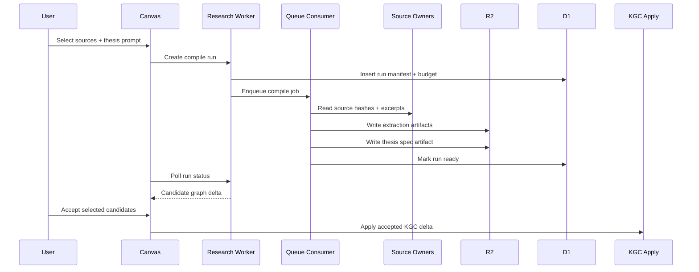
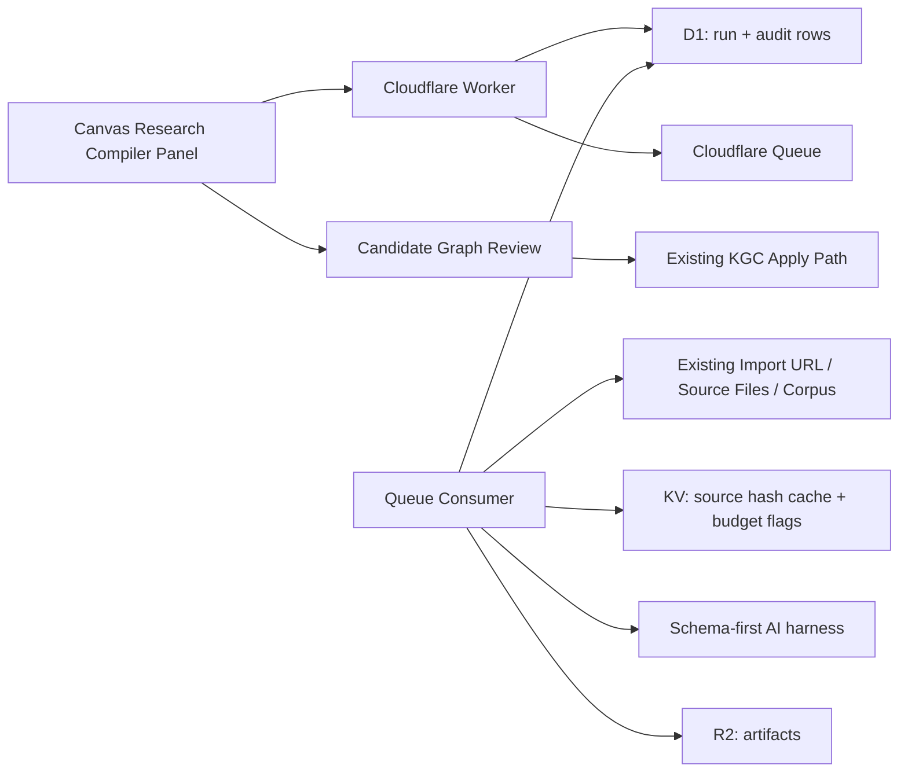

# Knowgrph Research Agent Reference PRD/TAD

## Document Purpose

This document is the product and technical contract for the implemented dev-source research-thesis baseline. It does not claim a deployed Cloudflare runtime. The dev repo now contains a native headless research-thesis harness, a visible MainPanel Research compiler/review surface, optional Cloudflare Worker source, D1/R2 persistence source, an injectable KV summary-cache adapter, and regression tests for manifest creation, evidence labeling, budget/cache guardrails, staged candidate graph deltas, review audit handoff, artifact persistence, and source-owner wiring.

The implemented baseline is **Investment Research Logic Engine**: a review-first compiler that converts a user's investment story, source corpus, and assumptions into a typed thesis specification. The output is not a free-form report. It is a traceable claim graph with evidence links, logic edges, assumptions, counter-arguments, risk triggers, monitoring metrics, and a commit-ready KGC delta that the user must review before it changes the active graph.

The implemented adjacent surfaces are:

| Surface | Current owner |
|---------|---------------|
| Queryable corpus | `docs/documents/knowgrph-query-prd-tad.md` |
| KGC prompt and canvas apply contract | `docs/documents/knowgrph-llm-prompt-contract-prd-tad.md` |
| Agent-ready WebMCP/runtime readiness | `docs/documents/knowgrph-agent-ready-prd-tad.md` |
| DeerFlow local gateway provider | `docs/documents/knowgrph-deerflow/knowgrph-deerflow-prd-tad.md` |
| Long-horizon SuperAgent harness | `docs/documents/knowgrph-superagent-harness.md` |
| Swarm prediction baseline | `docs/documents/knowgrph-swarm-prediction-engine-prd-tad.md` |
| Research-thesis harness | `canvas/src/features/research-agent/researchThesisContract.ts` |
| Research compiler UI | `canvas/src/features/panels/views/ResearchCompilerView.tsx` plus `canvas/src/features/research-agent/researchCompilerPanelModel.ts` |
| Research Worker source | `cloudflare/workers/knowgrph-research/index.ts` |

Any future research-agent work must reuse those owners where behavior already exists. It must not introduce a competing graph schema, duplicate source-file ingestion path, local-only patch stack, or second chat-to-canvas application pipeline.

The long-horizon harness may use [bytedance/deer-flow](https://github.com/bytedance/deer-flow)
as conceptual inspiration for message gateway, memory, tools, skills, subagents,
sandboxed workspace artifacts, and minutes-to-hours task handling. It must not
copy Deer Flow code, clone Deer Flow architecture, or move research-agent graph
mutation outside the review-first KGC apply owner.

## Markdown Demo Artifact Contract

The publish-side research-agent demo is a frontmatter-first Storyboard Widget artifact. Its opening YAML frontmatter block is the machine SSOT for renderer presets, integration metadata, SuperAgent harness metadata, swarm prediction metadata, workflow sections, socket types, `flow.nodes`, and `flow.edges`.

The Markdown body is for human review: purpose, demo scope, tables, validation evidence, and Knowgrph inspection steps. It must not carry a parallel graph or KGC reading layer. Reusable machine-readable node summaries belong on the owning frontmatter node record as `kgc:readingSummary`; graph relationships remain in `flow.edges`.

Forbidden body mirrors for this demo family:

- a second YAML-like metadata block after the closing frontmatter delimiter
- body `flow:` / `nodes:` / `edges:` declarations
- `## KGC Reading Layer`
- line-start `@node:...` or `@edge:...` declarations that duplicate frontmatter nodes or edges

## Implemented Dev-Source Baseline

| Capability | Implemented owner | Proof |
|------------|-------------------|-------|
| Input validation and manifest creation | `canvas/src/features/research-agent/researchThesisContract.ts` | `researchThesisContract.test.ts` rejects invalid input before provider calls and writes source refs plus source hashes for valid input. |
| Typed thesis spec | `canvas/src/features/research-agent/researchThesisContract.ts` | `research-thesis-spec/v1` output includes typed claims, evidence, logic edges, and monitoring metrics. |
| Evidence ledger | `canvas/src/features/research-agent/researchThesisContract.ts` | Ledger labels claims as `sourced`, `assumption`, `calculated`, `contradicted`, or `open_question`. |
| Candidate graph delta | `canvas/src/features/research-agent/researchThesisContract.ts` | Candidate graph metadata sets `active_graph_mutated: false` and names the existing KGC apply owner. |
| Review audit | `canvas/src/features/research-agent/researchThesisContract.ts` | Accepted and rejected candidate ids are recorded; only accepted candidates enter the staged accepted delta. |
| Visible compiler/review surface | `canvas/src/features/panels/views/ResearchCompilerView.tsx` plus `MainPanel` Research tab | `researchAgent.ui.sourceFileBackedReviewSurface` proves Source Files selection builds a compiler request and staged review audit; `researchAgent.ui.mainPanelSharedOwners` proves the visible tab/view uses Source Files, the shared headless harness, and the existing KGC apply owner. |
| Token/cost/artifact persistence | `cloudflare/workers/knowgrph-research/index.ts`, `cloudflare/d1/migrations/0005_research_thesis.sql`, `cloudflare/workers/knowgrph-research/wrangler.toml` | `researchThesisWorker.test.ts` proves status responses persist source summaries, evidence ledger rows, cost logs, R2 artifact pointers, and injected KV source-hash cache reuse without hardcoded namespace ids. |
| Long-horizon harness envelope | `docs/documents/knowgrph-superagent-harness.md` plus `knowgrph_parser/superagent_harness.py` | The research demo carries `superagent_harness_demo` metadata for research/code/create orchestration while the active graph remains staged until review. |
| Demo ingestion/parsing/rendering guard | Existing docs-mirror Source Files merge, Markdown frontmatter Flow parser, Flow native scene builder, and MainPanel pipeline inspector | `researchAgent.demo.ingestParseRender` proves the publish-side research demo is resolved by semantic frontmatter signatures, ingests through the matching `workspace:/docs/<resolved markdown file>` source, parses warning-clean, preserves `deployed_api_claim: false`, renders the shared MainPanel provider contract into the SuperAgent gateway, parses every runtime surface and subagent as typed Flow nodes/edges, and builds a Flow scene whose node/edge counts match the parsed frontmatter instead of fixture literals. `agentReady.localMainPanelChatCanvasPipeline.renderedMcpResearchAgentDemoSuperAgentStoryboardWidget` renders MainPanel MCP with configurable OpenAI MCP KTV rows and proves the same parsed demo reaches MCP -> FloatingPanel Chat -> Markdown frontmatter -> Storyboard Widget canvas topology with message gateway, sandbox, memory, tools, skills, and subagent nodes present in the active render graph; `agentReady.localMainPanelChatCanvasPipeline.researchAgentDemoSuperAgentStoryboardWidget` keeps the semantic MainPanel Integrations and MCP entry-tab contract dynamic across parsed node and edge counts. |
| Optional Worker source | `cloudflare/workers/knowgrph-research/index.ts` | `researchThesisWorker.test.ts` covers compile/status/candidates/commit routes and queue message processing with an in-memory dev store. |
| D1 run table | `cloudflare/d1/migrations/0005_research_thesis.sql` | Migration defines `research_thesis_runs` for manifest, source summary, spec, evidence ledger, delta, audit, cost log, artifact pointer, and status rows. |

The Cloudflare route source exists in Dev but has not been deployed to Prod or Cloudflare in this implementation pass. Until a deploy is explicitly requested and validated, `/api/research/*` must not be presented as a live `airvio.co` capability.

## Current Repo State

| Capability | Status | Boundary |
|------------|--------|----------|
| Research seeding from external sources | Implemented as selected source refs in the headless harness | Reuses selected Source Files / queryable-corpus style refs; no second ingestion stack. |
| Canvas-side reasoner suggestions | Implemented as a staged candidate graph delta | Candidate graph state is separate from active graph state until review. |
| Visible compiler surface | Implemented as MainPanel Research tab | Reads existing Source Files from `useGraphStore`, builds requests through `researchCompilerPanelModel.ts`, and runs the shared headless harness. |
| Visible review surface | Implemented as staged candidate review in MainPanel Research tab | Accepted/rejected candidate ids build a review audit naming `chatKgcCanvasApply.ts`; active graph mutation remains false. |
| Session skill loop | Implemented locally for the shared SuperAgent artifact loop; research-specific skill mutation remains gated | `knowgrph_parser` records role-scoped agent contracts, run memory, trace, and artifacts; no write path may create independent global memory files without source-owner tests. |
| Scenario simulator | Implemented as adjacent Dev-source swarm prediction baseline | `canvas/src/features/swarm-prediction/swarmPredictionEngine.ts` produces deterministic bounded world state, event log, metrics, and rich-media outputs; no research-specific scenario-diff overlay or active-graph mutation is active. |
| Cloudflare research Worker | Source implemented, not deployed | Worker routes, queue handler, D1 row shape, R2 artifact pointers, and an injectable KV summary-cache adapter exist in Dev; no Cloudflare live-route claim until deploy validation exists. |

## Product Add-On

### Feature: Investment Research Logic Engine

**Positioning**: A thesis compiler for solo investors, operators, and analysts who need to turn messy source material into an auditable investment thesis without paying for a heavyweight research terminal.

**User value**:

- Compress source review time from multi-hour reading into a reviewable evidence graph.
- Separate facts, assumptions, estimates, calculations, contradictions, and open questions.
- Preserve every generated claim as a candidate until the user accepts it.
- Convert accepted thesis primitives into existing Knowgrph graph state through the existing KGC apply path.
- Emit a low-cost monitoring spec so the thesis can be tracked over time without rerunning the full model pipeline.

**Business value**:

- High ROI for a solo-dev startup because the feature reuses current ingestion, corpus, KGC, graph rendering, and Cloudflare infrastructure.
- Strong differentiation because the product compiles a thesis into a structured spec rather than only generating prose.
- Low TCO because expensive model calls are bounded, cached, staged, and resumable.

### Persona and Journey

| Stage | Action | Touchpoint | Pain Point | Opportunity |
|---|---|---|---|---|
| Trigger | User has an investment idea or external reports. | Import URL, Source Files, selected graph node | Source material is long, fragmented, and hard to compare. | Start from existing workspace inputs; no separate upload stack. |
| Compile | User requests a thesis spec. | Research compiler panel | Free-form AI output hides assumptions and weak logic. | Produce typed claims, edges, evidence, assumptions, and counterpoints. |
| Review | User inspects candidate thesis graph. | Canvas review overlay | Unreviewed mutation can pollute the graph. | Candidate state stays separate until accepted. |
| Commit | User accepts selected primitives. | Existing KGC apply flow | Duplicate graph apply paths create drift. | Reuse existing graph semantics and provenance handling. |
| Track | User asks what to monitor. | Metric watchlist / dashboard spec | Research becomes stale after publication. | Persist monitoring keys and refresh only small slices. |

### Success Metrics

| Metric | Baseline | Target | Validation |
|---|---:|---:|---|
| Time to first reviewable thesis spec | Manual reading session | Under 10 minutes for 3 short-to-medium sources | Browser smoke + run manifest timestamps |
| Candidate graph acceptance rate | Unknown | 40%+ accepted primitives in internal dogfood | Review action telemetry |
| Evidence coverage | Ad hoc | 90%+ committed claims have at least one source pointer or explicit assumption marker | D1 artifact audit |
| Token cost per compile | Unknown | Under 80k input tokens and 12k output tokens per compile at MVP scope | Harness cost log |
| Monthly TCO at 100 runs | Unknown | Under USD 10 excluding optional model spend | Cloudflare usage estimate + provider cost logs |

### ROI Score

```
ROI Score = (User Impact x Reach) / (Build Hours + Monthly TCO + Token Cost / Month)
```

| Feature Slice | User Impact | Reach / month | Build Hours | Monthly TCO | Token Cost / month | ROI Score | Decision |
|---|---:|---:|---:|---:|---:|---:|---|
| Typed thesis spec compiler | 5 | 100 | 18 | 5 | 20 | 11.6 | Must |
| Evidence ledger and contradiction tags | 5 | 100 | 12 | 5 | 12 | 20.8 | Must |
| Candidate graph review and commit | 5 | 100 | 14 | 2 | 4 | 31.3 | Must |
| Monitoring spec export | 4 | 60 | 8 | 2 | 3 | 48.0 | Should |
| Live indicator dashboard | 3 | 40 | 20 | 10 | 10 | 6.0 | Could |

### MoSCoW Scope

| Priority | Scope | Reason |
|---|---|---|
| Must | Compile a typed thesis spec from selected workspace sources. | Highest user value; keeps output inspectable. |
| Must | Maintain an evidence ledger with claim-level provenance and contradiction status. | Prevents hallucinated confidence. |
| Must | Render candidate thesis graph primitives separately from committed graph state. | Protects existing graph quality. |
| Must | Reuse existing Import URL, Source Files, queryable corpus, KGC parser, and chat-to-canvas apply owners. | Avoids duplicated ingestion and graph mutation paths. |
| Should | Generate a monitoring spec of metrics, refresh cadence, and source hints. | Turns research into an ongoing asset with small refresh cost. |
| Should | Add a counter-thesis pass that lists strongest disconfirming claims. | Improves decision quality without becoming an advisory engine. |
| Could | Add collaborative review and reviewer comments. | Useful after single-user workflow proves demand. |
| Won't | Auto-trading, portfolio allocation, brokerage execution, or personalized financial advice. | High compliance and user-risk surface. |

## Product Concept

A future research-agent surface may help users enrich a graph from external knowledge, ask query-relevant follow-up questions, and stage candidate graph primitives for review. The key product requirement is review-first graph enrichment: generated nodes and edges must be inspectable before they change the active graph.

Candidate outcomes:

- A user starts from a query, source file, URL import, or selected graph node.
- The system gathers context through existing ingestion and corpus primitives.
- Candidate KGC primitives are produced as reviewable suggestions.
- Accepted suggestions reuse the existing KGC apply path and preserve graph semantics.
- Rejected suggestions leave no persisted graph changes.

These outcomes remain inactive until implemented in source.

## Product Requirements

### PRD-RA-E01 - Thesis Spec Compilation

As a solo investor or operator, I want to compile a story and source set into a typed thesis spec so that I can review the investment logic before committing anything to my graph.

**Acceptance Criteria**

- Given selected workspace sources and a user thesis prompt, when compilation starts, then the system creates a run manifest with source ids, source hashes, model budget, and max-iteration limits before any model call.
- Given a malformed prompt or empty source selection, when compilation starts, then the harness returns a structured validation error without token spend.
- Given a valid compile request, when the harness completes, then the output contains typed claims, evidence pointers, logic edges, assumptions, counterpoints, risk triggers, and monitoring candidates.

> **`/goal` translation**: `research-thesis compile tests pass: invalid input produces no model call; valid input writes a run manifest and a schema-valid thesis spec artifact`

### PRD-RA-E02 - Evidence Ledger

As a researcher, I want every candidate claim to carry provenance and confidence state so that I can identify unsupported, contradicted, or assumption-only logic.

**Acceptance Criteria**

- Given generated claims, when the evidence ledger is built, then each claim is labeled as `sourced`, `assumption`, `calculated`, `contradicted`, or `open_question`.
- Given a claim marked `sourced`, when the user opens it, then the source pointer, source hash, and excerpt offset are available without rerunning the compiler.
- Given contradictory evidence, when the thesis graph is rendered, then the contradiction is represented as a candidate edge and not hidden in prose.

> **`/goal` translation**: `research-thesis evidence tests pass: every committed candidate claim has evidence metadata or an explicit assumption/open-question label`

### PRD-RA-E03 - Review-First Graph Commit

As a Knowgrph user, I want candidate thesis primitives to stay separate from my active graph until I accept them so that generated research cannot corrupt existing knowledge.

**Acceptance Criteria**

- Given a compiled thesis spec, when the review overlay opens, then candidate nodes and edges render as a staged graph delta.
- Given the user accepts selected primitives, when commit runs, then the system reuses the existing KGC apply path and records accepted/rejected ids.
- Given the user rejects a candidate, when the run is persisted, then the rejection is recorded without adding active graph nodes or edges.

> **`/goal` translation**: `research-thesis review tests pass: accepted candidates route through the existing KGC apply owner; rejected candidates leave active graph state unchanged`

### PRD-RA-E04 - Token and TCO Guardrails

As a solo founder, I want every compile to be cost-bounded so that experimentation does not create uncontrolled model or infrastructure spend.

**Acceptance Criteria**

- Given a compile request, when estimated token budget exceeds the configured cap, then the harness requires the user to reduce source scope or choose a cheaper mode.
- Given repeated compilation of unchanged sources, when source hashes match a cached artifact, then the system reuses cached extraction artifacts before model calls.
- Given a run exceeds max iterations, source count, or wall-clock budget, then the Queue consumer stops, writes a partial artifact, and surfaces a resumable error.

> **`/goal` translation**: `research-thesis cost tests pass: budget caps stop before model calls; unchanged source hashes reuse cached extraction artifacts`

## Thesis Spec Contract

The compiler output is a typed artifact stored as JSON in R2 with summary rows in D1. The active graph is changed only after review.

```yaml
research_thesis_spec:
  schema_version: "research-thesis-spec/v1"
  run_id: "kgra_<generated>"
  thesis_title: "string"
  thesis_summary: "string"
  source_refs:
    - source_id: "string"
      canonical_path: "string"
      content_hash: "sha256"
  claims:
    - claim_id: "string"
      text: "string"
      claim_type: "fact|assumption|calculation|forecast|risk|open_question"
      confidence: "high|medium|low"
      evidence_refs: ["evidence_id"]
  evidence:
    - evidence_id: "string"
      source_id: "string"
      locator: "string"
      evidence_type: "source_quote|derived_metric|user_input"
      source_hash: "sha256"
  logic_edges:
    - edge_id: "string"
      from_claim_id: "string"
      to_claim_id: "string"
      relation: "supports|contradicts|depends_on|quantifies|risks"
  monitoring:
    - metric_id: "string"
      label: "string"
      source_hint: "string"
      refresh_cadence: "manual|daily|weekly|monthly"
```

## Workflow: Compile Thesis Spec

**Trigger**: User selects source files, a corpus query result, imported URLs, or an existing graph node and starts a thesis compile.

**Actors**: User, Canvas review surface, Research Compiler Worker, Queue Consumer, Source Files runtime, queryable corpus, KGC apply owner, D1, R2, KV.

**Happy Path**:
1. User selects sources and enters a thesis prompt.
2. Canvas sends a compile request with source ids and a token budget.
3. Worker validates input, writes a run manifest to D1, and enqueues the job.
4. Queue consumer extracts source summaries, builds claim candidates, verifies evidence coverage, and writes artifacts to R2.
5. Canvas polls the run status and renders a staged thesis graph delta.
6. User accepts or rejects candidates.
7. Accepted candidates route through the existing KGC apply path.

**Alternate Paths**:
- Cached source hashes match prior extraction: skip extraction model calls and reuse the cached source summary artifact.
- User only provides a story and no sources: create an assumption-first draft with all claims marked `assumption` or `open_question`.

**Error Paths**:
- Budget cap exceeded: stop before model calls and return a structured `budget_exceeded` response.
- Source fetch fails: mark the source as unavailable and continue only if at least one valid source remains.
- Output schema fails validation: store raw artifact for debugging, do not expose graph candidates, and ask user to retry or reduce scope.

**Postconditions**:
- D1 contains a run row, status, token/cost estimates, and artifact pointers.
- R2 contains manifest, source summaries, thesis spec, and optional raw validation artifacts.
- Active graph state changes only after user acceptance through the existing apply owner.



## Data Flow: Thesis Compiler

| Stage | Component | Input Format | Output Format | Persistence | Error Handling |
|---|---|---|---|---|---|
| Ingest | Existing Import URL / Source Files / queryable corpus | URL, Markdown, selected files, corpus ids | Source refs + hashes | Existing source owners | Reject empty source set or mark unavailable |
| Normalize | Source summary harness | Source refs + extracted text windows | Compact source summaries | R2 artifact + D1 pointer | Cache by source hash |
| Compile | Thesis spec harness | Prompt + summaries + budget | `research-thesis-spec/v1` | R2 artifact | Schema validation before exposure |
| Verify | Evidence ledger builder | Claims + source summaries | Evidence labels + contradiction edges | R2 artifact + D1 summary | Mark open questions instead of inventing proof |
| Review | Canvas candidate overlay | Thesis spec + KGC delta | Accepted/rejected candidate ids | D1 audit row | Reject invalid KGC delta |
| Commit | Existing KGC apply owner | Accepted primitives | Active graph update | Existing graph state | Preserve current apply error handling |

## Technical Architecture



### Component Inventory

| Layer | Component | Responsibility | Owner |
|---|---|---|---|
| UI | Research Compiler Panel | Select sources, set budget, start run, show status. | `canvas/src/features/panels/views/ResearchCompilerView.tsx` backed by `researchCompilerPanelModel.ts` and `researchThesisContract.ts` |
| UI | Candidate Thesis Graph Review | Render staged claims/edges and accept/reject actions. | `ResearchCompilerView.tsx` builds review audits through `buildResearchThesisReviewAudit`; active graph mutation remains gated by `chatKgcCanvasApply.ts` |
| API | Research Compiler Worker | Validate requests, create run manifest, enqueue jobs, serve status. | `cloudflare/workers/knowgrph-research/index.ts` |
| Async | Queue Consumer | Execute bounded compile steps and write artifacts. | `cloudflare/workers/knowgrph-research/index.ts` via `queue()` handler |
| AI | Thesis Spec Harness | Validate input/output schemas and emit token/cost logs. | `canvas/src/features/research-agent/researchThesisContract.ts` |
| Data | D1 | Run status, source refs, source summaries, cost logs, artifact pointers, audit records, accepted/rejected candidates. | `cloudflare/d1/migrations/0005_research_thesis.sql` |
| Data | R2 | Source summaries, thesis specs, raw validation artifacts. | `cloudflare/workers/knowgrph-research/wrangler.toml` binding source |
| Data | KV | Source-hash summary cache and future budget flags/run locks when a real namespace is provisioned for deployment. | `cloudflare/workers/knowgrph-research/index.ts` optional binding adapter; no fake namespace id is checked into Dev source |
| Retrieval | Optional vector index | Reuse only when existing corpus retrieval needs semantic similarity at scale. | Cloudflare Vectorize, optional |

### Proposed API Contracts

These routes are implemented in Dev source only. They must not be documented as shipped until Prod/Cloudflare deploy validation exists.

| Route | Method | Purpose |
|---|---|---|
| `/api/research/thesis-compile` | `POST` | Create a compile run and enqueue bounded async work. |
| `/api/research/runs/:runId` | `GET` | Return run status, manifest, cost summary, and artifact pointers. |
| `/api/research/runs/:runId/candidates` | `GET` | Return candidate KGC primitives for review. |
| `/api/research/runs/:runId/commit` | `POST` | Commit accepted candidates through the existing KGC apply owner. |

### Harness Contract

```text
Caller -> [Validate source refs + prompt + budget]
       -> [Build compact source context]
       -> [Model call only when budget permits]
       -> [Validate research-thesis-spec/v1]
       -> [Write cost log + artifacts]
       -> [Expose candidate graph delta]
```

### Long-Horizon SuperAgent Extension Contract

Research-agent runs may be embedded in the shared local SuperAgent envelope when
the user asks for research, code, and creation work that spans minutes to hours.
The envelope is metadata and orchestration glue, not a second graph pipeline:

```text
Message gateway -> [Run manifest + scoped agent contracts]
                -> [Source scout / thesis compiler / code worker / artifact builder]
                -> [Sandboxed workspace artifacts + trace memory]
                -> [Text, Image, Chart, or code outputs through shared owners]
                -> [Review gate]
                -> [Existing KGC apply owner for accepted graph candidates only]
```

The envelope must stay source-owned, provider-neutral, review-first, and
bounded. It may call local MCP or optional provider adapters through existing
tool contracts, but it must not create a DeerFlow-only parser, renderer,
memory directory, or graph apply path.

**Bounds**:

- Max source files per MVP run: 5.
- Max extracted windows per source: 12.
- Max compile iterations: 2.
- Max verification fan-out: 30 claim/edge checks.
- Max wall-clock run time before partial artifact: 10 minutes.
- Default mode must support an offline/mock harness for unit tests.

**Cost log**:

```json
{
  "run_id": "kgra_<generated>",
  "stage": "compile",
  "model": "configured-provider",
  "prompt_tokens": 0,
  "completion_tokens": 0,
  "cache_hits": 0,
  "estimated_cost_usd": 0,
  "source_hash_reuse": true
}
```

## FOSS, TCO, and Platform Direction

| Decision | Preferred Option | FOSS / Low-TCO Alternative | Rationale |
|---|---|---|---|
| Static app hosting | Existing Cloudflare Pages path | Same current deployment | Preserves Dev -> Prod -> Cloudflare flow. |
| API runtime | Cloudflare Workers | Self-hosted Node Worker on a small VPS | Workers reduce ops burden and align with existing repo. |
| Async orchestration | Cloudflare Queues | SQLite-backed local queue for offline tests | Queue consumer keeps compile work out of request lifecycle. |
| Relational state | Cloudflare D1 | SQLite in local tests | D1 matches existing storage direction and keeps TCO low. |
| Artifact storage | Cloudflare R2 | Local filesystem for tests | R2 avoids egress-heavy object storage patterns. |
| Cache and budget flags | Cloudflare KV | In-memory fake KV for tests | Simple low-latency source-hash reuse and kill switches. |
| Retrieval | Existing queryable corpus first; optional Vectorize later | Local embeddings cache | Avoid new vector dependency until corpus scale justifies it. |
| Model provider | Existing model settings through harness | Local/offline mock provider for CI | Keeps provider replaceable and testable. |

## Dev-Source Activation Evidence

Before this document can claim live deployed implementation, the Cloudflare deployment row remains pending. The Dev-source implementation evidence is:

| Contract | Dev-source proof |
|----------|------------------|
| Input selection | MainPanel Research tab reuses existing Source Files state via `useGraphStore`; `researchCompilerPanelModel.ts` converts selected files into compiler source refs. |
| Planning | The compiler is deterministic and bounded by max source files, source windows, compile iterations, verification fan-out, wall-clock budget metadata, input tokens, and output tokens. |
| Source retrieval | Source-file provenance remains visible through canonical Source Files paths in the compile request, manifest, evidence rows, and UI source list. |
| KGC extraction | Candidate deltas and review audits name `canvas/src/features/chat/chatKgcCanvasApply.ts`; the Research UI does not introduce a second graph mutation path. |
| Review UI | MainPanel Research tab renders staged candidate claims, accepted/rejected ids, accepted delta counts, and `active_graph_mutated: false`. |
| Published demo runtime | `researchAgent.demo.ingestParseRender` plus MainPanel pipeline tests prove semantic publish-demo resolution, Source Files ingestion, warning-clean frontmatter parsing, and Flow scene rendering. |
| Persistence | Worker source writes manifest, source summaries, thesis spec, evidence ledger, candidate delta, cost log, and review audit artifacts; no independent memory or skill directory is created. |
| Cloudflare deployment | Deferred until the user explicitly requests Prod/Cloudflare deploy; no live `airvio.co` route claim is made here. |
| Token economics | Cost logs, cache hits, source-hash reuse, configured caps, and artifact pointers persist with each Worker run row in Dev source/tests. |
| Validation | Focused unit tests, docs/source-owner guards, TypeScript, and scoped workflow checks remain the Dev-source acceptance surface. |

## Technical Direction

An active implementation should be built as an extension of current source owners:

- Use Import URL and Source Files for source acquisition rather than introducing a second ingestion stack.
- Use queryable corpus and KGC semantic graph helpers for retrieval and graph-language interpretation.
- Use existing chat-to-canvas apply contracts for committing accepted primitives.
- Use shared semantic-key helpers for any derived query, source, or candidate cache.
- Keep all generated candidate state reviewable and discardable until the user accepts it.
- Bound all agent loops by explicit iteration, time, and source-count limits.
- Compile source material into typed thesis artifacts before any prose summary is shown.
- Persist artifacts through D1/R2/KV contracts only after schema validation succeeds.

## Non-Goals

- No external agent framework dependency.
- No unreviewed graph mutation.
- No independent schema that competes with `kgc-computing-flow/v1`.
- No generated memory directory without a source-owned lifecycle.
- No provider-specific model names in this reference document.
- No Cloudflare route claim without deployable Worker or Pages source.
- No investment advice, trading recommendation, portfolio allocation, or broker execution.
- No browser-exposed model credentials or source-fetch secrets.
- No heavyweight paid research terminal dependency.

## ADR-001: Compile to Thesis Spec Before Rendering Prose

**Status**: Recommended.

**Decision**: The research-agent add-on should compile source material into `research-thesis-spec/v1` before rendering any prose summary or graph candidates.

**Alternatives**:

1. Free-form report generation: fast to demo but hard to audit, cache, diff, or commit safely.
2. Direct graph mutation: visually satisfying but unsafe for existing graph quality.
3. Typed thesis spec first: more upfront schema work but enables review, caching, validation, and acceptance tests.

**TCO / FOSS evaluation**: Typed JSON artifacts can be validated with FOSS schema tooling and stored cheaply in R2/D1. It avoids recurring cost from repeated full-report regeneration because unchanged source hashes can reuse prior extraction artifacts.

**Consequences**:

- Positive: deterministic validation, lower hallucination risk, and clear graph delta ownership.
- Negative: requires schema maintenance and review UI work before the feature feels complete.

## ADR-002: Cloudflare Queue-Backed Harness Instead of Browser Runtime

**Status**: Recommended.

**Decision**: Run compile work in a Cloudflare Worker with Queue consumer support, D1 run state, R2 artifacts, and KV budget/cache controls. The browser only starts runs, polls status, and reviews candidates.

**Alternatives**:

1. Browser-only compiler: lowest backend work but leaks provider control, cannot enforce budget, and cannot resume long jobs.
2. Local desktop-only script: useful for experiments but not compatible with the deployed product path.
3. Worker + Queue + D1/R2/KV: aligns with existing deployment and allows async, resumable, auditable runs.

**TCO / FOSS evaluation**: Cloudflare bindings keep infra near zero at MVP scale. Local fake D1/R2/KV/Queue tests preserve FOSS-style offline validation without adding a managed database or proprietary app backend.

**Consequences**:

- Positive: bounded async orchestration, durable artifacts, and clear cost controls.
- Negative: requires Worker route, queue binding, and migration work before implementation can be claimed.

## Acceptance Gate

This document stays at `dev-source-implemented-no-deploy` until Cloudflare deployment is explicitly requested and live route validation passes. The Dev-source gate is:

1. Source owners exist for retrieval, planning, candidate generation, review, and commit.
2. The implementation reuses current Import URL, Source Files, queryable corpus, KGC semantic, and chat-to-canvas owners where applicable.
3. Tests guard the source-owner map and reject duplicate ingestion or graph-apply paths.
4. The generated research demo has docs-mirror ingestion, frontmatter parser, and Flow rendering proof without a file-specific parser path.
5. The thesis spec harness has input/output schema tests, offline/mock-provider tests, token-budget tests, and KV cache-reuse tests.
6. The MainPanel Research tab provides visible Source Files selection and staged review audit proof without unreviewed active graph mutation.
7. The Worker source persists D1 rows, R2 artifact pointers, cost logs, evidence ledgers, and review audits in Dev tests.
8. The real workflow passes focused unit tests, `npm run hygiene:check`, TypeScript, and any required Cloudflare smoke once deployment is in scope.

Until Prod/Cloudflare deploy is explicitly requested and validated, the research-agent route remains Dev-source only and must not be presented as a shipped live feature in UI, docs, tests, or deployment notes.
