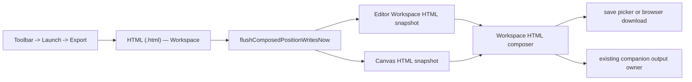

# Knowgrph Single-File HTML Workspace Export PRD/TAD

## Document Map

This PRD/TAD defines the repo-relevant contract for `Toolbar -> Launch -> Export -> HTML (.html) — Workspace`.
The export must produce one portable `.html` artifact that contains both active Editor Workspace content and
the active Canvas state. It replaces the stale plan for a brand-new generic serializer with a source-owned
composition of the export paths already present in `knowgrph/canvas`.

Current runtime primitives already exist:

- `HTML (.html) — Viewer` snapshots the active Editor Workspace viewer or webpage HTML surface.
- `HTML (.html) — Canvas` snapshots the active graph canvas into the standalone graph HTML viewer.

The implementation contract is to expose a unified `HTML (.html) — Workspace` action that composes those
two owners, keeps Viewer/Canvas as explicit scoped exports, and avoids a parallel
serializer, fixture-specific fallback, or downstream compatibility layer.

## Executive Summary

A Knowgrph workspace is not just a graph. The useful shareable state is the document/source workspace plus
the rendered canvas derived from it. A single-file HTML export must therefore preserve both:

- Editor Workspace: active Markdown, webpage HTML, preview DOM, inline media, document title, and source context
  already available through the workspace export bridge.
- Canvas: graph data, 2D/3D render posture, positions, rich media overlays, markdown design blocks, viewport
  controls, and standalone interaction runtime already available through the HTML canvas export path.

The min-viable max-value path is a deterministic client-side export envelope. It flushes pending graph writes,
captures the Editor Workspace and Canvas once, rewrites assets for standalone use, disables implicit runtime
network/proxy probing in exported artifacts, and downloads one `.html` file. It does not call an LLM, does not
add infrastructure, does not manually write the production mirror, and does not recalculate imports or parser
outputs during export.

## Product Requirements

### Problem

Solo builders need to send a workspace proof to a stakeholder, agent, collaborator, or future self without
requiring a live Knowgrph session. Current separate HTML actions can export the document viewer or the canvas,
but the real review artifact needs both surfaces together. Splitting them causes context loss, duplicate files,
extra QA, and drift between what the document says and what the canvas shows.

### Hypothesis

If Launch export provides one `HTML (.html) — Workspace` action that contains Editor Workspace and Canvas in
one offline artifact, then review, archival, and demo workflows become cheaper and more reliable while reusing
the existing export owners and preserving zero incremental TCO.

### Personas

| Persona | Job To Be Done | Success Signal |
|---|---|---|
| Solo founder | Share one self-contained proof of work. | Recipient opens one HTML file and sees document plus canvas. |
| Technical reviewer | Inspect source text and visual graph together. | Editor Workspace and Canvas agree without a live app session. |
| Agent operator | Archive a browser-readable workspace state. | Artifact has structured metadata and no external fetch dependency for core content. |
| Maintainer | Ship export improvements without drift. | One Launch menu action maps to shared export owners and focused tests. |

### User Journey

| Stage | Action | Touchpoint | Pain Point | Opportunity |
|---|---|---|---|---|
| Trigger | User finishes a workspace state worth sharing. | Canvas toolbar | Screenshot or canvas-only HTML loses source context. | Export one workspace artifact. |
| Discover | User opens Launch -> Export. | Toolbar menu | Separate Viewer and Canvas options create ambiguity. | One `HTML (.html) — Workspace` option. |
| Engage | User triggers export. | Workspace export bridge | Pending graph edits or overlay writes can be stale. | Flush shared writeback before capture. |
| Complete | Browser saves one `.html` file. | File picker or download fallback | Two files are hard to version and compare. | One deterministic workspace filename. |
| Return | User reopens artifact offline. | Browser | Export should not require Knowgrph, Cloudflare, or source repo access. | Standalone HTML shell with both surfaces. |

### User Stories And Acceptance

| ID | Story | Acceptance Criteria | `/goal` Translation |
|---|---|---|---|
| PRD-EXP-E01-S01 | As a builder, I want Launch export to offer Workspace HTML so the choice matches the artifact. | Given the toolbar Launch menu is open, when Export expands, then the user-facing action is `HTML (.html) — Workspace` for the combined export. | `WORKSPACE_EXPORT_MENU_ITEMS` contains the Workspace HTML label alongside explicit Viewer and Canvas scoped exports, with no hidden legacy alias remap. |
| PRD-EXP-E01-S02 | As a reviewer, I want the exported file to contain Editor Workspace and Canvas. | Given an active document with rendered graph state, when Workspace HTML export completes, then one `.html` file contains an Editor Workspace section and a Canvas section. | focused HTML export test asserts both workspace/editor markup and canvas viewer payload are present in the same artifact. |
| PRD-EXP-E01-S03 | As a maintainer, I want export to reuse current owners. | Given export implementation, when code is inspected, then it composes `buildHtmlViewerSnapshotDocument`, `buildHtmlCanvasWorkspaceDocument`, shared semantic keys, and standalone asset rewrite helpers instead of adding a duplicate renderer. | static guard rejects new hardcoded fixture serializers or duplicate local media scans. |
| PRD-EXP-E01-S06 | As a builder, I want Workspace HTML export to work from the active editor state even when the Viewer panel is not open. | Given active Markdown exists but no Viewer DOM or webpage `srcdoc` is mounted, when Workspace HTML export runs, then it builds Editor Workspace HTML from active editor text, preserves source context, and does not show `Open the Viewer to export HTML.` | Viewer snapshot builder accepts `fallbackMarkdownText` from the workspace bridge, first tries the shared `MarkdownPreview` owner, appends the source-context block, and falls back to the non-DOM markdown viewer document only when DOM rendering is unavailable. |
| PRD-EXP-E01-S04 | As a solo dev, I want export to stay zero-TCO and token-free. | Given export is triggered, when the pipeline runs, then no model, token, server, or Cloudflare write path is required. | token cost remains `0`; no network/server dependency is added to complete export. |
| PRD-EXP-E01-S05 | As an agent operator, I want artifact identity to be stable and neutral. | Given document/source/canvas state changes, when export invalidates or names snapshots, then semantic identity comes from shared graph/workspace helpers rather than hardcoded document names or URLs. | shared semantic-key helper usage is covered by static guard or owner-map review. |

### Scope

#### Must

- Expose one user-facing menu action: `Toolbar -> Launch -> Export -> HTML (.html) — Workspace`.
- Include both Editor Workspace and Canvas in a single `.html` file.
- Reuse the existing workspace export bridge and flush graph writeback before capture.
- Reuse the existing HTML viewer snapshot path for Editor Workspace content.
- Reuse the existing HTML canvas export path and graph HTML viewer runtime for Canvas content.
- Rewrite local/repo/proxy asset references through existing standalone export helpers.
- Default exported Viewer/Canvas runtimes to offline mode: no implicit localhost/proxy probing and no runtime remote media fetch unless a caller explicitly enables runtime networking.
- Persist companion output through existing workspace/chat output owners where applicable.
- Keep the feature deterministic, client-side, FOSS-first, and token-free.

#### Should

- Preserve active document title, source URL metadata when already present, and active export base name.
- Include 2D/3D canvas posture, rich media overlays, markdown design blocks, and viewport controls.
- Use shared semantic-key helpers for invalidation and duplicate-work prevention.
- Keep a generated export reference doc in sync with `exportMenuSsot.ts`.

#### Could

- Add a small in-file navigation rail for Editor Workspace and Canvas sections.
- Add optional metadata JSON for agents to identify source document, graph counts, and export timestamp.
- Add a comparison hash panel for repeated exports from the same workspace state.

#### Won't

- Add edit mode inside the exported file.
- Add realtime sync from exported file back to Knowgrph.
- Add a server-side renderer, Worker export endpoint, or Cloudflare write dependency.
- Backfill legacy menu aliases after the Workspace action ships.
- Remap stale hidden aliases in the user-facing menu; Workspace, Viewer, and Canvas must stay explicit scoped exports.
- Recalculate import, parser, graph, layout, or media state from raw source during export.
- Hardcode document paths, source URLs, fixture names, workspace IDs, or demo-specific selectors.

## ROI And TCO

| Metric | Baseline | Target | Notes |
|---|---:|---:|---|
| Files needed to review a workspace | 2+ | 1 | One artifact includes Editor Workspace and Canvas. |
| Incremental monthly TCO | $0 | $0 | Browser-only export, no server path. |
| Token cost per export | 0 | 0 | No AI/model harness in export. |
| Export owner count | split UI semantics | shared composition | Reuse current viewer/canvas owners. |
| Stakeholder review setup | live app or multiple files | one HTML file | High ROI for demos and archive. |

ROI posture:

| Input | Value |
|---|---:|
| User impact | 4 |
| Reach | 20 exports/month |
| Build hours | 4 |
| Monthly TCO | 0 |
| Token cost/month | 0 |
| ROI score | `(4 x 20) / (4 + 0 + 0) = 20` |

## Technical Architecture

### Current Runtime Owner Map

| Concern | Current Owner | Contract |
|---|---|---|
| Launch export SSOT | `canvas/src/lib/toolbar/exportMenuSsot.ts` | Owns menu labels and action keys. Workspace HTML must be represented here. |
| Launch export rendering | `canvas/src/lib/toolbar/LaunchDropdownExportMenu.tsx` | Renders SSOT-driven export actions without local label forks. |
| Toolbar bridge fallback | `canvas/src/lib/toolbar/LaunchDropdown.impl.tsx` | Provides export actions when workspace bridge is unavailable. |
| Workspace export bridge | `canvas/src/features/markdown-workspace/main/useWorkspaceExportBridge.ts` | Flushes composed graph writes and registers export actions. |
| Editor Workspace HTML | `canvas/src/features/markdown-workspace/main/exports/exportHtmlViewer.ts` | Clones viewer/webpage HTML and inlines image, media, CSS, and same-origin scripts. |
| Canvas HTML | `canvas/src/features/markdown-workspace/main/exports/exportHtmlCanvas.ts` | Captures active graph/canvas state and builds standalone canvas HTML. |
| Canvas SVG fallback | `canvas/src/lib/graph/htmlCanvasSvgExport.ts` | Renders SVG for export using shared graph, media, layout, and overlay helpers. |
| Standalone graph viewer | `canvas/src/lib/graph/htmlViewer/buildGraphHtmlViewerMarkup.ts` | Builds interactive standalone canvas viewer markup and runtime payload. |
| Runtime template/script | `canvas/src/lib/graph/htmlViewer/runtimeTemplate.ts` and `runtimeScript.ts` | Provides in-file canvas interaction behavior, placeholder substitution, and explicit runtime-network mode. |
| Asset rewrite | `canvas/src/lib/graph/htmlViewer/standaloneAssetRewrite.ts` and `rewriteSvgMarkupForStandaloneHtmlExport.ts` | Rewrites repo/proxy asset references for standalone HTML. |
| Overlay capture | `canvas/src/lib/graph/htmlViewer/liveOverlayExport.ts` | Captures live rich media and markdown design overlays. |
| Semantic identity | `canvas/src/lib/graph/semanticKey.ts` and `canvas/src/features/workspace-fs/workspaceEntriesSemanticKey.ts` | Shared helpers for graph/workspace export keys; no local hash hardcodes. |
| Companion output | `canvas/src/features/chat/chatHistoryWorkspace.output.ts` | Writes export companion artifacts without inventing a new output root. |

### Target Component

| Component | Responsibility | Reuse Rule |
|---|---|---|
| WorkspaceHtmlExportAction | User-facing Launch export action for `HTML (.html) — Workspace`. | Lives in the existing export SSOT/bridge path. |
| WorkspaceHtmlExportComposer | Builds one HTML shell containing Editor Workspace and Canvas sections. | Composes `buildHtmlViewerSnapshotDocument` and `buildHtmlCanvasWorkspaceDocument`; no duplicate serialization logic. |
| WorkspaceHtmlMetadataBuilder | Adds title, export timestamp, source path, graph counts, and semantic keys. | Reads from active workspace and shared semantic-key helpers. |
| WorkspaceHtmlDownloadHandler | Saves or downloads one `text/html;charset=utf-8` Blob. | Reuses existing save picker/download utilities. |
| HtmlViewerMissingViewerFallback | Builds Editor Workspace HTML from active editor text when no Viewer DOM is mounted. | Uses shared `MarkdownPreview` first, appends source context, and avoids the `Open the Viewer to export HTML.` warning when active text exists. |

### Data Flow

### Export Envelope Contract

The `.html` artifact must be a single document with:

| Section | Required Content | Source Owner |
|---|---|---|
| Metadata | title, exported timestamp, source path when available, graph counts, semantic keys | WorkspaceHtmlMetadataBuilder plus shared key helpers |
| Editor Workspace | active rendered Markdown or webpage HTML, CSS variables, inline assets where supported | `buildHtmlViewerSnapshotDocument` path |
| Canvas | standalone graph viewer payload, SVG/3D posture, overlays, viewport controls | `buildHtmlCanvasWorkspaceDocument` and `buildGraphHtmlViewerMarkup` |
| Navigation | stable anchors for Editor Workspace and Canvas | Workspace HTML shell only |
| Provenance | no hardcoded project/file/source URL assumptions | active workspace state only |
| Runtime network | offline by default; explicit proxy/runtime network only when caller opts in | `buildGraphHtmlViewerMarkup`, `buildHtmlViewerRuntimeScript`, runtime template |

### Integration Contracts

| Interface | Protocol | Input | Output | Error Handling |
|---|---|---|---|---|
| Launch menu -> Workspace export | in-process action callback | no payload | export starts | missing action shows existing export warning toast |
| Workspace bridge -> Editor snapshot | dynamic import/function call | active document key, viewer element, webpage srcdoc, active editor Markdown fallback | HTML document string | uses active editor Markdown when no Viewer DOM is mounted; warning toast only when no source exists |
| Workspace bridge -> Canvas snapshot | dynamic import/function call | active graph store, active document key | standalone canvas HTML string | warning toast if no graph/canvas snapshot exists |
| Composer -> Save/download | browser Blob/save picker | single HTML string | saved file or download fallback | existing picker cancel returns without fallback |
| Composer -> Companion output | in-process write owner | active path, `html`, variant `workspace` | workspace companion artifact | failures must not corrupt the downloaded artifact |

### Guardrails

- FORBID hardcoded source URLs, document paths, workspace IDs, route names, or demo fixture selectors.
- FORBID a second graph serializer when `deriveGraphDataForActiveView`, canvas capture, and graph HTML viewer already own the data.
- FORBID duplicate media scans or local rich-media heuristics; reuse `buildNodeMediaInventory`, overlay capture, and standalone asset rewrite helpers.
- FORBID local/downstream patches that mask stale upstream export state.
- FORBID implicit localhost proxy origins, hardcoded dev ports, proxy probes, or runtime remote fetch fallbacks in exported HTML.
- FORBID legacy backfill: do not add hidden aliases or remap stale split labels; keep Workspace, Viewer, and Canvas as explicit scoped export actions.
- FORBID re-render loops: export captures one coherent state after writeback flush and must not repeatedly recompute parser/import/layout output.
- FORBID manual edits to `$GITHUB_ROOT/huijoohwee/content/knowgrph`; production mirror updates come from the source-owned sync flow.

## Quality Attributes

| Attribute | Scenario | Validation |
|---|---|---|
| Portability | Open exported file without running Knowgrph. | Offline browser smoke has no critical console errors for core sections. |
| Fidelity | Canvas section matches active 2D/3D posture and overlays. | Existing graph HTML viewer and canvas export tests pass. |
| Completeness | Editor Workspace and Canvas are both present. | Focused Workspace HTML export test checks both sections in one artifact. |
| Offline safety | Exported runtime does not infer localhost or start remote fetches by default. | Runtime script tests assert network-off default, no implicit localhost proxy, and explicit opt-in behavior. |
| Performance | Export avoids repeated parsing/layout work. | Export captures once after writeback flush; no loop or recompute path. |
| Maintainability | Launch menu labels stay SSOT-driven. | Generated export reference and unit guard inspect `exportMenuSsot.ts`. |
| Cost | No server, token, or paid dependency added. | TCO/token rows remain zero. |

## Deployment And Validation

Source changes begin in `$GITHUB_ROOT/knowgrph`. The production mirror at
`$GITHUB_ROOT/huijoohwee/content/knowgrph` is generated, not manually patched.
Cloudflare proof lives at `https://airvio.co/knowgrph` after the normal Pages sync/deploy flow.

Focused validation set:

| Gate | Command Or Check | Purpose |
|---|---|---|
| Export menu SSOT | `npm --prefix canvas run test:ci:unit -- workspace.export.menu.htmlParity` | Confirms export menu labels and action keys. |
| Workspace HTML composer | `npm --prefix canvas run test:ci:unit -- export.htmlWorkspace` | Confirms Workspace composes Editor Workspace and Canvas and covers missing-Viewer fallback. |
| Runtime network mode | `npm --prefix canvas run test:ci:unit -- export.htmlViewer.runtime` | Confirms exported runtime defaults offline, avoids implicit localhost proxy origins, and preserves explicit proxy origins only when runtime networking is enabled. |
| HTML viewer snapshot | `npm --prefix canvas run test:ci:unit -- export.htmlViewerSnapshot.inlineUrl.usesFetchRemoteOnLocalhost` | Confirms viewer asset inlining behavior. |
| HTML canvas viewer | `npm --prefix canvas run test:ci:unit -- export.htmlCanvas.preferWebgl3d.embedded` | Confirms canvas viewer payload, overlays, and runtime config. |
| Standalone browser artifact | `npm --prefix canvas run test:ci:standalone-export` | Builds Viewer/Workspace/Canvas artifacts and opens them from `file://` with HTTP/HTTPS requests blocked. |
| Shared media helper guard | From `canvas/`: `npm exec -- tsx src/tests/runExport.ts src/__tests__/htmlCanvasExportSharedMediaLookupRegression.test.ts testHtmlCanvasExportReusesSharedPanelAndMediaLookupHelpers` | Confirms canvas export reuses shared panel and media lookup helpers. |
| Shared semantic-key guard | `npm --prefix canvas run test:ci:unit -- graph.cache.semanticKey.remainingRawIdentityOwnersEliminated` | Confirms graph cache/export-adjacent owners stay on shared semantic-key helpers. |
| Doc/frontmatter guard | `npm --prefix canvas run test:ci:unit -- docs.documents.statusCompliance` | Confirms document status/frontmatter stays valid. |
| Publish chain | `npm run pages:build-sync && npm run pages:check-sync` | Confirms Dev -> Prod mirror parity before Cloudflare deploy. |

## Traceability

| Requirement | Technical Owner | Validation |
|---|---|---|
| PRD-EXP-E01-S01 | `exportMenuSsot.ts`, `LaunchDropdownExportMenu.tsx` | export menu SSOT test/reference generation |
| PRD-EXP-E01-S02 | WorkspaceHtmlExportComposer, `exportHtmlViewer.ts`, `exportHtmlCanvas.ts` | combined artifact test |
| PRD-EXP-E01-S03 | `buildHtmlViewerSnapshotDocument`, `buildHtmlCanvasWorkspaceDocument`, standalone rewrite, overlay capture owners | shared helper/static guard tests |
| PRD-EXP-E01-S04 | client-side save/download path | no new server/token dependency in owner map |
| PRD-EXP-E01-S05 | `semanticKey.ts`, `workspaceEntriesSemanticKey.ts` | semantic-key regression tests |
| PRD-EXP-E01-S06 | `useWorkspaceExportBridge.ts`, `exportHtmlViewer.ts` | missing-Viewer fallback regression test with source-context assertion |

## Implementation Decisions

| Decision | Owner | Current Contract |
|---|---|---|
| Workspace shell layout | Product/UX | Responsive side-by-side Editor Workspace and Canvas sections, stacking on narrow screens. |
| Scoped export actions | Maintainer | Viewer and Canvas remain visible scoped actions; Workspace composes them and is not a compatibility alias. |
| Companion output | Maintainer | Workspace writes one `workspace` artifact; sub-variant metadata stays inside the HTML payload. |
| Runtime network | Maintainer | Exported runtimes default offline; explicit runtime networking is opt-in and carries an explicit proxy origin. |

## Change Log

| Version | Date | Change |
|---|---|---|
| 1.1.2 | 2026-06-01 | Updated menu spelling to the current SSOT label, documented the missing-Viewer source-context fallback, and added the offline runtime-network contract. |
| 1.1.1 | 2026-05-31 | Aligned function-level owners with current Workspace export code and added the active-editor fallback contract for missing Viewer DOM. |
| 1.1.0 | 2026-05-31 | Rebased the document on current repo export owners and changed scope to `HTML (.html) — Workspace` containing Editor Workspace and Canvas. |
| 1.0.0 | 2026-05-31 | Initial generic single-file HTML canvas export draft. |
