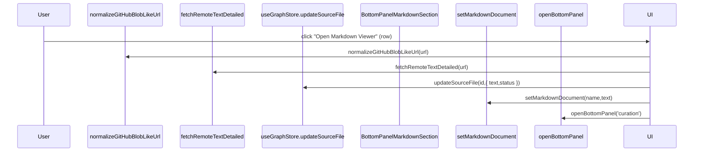
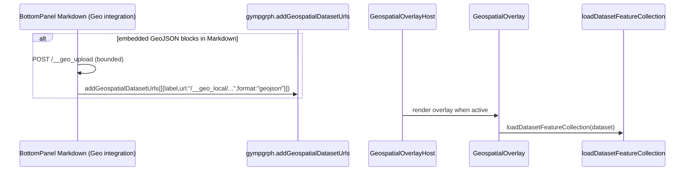

# Knowgrph Source Files Import (Workflow → Workspace Actions)

## Design Mantras

```
- [ ] Markup; apply semantic elements; forbid generic div misuse
- [ ] Modularity; reuse shared utilities; forbid duplication across components
- [ ] Neutrality; stay dataset-agnostic; forbid dataset-specific assumptions
- [ ] Provenance; preserve imported source text; forbid metadata loss
- [ ] Reliability; bound remote fetch; forbid indefinite runs
```

---

## Architecture

**UI Surface Stack**: MainPanel Workflow → Step 3 (Ingest) → collapsible subsections (**Sample Dataset**, **Dataset fetch limits**, **Source Files**) → Source Files header "New Source File" (icon) → creates empty `.md` + selects it → opens Bottom Panel Curation → Markdown Viewer/Editor → left-side **Explorer** sidebar with sections (**Source Files**, **Outline**, **Backlinks**).

**Workspace Persistence**: The `sourceFiles` workspace is persisted locally via IndexedDB (Dexie) so Source Files survive reloads and act as a lightweight file-system abstraction; the persisted payload is intentionally minimal (no heavy parsed graph blobs) and includes workspace metadata (folder name/access mode/selected folder path). Local-folder-backed entries fall back to cached text when folder handles are unavailable.

**Supported Formats**: Local import/export supports `.md .markdown .txt .json .jsonld .csv .html .htm .yaml .yml`, URL sources via `https://…`, and YouTube imports via the YouTube importer.

**UI Consolidation Rule**: Workspace Actions lives in MainPanel Workflow only; FloatingPanel is reserved for transient views (e.g. Props, Renderer, Traversal) to avoid duplicated controls.

**Workflow Aside Rule**: Workflow uses the shared MainPanel `<aside>` wrapper (same scrolling contract as Settings) and reuses the shared Expand/Collapse All header control.

**Search Rule**: Workspace Actions filtering reuses the MainPanel header Graph Search toggle (no duplicate per-section search input).

**GraphRAG Workflow Editing Rule**: Workflow Step 6 links to Bottom Panel → Orchestrator for GraphRAG workflow JSON-LD editing (no duplicate editor in MainPanel Workflow).

**Toolbar Entry Point**: Toolbar "Open Data" opens MainPanel Workflow so ingest actions remain discoverable in the canonical step flow.

**Optional Geo Layer Path**: Source Files → per-row Geo Layer checkbox (visible only while Geospatial Mode is On) → geospatial dataset registry (gympgrph store) → Geospatial Overlay layers

**Embedded GeoJSON Path**: For local Markdown Source Files, the Geo checkbox can register embedded fenced `geojson` blocks (GeoJSON `FeatureCollection`) as overlay datasets by uploading them to the bounded local dataset cache and registering the returned `/__geo_local/...` URLs.

---

## Happy Path Sequence Diagrams

### Source Files List Import → Markdown Render (Curagrph)



### Format-Specific Import (Parse → GraphCanvas Render) (Knowgrph)

```mermaid
sequenceDiagram
  participant U as User
  participant UI as BottomPanel Markdown Toolbar
  participant FLOW as runImportFlow
  participant PAR as loadGraphDataFromTextViaParser
  participant G as useActiveGraphData
  participant C as GraphCanvas

  U->>UI: Import local/URL (active file)
  UI->>FLOW: runImportFlow({ nameForParse, textForParse })
  FLOW->>PAR: loadGraphDataFromTextViaParser(nameForParse,textForParse)
  C->>G: useActiveGraphData()
```

### Optional Geo Layer Registration → MapLibre Layers (Gympgrph)



### High-Level Components

- **Workspace Actions (Knowgrph)**:
  - `knowgrph/canvas/src/features/workspace-actions/WorkspaceActionsPanel.tsx` renders Step 3 subsections (Dataset fetch limits + Source Files).
- **Source Files Ingest (Knowgrph)**:
  - `knowgrph/canvas/src/features/source-files/sourceFilesIngestIntegration.ts` implements Source Files import/export/clear + parse/apply helpers used by the BottomPanel Markdown toolbar.
- **Curation UI (Curagrph)**:
  - `curagrph/src/features/markdown/ui/MarkdownPanelLayout.tsx` renders an Explorer-like sidebar (Source Files + Outline + Backlinks).
  - `curagrph/src/components/BottomPanel/BottomPanelMarkdownSection.tsx` wires selection to `setMarkdownDocument(...)`.
  - `curagrph/src/components/BottomPanel/BottomPanelMarkdownViewerHeader.tsx` renders the Source Files ingest controls in the Markdown toolbar.
- **Geospatial Mode (Gympgrph)**:
  - `gympgrph/src/geospatialDatasets.ts` exposes a lightweight dataset-add API for hosts.
  - `gympgrph/src/hooks/store/geospatialSlice.ts` persists `mapOverlayDatasets` under `kg:ui:geospatial:*` keys.

---

## Specifications

### YouTube Import (End-to-End Native Local In-Repo Pipeline)

**From/To**: Source Files Import URL -> `youtube_cmd.py` -> Native Fetch (HTML scrape/InnerTube/XML/JSON) -> Markdown/JSON output.

**Decision Logic**:
- **End-to-End Native Implementation**: Uses a dependency-free native Python implementation (`youtube_cmd.py`) to fetch transcripts via the YouTube `timedtext` API or InnerTube API, avoiding external library breakage (`youtube-transcript-api`) and ensuring fully local execution.
- **Fallbacks**: Tries native fetch first, then InnerTube API (Android client emulation), then `yt-dlp` (if installed), then `whisper` (if installed/configured).
- **Output Format**: Respects the `youtubeTranscriptOutputFormat` setting (Markdown with embedded thumbnail or raw JSON).
- **Error Handling**: Returns structured JSON errors (`{ "ok": false, "error": "..." }`) even on failure, ensuring the UI displays specific messages (e.g., "Transcript unavailable" due to IP blocking) instead of generic request failures.
- **Thumbnail**: Extracts high-res thumbnails via oEmbed or fallback URL construction.

### Optional Geo Layer Registration

**From/To**: Source Files Import → registers dataset URLs → enables multi-dataset overlay rendering.

**Decision Logic**:

- When a local Markdown Source File contains fenced `geojson` blocks that parse as GeoJSON (FeatureCollection/Feature/Geometry), the renderer integration uploads each block to the local dataset cache (`/__geo_upload`) and registers them as overlay datasets.

### Parse Routing (Source Files → Parse → Graph)

**From/To**: Source Files → per-row Local import or URL import → `runImportFlow` (format inferred by name/URL) → GraphCanvas render.

**Decision Logic**:

- Source Files is the canonical ingest surface for text-like and document-like sources (Markdown/HTML/PDF/JSON/JSON-LD/CSV/GeoJSON) and URL sources (including YouTube).
- Legacy tool-menu ingest actions are removed to avoid duplicated/conflicting ingest surfaces.
- Remote URL fetching is bounded and uses the Step 3 **Dataset fetch limits** (timeout/max-bytes) so large URL sources do not fail against the shared default limit.
- Local file import is also bounded by the same max-bytes limit to keep local and URL ingest behavior consistent.

---

## Design Compliance

| Context | Intent | Directive | Module/Component | Function/Method | Input | Output | Decision Logic |
|---|---|---|---|---|---|---|---|
| Utilities | Centralize parsing | - [ ] Reuse URL normalization; forbid ad-hoc GitHub URL handling | `knowgrph/canvas/src/lib/url.ts` | `normalizeGitHubBlobLikeUrl` | URL | URL | Normalize blob-like URLs to the canonical fetch URL when possible |
| Fetch | Bound remote work | - [ ] Bound fetch; forbid indefinite streaming | `knowgrph/canvas/src/lib/net/fetchRemoteText.ts` | `fetchRemoteTextDetailed` | URL | `{ ok,text }` | Timeout + max-bytes guard |
| Curation UI | Preserve discoverability | - [ ] Show Source Files/Outline/Backlinks in Explorer; forbid hidden state | `curagrph/.../MarkdownPanelLayout.tsx` | `MarkdownPanelLayout` | `sourceFiles`, `tokens` | Explorer sidebar | Render Source Files tree + Outline (TOC) + Backlinks as stable sections |
| Geospatial | Avoid duplicate import surfaces | - [ ] Consolidate dataset import; forbid conflicting UIs | `gympgrph/src/features/geospatial/GeospatialPanel.tsx` | `GeospatialPanel` | Dataset list | Dataset list UI | Geo panel does not provide dataset-add inputs; adding is consolidated into Source Files import |
