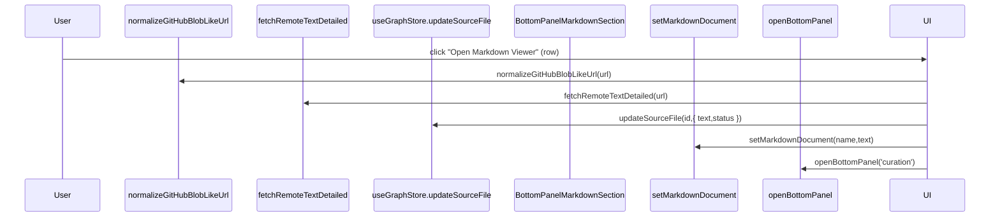
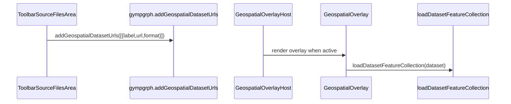

# Knowgrph Source Files Import (Workflow → Workspace Actions)

## Design Mantras

```
- [ ] Markup; apply semantic elements; forbid generic div misuse
- [ ] Modularity; reuse shared utilities; forbid duplication across components
- [ ] Neutrality; stay dataset-agnostic; forbid dataset-specific assumptions
- [ ] Provenance; preserve imported source text; forbid metadata loss
- [ ] Reliability; bound remote fetch; forbid indefinite runs
```

---

## Architecture

**UI Surface Stack**: MainPanel Workflow → Step 3 (Ingest) → Workspace Actions → Source Files → header "New Source File" (icon) → per-row import/export/clear actions → Store mutations → Bottom Panel Markdown "Contents" navigation

**Supported Formats**: Local import/export supports `.md .markdown .txt .json .jsonld .csv .html .htm .yaml .yml`, URL sources via `https://…`, and YouTube imports via the YouTube importer.

**UI Consolidation Rule**: Workspace Actions lives in MainPanel Workflow only; FloatingPanel is reserved for transient views (e.g. Props, Renderer, Traversal) to avoid duplicated controls.

**Workflow Aside Rule**: Workflow uses the shared MainPanel `<aside>` wrapper (same scrolling contract as Settings) and reuses the shared Expand/Collapse All header control.

**Search Rule**: Workspace Actions filtering reuses the MainPanel header Graph Search toggle (no duplicate per-section search input).

**GraphRAG Workflow Editing Rule**: Workflow Step 6 links to Bottom Panel → Orchestrator for GraphRAG workflow JSON-LD editing (no duplicate editor in MainPanel Workflow).

**Toolbar Entry Point**: Toolbar "Open Data" opens MainPanel Workflow so ingest actions remain discoverable in the canonical step flow.

**Optional Geo Layer Path**: Source Files → per-row Geo Layer checkbox → geospatial dataset registry (gympgrph store) → Geospatial Overlay layers

---

## Happy Path Sequence Diagrams

### Source Files List Import → Markdown Render (Curagrph)



### Format-Specific Import (Parse → GraphCanvas Render) (Knowgrph)

```mermaid
sequenceDiagram
  participant U as User
  participant UI as ToolbarSourceFilesArea
  participant FLOW as runImportFlow
  participant PAR as loadGraphDataFromTextViaParser
  participant G as useActiveGraphData
  participant C as GraphCanvas

  U->>UI: click "Import" (row)
  UI->>FLOW: runImportFlow({ nameForParse, textForParse })
  FLOW->>PAR: loadGraphDataFromTextViaParser(nameForParse,textForParse)
  C->>G: useActiveGraphData()
```

### Optional Geo Layer Registration → MapLibre Layers (Gympgrph)



### High-Level Components

- **Workspace Actions (Knowgrph)**:
  - `knowgrph/canvas/src/features/toolbar/ToolbarSourceFilesArea.tsx` opens the Source Files import surface.
  - `knowgrph/canvas/src/features/toolbar/ToolbarSourceFilesArea.tsx` embeds the URL/local Source Files import row and optional Geo dataset manager.
- **Curation UI (Curagrph)**:
  - `curagrph/src/features/markdown/ui/MarkdownPanelLayout.tsx` renders Source Files inside the "Contents" navigation.
  - `curagrph/src/components/BottomPanel/BottomPanelMarkdownSection.tsx` wires selection to `setMarkdownDocument(...)`.
- **Geospatial Mode (Gympgrph)**:
  - `gympgrph/src/geospatialDatasets.ts` exposes a lightweight dataset-add API for hosts.
  - `gympgrph/src/geospatialDatasetsUi.ts` exposes a dataset manager UI for host embedding.
  - `gympgrph/src/hooks/store/geospatialSlice.ts` persists `mapOverlayDatasets` under `kg:ui:geospatial:*` keys.

---

## Specifications

### Optional Geo Layer Registration

**From/To**: Source Files Import → registers dataset URLs → enables multi-dataset overlay rendering.

**Decision Logic**:

- If the user enables the Geo Layer checkbox on a URL row, the URL is registered as a dataset reference using `gympgrph` and rendered as an overlay when Geospatial mode is active.
- Dataset labels are derived from the row label when not explicitly provided.

### Quick Import (Parse → Graph)

**From/To**: Workspace Actions tool menu → Markdown/HTML/PDF/YouTube/JSON/JSON-LD areas → triggers `importLocal` / `importUrl` actions → runs the format-specific import pipeline.

**Decision Logic**:

- Source Files focuses on managing the Source Files list (add via URL/local, reorder, toggle visibility).
- Parser-oriented ingest (Markdown/HTML/PDF/YouTube/JSON/JSON-LD/CSV) remains in dedicated tool menu areas so Source Files stays table-driven and conflict-free.

---

## Design Compliance

| Context | Intent | Directive | Module/Component | Function/Method | Input | Output | Decision Logic |
|---|---|---|---|---|---|---|---|
| Utilities | Centralize parsing | - [ ] Reuse URL normalization; forbid ad-hoc GitHub URL handling | `knowgrph/canvas/src/lib/url.ts` | `normalizeGitHubBlobLikeUrl` | URL | URL | Normalize blob-like URLs to the canonical fetch URL when possible |
| Fetch | Bound remote work | - [ ] Bound fetch; forbid indefinite streaming | `knowgrph/canvas/src/lib/net/fetchRemoteText.ts` | `fetchRemoteTextDetailed` | URL | `{ ok,text }` | Timeout + max-bytes guard |
| Curation UI | Preserve discoverability | - [ ] Show Source Files in Contents; forbid hidden state | `curagrph/.../MarkdownPanelLayout.tsx` | `MarkdownPanelLayout` | `sourceFiles` | Contents nav list | Render list inside TOC nav so it remains visible even without headings |
| Geospatial | Avoid duplicate import surfaces | - [ ] Consolidate dataset import; forbid conflicting UIs | `gympgrph/src/features/geospatial/GeospatialPanel.tsx` | `GeospatialPanel` | Dataset list | Dataset list UI | Geo panel does not provide dataset-add inputs; adding is consolidated into Source Files import |
