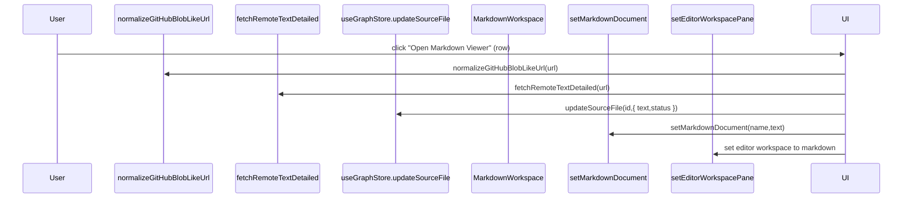
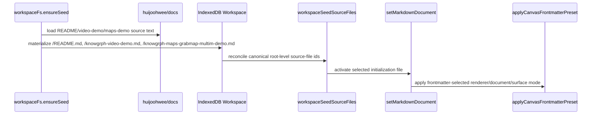
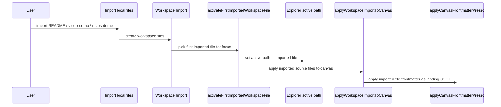
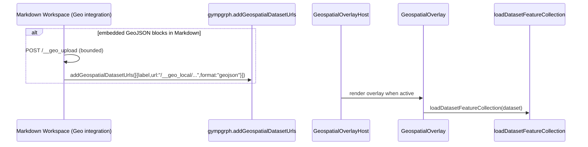

# Knowgrph Source Files Import (Workflow → Workspace Actions)

## Design Mantras

```
- [ ] Markup; apply semantic elements; forbid generic div misuse
- [ ] Modularity; reuse shared utilities; forbid duplication across components
- [ ] Neutrality; stay dataset-agnostic; forbid dataset-specific assumptions
- [ ] Provenance; preserve imported source text; forbid metadata loss
- [ ] Reliability; bound remote fetch; forbid indefinite runs
```

---

## Architecture

**UI Surface Stack**: MainPanel Workflow → Step 3 (Ingest) → collapsible subsections (**Sample Dataset**, **Dataset fetch limits**, **Source Files**) → Source Files header "New Source File" (icon) → creates empty `.md` + selects it → opens the markdown workspace / Editor Workspace → left-side **Explorer** sidebar with sections (**Source Files**, **Outline**, **Backlinks**).

**Workspace Persistence**: The `sourceFiles` workspace is persisted locally via IndexedDB (Dexie) so Source Files survive reloads and act as a lightweight file-system abstraction; the persisted payload is intentionally minimal (no heavy parsed graph blobs) and includes workspace metadata (folder name/access mode/selected folder path). Local-folder-backed entries fall back to cached text when folder handles are unavailable.

**Initialization-File Bootstrap Contract**: The default initialization-file family is sourced from `huijoohwee/docs` and materialized into the root of the local workspace as `/README.md`, `/knowgrph-video-demo.md`, and `/knowgrph-maps-grabmap-multim-demo.md`. `README.md` is the canonical D3 document seed, `knowgrph-video-demo.md` is the canonical Flow Editor validation seed, and `knowgrph-maps-grabmap-multim-demo.md` is the canonical geospatial seed. Source Files and workspace bootstrap must treat those root-level workspace paths as the activation ids while treating `huijoohwee/docs` as the source-text SSOT.

**Imported-Document Activation Rule**: During the exact UI import path, the first imported workspace file chosen for focus becomes the active raw-frontmatter authority before any composed source-file replay runs. This prevents a previously selected document from reapplying stale renderer/surface frontmatter over the newly imported preset document.

**Composition Invariant**: Any change to `sourceFiles` (add/remove/clear/toggle/parsed hash updates) must trigger a recomposition via `applyComposedGraphFromSourceFiles()` so the active `graphData` and all graph-tied touchpoints (canvas, Graph Data Table) stay consistent. When Source Files becomes empty, the composed `graphData` must become empty as well (no stale rows).

**Document Versioning Rule**: Editor Workspace saves, Source Files writeback, and GitGraph CRUD must record bounded local document snapshots via the shared document-versioning utility. Source Files exposes per-file version counts, Editor Workspace `[ ] diff` opens the shared Timeline bottom panel in GitGraph view after `[ ] Markdown`, and that bottom panel exposes the GitGraph icon immediately to the right of the Timeline icon. MainPanel History does not own a document-version Docs surface.

**Supported Formats**: Local import/export supports `.md .markdown .txt .json .jsonld .csv .html .htm .yaml .yml`, URL sources via `https://…`, and YouTube imports via the YouTube importer.

**GitHub Repo URL Rule**: When Import URL receives a GitHub repository URL (e.g. `https://github.com/<owner>/<repo>`), it must:

- Write a synthesized repo overview doc `repo.sitemap.md` into the created workspace folder and focus it as the first opened file.
- Also write `repo.user-journey.md` (user journey flow + UI map) into the same folder.
- Import up to a bounded number of likely-text files via `raw.githubusercontent.com` (no folder-by-folder `contents` crawling).
- Continue on per-file failures (record them) instead of failing the whole import.
- Emit progress toasts and bounded progress logs into MainPanel History → Log.

**Folder Mode Contract Rule**: When the user selects a workspace folder that contains `repo.sitemap.md` / `repo.user-journey.md`, the explorer row must show a right-side dropdown (same UI as File Mode Contract) that switches the Editor SSOT between Sitemap and User Journey.

**Sitemap LOD Rule**: `repo.sitemap.md` must include (bounded) Repository Statistics, a Directory Structure tree, extracted README feature groups with per-section “Section Statistics”, a Template Showcase grid + table, and a Core Entry Points section that derives function/class/method tables from key source files when available.

**UI Consolidation Rule**: Workspace Actions lives in MainPanel Workflow only; FloatingPanel is reserved for transient views (e.g. Props, Renderer, Traversal) to avoid duplicated controls.

**Workflow Aside Rule**: Workflow uses the shared MainPanel `<aside>` wrapper (same scrolling contract as Settings) and reuses the shared Expand/Collapse All header control.

**Search Rule**: Workspace Actions filtering reuses the MainPanel header Graph Search toggle (no duplicate per-section search input).

**GraphRAG Workflow Editing Rule**: Workflow Step 6 links to Floating Panel → Graph Traversal / Orchestrator for GraphRAG workflow JSON-LD editing (no duplicate editor in MainPanel Workflow).

**Toolbar Entry Point**: Toolbar "Open Data" opens MainPanel Workflow so ingest actions remain discoverable in the canonical step flow.

**Optional Geo Layer Path**: Source Files → per-row Geo Layer checkbox (visible only while Geospatial Mode is On) → geospatial dataset registry (gympgrph store) → Geospatial Overlay layers

**Embedded GeoJSON Path**: For local Markdown Source Files, the Geo checkbox can register embedded fenced `geojson` blocks (GeoJSON `FeatureCollection`) as overlay datasets by uploading them to the bounded local dataset cache and registering the returned `/__geo_local/...` URLs.

---

## Happy Path Sequence Diagrams

### Source Files List Import → Markdown Render (Singabldr)



### Initialization-File Bootstrap → Frontmatter View Landing (Knowgrph)



### UI Import Activation → Frontmatter-Preset Landing (Knowgrph)



### Format-Specific Import (Parse → GraphCanvas Render) (Knowgrph)

```mermaid
sequenceDiagram
  participant U as User
  participant UI as Markdown Workspace Toolbar
  participant FLOW as runImportFlow
  participant PAR as loadGraphDataFromTextViaParser
  participant G as useActiveGraphData
  participant C as GraphCanvas

  U->>UI: Import local/URL (active file)
  UI->>FLOW: runImportFlow({ nameForParse, textForParse })
  FLOW->>PAR: loadGraphDataFromTextViaParser(nameForParse,textForParse)
  C->>G: useActiveGraphData()
```

### Optional Geo Layer Registration → MapLibre Layers (Gympgrph)



### High-Level Components

- **Workspace Actions (Knowgrph)**:
  - `knowgrph/canvas/src/features/workspace-actions/WorkspaceActionsPanel.tsx` renders Step 3 subsections (Dataset fetch limits + Source Files).
- **Source Files Ingest (Knowgrph)**:
  - `knowgrph/canvas/src/features/source-files/sourceFilesIngestIntegration.ts` implements Source Files import/export/clear + parse/apply helpers used by the markdown workspace toolbar.
  - `knowgrph/canvas/src/features/source-files/workspaceSeedSourceFiles.ts` keeps the canonical source-file aliases for the 3-file initialization family aligned with the root-level workspace paths.
- **Workspace Seed Bootstrap (Knowgrph)**:
  - `knowgrph/canvas/src/features/workspace-fs/workspaceFs.ts` loads initialization-file source text from `huijoohwee/docs`, materializes the canonical files into the workspace root, and keeps seed ordering deterministic.
- **Source Files Runtime Bootstrap (Knowgrph)**:
  - `knowgrph/canvas/src/features/source-files/SourceFilesPersistenceBootstrap.tsx` coalesces seed-sync, rematerialization, and storage bridge scheduling through request-owned helpers to keep Source Files, Workspace, and Storage in sync on the same tick.
- **Document Versioning (Knowgrph)**:
  - `knowgrph/canvas/src/features/document-versioning/documentVersioning.ts` owns bounded local snapshots, git-style diffs, and GitGraph history code shared by Editor Workspace, Source Files, GitGraph CRUD, and the Timeline bottom panel GitGraph view.
- **Curation UI (Singabldr)**:
  - `singabldr/src/features/markdown/ui/MarkdownPanelLayout.tsx` renders an Explorer-like sidebar (Source Files + Outline + Backlinks).
  - `knowgrph/canvas/src/lib/markdown-workspace-runtime/MarkdownWorkspaceRuntime.impl.tsx` wires selection and active workspace path to `setMarkdownDocument(...)`.
  - `knowgrph/canvas/src/features/markdown-workspace/MarkdownWorkspaceToolbar.tsx` renders the Source Files ingest controls in the markdown workspace toolbar.
- **Geospatial Mode (Gympgrph)**:
  - `gympgrph/src/geospatialDatasets.ts` exposes a lightweight dataset-add API for hosts.
  - `gympgrph/src/hooks/store/geospatialSlice.ts` persists `mapOverlayDatasets` under `kg:ui:geospatial:*` keys.

### Component Inventory

| Layer | Component | File | Status |
|---|---|---|---|
| Workspace Actions | Workflow Step 3 UI | `WorkspaceActionsPanel.tsx` | Built |
| Source Files | Import/export/clear/parse | `sourceFilesIngestIntegration.ts` | Built |
| Source Files | Seed aliases (3-file family) | `workspaceSeedSourceFiles.ts` | Built |
| Workspace FS | Seed bootstrap | `workspaceFs.ts` | Built |
| Workspace FS | Minimal persisted cache FS | `workspaceFsPersisted.ts` | Built |
| Workspace FS | In-memory FS | `workspaceFsMemory.ts` | Built |
| Workspace FS | Change events | `workspaceFsEvents.ts` | Built |
| Workspace FS | Bootstrap startup | `sourceFilesBootstrapStartup.ts` | Built |
| SF ↔ Storage | Runtime bootstrap | `SourceFilesPersistenceBootstrap.tsx` | Built |
| Document versions | Snapshot/diff/GitGraph utility | `documentVersioning.ts` | Built |
| Curation UI | Explorer sidebar | `MarkdownPanelLayout.tsx` (Singabldr) | Built |
| Curation UI | Workspace runtime | `MarkdownWorkspaceRuntime.impl.tsx` | Built |
| Curation UI | Toolbar ingest controls | `MarkdownWorkspaceToolbar.tsx` | Built |
| Geospatial | Dataset add API | `geospatialDatasets.ts` (Gympgrph) | Built |
| Geospatial | Dataset store | `geospatialSlice.ts` (Gympgrph) | Built |
| Utilities | URL normalization | `url.ts` → `normalizeGitHubBlobLikeUrl` | Built |
| Fetch | Bounded remote fetch | `fetchRemoteText.ts` → `fetchRemoteTextDetailed` | Built |
| Import | YouTube pipeline | `youtube_cmd.py` | Built |
| Import | Webpage proxy | `/__webpage_proxy` route | Built |
| Import | Website import | `/__website_import/start` route | Built |
| Import | Geo upload | `/__geo_upload` route | Built |

---

## Specifications

### YouTube Import (End-to-End Native Local In-Repo Pipeline)

**From/To**: Source Files Import URL -> `youtube_cmd.py` -> Native Fetch (HTML scrape/InnerTube/XML/JSON) -> Markdown/JSON output.

**Decision Logic**:
- **End-to-End Native Implementation**: Uses a dependency-free native Python implementation (`youtube_cmd.py`) to fetch transcripts via the YouTube `timedtext` API or InnerTube API, avoiding external library breakage (`youtube-transcript-api`) and ensuring fully local execution.
- **Fallbacks**: Tries native fetch first, then InnerTube API (Android client emulation), then `yt-dlp` (if installed), then `whisper` (if installed/configured).
- **Output Format**: Respects the `youtubeTranscriptOutputFormat` setting (Markdown with embedded thumbnail or raw JSON).
- **Error Handling**: Returns structured JSON errors (`{ "ok": false, "error": "..." }`) even on failure, ensuring the UI displays specific messages (e.g., "Transcript unavailable" due to IP blocking) instead of generic request failures.
- **Thumbnail**: Extracts high-res thumbnails via oEmbed or fallback URL construction.

### Webpage Import (URL/Local Path → Markdown SSOT + HTML/JSON Viewer)

**From/To**: Source Files / Workspace Import URL → browser-native webpage conversion (hidden sandboxed iframe DOM export + proxy-fetch fallback) → Markdown → Graph parse; Viewer/Presentation/Slides → fetch HTML via `/__webpage_proxy` (or stored artifacts) → sanitize → sandboxed iframe `srcdoc`.

**Decision Logic**:
- **Graph Alignment**: Webpages convert to Markdown for Document Structure parsing, preserving graph/content sync across touchpoints.
- **View Mode (Strictly View-Only)**: Per-file `kgWebpageView` frontmatter (and default `webpageImportView` setting) selects `markdown | json | html`.
- **Mode contract (active-row dropdown)**:
  - (1) `Markdown` (default): Editor shows Markdown; Viewer/Presentation/Slides render Markdown.
  - (2) `HTML`: Editor shows editable Markdown SSOT; Viewer/Presentation/Slides render sandboxed HTML via iframe `srcdoc` (view-only).
  - (3) `JSON`: Editor shows conversion JSON (read-only override); Viewer/Presentation/Slides render sandboxed JSON code via iframe `srcdoc` (view-only).

**Webpage Markdown (Editor SSOT)**:
- Generated output is a single Markdown SSOT document (frontmatter + Markdown body). It must not include duplicate “artifact doc” wrappers, alternate formats, or synthetic table-of-contents/layout sections by default.
- If a webpage embeds a Markdown payload in its HTML (e.g., React `data-page` JSON fields like `props.article.content`), the importer prefers that embedded Markdown and writes it directly (lossless for text/images/links).

**Shared token vocabulary (mode-independent)**: the app uses a generic signal extraction layer to derive consistent tokens from Markdown across modes: `[NAV]`, `[CTA]`, `[LINK]`, `[PRICE]`, `[TIME]`.
- **Iframe implementation**:
  - HTML/JSON always render via sandboxed iframe `srcdoc`.
  - HTML source is fetched via `/__webpage_proxy` (remote or local in-repo path), or read from stored website-import artifacts when available.
-  - For local in-repo webpages, assets resolve through `/__codebase_asset?path=...` plus optional `kgWebpageSiteRootRel` for root-relative URLs. Local HTML rewriting should target the codebase routes directly instead of relying on path-based baseHref behavior.
  - Script execution baseline is controlled by `webpageViewerScriptPolicy`, but effective per-page behavior is auto by default: shared rich-media + iframe heuristics decide when scripts are required for DOM export versus when they should be stripped.
- **Iframe sandbox policy**: Use `sandbox="allow-scripts"` with `referrerPolicy="no-referrer"`; forbid top-level navigation. Also set a restrictive `allow` feature policy (no geolocation/camera/mic/payment/clipboard).
- **Safety invariant**: Switching view must not mutate graph/layout/zoom/layers, trigger re-parsing/apply-to-graph, or write default import settings.
- **Iframe Fidelity**: The proxy strips conflicting `<base>` and CSP/XFO meta tags, rewrites asset URLs (including relative URLs) to `/__webpage_asset_proxy` for same-origin loading, and supports local in-repo file reads for HTML + assets.
- **Neutrality**: No site-specific parsing; URL normalization + bounded fetch/convert only.

**Native fidelity upgrade (no headless browser)**:

- If the initial conversion produces low-quality Markdown (typical for JS-rendered/accordion pages), the client may upgrade the conversion using a **hidden sandboxed iframe** pointed at `/__webpage_proxy` and the `kg-export-dom` bridge to export rendered DOM text/HTML, then convert to Markdown.
- This path is domain-neutral and does not require external headless browser dependencies.

### Website Import (Sitemap/Tree → Workspace Pages + Artifact-Backed View Switching)

**From/To**: Markdown Workspace → Import website (Globe button) → `/__website_import/start` → sitemap discovery + bounded crawling → per-page artifacts persisted under `.knowgrph-workspace/website-imports/<importId>/nodes/<nodeId>/` (in this repo the directory is moved to `sandbox/.knowgrph-workspace` via symlink) → workspace stubs written under `/websites/<host>/<importId>/...`.

**Website Sitemap Artifact (workspace)**:
- Writes `website.sitemap.md` at the website import root folder.
- Contains a tree view (ASCII) and a page table (path/title/url) so imported webpages are visible in a single sitemap document.

**Per-Page Stub Contract (frontmatter)**:
- `kgWebpageUrl`: canonical page URL
- `kgWebpageView`: `markdown | json | html`
- `kgWebsiteImportId`: website import job id
- `kgWebsiteNodeId`: stable node id (hash of URL)
- `kgWebsiteOutputDirRel`: optional override for the in-repo artifact root directory

**Decision Logic**:
- **Tree fidelity**: Workspace path is derived from URL pathname so the Explorer reflects the website’s directory structure.
- **View switching (active-row dropdown)**: `Markdown | JSON | HTML` is strictly view-only (no apply-to-graph, no layout/zoom mutation, no default-setting mutation).
- **Artifact mapping (editor text)**: `json→conversionJson`, `html→rawHtml`, `markdown→(no override)`.
- **Frontmatter preservation**: View switching must preserve existing frontmatter keys (including `kgWebsiteImportId/kgWebsiteNodeId/kgWebsiteOutputDirRel`) so artifact-backed HTML/JSON resolution remains stable after switching.
- **HTML fidelity**: For `kgWebpageView = html`, Viewer/Presentation/Slides render sandboxed HTML via `srcdoc`. HTML is sourced from stored `raw.html` artifacts (preferred) or via the same-origin proxy. `json` renders sandboxed JSON code via `srcdoc`.
- **Markdown artifact**: The Markdown view can embed a ` ```text kg-webpage-layout ` block as a lightweight, editable layout snapshot.

**Single-URL Artifact Path (non-sitemap)**:
- Source Files / Markdown Workspace “Import URL” can also persist per-URL artifacts via `POST /__website_import/import-url`, writing `raw.html`, `page.md`, `conversion.json` under `.knowgrph-workspace/...` (in this repo the directory is moved to `sandbox/.knowgrph-workspace` via symlink).
 
Note: The current website-import artifact set is `raw.html`, `page.md`, `conversion.json` (no separate layout artifacts).

### Optional Geo Layer Registration

**From/To**: Source Files Import → registers dataset URLs → enables multi-dataset overlay rendering.

**Decision Logic**:

- When a local Markdown Source File contains fenced `geojson` blocks that parse as GeoJSON (FeatureCollection/Feature/Geometry), the renderer integration uploads each block to the local dataset cache (`/__geo_upload`) and registers them as overlay datasets.

### Parse Routing (Source Files → Parse → Graph)

**From/To**: Source Files → per-row Local import or URL import → `runImportFlow` (format inferred by name/URL) → GraphCanvas render.

**Decision Logic**:

- Source Files is the canonical ingest surface for text-like and document-like sources (Markdown/HTML/PDF/JSON/JSON-LD/CSV/GeoJSON) and URL sources (including YouTube).
- Legacy tool-menu ingest actions are removed to avoid duplicated/conflicting ingest surfaces.
- Remote URL fetching is bounded and uses the Step 3 **Dataset fetch limits** (timeout/max-bytes) so large URL sources do not fail against the shared default limit.
- Local file import is also bounded by the same max-bytes limit to keep local and URL ingest behavior consistent.
- Composed source-files apply guards (`composedApplyGuards.ts`) prevent stale or conflicting graph mutations when multiple source files are composed into a single active graph: guards check text hash consistency, frontmatter mode compatibility, and overlay state before applying a composed graph update.
- Frontmatter-flow import mode clearing: importing a frontmatter-flow graph clears both the global `flowWidgetWorldPosByNodeId` and the per-graph-key variant `flowWidgetWorldPosByNodeIdByGraphMetaKey[graphKey]` to ensure a clean slate when switching between frontmatter-flow graphs.

---

## Design Compliance

| Context | Intent | Directive | Module/Component | Function/Method | Input | Output | Decision Logic |
|---|---|---|---|---|---|---|---|
| Utilities | Centralize parsing | - [ ] Reuse URL normalization; forbid ad-hoc GitHub URL handling | `knowgrph/canvas/src/lib/url.ts` | `normalizeGitHubBlobLikeUrl` | URL | URL | Normalize blob-like URLs to the canonical fetch URL when possible |
| Fetch | Bound remote work | - [ ] Bound fetch; forbid indefinite streaming | `knowgrph/canvas/src/lib/net/fetchRemoteText.ts` | `fetchRemoteTextDetailed` | URL | `{ ok,text }` | Timeout + max-bytes guard |
| Curation UI | Preserve discoverability | - [ ] Show Source Files/Outline/Backlinks in Explorer; forbid hidden state | `singabldr/.../MarkdownPanelLayout.tsx` | `MarkdownPanelLayout` | `sourceFiles`, `tokens` | Explorer sidebar | Render Source Files tree + Outline (TOC) + Backlinks as stable sections |
| Geospatial | Avoid duplicate import surfaces | - [ ] Consolidate dataset import; forbid conflicting UIs | `gympgrph/src/features/geospatial/GeospatialPanel.tsx` | `GeospatialPanel` | Dataset list | Dataset list UI | Geo panel does not provide dataset-add inputs; adding is consolidated into Source Files import |
