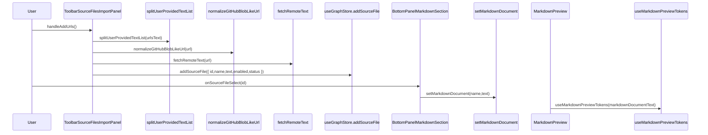
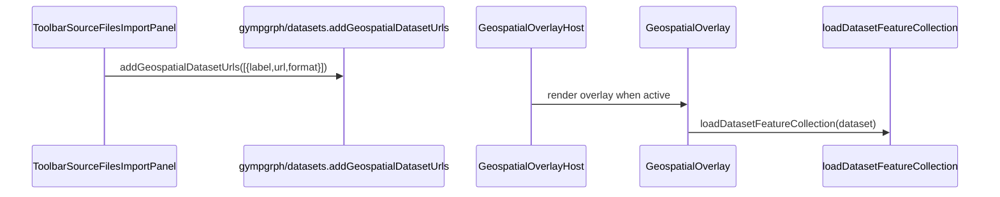

# Knowgrph Source Files Import (Workflow → Workspace Actions)

## Design Mantras

```
- [ ] Markup; apply semantic elements; forbid generic div misuse
- [ ] Modularity; reuse shared utilities; forbid duplication across components
- [ ] Neutrality; stay dataset-agnostic; forbid dataset-specific assumptions
- [ ] Provenance; preserve imported source text; forbid metadata loss
- [ ] Reliability; bound remote fetch; forbid indefinite runs
```

---

## Architecture

**UI Surface Stack**: MainPanel Workflow → Step 3 (Ingest) → Workspace Actions → Source Files (Import) → Store mutations → Bottom Panel Markdown "Contents" navigation

**UI Consolidation Rule**: Workspace Actions lives in MainPanel Workflow only; FloatingPanel is reserved for transient views (e.g. Props, Renderer, Traversal) to avoid duplicated controls.

**Workflow Aside Rule**: Workflow uses the shared MainPanel `<aside>` wrapper (same scrolling contract as Settings) and reuses the shared Expand/Collapse All header control.

**Search Rule**: Workspace Actions filtering reuses the MainPanel header Graph Search toggle (no duplicate per-section search input).

**Toolbar Entry Point**: Toolbar "Open Data" opens MainPanel Workflow so ingest actions remain discoverable in the canonical step flow.

**Optional Geo Layer Path**: Source Files (Import) → geospatial dataset registry (gympgrph store) → Geospatial Overlay layers

---

## Happy Path Sequence Diagrams

### Source Files List Import → Markdown Render (Curagrph)



### Quick Import (Parse → GraphCanvas Render) (Knowgrph)

```mermaid
sequenceDiagram
  participant U as User
  participant UI as ToolbarSourceFilesArea
  participant ACT as useToolbarMenuAction
  participant IMP as performMarkdownImport
  participant FLOW as runImportFlow
  participant PAR as loadGraphDataFromTextViaParser
  participant SIDE as applyImportedMarkdownToStore
  participant G as useActiveGraphData
  participant C as GraphCanvas

  U->>UI: onToolMenuAction('sourceFiles','importUrl',{format,url})
  UI->>ACT: dispatch importUrl
  ACT->>IMP: performMarkdownImport('url', url)
  IMP->>FLOW: runImportFlow({ nameForParse, textForParse, ... })
  FLOW->>PAR: loadGraphDataFromTextViaParser(nameForParse,textForParse)
  IMP->>SIDE: applyImportedMarkdownToStore(...)
  C->>G: useActiveGraphData()
```

### Optional Geo Layer Registration → MapLibre Layers (Gympgrph)



### High-Level Components

- **Workspace Actions (Knowgrph)**:
  - `knowgrph/canvas/src/features/toolbar/ToolbarSourceFilesArea.tsx` opens the Source Files import surface.
  - `knowgrph/canvas/src/features/toolbar/ToolbarSourceFilesImportPanel.tsx` imports local files and URL lists.
- **Curation UI (Curagrph)**:
  - `curagrph/src/features/markdown/ui/MarkdownPanelLayout.tsx` renders Source Files inside the "Contents" navigation.
  - `curagrph/src/components/BottomPanel/BottomPanelMarkdownSection.tsx` wires selection to `setMarkdownDocument(...)`.
- **Geospatial Mode (Gympgrph)**:
  - `gympgrph/src/geospatialDatasets.ts` exposes a lightweight dataset-add API for hosts.
  - `gympgrph/src/geospatialDatasetsUi.ts` exposes a dataset manager UI for host embedding.
  - `gympgrph/src/hooks/store/geospatialSlice.ts` persists `mapOverlayDatasets` under `kg:ui:geospatial:*` keys.

---

## Specifications

### Multi-Source URL Import

**From/To**: ToolbarSourceFilesImportPanel → splits URL list → normalizes URLs → fetches text → stores Source Files.

**Interface Pattern**:

- `ToolbarSourceFilesImportPanel` stores each imported entry as `{ id, name, text, enabled, status }` via `addSourceFile(...)`.
- URL parsing uses `splitUserProvidedTextList(...)` and `normalizeGitHubBlobLikeUrl(...)` to accept common paste formats.

### Optional Geo Layer Registration

**From/To**: Source Files Import → registers dataset URLs → enables multi-dataset overlay rendering.

**Decision Logic**:

- If the user enables the "Also add as Geo layer" toggle, each imported URL is registered as a dataset reference using `gympgrph/datasets`.
- Dataset labels are derived from the URL when not explicitly provided.
- Dataset ids are generated uniquely and persisted; implementation should prefer uuid-based ids when available.

### Dataset Add/List UI (Workspace Actions)

**From/To**: Source Files Import → embeds geospatial dataset manager → add/remove/reload/toggle datasets.

**Decision Logic**:

- The host hides the dataset manager inside the Geo side panel and embeds it into Source Files import to avoid duplicated surfaces.
- The embedded dataset manager is consumed via the declared `gympgrph/datasets-ui` entrypoint.

### Quick Import (Parse → Graph)

**From/To**: ToolbarSourceFilesArea → selects format → triggers `importLocal` / `importUrl` actions → runs the format-specific import pipeline.

**Decision Logic**:

- The quick-import surface provides a single format dropdown, a Local action, and a URL(s) action.
- URL(s) import accepts multiple URLs and dispatches `importUrl` once per URL (bounded by the underlying import flows).
- Advanced format-specific panels remain available for specialized inputs (for example YouTube language).

---

## Design Compliance

| Context | Intent | Directive | Module/Component | Function/Method | Input | Output | Decision Logic |
|---|---|---|---|---|---|---|---|
| Utilities | Centralize parsing | - [ ] Reuse URL parsing; forbid duplicate splitting logic | `knowgrph/canvas/src/lib/url.ts` | `splitUserProvidedTextList` | URL text list | URL array | Split by whitespace/commas; trim/unwrap; dedupe |
| Fetch | Bound remote work | - [ ] Bound fetch; forbid indefinite streaming | `knowgrph/canvas/src/lib/net/fetchRemoteText.ts` | `fetchRemoteText` | URL | Text or null | Timeout + max-bytes guard |
| Curation UI | Preserve discoverability | - [ ] Show Source Files in Contents; forbid hidden state | `curagrph/.../MarkdownPanelLayout.tsx` | `MarkdownPanelLayout` | `sourceFiles` | Contents nav list | Render list inside TOC nav so it remains visible even without headings |
| Geospatial | Avoid duplicate import surfaces | - [ ] Consolidate dataset import; forbid conflicting UIs | `gympgrph/src/features/geospatial/GeospatialPanel.tsx` | `GeospatialPanel` | Dataset list | Dataset list UI | Geo panel does not provide dataset-add inputs; adding is consolidated into Source Files import |
