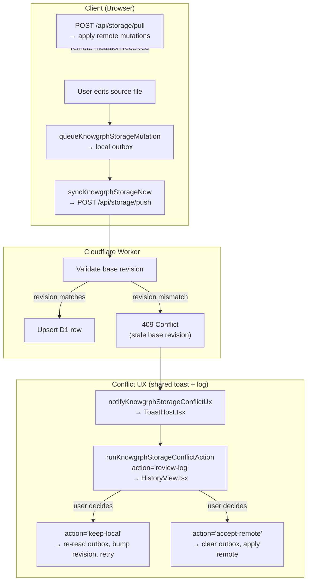

# Knowgrph Storage & Sync — Companion

Continuation of [knowgrph-storage-sync-document.md](knowgrph-storage-sync-document.md). Contains PRD summary, TAD runtime layers, conflict resolution flow, architectural decisions (ADRs), deployment phases, quality attributes, token economics, storage comparison, validation summary, and cross-repo documentation contract.

**Version**: 3.0.0
**Date**: 2026-06-13

---

## PRD Summary

### Problem

Knowgrph source files exist in three disconnected locations:

1. **Dev** (`knowgrph/canvas/src/`) — live editing with minimal persisted local cache
2. **Prod SSOT** (`huijoohwee/content/knowgrph/`) — static build artifacts mirrored into the Cloudflare Pages publish repo
3. **Docs seed** (`huijoohwee/docs/`) — canonical Markdown files for workspace initialization

The original gap was a built client-side sync engine with no server-side endpoint. Current Dev → Prod → Cloudflare context resolves the shared-store path through the deployed `knowgrph-storage` Worker, remote D1 migrations, and the static `huijoohwee/content/knowgrph` mirror.

### Personas

| Persona | Job-to-be-done | Pain point |
|---|---|---|
| Solo developer | Edit docs on any device and resume exactly where I left off | Workspace state is siloed per browser |
| Collaborator | Edit the same `*.md` or `*.json` file with a peer without destructive merge conflicts | Git merge on minified JSON loses fields; polling D1 is too slow for character-level edits |
| Operator | Deploy once and keep Prod SSOT and D1 read cache consistent with Dev | Manual multi-step deploy leaves runtime stale after doc changes |

### User Journey

| Stage | Action | Touchpoint | Pain | Opportunity |
|---|---|---|---|---|
| Trigger | Developer edits a source file | `canvas/src/` workspace FS | Edit is local-only; second device sees nothing | Autosave → push mutation to D1 Worker |
| Engage | Second device opens same workspace | Browser → `GET /api/storage/pull` | No mutations received; workspace diverges | Cursor-based pull → apply remote records |
| Collaborate | Two users open same `*.md` simultaneously | PocketBase/Yjs room | Destructive Git merge risk | `Y.Text` CRDT → save bridge → GitHub commit |
| Publish | Operator runs build-sync | `npm run pages:build-sync-cloudflare` | D1 can be stale after static deploy | `storage:deploy` re-seeds D1 docs inline |
| Recover | User clears all workspace files | Browser `localStorage` | Re-seed required manually | `ensureSeed()` re-seeds from configured source |

### User Stories

**As a** developer editing source files, **I want** document edits to persist to a remote store automatically, **so that** I can resume work from any device.

**As a** developer running the Dev server, **I want** seed file changes in the docs mirror to appear immediately, **so that** I can iterate on canonical docs without manual refresh.

**As a** collaborator editing a shared doc, **I want** same-file edits to merge without destructive Git conflicts, **so that** concurrent Markdown and JSON edits resolve through CRDTs and save back to GitHub.

**As an** operator deploying to production, **I want** the build-sync pipeline to be the single static-artifact path, **so that** production SPA continues to serve from Prod SSOT.

**As a** user on a mobile device, **I want** workspace state to sync via the same push/pull mechanism, **so that** I have seamless cross-device continuity.

### Acceptance Criteria

| Given | When | Then | VCC |
|---|---|---|---|
| Developer edits a source file | autosave debounce fires | document upsert queued in local outbox and pushed to `/api/storage/push` | `Verify: sourceFilesStorageSync.test.ts passes and outbox row cleared after push` |
| Push endpoint receives a mutation | D1 `documents` table upserted by `(workspace_id, canonical_path)` | response confirms stored revision; client clears outbox entry | `Verify: knowgrphStorageWorker.test.ts push assertions pass and no orphaned outbox rows remain` |
| Second device opens same workspace | client polls `/api/storage/pull` with last cursor | receives all mutations newer than cursor, applies to the local persisted cache | `Verify: knowgrphStorageClientSync.test.ts pull-to-apply assertions pass` |
| `Storage Sync` is off | Source Files change or workspace selection changes | configured docs mirror refresh loop stays paused | `Verify: sourceFilesBootstrapStartup does not trigger seed refresh when Storage Sync is off` |
| `Storage Sync` is on and two users edit the same `*.md` | both type at the same time | `Y.Text` merges character-level edits through PocketBase realtime; save bridge commits saved snapshot to GitHub | `Verify: sourceFilesPocketBaseYjsCollaboration.test.ts Markdown CRDT merge assertions pass` |
| `Storage Sync` is on and two users edit the same `*.json` | both edit at the same time | raw JSON editing is blocked; Yjs shared JSON types own the edit; save bridge commits canonical formatted JSON to GitHub | `Verify: sourceFilesPocketBaseYjsCollaboration.test.ts JSON guardrail assertions pass` |
| A collaborator saves a concurrent document | bridge persists the save | bridge owns the GitHub commit; collaborators never touch Git credentials or Git commands | `Verify: collab save bridge e2e test creates GitHub commit and no browser-side credential is accessed` |

### MoSCoW Prioritization

| Priority | Feature | ROI Score | Rationale |
|---|---|---|---|
| **Must** | Client push/pull + D1 Worker | 5×5/2 = 12.5 | Enables cross-device continuity; deployed; zero incremental build cost |
| **Must** | Auto-clear stale outbox conflicts | 4×5/0.5 = 40 | Eliminates manual resolution after re-seed; deployed; < 1 day to build |
| **Must** | Toolbar Storage Sync gate | 4×4/1 = 16 | User controls sync; prevents accidental seed refresh; deployed |
| **Should** | PocketBase + Yjs concurrent editing | 4×3/3 = 4 | Eliminates Git merge conflict risk for teams; built in Dev; requires PocketBase collection deploy |
| **Should** | GitHub save bridge | 4×3/2 = 6 | Keeps GitHub SSOT without requiring collaborators to use Git; built in Dev; requires Worker secret |
| **Should** | Default source URL + public doc view | 3×4/1 = 12 | Enables shareable canvas doc links; deployed |
| **Could** | R2 binary artifact storage | 2×2/1 = 4 | Needed for generated media; built; gated on Cloudflare R2 enablement |
| **Won't** | PostgreSQL backend | 1×1/8 = 0.1 | Deferred until D1/PocketBase responsibilities are outgrown |

**Min-viable scope**: Push/pull + D1 Worker + auto-clear conflicts + Storage Sync gate. Everything above this line is deployed. Concurrent editing (PocketBase + Yjs) is the next delivery gate.

### Success Metrics

| Metric | Baseline | Target | Timeline |
|---|---|---|---|
| Push success rate | 0% (no endpoint) | 99.9% | Done |
| Pull-to-apply latency | N/A | <2s p95 | Done |
| Cross-device state parity | 0% | 100% document parity | Done |
| Concurrent same-file merge safety | Destructive Git merge risk | 0 raw JSON simultaneous edits without CRDT | Built in Dev |
| D1 free-tier utilization | $0/mo | <$5/mo at projected scale | Ongoing |
| Monthly TCO | $0 | $0 (D1 free tier + FOSS PocketBase) | Ongoing |

### Out of Scope

- Browser-stored credentials of any kind.
- D1 as the concurrent collaboration SSOT.
- Git merge as the reconciliation path for simultaneous `*.json` edits.
- PostgreSQL until server-side retrieval outgrows D1/PocketBase responsibilities.

### Open Questions

- PocketBase collection deployment outside the repo: exact deploy runbook not yet scripted.
- Worker `KNOWGRPH_STORAGE_GITHUB_TOKEN` rotation strategy for the save bridge.
- Multi-tenant access control: see `knowgrph-multi-user-collaboration-prd.tad.md`.

---

## TAD — Runtime Layers

### Shared Contract

`canvas/src/lib/storage/knowgrphStorageSyncContract.ts` keeps client, Worker, and test fixtures aligned on:

- entity kinds, mutation operations, route paths
- pull/push response shapes, export contract
- conflict summary shape
- API version: `2026-05-04`

### Browser Storage (Minimal Persisted Cache)

`canvas/src/lib/storage/knowgrphStorageDb.ts` persists:

- local document copies, chunk cache, graph snapshots
- sync outbox, sync cursor

Local field names differ from remote to preserve the existing browser-local contract (`documentRevision` vs `revision`, `isDeleted` vs `deleted`).

### Cloudflare Worker

`cloudflare/workers/knowgrph-storage/` implements:

- `POST /api/storage/push` — validate mutations, upsert D1 rows by primary id or `(workspace_id, canonical_path)`, emit sync events
- `POST /api/storage/pull` — query sync events after cursor, return mutations
- `GET /api/storage/export/:workspaceId` — full workspace snapshot (JSON)
- `GET /api/storage/doc/:workspaceId/:canonicalPath*` — public single-document view (text/markdown)
- `POST /api/storage/blob/:workspaceId/:canonicalPath*` — store generated binary artifacts in R2 under the same workspace/canonical-path identity
- `GET|HEAD /api/storage/blob/:workspaceId/:canonicalPath*` — read generated binary artifact bodies or metadata from R2
- `POST /api/storage/collab/save` — GitHub save bridge; accepts saved Yjs snapshots; requires Worker `KNOWGRPH_STORAGE_GITHUB_TOKEN`, owner, and repo config

**Harness Contract — Client Sync Engine**

The sync client is not an LLM component, but it conforms to a bounded harness pattern to cap retry spend and prevent unbounded polling loops:

```
Input schema: { workspaceId, mutations: KnowgrphStorageMutation[], cursor: string | null }
Output schema: { pushed: number, pulled: KnowgrphStorageMutation[], newCursor: string, conflicts: ConflictSummary[] }
Max iterations: 3 push retries per mutation (exponential backoff); poll loop bounded by 120s interval and explicit Storage Sync gate
Circuit-breaker: Storage Sync off → loop paused; push retry count >= 3 → conflict surfaced to UX
Fallback path: on Worker 5xx → retain outbox; on pull failure → keep last cursor; never silently discard mutations
```

**VCC Conditions**

- `PRD-STORAGE-SYNC-S1 ↔ TAD-STORAGE-SYNC-SyncEngine`: `Verify: knowgrphStorageClientSync.test.ts push/pull/loop assertions pass and no test file outside storage scope is modified`
- `PRD-STORAGE-SYNC-S2 ↔ TAD-STORAGE-SYNC-Worker`: `Verify: knowgrphStorageWorker.test.ts push/pull/export/doc-view assertions pass and D1 row counts match seeded fixture`
- `PRD-STORAGE-SYNC-S5 ↔ TAD-STORAGE-SYNC-YjsRoom`: `Verify: sourceFilesPocketBaseYjsCollaboration.test.ts CRDT merge and JSON guardrail assertions pass`

### Client Sync Loop

`canvas/src/lib/storage/knowgrphStorageClientSync.ts` provides:

- device id provisioning, mutation enqueueing
- immediate and scheduled sync runs
- workspace-scoped polling loop (120s default)
- export helper, conflict summary callbacks

### Canvas Runtime Integration

`canvas/src/features/source-files/` wires storage into active workspace:

- source-file edits enqueue storage mutations
- generated workspace artifacts such as `/chat-log/{session}/kgc_{session}.md` promote through the server-owned GitHub write route first, then through the shared Source Files storage publication helper as a secondary read/share cache; generated binary artifacts store bytes in R2 and promote a sibling Markdown manifest through the same secondary D1 document path; `workspace:` entries stay skipped by background sync unless explicitly promoted
- sync loop starts per active workspace
- Toolbar → Workspace View → `Storage Sync` gates the configured docs mirror refresh loop and PocketBase/Yjs collaboration rooms
- pulled remote records applied back into visible `sourceFiles`
- graph recomposition follows pulled updates
- conflict notifications reuse shared toasts and logs

### Concurrent Editing Layer

PocketBase owns auth/session state, collaboration room metadata, membership, and realtime fanout. The browser keeps a Yjs `Y.Doc` per open collaborative source file:

- Markdown uses `Y.Text`.
- JSON uses `Y.Map` / nested shared JSON types and serializes to stable formatted JSON only on save.
- Yjs document updates are exchanged through the PocketBase collaboration relay; Yjs update events are applied with `Y.applyUpdate()`.
- The GitHub save bridge is server-side only. It accepts saved Yjs snapshots at explicit save/autosave boundaries, reads PocketBase room state when the Worker PocketBase URL is configured, writes `docs/{path}` through GitHub Contents API or a GitHub App, and owns all commits.
- D1 is not a concurrent edit store. It remains a runtime read/export cache.

---

## Conflict Resolution

### Flow



### Rules

- Auto-clear stale outbox conflicts after pull: when server revision >= local revision, the conflict is stale (server already won) and the outbox row is removed without user intervention.
- Keep non-stale conflicting outbox rows retained until user action or later retry.
- Summarize unresolved conflicts at workspace scope.
- Expose `Keep Local`, `Accept Remote`, and `Review Log` through shared action descriptors.
- Dispatch actions through one runtime path (`uiActionRuntime.ts`).
- Reuse shared toast (`ToastHost.tsx`) and History log (`HistoryView.tsx`) rendering surfaces.
- Forbid a second storage-only modal, drawer, or panel system.
- Handle persisted-cache conflict errors in the workspace FS resilient wrapper: retry once before degrading to memory FS, preventing false "persistence unavailable" toasts from concurrent write race conditions.
- Resolve document writes against `(workspace_id, canonical_path)` before insert so seeded docs, Source Files edits, and Share URL publication converge on the same D1 row instead of surfacing SQLite uniqueness errors.

---

## Architectural Decisions

### ADR-001: Keep A Minimal Persisted Client Working Store

**Status**: Accepted
**Date**: 2026-05-01

**Context**: The workspace FS needs a bounded local working set for continuity and sync recovery. Canonical persistence lives in D1; the browser cache must not become an authoring SSOT.

**Decision**: Current runtime stays local-first with a minimal persisted client cache.

**FOSS Alternative**: IndexedDB directly (no wrapper) — viable but requires custom schema management; `knowgrphStorageDb.ts` is already a thin typed wrapper with zero egress cost.

**TCO Impact**

| Dimension | Chosen | FOSS Alt | Delta / 12mo |
|---|---|---|---|
| Infra cost | $0 (browser) | $0 (browser) | $0 |
| Egress | $0 | $0 | $0 |
| Vendor risk | None | None | — |

**Consequences**: Strong local continuity; bounded cache prevents storage drift; canonical persistence unambiguously in D1.

---

### ADR-002: Choose SQLite / D1 As The First Shared Cloud Store

**Status**: Accepted
**Date**: 2026-05-01

**Context**: A first shared cloud store is needed. D1 fits the Pages + Worker deployment shape; SQLite keeps TCO below PostgreSQL-first design; current shared requirements do not justify a heavier stack.

**Decision**: D1 (Cloudflare SQLite) as the first shared store.

**FOSS Alternatives considered**:
- Supabase (PostgreSQL) — requires rewriting D1-oriented schema; adds egress cost
- Turso (libSQL) — separate provider when D1 is already in account; ~$29/mo for Team tier
- Firebase — proprietary NoSQL; schema is relational; vendor lock-in is high
- Self-hosted SQLite + Fly.io — higher ops burden; no edge co-location; ~$5–15/mo

**TCO Impact**

| Dimension | D1 (Cloudflare) | Supabase | Turso | Delta / 12mo |
|---|---|---|---|---|
| Infra cost | $0 free tier | $25/mo | $29/mo | -$300 to -$348/yr vs paid alts |
| Egress | $0 (same zone) | Metered | Metered | Savings |
| Vendor risk | Medium (CF) | Medium | Low-Med | — |

**Consequences**: D1 free tier fits projected scale; SQLite schema stays portable; Worker co-location eliminates cross-zone egress.

---

### ADR-003: Defer PostgreSQL Until Collaboration Or Retrieval Scale Requires It

**Status**: Accepted
**Date**: 2026-05-01

**Context**: Concurrent same-file editing is handled by PocketBase + Yjs. D1 serves the runtime read/export cache. PostgreSQL would only be warranted when server-side retrieval outgrows D1 or vector search becomes a runtime requirement.

**Decision**: Keep PostgreSQL deferred; scale path is documented.

**FOSS Alternative**: PostgreSQL + Supabase, Neon, or self-hosted — all viable at scale; all have higher TCO at current usage.

**TCO Impact**: PostgreSQL at current scale would add $25–$50/mo with no user-facing benefit. Deferred indefinitely while D1 free tier is sufficient.

**Adoption gates**: server-side retrieval outgrows D1; vector search becomes a runtime requirement; tenancy/analytics/audit justify managed DB overhead.

---

### ADR-004: Deploy Storage API As A Standalone Cloudflare Worker On The Same Zone

**Status**: Accepted
**Date**: 2026-05-04

**Context**: The storage API needs a dedicated Worker to own D1 binding, route pattern, and secret management. The static SPA serves from Cloudflare Pages at `airvio.co/knowgrph`.

**Decision**: `cloudflare/workers/knowgrph-storage/wrangler.toml` deploys the `knowgrph-storage` Worker to `airvio.co/api/storage/*` with D1 binding `knowgrph-storage` (`633355bf-…152`). `cloudflare/workers/knowgrph-payment/wrangler.toml` deploys the separate `knowgrph-payment` Worker to `airvio.co/api/payments/*` with the same D1 binding for checkout-session state. `pages:build-sync-cloudflare` builds and syncs the static app, then runs `workers:deploy` so storage and payment Workers deploy together.

**FOSS Alternative**: Hono.js on Bun/Node with Fly.io — viable; adds $5–10/mo ops cost and cross-origin latency vs same-zone Worker.

**TCO Impact**

| Dimension | CF Worker | Fly.io | Delta / 12mo |
|---|---|---|---|
| Infra cost | $0 free tier | ~$5–10/mo | -$60–120/yr |
| Egress | $0 (same zone) | Metered | Savings |
| Vendor risk | Medium (CF) | Low | — |

**Trade-offs**: Standalone Workers require a separate `workers:deploy` step from the Pages Git push, but keep D1 route ownership explicit, avoid Pages Function coupling, and isolate payment secrets from storage sync routes.

---

### ADR-005: Retain Polling-Based Sync (120s) For Phase 1

**Status**: Accepted
**Date**: 2026-05-04

**Context**: Client-side polling infrastructure already exists. Latency is acceptable for single-user / small-team use. Durable Objects add operational complexity.

**Decision**: 120s poll interval; Durable Objects deferred.

**FOSS Alternative**: Server-Sent Events with a Hono/Bun streaming server — feasible; adds persistent connection management complexity.

**TCO Impact**: Both options are zero-cost at current scale. Durable Objects would add ~$0.15/million requests; SSE adds server complexity. Polling wins on simplicity.

---

### ADR-006: Seed Write-Back Via Node.js fs Only

**Status**: Accepted
**Date**: 2026-05-04

**Context**: `upsertWorkspaceInitializationSeedText` must write back to the local docs mirror in Dev but must never run in a browser context.

**Decision**: `typeof window !== 'undefined'` guard prevents browser-side filesystem access. Dev-only concern.

**TCO Impact**: Zero. Node.js `fs` is FOSS/built-in.

---

### ADR-007: Auto-Clear Stale Outbox Conflicts After Pull

**Status**: Accepted
**Date**: 2026-05-10

**Context**: After a D1 re-seed, 48+ conflict rows accumulated in the local outbox. Manual resolution UX did not scale.

**Decision**: After every pull, `autoClearStaleOutboxConflicts()` compares pulled server revisions against conflicted outbox entries. When `serverRevision >= localRevision`, the conflict is stale and the outbox row is auto-removed.

**Alternatives considered**:
1. Require user to manually resolve each conflict — poor UX at scale.
2. Clear all conflicts unconditionally — risks losing legitimate local edits ahead of the server.
3. Reset outbox attempt count only — conflicts re-accumulate on next push.

**TCO Impact**: Zero additional cost. Eliminates UX burden.

**VCC**: `Verify: re-seed D1 → browser pull → conflicts auto-clear → toast dismisses without user action; knowgrphStorageClientSync.test.ts auto-clear assertions pass`

---

### ADR-008: Default Workspace Initialization Source URL

**Status**: Accepted
**Date**: 2026-05-15

**Context**: Workspace cold-start required a configured local docs mirror. Users without a local checkout had no seed path.

**Decision**: `workspace.import.defaultSourceUrl` setting added to workspace settings registry (localStorage-backed, string, default empty). When set and workspace is empty, `readWorkspaceInitializationDocsMirrorEntries()` fetches content from the URL using the Source Files mirror path. GitHub repo/folder URLs are expanded through the GitHub tree reader and win over local docs projections because GitHub `docs/**` remains SSOT. Priority chain for explicit GitHub docs URLs: GitHub tree → sourceFiles/storage/local projections. Priority chain for generic URLs: sourceFiles → folderHandle → folderCache → defaultSourceUrl → Vite proxy → Node fs.

**FOSS Alternative**: Hardcode a public URL — not configurable; breaks for users without D1. Chosen approach is fully configurable and zero-cost.

**TCO Impact**: Zero. LocalStorage + existing `importUrlFallback()` pipeline; no new infra.

### ADR-009: Public Single-Document View Endpoint

**Status**: Accepted
**Date**: 2026-05-20

**Context**: No way to share a readable link to a specific D1 document outside the full workspace.

**Decision**: `GET /api/storage/doc/:workspaceId/:canonicalPath*` Worker route returns a single document's `content_md` as `text/markdown` with `deleted = 0` filter, CORS headers, and 60s cache. Deep link canvas rendering: `https://airvio.co/knowgrph/doc/{workspaceId}/{canonicalPath}` renders the document in the knowledge graph canvas.

**URL structure**

| Segment | Source |
|---|---|
| `workspaceId` | D1 `documents.workspace_id` |
| `canonicalPath` | D1 `documents.canonical_path` |

**Worker logic**:
1. Decode `workspaceId` and `canonicalPath` from URL path
2. Query D1: `SELECT content_md FROM documents WHERE workspace_id = ? AND canonical_path = ? AND deleted = 0`
3. Return `content_md` as plain text or 404

**Use cases**: share readable link; deep-link canvas rendering; use as `workspace.import.defaultSourceUrl`; programmatic `curl` access.

**Alternatives considered**: (1) `/knowgrph/docs/{path}` — rejected because SPA catch-all intercepts all paths under `/knowgrph/`. (2) Extend `/export/` with query params — rejected because export returns full JSON workspace snapshot. (3) Separate Pages function — rejected because existing Worker already has the D1 binding.

**TCO Impact**: Zero additional infra cost. Adds one D1 read per share-link request; well within free tier.

**VCC**: `Verify: knowgrphStorageWorker.test.ts doc-view route returns 200 text/markdown for existing doc and 404 for deleted doc`

---

### ADR-010: Use PocketBase + Yjs For Same-File Collaboration, Not Git Merge

**Status**: Accepted
**Date**: 2026-06-01

**Context**: Two users editing the same `*.md` or `*.json` file simultaneously; Git merge is insufficient for minified JSON and high-frequency same-file edits.

**Decision**: Yjs owns concurrent edits; PocketBase relays authenticated room updates; the save bridge commits CRDT snapshots to GitHub on save.

**FOSS Alternative**: ShareDB (JSON Operational Transforms) — FOSS; requires a persistent WebSocket server; no native Markdown CRDT. Yjs is FOSS and provides both `Y.Text` (Markdown) and `Y.Map` (JSON) CRDTs. PocketBase is FOSS (MIT). Both are zero-egress within the zone.

**TCO Impact**

| Dimension | PocketBase + Yjs | ShareDB + WebSocket server | Delta / 12mo |
|---|---|---|---|
| Infra cost | $0 (FOSS, self-hosted) | ~$5–10/mo (WebSocket server) | -$60–120/yr |
| Vendor risk | None (FOSS) | None (FOSS) | — |

**Rules**: `*.md` → `Y.Text`; `*.json` → `Y.Map`; Git merge never reconciles simultaneous minified JSON; collaborators never receive GitHub credentials; D1 remains a runtime read/export cache and must not be promoted to collaboration SSOT.

**VCC**: `Verify: sourceFilesPocketBaseYjsCollaboration.test.ts CRDT merge, JSON guardrail, and bridge save assertions all pass`

---

### ADR-011: Promote Generated Chat Markdown Through GitHub First, Storage Second

**Status**: Accepted
**Date**: 2026-06-06

**Context**: FloatingPanel Chat generates KGC session files under `/chat-log/{session}/`. These are workspace-backed (`workspace:/chat-log/...`) and must not be silently skipped by background sync.

**Decision**: Generated chat artifacts opt into a server-side GitHub write via `publishGeneratedWorkspacePathsToGitHub()` before any Cloudflare storage mirror. Pages route `/knowgrph/api/workspace/github/write` (alias: `/api/workspace/github/write`) accepts only text files under `chat-log/`, uses Cloudflare env bindings (`KNOWGRPH_GITHUB_WRITE_REPOSITORY`, `KNOWGRPH_GITHUB_WRITE_BRANCH`, `KNOWGRPH_GITHUB_WRITE_TOKEN`), sends a stable `User-Agent`, and never exposes GitHub credentials to the browser. If GitHub promotion fails, downstream D1/R2 mirror is skipped so Cloudflare does not become canonical write owner.

**FOSS Alternative**: Direct GitHub API call from browser — rejected because it would expose GitHub credentials to the browser.

**TCO Impact**

| Dimension | Pages Function | Direct browser GitHub API | Delta |
|---|---|---|---|
| Infra cost | $0 (Pages) | $0 | $0 |
| Security | Credentials stay server-side | Credentials exposed to browser | High-risk avoided |
| Vendor risk | CF Pages | GitHub API | Low |

**Operator setup**: `npm run pages:github-write:configure -- --json` for dry-run; `--apply --yes --confirm=configure-pages-github-write` to apply. Rejects broad `gho_` OAuth tokens by default. Production smoke: `chat-log/codex-prod-write-smoke-20260606T004928Z/kgc_codex-prod-write-smoke-20260606T004928Z.md`; commit `e750ca7e1afa8bddc6b64fb28ed5d16060f8d99a`.

**Storage mirror**: When GitHub promotion applies or is disabled, generated Markdown/text artifacts may continue through `publishGeneratedWorkspacePathsToKnowgrphStorage()`. When `VITE_KNOWGRPH_STORAGE_RUNTIME_SYNC_ENABLED` is off, the helper stores a local D1/outbox row only.

**VCC**: `Verify: e2e:github-canonical-storage:dev passes; e2e:github-canonical-storage:prod creates GitHub commit before D1 mutation and D1 document read returns the same content`

---

### ADR-012: Store Generated Binary Artifacts In R2 With Markdown Manifests

**Status**: Accepted
**Date**: 2026-06-06

**Context**: D1 is a Markdown/text document store. Binary chat outputs (images, video) cannot be stored in `content_md` without inflating sync payloads.

**Decision**: Storage Worker binds `KNOWGRPH_STORAGE_BLOB_BUCKET` to the `knowgrph-storage-blobs` R2 bucket and owns `/api/storage/blob/:workspaceId/:canonicalPath*`. Browser-generated binary outputs upload to R2, then promote a Markdown manifest to D1. R2 owns binary bytes; D1 owns searchable/editable manifests. Public reads go through the storage Worker so metadata, CORS, and cache policy stay centralized.

**FOSS Alternative**: Self-hosted MinIO — viable; adds ~$5/mo ops cost. R2 is zero-egress within the CF zone and zero-cost at current scale.

**TCO Impact**

| Dimension | R2 | MinIO (self-hosted) | Delta / 12mo |
|---|---|---|---|
| Infra cost | $0 (free tier: 10 GB) | ~$5/mo | -$60/yr |
| Egress | $0 (same zone) | Metered | Savings |
| Vendor risk | Medium (CF) | None | — |

**Deployment gate**: Cloudflare account-level R2 must be enabled before `wrangler r2 bucket create knowgrph-storage-blobs` can succeed. `wrangler deploy --dry-run` validates the binding locally; live mutation is blocked while the Cloudflare API returns R2 enablement error `10042`.

**Alternatives considered**: (1) Put base64 in D1 `content_md` — rejected; inflates sync payloads. (2) Keep only browser-local files — rejected; production Source Files cannot dereference them. (3) Chat-only uploader — rejected; generated widget/video/image outputs should reuse the same storage route.

**VCC**: `Verify: storage Worker blob upload route returns 201 with R2 object key and sibling manifest document is pushed to D1 via knowgrphStorageWorker.test.ts`

---

## Deployment Phases

### Phase 1 — Worker + D1 (DONE)

1. ~~Create `wrangler.toml` with D1 binding and standalone Worker route patterns~~ ✅
2. ~~Apply D1 migration for 6 tables~~ ✅
3. ~~Deploy Worker handlers for push, pull, export~~ ✅
4. ~~Wire `pages:build-sync-cloudflare` to run static build/sync and then deploy storage through `storage:deploy`, including D1 docs re-seeding~~ ✅
5. ~~Verify end-to-end: Dev browser push → D1 → second browser pull → state parity~~ ✅

### Phase 1.5 — Conflict Resilience (DONE)

1. ~~Add `autoClearStaleOutboxConflicts()` to sync client~~ ✅ — auto-removes stale conflicts after pull
2. ~~Add `isRxConflictError()` retry in workspace FS resilient wrapper~~ ✅ — prevents false persistence degradation
3. ~~Verify: re-seed D1 → browser pull → conflicts auto-clear → toast dismisses~~ ✅

### Phase 2 — Default Source URL + Public Doc View + SSOT Transition (IN PROGRESS)

1. ~~Add `workspace.import.defaultSourceUrl` setting to workspace settings registry~~ ✅
2. ~~Extend `readWorkspaceInitializationDocsMirrorEntries()` priority chain with URL fetch step~~ ✅
3. ~~Add `GET /api/storage/doc/:workspaceId/:canonicalPath*` Worker route for public single-document view~~ ✅
4. ~~Add `CanvasDocDeepLinkRuntime` for deep link canvas rendering (`/knowgrph/doc/{workspaceId}/{canonicalPath}`)~~ ✅
5. Keep D1 export/import as an explicit Worker/runtime path, not the default toolbar Storage Sync path
6. ~~Add R2-backed `/api/storage/blob/:workspaceId/:canonicalPath*` for generated binary bytes plus D1 Markdown manifests~~ ✅
7. Update workspace creation flow to detect multi-member workspaces and keep GitHub SSOT while enabling PocketBase/Yjs collaboration rooms

### Phase 3 — PocketBase + Yjs Concurrent Editing (DEV BUILT)

1. Add PocketBase collections for collaboration rooms, update envelopes, awareness state, and membership — collection deployment required outside the repo
2. ~~Add client Yjs room owner for Source Files (`Y.Text` for Markdown, `Y.Map` for JSON)~~ ✅
3. ~~Add JSON raw-editor guard so multiple active collaborators can only edit JSON through CRDT-backed structured controls~~ ✅
4. ~~Add GitHub save bridge with server-owned token/App identity, per-file save queue, and commit audit metadata~~ ✅ — `POST /api/storage/collab/save`, requires Worker GitHub token, owner, and repo config; reads PocketBase room state with `KNOWGRPH_STORAGE_POCKETBASE_URL`
5. Extend conflict UX with richer user identity display and bridge save status beyond status/toast messages
6. See `knowgrph-multi-user-collaboration-prd.tad.md` for full specification

### Phase 4 — Realtime Transport Scale-Up (Future)

1. Keep PocketBase/Yjs as the default collaboration path while usage is small-team scale
2. Introduce Cloudflare Durable Objects only if room fanout, persistence, or deployment topology outgrows PocketBase
3. Keep GitHub save bridge unchanged so GitHub remains SSOT across transport changes

---

## Quality Attributes

| Attribute | Scenario | Validation |
|---|---|---|
| Performance | Push/pull round-trip <500ms p95; D1 queries <50ms p95 | `wrangler tail` + D1 dashboard latency metrics |
| Scalability | D1 free tier: 5M reads/day, 100K writes/day; pagination for >500 documents | Load test with >500 doc fixture |
| Security | Optimistic concurrency via base revision; workspace-scoped isolation; PocketBase auth for collab rooms; GitHub credentials are bridge-only; no credentials stored in browser | Credential audit in code review; `e2e:github-canonical-storage:prod` |
| Observability | Worker logs via `wrangler tail`; D1 metrics via Cloudflare dashboard; client telemetry via `pipelinePerf.ts` | Confirm logs emitted on push/pull/conflict events |
| Resilience | Local outbox survives crashes; retry with exponential backoff (max 3); cursor-based pull ensures no missed mutations; auto-clear stale conflicts after pull; persisted-cache conflict retry before FS degradation; Yjs update replay preserves concurrent edits until bridge save succeeds | `knowgrphStorageClientSync.test.ts` retry/conflict assertions |
| Maintainability | Worker is thin validation + D1 proxy; Yjs owns merge semantics; PocketBase owns collab relay/auth; GitHub save bridge owns commits; settings-driven default source URL | Code review SRP check |
| Token Cost | No LLM calls in the storage/sync path; token spend is zero per push/pull cycle | Static analysis confirms no LLM harness calls in `knowgrphStorageClientSync.ts` or Worker |
| TCO | $0/mo at current scale (D1 free tier + FOSS PocketBase + Yjs + CF Worker free tier) | Monthly Cloudflare dashboard cost audit; re-evaluate if D1 write volume exceeds free tier |

---

## Token-Economics Rules

- Store raw markdown once per document revision.
- Persist chunks and graph snapshots separately.
- Track `contentHash` and chunk hashes for reuse.
- Address chunks by semantic keys instead of offsets.
- Avoid resending unchanged chunks when hashes match.
- Prefer pulled delta application over full workspace reloads.

---

## Storage Comparison

| Option | Primary role | TCO | Token economics | Recommendation |
|---|---|---:|---|---|
| Minimal persisted cache | Browser-local draft and cache store | Lowest | Strong via local chunk reuse | Required |
| SQLite / D1 | First shared store | Low | Strong via persisted chunks and revisions | Recommended |
| R2 | Binary artifact byte store | Low | Strong when paired with Markdown manifests in D1 | Recommended for generated media |
| PostgreSQL | High-scale shared backend | Highest | Strong for future server retrieval | Deferred |

---

## Validation Summary

Focused tests cover:

- Shared contract routes and record shapes
- Worker push, pull, and export behavior
- Worker public doc view (single document markdown response)
- Worker R2 blob upload/read route and generated binary manifest publication
- Client sync loop scheduling and result handling
- Source-files mutation enqueueing
- Inbound pulled-record application into visible source-files state
- Conflict UX dedupe behavior
- Shared toast/history action rendering and dispatch

Representative test files:

- `canvas/src/__tests__/knowgrphStorageContracts.test.ts`
- `canvas/src/__tests__/knowgrphStorageWorker.test.ts`
- `canvas/src/__tests__/knowgrphStorageClientSync.test.ts`
- `canvas/src/__tests__/sourceFilesStorageSync.test.ts`
- `canvas/src/__tests__/chatHistoryWorkspaceOutput.test.ts`
- `canvas/src/__tests__/sourceFilesInboundStorageApply.test.ts`
- `canvas/src/__tests__/knowgrphStorageConflictUx.test.ts`
- `canvas/src/__tests__/sourceFilesPocketBaseYjsCollaboration.test.ts`
- `canvas/src/__tests__/uiActionSurfaces.testx`

### VCC Traceability

| PRD Story | TAD Component | VCC |
|---|---|---|
| PRD-STORAGE-SYNC-S1 (cross-device push/pull) | `knowgrphStorageClientSync` | `Verify: knowgrphStorageClientSync.test.ts push/pull/loop assertions pass` |
| PRD-STORAGE-SYNC-S2 (Worker D1 upsert) | `knowgrph-storage Worker` | `Verify: knowgrphStorageWorker.test.ts push/pull/export assertions pass and D1 row counts match fixture` |
| PRD-STORAGE-SYNC-S3 (stale conflict auto-clear) | `autoClearStaleOutboxConflicts` | `Verify: re-seed D1 → browser pull → conflicts auto-clear → toast dismisses; auto-clear test assertions pass` |
| PRD-STORAGE-SYNC-S4 (public doc view) | `/api/storage/doc/` Worker route | `Verify: doc-view route returns 200 text/markdown for live doc and 404 for deleted doc` |
| PRD-STORAGE-SYNC-S5 (concurrent CRDT editing) | `sourceFilesPocketBaseYjsRoom` | `Verify: sourceFilesPocketBaseYjsCollaboration.test.ts CRDT merge and JSON guardrail assertions pass` |
| PRD-STORAGE-SYNC-S6 (GitHub canonical write) | `publishGeneratedWorkspacePathsToGitHub` | `Verify: e2e:github-canonical-storage:prod creates GitHub commit before D1 mutation` |
| PRD-STORAGE-SYNC-S7 (R2 binary manifests) | `/api/storage/blob/` Worker route | `Verify: blob upload route returns 201 and sibling manifest is pushed to D1` |

---

## Cross-Repo Documentation Contract

These cross-repo docs must stay aligned:

- `knowgrph/todo-log.md`
- `knowgrph/docs/documents/knowgrph-storage-sync-document.md` (canonical)
- `knowgrph/docs/documents/knowgrph-storage-sync-document.companion.md` (this file)
- `knowgrph/docs/documents/knowgrph-storage-schemas-document.md`
- `huijoohwee.github.io/docs/documents/hjh-workspace-todo-log.md`
- `huijoohwee.github.io/schema/AgenticRAG/README.md`
- `huijoohwee.github.io/schema/AgenticRAG/documentation.jsonld`
- `huijoohwee.github.io/schema/AgenticRAG/markdown.jsonld`
- `huijoohwee.github.io/schema/AgenticRAG/panels.jsonld`
- `huijoohwee.github.io/schema/AgenticRAG/knowgrph-documents-map.graph.jsonld`
