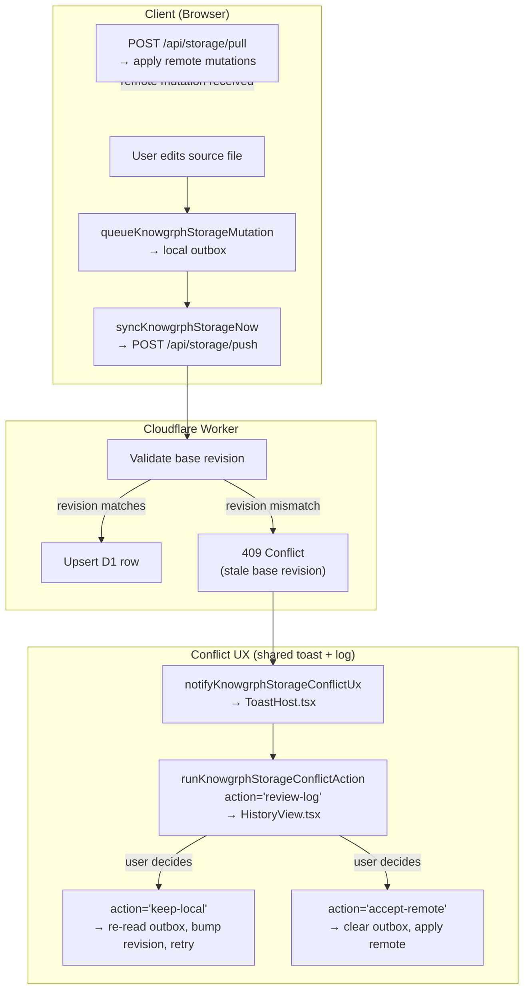

# Knowgrph Storage & Sync — Companion

Continuation of [knowgrph-storage-sync-document.md](knowgrph-storage-sync-document.md). Contains PRD summary, TAD runtime layers, conflict resolution flow, architectural decisions (ADRs), deployment phases, quality attributes, token economics, storage comparison, validation summary, and cross-repo documentation contract.

**Version**: 2.5.0
**Date**: 2026-05-19

---

## PRD Summary

### Problem

Knowgrph source files exist in three disconnected locations:

1. **Dev** (`knowgrph/canvas/src/`) — live editing with minimal persisted local cache
2. **Prod SSOT** (`huijoohwee/content/knowgrph/`) — static build artifacts mirrored into the Cloudflare Pages publish repo
3. **Docs seed** (`huijoohwee/docs/`) — canonical Markdown files for workspace initialization

The original gap was a built client-side sync engine with no server-side endpoint. Current Dev -> Prod -> Cloudflare context resolves the shared-store path through the deployed `knowgrph-storage` Worker, remote D1 migrations, and the static `huijoohwee/content/knowgrph` mirror.

### User Stories

| As a… | I want… | So that… |
|---|---|---|
| Developer editing source files | document edits to persist to a remote store automatically | I can resume work from any device |
| Developer running Dev server | seed file changes in `huijoohwee/docs/` to appear immediately | I can iterate on canonical docs without manual refresh |
| Developer editing a seed document | edits to write back to `huijoohwee/docs/` | canonical seed files stay in sync |
| Operator deploying to production | build-sync pipeline to remain the single static-artifact path | production SPA continues to serve from Prod SSOT |
| User on a mobile device | workspace state to sync via the same push/pull mechanism | seamless cross-device continuity |

### Acceptance Criteria

| Given | When | Then |
|---|---|---|
| Developer edits a source file | autosave debounce fires | document upsert queued in the local outbox and pushed to `/api/storage/push` |
| Push endpoint receives a mutation | D1 `documents` table upserted | response confirms stored revision, client clears outbox entry |
| Second device opens same workspace | client polls `/api/storage/pull` with last cursor | receives all mutations newer than cursor, applies to the local persisted cache |
| File changes in `huijoohwee/docs/` | Dev server seed polling cycle runs | workspace re-reads file and updates source file state |
| `npm run pages:build-sync` executed | build completes and sync runs | Prod SSOT reflects latest static artifacts |
| `npm run pages:build-sync-cloudflare` executed | static build/sync completes, remote D1 migrations apply, and Worker deploy runs | Prod mirror and Cloudflare storage routes reflect the same Dev source |

### Success Metrics

| Metric | Baseline | Target |
|---|---|---|
| Push success rate | 0% (no endpoint) | 99.9% |
| Pull-to-apply latency | N/A | <2s p95 |
| Cross-device state parity | 0% (no sync) | 100% document parity |
| D1 free-tier utilization | $0/mo | <$5/mo at projected scale |

---

## TAD — Runtime Layers

### Shared Contract

`canvas/src/lib/storage/knowgrphStorageSyncContract.ts` keeps client, Worker, and test fixtures aligned on:

- entity kinds, mutation operations, route paths
- pull/push response shapes, export contract
- conflict summary shape
- API version: `2026-05-04`

### Browser Storage (Minimal Persisted Cache)

`canvas/src/lib/storage/knowgrphStorageDb.ts` persists:

- local document copies, chunk cache, graph snapshots
- sync outbox, sync cursor

Local field names differ from remote to preserve the existing browser-local contract (`documentRevision` vs `revision`, `isDeleted` vs `deleted`).

### Cloudflare Worker

`cloudflare/workers/knowgrph-storage/` implements:

- `POST /api/storage/push` — validate mutations, upsert D1 rows, emit sync events
- `POST /api/storage/pull` — query sync events after cursor, return mutations
- `GET /api/storage/export/:workspaceId` — full workspace snapshot (JSON)
- `GET /api/storage/doc/:workspaceId/:canonicalPath*` — public single-document view (text/markdown)

### Client Sync Loop

`canvas/src/lib/storage/knowgrphStorageClientSync.ts` provides:

- device id provisioning, mutation enqueueing
- immediate and scheduled sync runs
- workspace-scoped polling loop (120s default)
- export helper, conflict summary callbacks

### Canvas Runtime Integration

`canvas/src/features/source-files/` wires storage into active workspace:

- source-file edits enqueue storage mutations
- sync loop starts per active workspace
- pulled remote records applied back into visible `sourceFiles`
- graph recomposition follows pulled updates
- conflict notifications reuse shared toasts and logs

---

## Conflict Resolution

### Flow

### Rules

- Auto-clear stale outbox conflicts after pull: when server revision >= local revision, the conflict is stale (server already won) and the outbox row is removed without user intervention.
- Keep non-stale conflicting outbox rows retained until user action or later retry.
- Summarize unresolved conflicts at workspace scope.
- Expose `Keep Local`, `Accept Remote`, and `Review Log` through shared action descriptors.
- Dispatch actions through one runtime path (`uiActionRuntime.ts`).
- Reuse shared toast (`ToastHost.tsx`) and History log (`HistoryView.tsx`) rendering surfaces.
- Forbid a second storage-only modal, drawer, or panel system.
- Handle persisted-cache conflict errors in the workspace FS resilient wrapper: retry once before degrading to memory FS, preventing false "persistence unavailable" toasts from concurrent write race conditions.

---

## Architectural Decisions

### ADR-001: Keep A Minimal Persisted Client Working Store

**Status**: Accepted. Current runtime stays local-first with a minimal persisted client cache; canonical persistence lives in D1 and the browser keeps only the bounded local working set needed for continuity and sync recovery.

### ADR-002: Choose SQLite / D1 As The First Shared Cloud Store

**Status**: Accepted. D1 fits Pages + Worker deployment shape; SQLite keeps TCO below PostgreSQL-first design; current shared requirements do not justify heavier operational stack.

**Alternatives considered**: Supabase (PostgreSQL) — requires rewriting D1-oriented schema; Turso (libSQL) — separate provider when D1 is already in account; Firebase — proprietary NoSQL, schema is relational; Self-hosted SQLite + Fly.io — higher ops burden, no edge co-location.

### ADR-003: Defer PostgreSQL Until Collaboration Or Retrieval Scale Requires It

**Status**: Accepted. Scale path is documented; MVP path remains lean; sync contract stays stable while backend changes later.

**Adoption gates**: multiple concurrent editors; server-side retrieval outgrows D1; vector search becomes runtime requirement; tenancy/analytics/audit justify managed DB overhead.

### ADR-004: Deploy Storage API As A Standalone Cloudflare Worker On The Same Zone

**Status**: Accepted. `cloudflare/workers/knowgrph-storage/wrangler.toml` deploys the `knowgrph-storage` Worker to `airvio.co/api/storage/*` with the D1 binding `knowgrph-storage` (`633355bf-1a52-4085-bd3c-eba4220ff152`). `cloudflare/workers/knowgrph-payment/wrangler.toml` deploys the separate `knowgrph-payment` Worker to `airvio.co/api/payments/*` with the same D1 binding for checkout-session state. The static SPA remains a Cloudflare Pages artifact served at `airvio.co/knowgrph`. `pages:build-sync-cloudflare` now builds and syncs the static app, then runs `workers:deploy` so storage and payment Workers deploy together when the source changes.

**Trade-offs**: Standalone Workers require a separate `workers:deploy` step from the Pages Git push, but keep D1 route ownership explicit, avoid Pages Function coupling, and isolate payment secrets and webhook handling from storage sync routes.

### ADR-005: Retain Polling-Based Sync (120s) For Phase 1

**Status**: Accepted. Client-side polling infrastructure already exists; acceptable latency for single-user / small-team use; avoids Durable Objects complexity.

### ADR-006: Seed Write-Back Via Node.js fs Only

**Status**: Accepted. `upsertWorkspaceInitializationSeedText` implements Node.js-only file write with `typeof window !== 'undefined'` guard; prevents browser-side filesystem access; docs directory is Dev-only concern.

### ADR-007: Auto-Clear Stale Outbox Conflicts After Pull

**Status**: Accepted. After every pull, `autoClearStaleOutboxConflicts()` compares pulled server revisions against conflicted outbox entries. When `serverRevision >= localRevision`, the conflict is stale (the server already has the authoritative version) and the outbox row is auto-removed. This eliminates manual conflict resolution after re-seeding D1.

**Alternatives considered**: (1) Require user to manually resolve each conflict — poor UX at scale (48+ conflicts). (2) Clear all conflicts unconditionally — risks losing legitimate local edits that are ahead of the server. (3) Reset outbox attempt count only — conflicts re-accumulate on next push.

### ADR-008: Default Workspace Initialization Source URL

**Status**: Accepted. `workspace.import.defaultSourceUrl` setting added to workspace settings registry (localStorage-backed, string, default empty). When set and the workspace is empty, `readWorkspaceInitializationDocsMirrorEntries()` fetches content from the URL using `fetchWorkspaceUrlContent()` and seeds the workspace. Priority chain: sourceFiles → folderHandle → folderCache → defaultSourceUrl → Vite proxy → Node fs.

**Alternatives considered**: (1) Hardcode D1 export URL — not configurable, breaks for users without D1. (2) Add a new seed provider type — unnecessary complexity when `importUrlFallback()` already handles all URL types. (3) Use Vite env var only — not user-configurable at runtime.

### ADR-009: Public Single-Document View Endpoint

**Status**: Accepted. `GET /api/storage/doc/:workspaceId/:canonicalPath*` Worker route returns a single document's `content_md` as `text/markdown` with `deleted = 0` filter, CORS headers, and 60s cache. Deployed at `airvio.co/api/storage/doc/*`.

**URL structure**: `https://airvio.co/api/storage/doc/{workspaceId}/{canonicalPath}`

| Segment | Source | Example |
|---|---|---|
| `workspaceId` | D1 `documents.workspace_id` | `kgws:canonical-docs` |
| `canonicalPath` | D1 `documents.canonical_path` | `huijoohwee/docs/knowgrph-maps-readme.md` |

**Response**: `200 Content-Type: text/markdown; charset=utf-8` with raw `content_md`. `404` if document not found or soft-deleted. No authentication required (public read).

**Worker logic**:
1. Decode `workspaceId` and `canonicalPath` from URL path (split on first `/` after prefix)
2. Query D1: `SELECT content_md FROM documents WHERE workspace_id = ? AND canonical_path = ? AND deleted = 0`
3. Return `content_md` as plain text or 404

**Deep link canvas rendering**: Visiting `https://airvio.co/knowgrph/doc/{workspaceId}/{canonicalPath}` renders the document in the knowledge graph canvas. `CanvasRouteRuntime` normalizes the path to `?kgPath=`, then `CanvasDocDeepLinkRuntime` reads the param, constructs the `/api/storage/doc/` URL, and calls `importWorkspaceUrl()` to fetch and render the document.

**Use cases**:
- Share a readable link to a specific document (browser renders markdown natively or via extension)
- Share a canvas-rendered link: `/knowgrph/doc/{workspaceId}/{canonicalPath}` opens the document in the knowledge graph canvas
- Use as `workspace.import.defaultSourceUrl` input — `fetchWorkspaceUrlContent()` handles `text/markdown` responses
- Programmatic access via `curl` or API clients without JSON parsing

**Alternatives considered**: (1) `/knowgrph/docs/{path}` — rejected because SPA catch-all (`/knowgrph/*` → `index.html`) intercepts all paths under `/knowgrph/`; would require `_redirects` exception or Worker route priority override. (2) Extend `/export/` with query params — rejected because export returns full JSON workspace snapshot, not a single readable document. (3) Separate Cloudflare Pages function — rejected because the existing Worker already has D1 binding and route pattern; adding a route is zero operational overhead.

---

## Deployment Phases

### Phase 1 — Worker + D1 (DONE)

1. ~~Create `wrangler.toml` with D1 binding and standalone Worker route patterns~~ ✅
2. ~~Apply D1 migration for 6 tables~~ ✅
3. ~~Deploy Worker handlers for push, pull, export~~ ✅
4. ~~Wire `pages:build-sync-cloudflare` to run static build/sync and then deploy storage through `storage:deploy`~~ ✅
5. ~~Verify end-to-end: Dev browser push → D1 → second browser pull → state parity~~ ✅

### Phase 1.5 — Conflict Resilience (DONE)

1. ~~Add `autoClearStaleOutboxConflicts()` to sync client~~ ✅ — auto-removes stale conflicts after pull
2. ~~Add `isRxConflictError()` retry in workspace FS resilient wrapper~~ ✅ — prevents false persistence degradation
3. ~~Verify: re-seed D1 → browser pull → conflicts auto-clear → toast dismisses~~ ✅

### Phase 2 — Default Source URL + Public Doc View + SSOT Transition (IN PROGRESS)

1. ~~Add `workspace.import.defaultSourceUrl` setting to workspace settings registry~~ ✅
2. ~~Extend `readWorkspaceInitializationDocsMirrorEntries()` priority chain with URL fetch step~~ ✅
3. ~~Add `GET /api/storage/doc/:workspaceId/:canonicalPath*` Worker route for public single-document view~~ ✅
4. ~~Add `CanvasDocDeepLinkRuntime` for deep link canvas rendering (`/knowgrph/doc/{workspaceId}/{canonicalPath}`)~~ ✅
5. Implement D1→filesystem export script for git-backed backup
6. Update workspace creation flow to detect multi-member workspaces and flip SSOT to D1

### Phase 3 — Multi-User Auth + Authorization (PROPOSED)

1. Add D1 migration for `users`, `workspace_members`, `invitations` tables
2. Implement JWT auth middleware in Worker
3. Add role-based push/pull permission enforcement (owner, editor, viewer)
4. Extend conflict UX with user identity display
5. See `knowgrph-multi-user-collaboration-prd.tad.md` for full specification

### Phase 4 — Real-Time Collaboration (FUTURE)

1. Introduce Cloudflare Durable Objects for per-workspace WebSocket channels
2. Replace 120s polling with push-based mutation broadcast
3. Add device presence tracking via `sync_devices` table
4. Implement conflict resolution UI for concurrent edits

---

## Quality Attributes

| Attribute | Requirement |
|---|---|
| Performance | Push/pull round-trip <500ms p95; D1 queries <50ms p95 |
| Scalability | D1 free tier: 5M reads/day, 100K writes/day; pagination for >500 documents |
| Security | Optimistic concurrency via base revision; workspace-scoped isolation; no auth in Phase 1; JWT auth + RBAC in Phase 3 |
| Observability | Worker logs via `wrangler tail`; D1 metrics via Cloudflare dashboard; client telemetry via `pipelinePerf.ts` |
| Resilience | Local outbox survives crashes; retry with exponential backoff (max 3); cursor-based pull ensures no missed mutations; auto-clear stale conflicts after pull; persisted-cache conflict retry before FS degradation |
| Maintainability | Worker is thin validation + D1 proxy; business logic stays client-side; numbered SQL migrations; settings-driven default source URL |

---

## Token-Economics Rules

- Store raw markdown once per document revision.
- Persist chunks and graph snapshots separately.
- Track `contentHash` and chunk hashes for reuse.
- Address chunks by semantic keys instead of offsets.
- Avoid resending unchanged chunks when hashes match.
- Prefer pulled delta application over full workspace reloads.

---

## Storage Comparison

| Option | Primary role | TCO | Token economics | Recommendation |
|---|---|---:|---|---|
| Minimal persisted cache | Browser-local draft and cache store | Lowest | Strong via local chunk reuse | Required |
| SQLite / D1 | First shared store | Low | Strong via persisted chunks and revisions | Recommended |
| PostgreSQL | High-scale shared backend | Highest | Strong for future server retrieval | Deferred |

---

## Validation Summary

Focused tests cover:

- Shared contract routes and record shapes
- Worker push, pull, and export behavior
- Worker public doc view (single document markdown response)
- Client sync loop scheduling and result handling
- Source-files mutation enqueueing
- Inbound pulled-record application into visible source-files state
- Conflict UX dedupe behavior
- Shared toast/history action rendering and dispatch

Representative test files:

- `canvas/src/__tests__/knowgrphStorageContracts.test.ts`
- `canvas/src/__tests__/knowgrphStorageWorker.test.ts`
- `canvas/src/__tests__/knowgrphStorageClientSync.test.ts`
- `canvas/src/__tests__/sourceFilesStorageSync.test.ts`
- `canvas/src/__tests__/sourceFilesInboundStorageApply.test.ts`
- `canvas/src/__tests__/knowgrphStorageConflictUx.test.ts`
- `canvas/src/__tests__/uiActionSurfaces.testx`

---

## Cross-Repo Documentation Contract

These cross-repo docs must stay aligned:

- `knowgrph/todo-log.md`
- `knowgrph/docs/documents/knowgrph-storage-sync-document.md` (canonical)
- `knowgrph/docs/documents/knowgrph-storage-sync-document.companion.md` (this file)
- `knowgrph/docs/documents/knowgrph-storage-schemas-document.md`
- `huijoohwee.github.io/docs/documents/hjh-workspace-todo-log.md`
- `huijoohwee.github.io/schema/AgenticRAG/README.md`
- `huijoohwee.github.io/schema/AgenticRAG/documentation.jsonld`
- `huijoohwee.github.io/schema/AgenticRAG/markdown.jsonld`
- `huijoohwee.github.io/schema/AgenticRAG/panels.jsonld`
- `huijoohwee.github.io/schema/AgenticRAG/knowgrph-documents-map.graph.jsonld`
