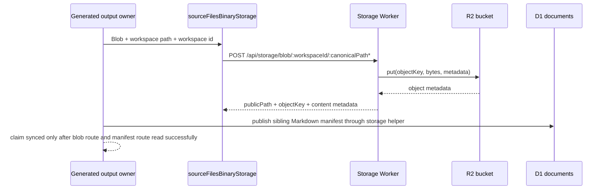
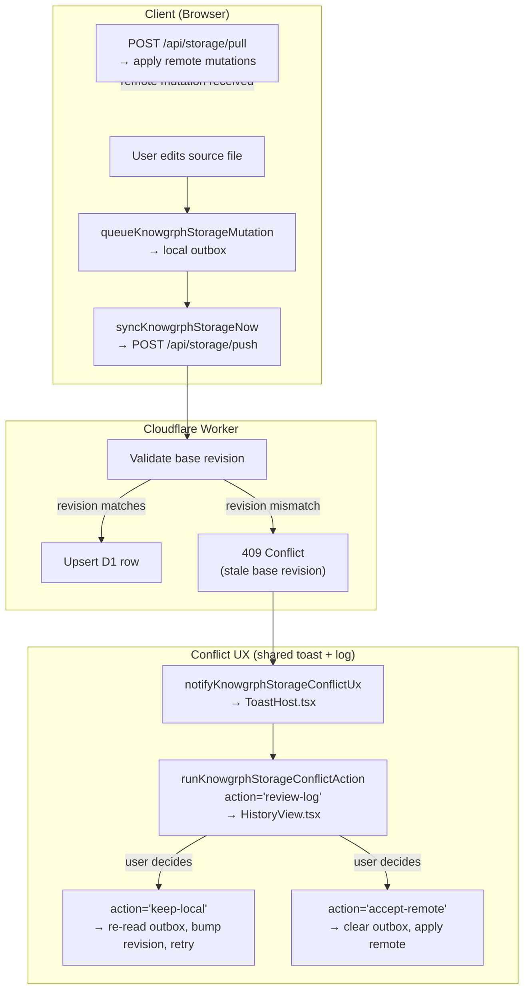

# Knowgrph Storage & Sync — Companion

Continuation of [knowgrph-storage-sync-document.md](knowgrph-storage-sync-document.md). Contains PRD summary, TAD runtime layers, conflict resolution flow, ADR index, deployment phases, quality attributes, token economics, storage comparison, validation summary, and cross-repo documentation contract.

**Version**: 3.5.0
**Date**: 2026-07-23

---

## PRD Summary

### Problem

Knowgrph documents cross four path-scoped owners that must not be conflated:

1. **Product/runtime contracts** (`knowgrph/docs/`) — authored Knowgrph specifications, schemas, and workspace seeds.
2. **Collaborative workspace documents** (`huijoohwee/docs/`) — user-created, imported, and runnable Markdown plus the default local Dev mirror.
3. **Global invocation/governance documents** (`agentic-canvas-os/docs/`) — the `/`, `@`, and `#` dictionaries and the current published runtime-doc catalog.
4. **Production mirror** (`huijoohwee/content/knowgrph/`) — generated static release output, never an authoring SSOT.

The original gap was a built client-side sync engine with no server-side endpoint. Existing deployed Worker and mirror state remains separate release context; this enhancement changes only local/Dev source and does not perform a Production mirror write or Cloudflare mutation. Generated image/video/binary bytes remain R2 objects with sibling Markdown manifests in D1 when an independently authorized release enables those routes.

### Implemented Enhancement Delta

| Concern | Dev implementation | Fail-closed rule |
|---|---|---|
| Browser continuity | Dexie IndexedDB adapter for documents, chunks, graph snapshots, sync outbox, cursor, revision history, and Yjs update outbox | Retry one persistence conflict, then expose degraded in-memory state |
| MainPanel | Online/Offline only, IndexedDB persistence status, canonical GitHub roots, explicit Sync now | Offline only still persists and queues; it disables transport, not saving |
| Push/pull | 30-second timeout, 3 attempts, 1/2-second backoff, 120-second polling, cursor delta pulls | Transport exhaustion, rejection, and conflict retain outbox rows |
| Conflict UX | Shared toast + History log with Keep Local, Accept Remote, Review Log | No automatic second Keep Local retry; Accept Remote clears only after cache write |
| Dedupe | Content hashes, semantic chunk keys, zero-byte known-chunk references, no-op D1 write skip | Missing/mismatched hashes and byte-offset chunk keys are rejected |
| Authority | Knowgrph docs/seeds vs Huijoohwee workspace docs re-derived by browser and Worker | Agentic paths, duplicate Huijoohwee seed roots, and target/path mismatches are rejected before writes |
| Cloud upload | GitHub first, D1 second, byte-identical read-back in at most 3 attempts | Public/default mutating origin is rejected without an explicit local Worker origin |
| Validation | 39 independent `fast-check` properties, 100 runs each | No Production or Cloudflare operation is part of the proof |

The physical ownership audit found six authored files under `knowgrph/docs/workspace-seeds`, no `huijoohwee/docs/workspace-seeds` directory, and one byte-identical Agentic Canvas OS runtime projection. The projection remains only because the current bootstrap authority check requires it; removing it is a separate migration, not part of storage write authority.

### Personas

| Persona | Job-to-be-done | Pain point |
|---|---|---|
| Solo developer | Edit docs on any device and resume exactly where I left off | Workspace state is siloed per browser |
| Collaborator | Edit the same `*.md` or `*.json` file with a peer without destructive merge conflicts | Git merge on minified JSON loses fields; polling D1 is too slow for character-level edits |
| Operator | Deploy once and keep the generated Prod mirror and D1 read cache consistent with the protected source | Manual multi-step deploy leaves runtime stale after doc changes |
| Generated-media author | Produce image/video/binary outputs that can replay from Cloudflare without re-running the model | Local artifact paths, provider URLs, and embedded previews do not prove durable Cloudflare persistence |

### User Journey

| Stage | Action | Touchpoint | Pain | Opportunity |
|---|---|---|---|---|
| Trigger | Developer edits a source file | `canvas/src/` workspace FS | Edit is local-only; second device sees nothing | Autosave → push mutation to D1 Worker |
| Engage | Second device opens same workspace | Browser → `GET /api/storage/pull` | No mutations received; workspace diverges | Cursor-based pull → apply remote records |
| Collaborate | Two users open same `*.md` simultaneously | PocketBase/Yjs room | Destructive Git merge risk | `Y.Text` CRDT → save bridge → GitHub commit |
| Publish | Operator runs build-sync | `npm run pages:build-sync-cloudflare` | D1 can be stale after static deploy | `storage:deploy` re-seeds D1 docs inline |
| Persist artifact | Runtime owner emits a generated image/video/binary output | `sourceFilesBinaryStorage` → Storage Worker blob route | Local artifact is visible only on the generating device | R2 stores bytes; D1 stores sibling Markdown manifest; Worker routes prove replay |
| Recover | User clears all workspace files | Browser `localStorage` | Re-seed required manually | `ensureSeed()` re-seeds from configured source |

### User Stories

**As a** developer editing source files, **I want** document edits to persist to a remote store automatically, **so that** I can resume work from any device.

**As a** developer running the Dev server, **I want** seed file changes in the docs mirror to appear immediately, **so that** I can iterate on canonical docs without manual refresh.

**As a** collaborator editing a shared doc, **I want** same-file edits to merge without destructive Git conflicts, **so that** concurrent Markdown and JSON edits resolve through CRDTs and save back to GitHub.

**As an** operator deploying to production, **I want** the release controller to own the single static-artifact path, **so that** the production SPA serves only the generated mirror of protected source.

**As a** user on a mobile device, **I want** workspace state to sync via the same push/pull mechanism, **so that** I have seamless cross-device continuity.

**As a** generated-media author, **I want** image/video/binary outputs to persist through the existing Storage Worker and manifest flow, **so that** Dev previews can become Cloudflare-replayable artifacts without adding a second storage path.

### Acceptance Criteria

| Given | When | Then | VCC |
|---|---|---|---|
| Developer edits a source file | autosave debounce fires | document upsert queued in local outbox and pushed to `/api/storage/push` | `Verify: sourceFilesStorageSync.test.ts passes and outbox row cleared after push` |
| Push endpoint receives a mutation | D1 `documents` table upserted by `(workspace_id, canonical_path)` | response confirms stored revision; client clears outbox entry | `Verify: knowgrphStorageWorker.test.ts push assertions pass and no orphaned outbox rows remain` |
| Second device opens same workspace | client polls `/api/storage/pull` with last cursor | receives all mutations newer than cursor, applies to the local persisted cache | `Verify: knowgrphStorageClientSync.test.ts pull-to-apply assertions pass` |
| Toolbar `Storage Sync` is off | Source Files change or workspace selection changes | configured local docs mirror refresh stays paused without changing the online collaboration preference | `Verify: sourceFilesBootstrapStartup does not trigger seed refresh when Storage Sync is off` |
| MainPanel document storage mode is `Offline only` | local edits continue | IndexedDB and the outbox retain work; D1 and PocketBase/Yjs transport remain paused | `Verify: settings.documentStorage.offlinePreference and sourceFiles.storageSync pass` |
| MainPanel document storage mode is `Online` and two users edit the same `*.md` | both type at the same time | `Y.Text` merges character-level edits through PocketBase realtime; save bridge commits saved snapshot to the owning GitHub docs root | `Verify: sourceFilesPocketBaseYjsCollaboration.test.ts Markdown CRDT merge assertions pass` |
| MainPanel document storage mode is `Online` and two users edit the same `*.json` | both edit at the same time | raw JSON editing is blocked; Yjs shared JSON types own the edit; save bridge commits canonical formatted JSON to the owning GitHub docs root | `Verify: sourceFilesPocketBaseYjsCollaboration.test.ts JSON guardrail assertions pass` |
| A collaborator saves a concurrent document | bridge persists the save | bridge owns the GitHub commit; collaborators never touch Git credentials or Git commands | `Verify: collab save bridge e2e test creates GitHub commit and no browser-side credential is accessed` |
| A generated image/video/binary artifact exists as a local Blob | runtime storage sync is explicitly enabled and the output owner publishes it | bytes upload to R2 through `/api/storage/blob/`; a sibling manifest document is written to D1; Cloudflare persistence is claimed only after both routes read successfully | `Verify: chat.responseContract.storage.kgcBinaryOutputPublishesR2Manifest, chat.responseContract.storage.richMediaBinaryOutputPublishesR2Manifest, and sourceFiles.storageSync.r2BlobRoute.storesBinaryObject pass` |
| Explorer → Source Files opens | ownership summary and tree render | product, workspace, seed, and offline roots are visible; `workspace-seeds` is marked as Knowgrph-owned; no editable Agentic or Huijoohwee seed duplicate appears | `Verify: sourceFiles.ownership passes and workspace-seeds:authority reports agenticProjection=true plus publishMirror=true` |
| Source Files creates, saves, renames, or deletes a nested `/docs/workspace-seeds/**` entry | local mutation is accepted | IndexedDB retains the offline mutation; the host mirror resolves only to `$GITHUB_ROOT/knowgrph/docs/workspace-seeds/**`; stale rename sources are removed; mismatched or root-delete requests are rejected | `Verify: workspaceFs.seedProvider.enforcesCanonicalWorkspaceSeedsMutations and workspaceFs.artifactBridge.enforcesCanonicalWorkspaceSeedOwnership pass` |
| Source Files bootstrap reads the canonical seed inventory | revision-pinned six-file bundle is complete; repository-local Dev may also read the authored seed root | the complete bundle restores `/docs/workspace-seeds/**` without a runtime GitHub tree request; a successful local Dev read overlays that subtree; missing canonical files are added, stale cached files and their source metadata are removed, and unrelated authored documents remain | `Verify: workspaceFs.seedProvider.bundlesCanonicalWorkspaceSeedInventory, workspaceFs.seedProvider.productionFallbackRestoresCanonicalWorkspaceSeedInventory, workspaceFs.seedProvider.projectsCanonicalWorkspaceSeedInventory, workspaceFs.seedProvider.overlaysCanonicalLocalSeedInventory, and workspaceFs.persisted.reconcilesCanonicalWorkspaceSeedInventory pass` |

### MoSCoW Prioritization

| Priority | Feature | ROI Score | Rationale |
|---|---|---|---|
| **Must** | Client push/pull + D1 Worker | 5×5/2 = 12.5 | Enables cross-device continuity; deployed; zero incremental build cost |
| **Must** | Auto-clear stale outbox conflicts | 4×5/0.5 = 40 | Eliminates manual resolution after re-seed; deployed; < 1 day to build |
| **Must** | Independent local refresh and online collaboration controls | 4×4/1 = 16 | Local mirror refresh remains separate from cloud transport; offline work is retained |
| **Must** | Generated binary artifact R2 + D1 manifest publication | 4×4/1 = 16 | Required for replayable image/video outputs; built; reuses existing Worker and Source Files owners |
| **Should** | PocketBase + Yjs concurrent editing | 4×3/3 = 4 | Eliminates Git merge conflict risk for teams; built in Dev; requires PocketBase collection deploy |
| **Should** | GitHub save bridge | 4×3/2 = 6 | Keeps GitHub SSOT without requiring collaborators to use Git; built in Dev; requires Worker secret |
| **Should** | Default source URL + public doc view | 3×4/1 = 12 | Enables shareable canvas doc links; deployed |
| **Won't** | PostgreSQL backend | 1×1/8 = 0.1 | Deferred until D1/PocketBase responsibilities are outgrown |

**Min-viable scope**: Push/pull + D1 Worker + auto-clear conflicts + Storage Sync gate. Everything above this line is deployed. Concurrent editing (PocketBase + Yjs) is the next delivery gate.

### Success Metrics

| Metric | Baseline | Target | Timeline |
|---|---|---|---|
| Push success rate | 0% (no endpoint) | 99.9% | Done |
| Pull-to-apply latency | N/A | <2s p95 | Done |
| Cross-device state parity | 0% | 100% document parity | Done |
| Generated artifact replay proof | Local-only path / provider URL | 100% of claimed Cloudflare artifacts have readable R2 blob route plus D1 manifest route | Done for local harness; live claims require route proof |
| Concurrent same-file merge safety | Destructive Git merge risk | 0 raw JSON simultaneous edits without CRDT | Built in Dev |
| D1 free-tier utilization | $0/mo | <$5/mo at projected scale | Ongoing |
| Monthly TCO | Cloud-only baseline can remain low-cost | Stay within an approved hosting, backup, and egress budget | Ongoing |

### Out of Scope

- Browser-stored credentials of any kind.
- D1 as the concurrent collaboration SSOT.
- D1 storage of image/video bytes inside `content_md`.
- Cloudflare sync claims for local artifact paths, provider URLs, browser object URLs, or embedded `srcdoc` without readable Worker blob and manifest routes.
- Git merge as the reconciliation path for simultaneous `*.json` edits.
- PostgreSQL until server-side retrieval outgrows D1/PocketBase responsibilities.

### Open Questions

- PocketBase collection deployment outside the repo: exact deploy runbook not yet scripted.
- Worker `KNOWGRPH_STORAGE_GITHUB_TOKEN` rotation strategy for the save bridge.
- Multi-tenant access control: see `knowgrph-multi-user-collaboration-prd.tad.md`.

---

## TAD — Runtime Layers

### Shared Contract

`canvas/src/lib/storage/knowgrphStorageSyncContract.ts` keeps client, Worker, and test fixtures aligned on:

- entity kinds, mutation operations, route paths
- pull/push response shapes, export contract
- conflict summary shape
- API version: `2026-05-04`

### Browser Storage (Minimal Persisted Cache)

`canvas/src/lib/storage/knowgrphStorageDb.ts` persists:

- local document copies, chunk cache, graph snapshots
- sync outbox, sync cursor

Local field names differ from remote to preserve the existing browser-local contract (`documentRevision` vs `revision`, `isDeleted` vs `deleted`).

### Cloudflare Worker

`cloudflare/workers/knowgrph-storage/` implements:

- `POST /api/storage/push` — validate mutations, upsert D1 rows by primary id or `(workspace_id, canonical_path)`, emit sync events
- `POST /api/storage/pull` — query sync events after cursor, return mutations
- `GET /api/storage/export/:workspaceId` — full workspace snapshot (JSON)
- `GET /api/storage/doc/:workspaceId/:canonicalPath*` — public single-document view (text/markdown)
- `POST /api/storage/blob/:workspaceId/:canonicalPath*` — store generated binary artifacts in R2 under the same workspace/canonical-path identity
- `GET|HEAD /api/storage/blob/:workspaceId/:canonicalPath*` — read generated binary artifact bodies or metadata from R2
- `POST /api/storage/collab/save` — GitHub save bridge; accepts saved Yjs snapshots; requires Worker token, owner, `KNOWGRPH_STORAGE_GITHUB_KNOWGRPH_REPO`, and `KNOWGRPH_STORAGE_GITHUB_WORKSPACE_REPO`; validates the request target against path-derived authority
- Source Files explicit cloud upload reuses that bridge for saved Markdown, including an empty new `.md`, then pushes the identical document to D1 and requires `GET /api/storage/doc/:workspaceId/:canonicalPath*` byte equality before presenting the row as cloud-synced. A bridge failure must not enqueue or push D1.

**Harness Contract — Client Sync Engine**

The sync client is not an LLM component, but it conforms to a bounded harness pattern to cap retry spend and prevent unbounded polling loops:

```
Input schema: { workspaceId, mutations: KnowgrphStorageMutation[], cursor: string | null }
Output schema: { pushed: number, pulled: KnowgrphStorageMutation[], newCursor: string, conflicts: ConflictSummary[] }
Max iterations: 3 push retries per mutation (exponential backoff); poll loop bounded by 120s interval and explicit MainPanel online-mode gate
Circuit-breaker: Offline-only mode → cloud loop paused with outbox retained; push retry count >= 3 → conflict surfaced to UX
Fallback path: on Worker 5xx → retain outbox; on pull failure → keep last cursor; never silently discard mutations
```

**VCC Conditions**

- `PRD-STORAGE-SYNC-S1 ↔ TAD-STORAGE-SYNC-SyncEngine`: `Verify: knowgrphStorageClientSync.test.ts push/pull/loop assertions pass and no test file outside storage scope is modified`
- `PRD-STORAGE-SYNC-S2 ↔ TAD-STORAGE-SYNC-Worker`: `Verify: knowgrphStorageWorker.test.ts push/pull/export/doc-view assertions pass and D1 row counts match seeded fixture`
- `PRD-STORAGE-SYNC-S5 ↔ TAD-STORAGE-SYNC-YjsRoom`: `Verify: sourceFilesPocketBaseYjsCollaboration.test.ts CRDT merge and JSON guardrail assertions pass`
- `PRD-STORAGE-SYNC-S7 ↔ TAD-STORAGE-SYNC-GeneratedBinaryArtifact`: `Verify: chat.responseContract.storage.kgcBinaryOutputPublishesR2Manifest, chat.responseContract.storage.richMediaBinaryOutputPublishesR2Manifest, and sourceFiles.storageSync.r2BlobRoute.storesBinaryObject pass`

### Generated Binary Artifact Contract

Generated image/video/binary outputs use one storage contract regardless of feature surface. Generated image/video artifacts are considered persisted across Dev, Prod, and Cloudflare only when the Worker blob route returns the bytes or metadata and the sibling D1 manifest route returns the Markdown manifest.

| Boundary | Contract |
|---|---|
| Input | `{ workspacePath, workspaceId, blob, contentType, runtimeSyncEnabled }` |
| Blob route | `POST /api/storage/blob/:workspaceId/:canonicalPath*` with `x-knowgrph-content-kind: generated-binary-artifact` and optional `x-knowgrph-content-hash` |
| Blob output | `{ ok, workspaceId, canonicalPath, objectKey, publicPath, contentType, contentHash, sizeBytes, etag, uploadedAtMs }` |
| Manifest route | Shared Source Files storage publication helper writes sibling Markdown manifest into D1 as a normal document |
| Manifest content | Includes generated artifact type, content type, byte size, content hash, R2 object key, Worker blob URL, and generation metadata supplied by the caller |
| Failure handling | If runtime sync is off, upload fails, or manifest publication fails, keep the local artifact evidence and do not claim Cloudflare persistence |
| VCC | `Verify: chat.responseContract.storage.kgcBinaryOutputPublishesR2Manifest, chat.responseContract.storage.richMediaBinaryOutputPublishesR2Manifest, and sourceFiles.storageSync.r2BlobRoute.storesBinaryObject pass` |



### Client Sync Loop

`canvas/src/lib/storage/knowgrphStorageClientSync.ts` provides:

- device id provisioning, mutation enqueueing
- immediate and scheduled sync runs
- workspace-scoped polling loop (120s default)
- export helper, conflict summary callbacks

### Canvas Runtime Integration

`canvas/src/features/source-files/` wires storage into active workspace:

- source-file edits enqueue storage mutations
- generated workspace artifacts such as `/chat-log/{session}/kgc_{session}.md` promote through the server-owned GitHub write route first, then through the shared Source Files storage publication helper as a secondary read/share cache; generated binary artifacts store bytes in R2 and promote a sibling Markdown manifest through the same secondary D1 document path; `workspace:` entries stay skipped by background sync unless explicitly promoted
- sync loop starts per active workspace
- Toolbar → Workspace View → `Storage Sync` gates only the configured local docs-mirror refresh loop
- MainPanel → Settings → `Document Storage & Sync` selects Online or Offline only, exposes both GitHub docs roots, reports fallback state, and runs explicit push/pull without exposing credentials
- pulled remote records applied back into visible `sourceFiles`
- graph recomposition follows pulled updates
- conflict notifications reuse shared toasts and logs

### Concurrent Editing Layer

PocketBase owns auth/session state, collaboration room metadata, membership, and realtime fanout. The browser keeps a Yjs `Y.Doc` per open collaborative source file:

- Markdown uses `Y.Text`.
- JSON uses `Y.Map` / nested shared JSON types and serializes to stable formatted JSON only on save.
- Yjs document updates are exchanged through the PocketBase collaboration relay; Yjs update events are applied with `Y.applyUpdate()`.
- The GitHub save bridge is server-side only. It accepts saved Yjs snapshots at explicit save/autosave boundaries, derives repository authority from the document path, rejects mismatched `repositoryTarget` values, and writes `docs/{path}` to either `knowgrph-docs` or `workspace-docs` through GitHub Contents API or a GitHub App.
- D1 is not a concurrent edit store. It remains a runtime read/export cache.

### PocketBase Production Gate

PocketBase + Yjs is recommended for small-team Phase 1 collaboration only when every gate below is met. Its FOSS license does not make hosting, persistent storage, backups, monitoring, or recovery cost-free.

| Gate | Required contract |
|---|---|
| Room identity | Enforce one unique room per `(workspaceId, documentKey)` and resolve create races by refetching the winner. |
| Authorization | Require authenticated active workspace membership in PocketBase rules and independently re-check path/repository authority in the GitHub bridge. |
| Offline durability | Persist each local Yjs update in IndexedDB with a stable update id; retry until acknowledged and deduplicate during replay. Never swallow failed writes. |
| Join/recovery | Load a compacted snapshot plus an ordered update cursor, then replay unacknowledged local updates before declaring the room synchronized. |
| Write bounds | Batch update envelopes on a bounded timer/size threshold, compact snapshots server-side, and prune compacted updates plus stale awareness records. |
| GitHub checkpoint | Commit only at explicit save or bounded autosave checkpoints using a GitHub App/server identity and compare-and-set content SHA. Never commit per keystroke. |
| Operations | Pin the PocketBase server separately from the JavaScript SDK; ship `pb_migrations`, rate limits, monitoring, backups, and restore tests before Prod. |
| Topology | Select exactly one collaboration room provider. PocketBase and Durable Objects must never own the same room concurrently. |

---

## Conflict Resolution

### Flow



### Rules

- Auto-clear stale outbox conflicts after pull: when server revision >= local revision, the conflict is stale (server already won) and the outbox row is removed without user intervention.
- Keep non-stale conflicting outbox rows retained until user action or later retry.
- Summarize unresolved conflicts at workspace scope.
- Expose `Keep Local`, `Accept Remote`, and `Review Log` through shared action descriptors.
- Dispatch actions through one runtime path (`uiActionRuntime.ts`).
- Reuse shared toast (`ToastHost.tsx`) and History log (`HistoryView.tsx`) rendering surfaces.
- Forbid a second storage-only modal, drawer, or panel system.
- Handle persisted-cache conflict errors in the workspace FS resilient wrapper: retry once before degrading to memory FS, preventing false "persistence unavailable" toasts from concurrent write race conditions.
- Resolve document writes against `(workspace_id, canonical_path)` before insert so seeded docs, Source Files edits, and Share URL publication converge on the same D1 row instead of surfacing SQLite uniqueness errors.

---

## Architectural Decisions

Detailed ADRs live in `knowgrph-storage-sync-adrs-document.md` so this companion remains a maintainable runtime index. Current accepted decisions:

| ADR | Decision |
|---|---|
| ADR-001 | Keep a minimal persisted client working store. |
| ADR-002 | Use SQLite / D1 as the first shared cloud store. |
| ADR-003 | Defer PostgreSQL until collaboration or retrieval scale requires it. |
| ADR-004 | Deploy storage API as a standalone Cloudflare Worker on the same zone. |
| ADR-005 | Retain polling-based sync at 120 seconds for phase 1. |
| ADR-006 | Restrict seed write-back to Node.js filesystem contexts. |
| ADR-007 | Auto-clear stale outbox conflicts after pull. |
| ADR-008 | Support default workspace initialization source URL. |
| ADR-009 | Expose a public single-document view endpoint. |
| ADR-010 | Use production-gated PocketBase + Yjs for small-team same-file collaboration, not Git merge. |
| ADR-011 | Promote generated chat Markdown through GitHub first, storage second. |
| ADR-012 | Store generated binary artifacts in R2 with Markdown manifests. |
| ADR-013 | Persist collaborative AI media through R2, D1, KV, and Durable Objects. |
| ADR-014 | Use one canonical storage workspace by default across devices. |
| ADR-015 | Route document writes to path-scoped Knowgrph or workspace GitHub docs roots. |
| ADR-016 | Select one collaboration room provider; replace PocketBase with Durable Objects instead of dual-owning rooms. |
| ADR-017 | Keep one authored workspace-seed root, one byte-identical runtime projection, and no publish-repository duplicate. |

---

## Deployment Phases

### Phase 1 — Worker + D1 (DONE)

1. ~~Create `wrangler.toml` with D1 binding and standalone Worker route patterns~~ ✅
2. ~~Apply D1 migration for 6 tables~~ ✅
3. ~~Deploy Worker handlers for push, pull, export~~ ✅
4. ~~Wire `pages:build-sync-cloudflare` to run static build/sync and then deploy storage through `storage:deploy`, including D1 docs re-seeding~~ ✅
5. ~~Verify end-to-end: Dev browser push → D1 → second browser pull → state parity~~ ✅

### Phase 1.5 — Conflict Resilience (DONE)

1. ~~Add `autoClearStaleOutboxConflicts()` to sync client~~ ✅ — auto-removes stale conflicts after pull
2. ~~Add `isRxConflictError()` retry in workspace FS resilient wrapper~~ ✅ — prevents false persistence degradation
3. ~~Verify: re-seed D1 → browser pull → conflicts auto-clear → toast dismisses~~ ✅

### Phase 2 — Default Source URL + Public Doc View + SSOT Transition (IN PROGRESS)

1. ~~Add `workspace.import.defaultSourceUrl` setting to workspace settings registry~~ ✅
2. ~~Extend `readWorkspaceInitializationDocsMirrorEntries()` priority chain with URL fetch step~~ ✅
3. ~~Add `GET /api/storage/doc/:workspaceId/:canonicalPath*` Worker route for public single-document view~~ ✅
4. ~~Add `CanvasDocDeepLinkRuntime` for deep link canvas rendering (`/knowgrph/doc/{workspaceId}/{canonicalPath}`)~~ ✅
5. Keep D1 export/import as an explicit Worker/runtime path, not the default toolbar Storage Sync path
6. ~~Add R2-backed `/api/storage/blob/:workspaceId/:canonicalPath*` for generated binary bytes plus D1 Markdown manifests~~ ✅
7. Update workspace creation flow to detect multi-member workspaces and keep GitHub SSOT while enabling PocketBase/Yjs collaboration rooms
8. ~~Expose shared repository ownership roots and the Knowgrph seed boundary in Explorer → Source Files~~ ✅

### Phase 3 — PocketBase + Yjs Concurrent Editing (DEV BUILT; PROD GATED)

1. Add PocketBase collections for uniquely keyed collaboration rooms, idempotent update envelopes, awareness state, and authenticated membership — collection deployment required outside the repo
2. ~~Add client Yjs room owner for Source Files (`Y.Text` for Markdown, `Y.Map` for JSON)~~ ✅
3. ~~Add JSON raw-editor guard so multiple active collaborators can only edit JSON through CRDT-backed structured controls~~ ✅
4. ~~Add GitHub save bridge with server-owned token/App identity, per-file save queue, commit audit metadata, and path-scoped repository targets~~ ✅ — `POST /api/storage/collab/save` validates `repositoryTarget`; target-specific repository deployment values and PocketBase remain operator-owned
5. Extend conflict UX with richer user identity display and bridge save status beyond status/toast messages
6. Add IndexedDB Yjs update outbox acknowledgements/retry/dedupe, ordered join replay, server-owned compaction, bounded batching/pruning, and restore-tested `pb_migrations`
7. Use GitHub compare-and-set content SHA at explicit or bounded autosave checkpoints; never commit per keystroke
8. See `knowgrph-multi-user-collaboration-prd.tad.md` for full specification

### Phase 4 — Realtime Transport Scale-Up (Future)

1. Keep PocketBase/Yjs as the selected collaboration provider while usage is small-team scale and its production gates remain green
2. Replace PocketBase with per-document Cloudflare Durable Objects only if room fanout, persistence, or deployment topology outgrows one PocketBase server
3. Keep GitHub save bridge unchanged so GitHub remains SSOT across transport changes
4. Forbid simultaneous PocketBase and Durable Object ownership of one collaboration room

---

## Quality Attributes

| Attribute | Scenario | Validation |
|---|---|---|
| Performance | Push/pull round-trip <500ms p95; D1 queries <50ms p95 | `wrangler tail` + D1 dashboard latency metrics |
| Scalability | D1 free tier: 5M reads/day, 100K writes/day; pagination for >500 documents | Load test with >500 doc fixture |
| Security | Optimistic concurrency via base revision; workspace-scoped isolation; PocketBase auth for collab rooms; GitHub credentials are bridge-only; no credentials stored in browser | Credential audit in code review; `e2e:github-canonical-storage:prod` |
| Observability | Worker logs via `wrangler tail`; D1 metrics via Cloudflare dashboard; client telemetry via `pipelinePerf.ts` | Confirm logs emitted on push/pull/conflict events |
| Resilience | Local outbox survives crashes; retry with exponential backoff (max 3); cursor-based pull ensures no missed mutations; auto-clear stale conflicts after pull; persisted-cache conflict retry before FS degradation; Yjs update replay preserves concurrent edits until bridge save succeeds | `knowgrphStorageClientSync.test.ts` retry/conflict assertions |
| Maintainability | Worker is thin validation + D1 proxy; Yjs owns merge semantics; PocketBase owns collab relay/auth; GitHub save bridge owns commits; settings-driven default source URL | Code review SRP check |
| Token Cost | No LLM calls in the storage/sync path; token spend is zero per push/pull cycle | Static analysis confirms no LLM harness calls in `knowgrphStorageClientSync.ts` or Worker |
| TCO | Budget includes PocketBase compute, persistent disk, backups, monitoring, and egress even when D1/Worker usage remains in free tiers | Monthly provider cost audit and restore test; re-evaluate when room or D1 volume exceeds the approved envelope |
| Replayability | Generated image/video/binary artifacts replay from R2 + D1 manifest without provider re-call | Blob route and manifest route return 200 for every claimed persisted artifact |

---

## Token-Economics Rules

- Store raw markdown once per document revision.
- Persist chunks and graph snapshots separately.
- Track `contentHash` and chunk hashes for reuse.
- Address chunks by semantic keys instead of offsets.
- Avoid resending unchanged chunks when hashes match.
- Prefer pulled delta application over full workspace reloads.

---

## Storage Comparison

| Option | Primary role | TCO | Token economics | Recommendation |
|---|---|---:|---|---|
| Minimal persisted cache | Browser-local draft and cache store | Lowest | Strong via local chunk reuse | Required |
| SQLite / D1 | First shared store | Low | Strong via persisted chunks and revisions | Recommended |
| R2 | Binary artifact byte store | Low | Strong when paired with Markdown manifests in D1 | Recommended for generated media |
| PocketBase + Yjs | Optional small-team live collaboration provider | Operator-hosted | Strong when updates are batched, compacted, and replayable | Recommended only after production gates pass |
| Durable Objects + Yjs | Cloudflare-native alternative room provider | Usage-based | Strong with one object per document and WebSocket hibernation | Replacement path, not a concurrent second owner |
| PostgreSQL | High-scale shared backend | Highest | Strong for future server retrieval | Deferred |

---

## Validation Summary

Focused tests cover:

- Shared contract routes and record shapes
- Worker push, pull, and export behavior
- Worker public doc view (single document markdown response)
- Worker R2 blob upload/read route and generated binary manifest publication
- Client sync loop scheduling and result handling
- Source-files mutation enqueueing
- Inbound pulled-record application into visible source-files state
- Conflict UX dedupe behavior
- Shared toast/history action rendering and dispatch
- Source Files ownership summary, seed authority marker, and sibling-root authority validation

Representative test files:

- `canvas/src/__tests__/knowgrphStorageContracts.test.ts`
- `canvas/src/__tests__/knowgrphStorageWorker.test.ts`
- `canvas/src/__tests__/knowgrphStorageClientSync.test.ts`
- `canvas/src/__tests__/sourceFilesStorageSync.test.ts`
- `canvas/src/__tests__/chatHistoryWorkspaceOutput.test.ts`
- `canvas/src/__tests__/sourceFilesInboundStorageApply.test.ts`
- `canvas/src/__tests__/knowgrphStorageConflictUx.test.ts`
- `canvas/src/__tests__/sourceFilesPocketBaseYjsCollaboration.test.ts`
- `canvas/src/__tests__/uiActionSurfaces.testx`
- `canvas/src/__tests__/sourceFilesOwnershipProjection.test.tsx`
- `scripts/__tests__/workspace-seed-authority.test.mjs`

### VCC Traceability

| PRD Story | TAD Component | VCC |
|---|---|---|
| PRD-STORAGE-SYNC-S1 (cross-device push/pull) | `knowgrphStorageClientSync` | `Verify: knowgrphStorageClientSync.test.ts push/pull/loop assertions pass` |
| PRD-STORAGE-SYNC-S2 (Worker D1 upsert) | `knowgrph-storage Worker` | `Verify: knowgrphStorageWorker.test.ts push/pull/export assertions pass and D1 row counts match fixture` |
| PRD-STORAGE-SYNC-S3 (stale conflict auto-clear) | `autoClearStaleOutboxConflicts` | `Verify: re-seed D1 → browser pull → conflicts auto-clear → toast dismisses; auto-clear test assertions pass` |
| PRD-STORAGE-SYNC-S4 (public doc view) | `/api/storage/doc/` Worker route | `Verify: doc-view route returns 200 text/markdown for live doc and 404 for deleted doc` |
| PRD-STORAGE-SYNC-S5 (concurrent CRDT editing) | `sourceFilesPocketBaseYjsRoom` | `Verify: sourceFilesPocketBaseYjsCollaboration.test.ts CRDT merge and JSON guardrail assertions pass` |
| PRD-STORAGE-SYNC-S6 (GitHub canonical write) | `publishGeneratedWorkspacePathsToGitHub` | `Verify: e2e:github-canonical-storage:prod creates GitHub commit before D1 mutation` |
| PRD-STORAGE-SYNC-S7 (R2 binary manifests) | `/api/storage/blob/` Worker route | `Verify: blob upload route returns 201 and sibling manifest is pushed to D1` |

---

## Cross-Repo Documentation Contract

These cross-repo owners must stay aligned without becoming editable copies of one another:

- `agentic-canvas-os/docs/TODO.md` and the active `agentic-canvas-os/todo/YYYY-MM.md` shard
- `knowgrph/docs/documents/knowgrph-storage-sync-document.md` (canonical)
- `knowgrph/docs/documents/knowgrph-storage-sync-document.companion.md` (this file)
- `knowgrph/docs/documents/knowgrph-storage-sync-adrs-document.md`
- `knowgrph/docs/documents/knowgrph-storage-schemas-document.md`
- `knowgrph/docs/documents/knowgrph-storage-schemas-extensions-document.md`
- `knowgrph/docs/documents/knowgrph-spreadsheet-storage-document.md`
- `knowgrph/docs/documents/knowgrph-source-files-import-document.md`
- `huijoohwee/docs/` for collaborative workspace documents and local offline mirror fallback
- `huijoohwee.github.io/docs/documents/hjh-workspace-todo-log.md`
- `huijoohwee.github.io/schema/AgenticRAG/README.md`
- `huijoohwee.github.io/schema/AgenticRAG/documentation.jsonld`
- `huijoohwee.github.io/schema/AgenticRAG/markdown.jsonld`
- `huijoohwee.github.io/schema/AgenticRAG/panels.jsonld`
- `huijoohwee.github.io/schema/AgenticRAG/knowgrph-documents-map.graph.jsonld`
