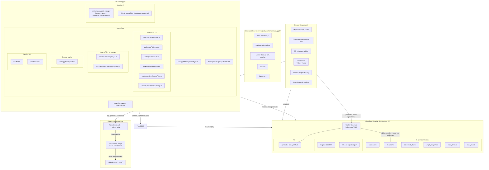
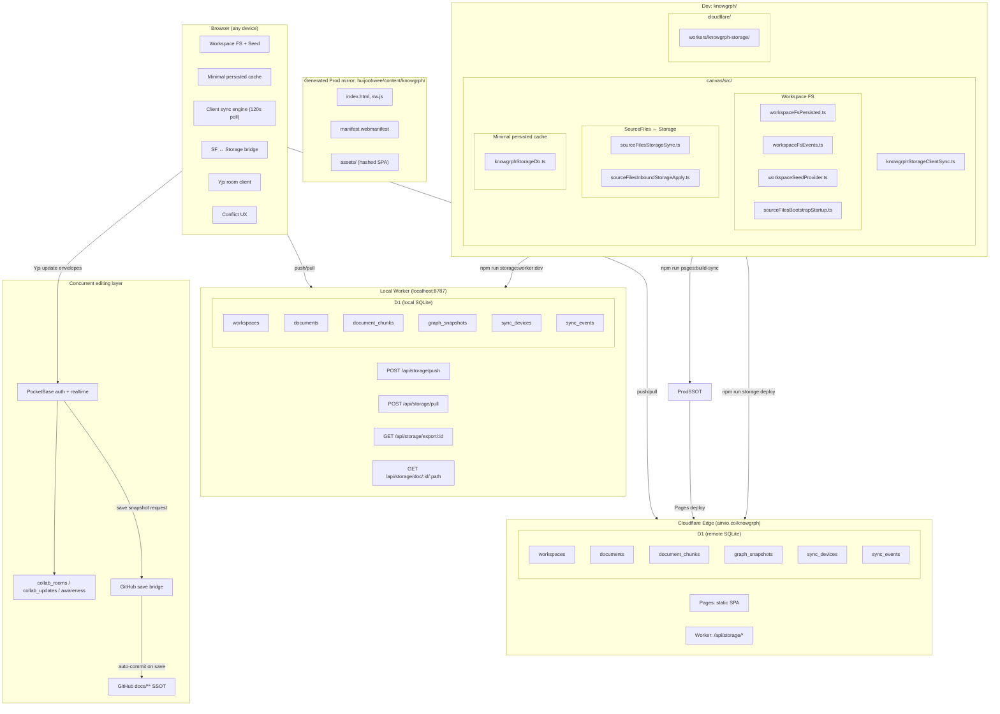

# Knowgrph Storage & Sync

**Context**: Canonical markdown documents, configurable local docs mirror sync, optional D1-backed Worker storage, PocketBase + Yjs collaborative editing, minimal browser cache, and Cloudflare deployment.
**Intent**: Keep one canonical storage decision, one shared sync contract, and one conflict-resolution UX path.
**Directive**: Keep GitHub `docs/**` canonical for Storage Sync: Knowgrph product and runtime contracts in `knowgrph/docs`, collaborative workspace documents in `huijoohwee/docs`, and global invocation dictionaries in `agentic-canvas-os/docs`. Use the configured local docs mirror as the offline working projection, PocketBase + Yjs as the concurrent-editing layer, and Cloudflare Worker + D1 only for explicit runtime/read-cache endpoints. `huijoohwee/content/knowgrph` is generated release output and is never an authoring target. Collaborators never touch Git; a server-side bridge commits saved CRDT snapshots back to the owning GitHub docs root. Never let two users edit raw JSON simultaneously without CRDT wrapping.

The document family is invocable through `knowgrph.agentic_canvas_os.docs.invoke`, which resolves the authored `/`, `@`, and `#` tokens from Agentic Canvas OS. The `search`/`fetch` MCP pair and `knowgrph.list_source_files`/`knowgrph.read_source_file` WebMCP pair provide read-only document access only after a source is present in the configured published Source Files workspace. Invocation lookup does not execute storage mutations, authorize deployment, or turn this Markdown into a second tool registry.

## Companion Files

| File | Scope |
|---|---|
| `knowgrph-storage-sync-document.companion.md` | PRD summary, TAD runtime layers, conflict resolution, ADRs, deployment phases, quality attributes, token economics, validation |
| `knowgrph-storage-schemas-document.md` | D1 SQL, browser cache shapes, contract types, route contracts |
| `knowgrph-local-storage-document.md` | Browser LocalStorage keys (UI state, not sync) |
| `knowgrph-source-files-import-document.md` | Import workflows, format routing, geo layer registration |
| `knowgrph-multi-user-collaboration-prd.tad.md` | Multi-user auth, authorization, role-based access, SSOT transition |

---

## Storage Ladder

1. **Product/runtime contract source**: GitHub `huijoohwee/knowgrph` `docs/**` owns Knowgrph specifications, route contracts, schemas, and authored workspace seeds.
2. **Collaborative document source**: GitHub `huijoohwee/huijoohwee` `docs/**` owns user-created, imported, and runnable workspace Markdown; local Dev defaults its configured docs mirror to this sibling root when available.
3. **Global invocation source**: GitHub `huijoohwee/agentic-canvas-os` `docs/**` owns the `/`, `@`, and `#` dictionaries and the currently published canonical runtime-doc catalog.
4. **Per-device cache**: minimal browser cache only; it is not canonical persistence.
5. **Concurrent edit layer**: PocketBase + Yjs when two or more users edit the same file at the same time.
6. **Save bridge**: server-side bridge serializes saved Yjs state and commits to the owning GitHub docs root; collaborators never touch Git directly.
7. **Explicit shared/runtime store**: Cloudflare D1 through a Cloudflare Worker sync API using `drizzle-orm` queries and Wrangler SQL migrations for read/export/runtime metadata only.
8. **Generated binary artifact store**: Cloudflare R2 owns generated image/video/binary bytes; D1 owns the sibling Markdown manifest that points to the R2 object through the Worker blob route.
9. **Future scale-up path**: a per-document Cloudflare Durable Object may replace PocketBase when room coordination outgrows one PocketBase server; PostgreSQL remains deferred until server-side retrieval outgrows D1.

### SSOT Transition

There is no undifferentiated repository-wide `docs/**` SSOT. Authority is path-scoped: `knowgrph/docs` owns product/runtime contracts, `huijoohwee/docs` owns collaborative workspace documents, and `agentic-canvas-os/docs` owns global invocation/governance documents and the current published runtime-doc catalog.

`knowgrph/docs/workspace-seeds` is the only writable seed root. `agentic-canvas-os/docs/workspace-seeds` retains only the protected, byte-identical default-runtime projection and must not be hand-edited or deleted while bootstrap depends on it. `huijoohwee/docs/workspace-seeds` is forbidden as an editable or published copy; the collaboration bridge rejects it instead of maintaining a write alias.

- **Single-user workspace**: Source Files reads the configured GitHub source and uses the sibling `huijoohwee/docs` root as the default local Dev mirror when present. Browser persistence is the offline fallback, not an inventory owner.
- **Multi-user workspace**: PocketBase + Yjs becomes the live collaboration layer only while concurrent same-file editing is active. On save, the bridge serializes Yjs state and commits to the path's owning GitHub docs root. D1 remains a runtime read/export cache and never becomes the collaboration SSOT.

### Multi-User Concurrent Editing

When ≥2 users edit the same `*.md` or `*.json` file simultaneously, Git merge is insufficient — minified JSON merges are destructive, and polling-based D1 sync introduces unacceptable conflict rates at character-level edit frequency.

**Stack: PocketBase + Yjs**

PocketBase owns authentication/session state, room metadata, membership, and realtime fanout using its JavaScript SDK authentication store and collection `subscribe()` realtime API. Yjs owns merge state through `Y.Doc` update events and shared types; clients exchange encoded Yjs updates through the PocketBase collaboration collections/relay and apply them with `Y.applyUpdate()`.

| Doc type | Yjs primitive | Merge semantics |
|---|---|---|
| `*.md` | `Y.Text` | Character-level CRDT, zero conflicts |
| `*.json` | `Y.Map` / nested `Y.Map` + `Y.Array` | Field-level merge, prevents destructive overwrites on minified JSON |

**Constraint**: Never allow two users to edit raw minified JSON simultaneously without CRDT wrapping. Git merge on minified JSON produces non-deterministic field loss. All concurrent `*.json` edits must route through Yjs shared JSON types and serialize back to canonical formatted JSON only at save time.

**JSON guardrail**:

- Single-user raw JSON editing is allowed only when no active collaborator is present for the same file.
- When a second collaborator joins a `*.json` document, the raw JSON textarea/editor becomes read-only and the structured Yjs JSON editor becomes authoritative.
- Minified JSON is never committed directly from two clients. The bridge writes stable, formatted JSON generated from the Yjs shared model.

**Git sync bridge auto-commit contract**

```
User save / autosave boundary
  → bridge reads current PocketBase room membership and Y.Doc state
  → serialize Y.Text / Y.Map snapshot to *.md / canonical formatted *.json
  → resolve repositoryTarget from the document path and reject target/path mismatches
  → GitHub Contents API (or GitHub App): PUT /repos/{owner}/{repo}/contents/docs/{path}
  → commit: "chore(sync): save {path} from {repositoryTarget} collaboration bridge"
  → collaborators never touch Git — bridge owns all commits
  → GitHub docs branch/main stays SSOT
```

PocketBase realtime broadcasts Yjs update envelopes and awareness state (cursor, selection, active user) between clients. D1 remains the runtime export/read cache; it does not serve as the concurrent edit store.

### PocketBase Production Recommendation

Use PocketBase + Yjs as the optional small-team Phase 1 collaboration provider, not as an authoring SSOT or an offline dependency. Run a version-pinned PocketBase server on persistent VM/container storage behind a dedicated collaboration origin; PocketBase is not deployed inside a Cloudflare Worker. The `pocketbase` package in `canvas/package.json` is the browser SDK version, not the server release pin.

Production enablement is gated on authenticated workspace membership rules, a unique `(workspaceId, documentKey)` room key, an IndexedDB-backed idempotent Yjs update outbox with acknowledgements/retry/deduplication, ordered replay on join, server-owned snapshot compaction, bounded update batching/pruning, and tested migrations plus backup/restore. GitHub checkpoints use a GitHub App or server token with compare-and-set content SHA at explicit save or bounded autosave intervals, never per keystroke.

The collaboration room contract remains provider-neutral and selects exactly one room owner per workspace. If single-server operations or room scale outgrow PocketBase, replace it with a per-document Cloudflare Durable Object; never dual-write PocketBase and Durable Objects as competing room authorities. See the [PocketBase documentation](https://pocketbase.io/docs/), [realtime API](https://pocketbase.io/docs/api-realtime/), [production guidance](https://pocketbase.io/docs/going-to-production/), and [Cloudflare Durable Objects documentation](https://developers.cloudflare.com/durable-objects/).

---

### Default Workspace Initialization Source

Users can configure a default import source URL via Settings → Workspace → `workspace.import.defaultSourceUrl`. When the workspace is empty and this URL is set, `ensureSeed()` fetches content from the URL and seeds the workspace, reusing the existing `importUrlFallback()` pipeline.

Supported URL types: GitHub repo/folder/blob, any webpage, raw markdown URL, local dev path (via Vite proxy), and explicit Cloudflare D1 export endpoints for Worker/runtime validation.

### Document Storage And Sync Controls

MainPanel → Settings → `Document Storage & Sync` controls online collaboration independently from the existing Toolbar → Workspace View → `Storage Sync` local mirror refresh:

1. **Solo/local path**: Editor Workspace `/docs/**` ⇄ Source Files ⇄ configured local docs mirror. Local Dev defaults to sibling `huijoohwee/docs` when available.
2. **Concurrent path**: Editor Workspace `/docs/**` ⇄ Yjs document room ⇄ PocketBase realtime relay ⇄ GitHub save bridge.
3. **Explicit Source Files cloud path**: a Markdown row's local/cloud icon commits the saved local file through the GitHub save bridge, pushes that exact text to D1 only after GitHub succeeds, and shows cloud-synced only after the public D1 document read-back matches.
4. **Generated artifact publication path**: Generated workspace artifact blob ⇄ `/api/storage/blob/:workspaceId/:canonicalPath*` ⇄ R2 object, plus a sibling Markdown manifest pushed through the Source Files storage publication helper into D1.

Explorer → Source Files renders the shared ownership roots directly above the tree: product documents → `GitHub/knowgrph/docs`, workspace documents → `GitHub/huijoohwee/docs`, workspace seeds → `GitHub/knowgrph/docs/workspace-seeds`, and offline fallback → IndexedDB. The `workspace-seeds` folder carries a shield marker; the Agentic Canvas OS projection is not exposed as a second editable root.

The Source Files mirror enforces that seed boundary for reads, folder creation, file writes, renames, and nested deletes. `/docs/workspace-seeds/**` bypasses the configurable general docs mirror and resolves to `$GITHUB_ROOT/knowgrph/docs/workspace-seeds/**`; the local bridge rejects a mismatched host path or a seed mutation without the workspace ownership key, and it never permits deleting the seed root itself.

Bootstrap treats the seed directory as one authoritative inventory, not a set of independently cached files. In local Dev, a successful read of `$GITHUB_ROOT/knowgrph/docs/workspace-seeds` replaces only the `workspace-seeds/**` portion of the published GitHub aggregate; when that local read is unavailable, the Knowgrph GitHub tree is the online source. Persisted reconciliation then applies exact filenames and bytes, removes stale seed rows and stale source-ownership metadata, and leaves the cached subtree intact when neither source yields an authoritative seed inventory.

`Storage Sync` controls only the configured local docs-mirror refresh. `Document Storage & Sync` defaults to **Online** when the runtime endpoint is configured; **Offline only** pauses D1 and PocketBase/Yjs transport while IndexedDB persistence and the queued outbox remain active. `Sync now` pushes queued mutations, pulls remote changes, and reports `synced` or `offline-queued` without discarding local work.

Generated artifact publication remains explicitly opt-in through the runtime storage setting. A generated image/video/binary artifact is considered synced across Dev, Prod, and Cloudflare only when both checks pass: the Worker blob URL responds through `GET|HEAD /api/storage/blob/:workspaceId/:canonicalPath*`, and the sibling manifest is readable through the D1 document route. AI/LLM generated media that participates in collaborative canvas state additionally uses `/api/storage/media/assets` to confirm the R2 object, persist D1 metadata/provenance, cache an operator-supplied access URL in KV when `KNOWGRPH_MEDIA_ACCESS_KV` is bound, and notify `KNOWGRPH_CANVAS_ROOM` when a collaboration room id is present. Local generated files, browser object URLs, provider URLs, and embedded `srcdoc` alone are proof of Dev output only, not Cloudflare persistence.

#### Media Upload And `@` Command Runtime

FloatingPanel Media is the rich-media catalog, not a storage settings panel. Upload Media from the panel and `@ Upload Media` from an active card field must call the same shared upload helper, produce the same image/audio/video asset record, and refresh the same Media inventory. The `@` insertion path adds an inline media chip to the selected card field without changing the surrounding text typography or recomputing the card surface. Uploaded media thumbnails open the shared preview lightbox, while the thumbnail Download Media action uses the shared download helper without changing the insert, rename, delete, or open-link contracts. Storyboard card media previews and Storyboard reference thumbnails must reuse the same shared hover/focus-appearing translucent kind, info, open-link, and download overlays instead of a Storyboard-local overlay stack.

| Runtime surface | Storage responsibility |
|---|---|
| FloatingPanel Media | List, rename, delete, open, preview, download, and insert persisted media records through shared media inventory helpers. |
| `@ Upload Media` | Reuse FloatingPanel Media upload logic, then insert the resulting media record into the active card field as an inline chip. |
| R2 | Store image/audio/video binary blobs under the configured workspace/object prefix. |
| D1 | Store media asset metadata, provenance, content type, source action, and workspace/card/run context. |
| KV | Cache short-lived access URLs only when `KNOWGRPH_MEDIA_ACCESS_KV` is bound. |
| Durable Objects | Sync latest media room state and collaborator notifications when `KNOWGRPH_CANVAS_ROOM` is bound. |

### Why This Remains The Default

- GitHub `docs/**` stays the authoring source of truth; docs do not drift into a database-first workflow.
- GitHub stays SSOT for both solo and collaborative authoring; D1 is a runtime read/export cache, not an authoring SSOT.
- D1 + Wrangler SQL migrations keep the shared-store step operationally lean while `drizzle-orm` typed Worker code owns runtime access.
- Browser cache remains bounded and non-canonical, so storage drift is neutralized at the source.
- Token savings come from chunk reuse, graph snapshot reuse, and bounded pull/push contracts.
- D1 write cost stays lean: read-first ensure* guards, pull skips writes on no-change, sync_events capped at 24h TTL, 120s poll interval.
- Conflict handling stays inside the existing toast/log/runtime path; no second UX system.
- Auto-clear of stale outbox conflicts after pull eliminates manual resolution after re-seeds.
- Yjs CRDT (Y.Text/Y.Map) eliminates destructive Git merge conflicts for concurrent sessions; raw minified JSON must never be Git-merged across simultaneous edits.
- GitHub save bridge auto-commits saved Yjs snapshots — GitHub SSOT is maintained without any manual Git workflow for collaborators.
- Generated binary artifacts reuse the same Storage Worker and Source Files storage publication owners: R2 stores bytes, D1 stores manifests, and Cloudflare persistence is never claimed without a readable blob route and manifest route.
- Collaborative generated media uses the MainPanel Cloudflare media topology and Storage Worker asset-sync route while FloatingPanel Media remains the rich-media browser: R2 stores image/audio/video bytes, D1 stores `media_artifacts` metadata/provenance, KV stores short-lived access URL cache entries only when a real namespace is bound, and the Durable Object stores the latest room asset notification.
- FloatingPanel Media upload accepts image, audio, and video files. The panel shows a local preview immediately, attempts the existing Worker media PUT route plus `/api/storage/media/assets` metadata route when runtime sync is enabled, writes bytes to the `knowgrph-storage-blobs` R2 bucket under the `airvio/` object prefix, stores a short-lived browser-openable access URL in KV when bound, and writes a lightweight Markdown media reference only after R2/D1 persistence is confirmed.

---

## Architecture — As-Is



### As-Is Gaps

| Gap | Impact | Status |
|---|---|---|
| Cloudflare Worker not deployed to Edge | Client push/pull has no server endpoint | **Resolved** — Worker deployed at `airvio.co/api/storage/*` |
| D1 database not provisioned | No shared remote store exists | **Resolved** — D1 provisioned (`633355bf-…152`) |
| No cross-device sync | Workspace state is siloed per-browser | **Resolved** — push/pull + 120s polling loop |
| Canonical corpus drift | Device caches, the former `huijoohwee/docs` seed, legacy `/agentic-os-docs`, and obsolete `video-runs*` generated roots exposed different Source Files inventories | **Resolved in Dev** — GitHub `agentic-canvas-os/docs` owns bootstrap; workspace startup removes exact legacy source subtrees from persisted, memory, and hot-reload state while preserving `/agentic-canvas-os` and current timestamped `kgc-output_*` artifacts; the release seeder reconciles D1 to the same canonical paths and removes stale rows |
| No per-file persistence truth or upload action | A local `New .md` row looked the same as a GitHub + Cloudflare verified document | **Resolved in Dev** — Source Files renders local, checking, uploading, cloud, unavailable, and failure states; clicking a supported Markdown icon runs GitHub first, D1 second, then exact document read-back |
| No user identity | Mutations are anonymous (device-scoped only) | Open — see multi-user collaboration PRD-TAD |
| No access control | Any device with workspace ID can read/write | Open — see multi-user collaboration PRD-TAD |
| Stale outbox conflicts after re-seed | 48+ conflicts require manual resolution | **Resolved** — auto-clear after pull |
| No public document view URL | Cannot share a readable link to a specific D1 document | **Resolved** — `GET /api/storage/doc/:workspaceId/:canonicalPath` + deep link canvas rendering |
| D1 write amplification on every request | Pull/export write rows even when idle; sync_events grows unboundedly | **Resolved** — read-first ensure*, pull skips writes on no-change, sync_events removed from pull/export, 24h TTL prune on push, poll interval 30s→120s |
| No concurrent doc editing | Two users editing same `*.md`/`*.json` simultaneously causes destructive Git merge on minified JSON | **Built in Dev** — PocketBase + Yjs (`Y.Text`/`Y.Map`) + GitHub save bridge (Path F); deploy requires PocketBase collections and Worker GitHub secret |

---

## Happy Paths

### Path A — Canonical GitHub Bootstrap (Every Device)

```
1. Agentic Canvas OS publication changes merge into GitHub `huijoohwee/agentic-canvas-os/docs/**`
2. Published-catalog bootstrap reads that tree before device-local or D1 fallback data; it does not make Agentic Canvas OS a writable workspace-document target
3. Source Files materializes the exact canonical files under `/docs/**`
4. Authoritative reconciliation deletes cached `/docs/**` entries absent from GitHub
5. An authorized release seeds the same files as `agentic-canvas-os/docs/**` D1 canonical paths
6. D1 export/read-back must equal the GitHub file inventory before cross-device Cloudflare sync is claimed

The collaboration readiness harness uses `/docs/workspace-seeds/knowgrph-physics-playground-demo.md`, which is guaranteed by clean workspace bootstrap, as its shared owner/guest document.
```

### Path B — Cloudflare D1 Export URL (Runtime Read Cache)

```
1. Owner sets workspace.import.defaultSourceUrl in Settings
   → https://airvio.co/api/storage/export/{workspaceId}
2. New user opens workspace in browser
3. ensureSeed() finds empty workspace + URL set
4. Fetches export JSON from D1 endpoint
5. Extracts documents[].contentMd → seeds workspace
6. User edits stay local unless Storage Sync joins a PocketBase/Yjs collaboration room
7. D1 remains a runtime read/export cache, not the authoring SSOT
```

### Path B2 — Explicit Source File Cloud Upload

```
1. User creates or edits a Markdown file, including an empty new `.md`, and saves it into Workspace FS
2. Source Files compares the saved row text with the canonical D1 export snapshot
3. A hard-drive icon means the saved local text is not verified in the Cloudflare projection
4. User clicks the icon
5. The shared authority resolver selects `knowgrph-docs` for `knowgrph/docs/**` and `/docs/workspace-seeds/**`, selects `workspace-docs` for collaborative workspace paths, and rejects `agentic-canvas-os/**` writes
6. POST /api/storage/collab/save verifies the supplied `repositoryTarget`, writes `docs/{path}` in the selected GitHub repository, and treats byte-identical canonical content as success without creating a no-op commit
7. Only after GitHub succeeds, the client queues the same text under `knowgrph/docs/{path}` or `huijoohwee/docs/{path}` and pushes D1
8. GET /api/storage/doc/:workspaceId/:canonicalPath must return the exact saved text
9. The row changes to a cloud icon only after that read-back; GitHub failure skips D1, and partial/read-back failure stays visible as retryable failure
```

Local browser proof must set `KNOWGRPH_STORAGE_DEV_PROXY_TARGET` to a local Wrangler origin. Vite loads this server-only value from `.env.local` with `loadEnv`; local Worker credentials stay in an ignored `.dev.vars` file. The Vite default remains `https://airvio.co`, but explicit local verification must never click a mutating Source Files icon while that production default is active. The docs seeder forbids direct remote-D1 fallback whenever `--base-url` is not the canonical production origin.

### Path C — GitHub Repo Docs Folder (Import from External Source)

```
1. User sets workspace.import.defaultSourceUrl in Settings
   → https://github.com/user/repo/tree/main/docs
2. ensureSeed() calls importWorkspaceUrl() via existing pipeline
3. Source Files mirror hydration treats the GitHub `docs` tree URL as the authoritative seed and fetches Source Files-supported text/model files from the repo
4. Workspace populated with imported docs and supported source assets
5. Edits stay local unless an explicit Worker/D1 runtime path is enabled
```

### Path D — Recover Deleted Workspace Files

```
1. User deletes all workspace files (userClearedAll flag set)
2. To recover: clear localStorage flags in browser console:
   localStorage.removeItem('kg:ui:markdown:workspace:userClearedAllFiles')
   localStorage.removeItem('kg:ui:markdown:workspace:seeded')
   location.reload()
3. ensureSeed() re-seeds from configured source (filesystem or URL)
```

### Path E — Re-Seed Without Conflict Accumulation

```
1. npm run storage:d1:seed:docs (re-seeds D1 with fresh revisions)
2. Browser pulls on next poll cycle
3. autoClearStaleOutboxConflicts compares server revisions vs outbox
4. All stale conflicts auto-removed (serverRevision >= localRevision)
5. Toast auto-dismisses — zero user intervention
```

### Path F — Concurrent Multi-User Edit (PocketBase + Yjs + GitHub Save Bridge)

```
1. User A and User B open same *.md or *.json in workspace
2. MainPanel `Document Storage & Sync` is Online, so the editor joins a PocketBase-backed Yjs room for that file
3. PocketBase realtime relay broadcasts Yjs update envelopes and awareness (cursor, selection)
4. Y.Text (*.md) / Y.Map (*.json) CRDTs merge edits character/field-level — zero conflict
   ⚠ Raw minified JSON must never be Git-merged across simultaneous sessions — route through Y.Map
5. On explicit save or autosave boundary:
   → GitHub save bridge serializes Y.Doc snapshot
   → Markdown writes from Y.Text; JSON writes from canonical formatted Y.Map/Y.Array projection
   → shared authority selects `knowgrph-docs` or `workspace-docs` from the document path
   → GitHub Contents API or GitHub App writes docs/{path} in the selected repository
   → commit: "chore(sync): save {path} from {repositoryTarget} collaboration bridge"
6. Neither User A nor User B touches Git — bridge owns all commits
7. GitHub docs branch/main stays SSOT; D1 stays runtime export/read cache
```

### Path G — Generated Image/Video/Binary Artifact Persistence (R2 + D1 Manifest)

```
1. A runtime owner generates a binary artifact from a workspace path, for example image/video bytes for a KGC or rich-media output
2. Runtime storage sync is explicitly enabled and the artifact has a workspace id plus canonical path
3. `uploadGeneratedWorkspaceBlobToKnowgrphStorage()` posts the Blob to `/api/storage/blob/:workspaceId/:canonicalPath*`
4. The Storage Worker stores the bytes in R2 using the same workspace/canonical-path identity and returns the object key, content type, hash, size, and public Worker path
5. The generated output owner writes a sibling Markdown manifest through `writeKgcCompanionOutputBlob()` or the shared Source Files storage publication helper
6. D1 stores the manifest as a normal document; R2 stores the binary bytes
7. Acceptance requires both reads to succeed: manifest through `/api/storage/doc/:workspaceId/:manifestPath*`, bytes or metadata through `GET|HEAD /api/storage/blob/:workspaceId/:canonicalPath*`
```

**Constraint**: Do not infer Cloudflare persistence from a local artifact path, provider URL, browser object URL, or embedded `srcdoc`. Those are Dev/runtime evidence only until the R2 blob route and D1 manifest route are readable.

---

## Architecture — To-Be (Phase 1)



---

## Component Inventory

### Client (canvas/src/)

| Layer | Component | File | Status |
|---|---|---|---|
| Workspace FS | Minimal persisted cache | `features/workspace-fs/workspaceFsPersisted.ts` | Built |
| Workspace FS | In-memory fallback | `features/workspace-fs/workspaceFsMemory.ts` | Built |
| Workspace FS | Change events | `features/workspace-fs/workspaceFsEvents.ts` | Built |
| Workspace FS | Seed read/write | `features/workspace-fs/workspaceSeedProvider.ts` | Built |
| Workspace FS | Seed → SF hydration | `features/source-files/workspaceSeedSourceFiles.ts` | Built |
| Workspace FS | Bootstrap startup | `features/source-files/sourceFilesBootstrapStartup.ts` | Built |
| Source Files | Minimal persisted cache | `features/source-files/sourceFilesDb.ts` | Built |
| Source Files | Markdown folder cache | `features/source-files/markdownFsCache.ts` | Built |
| Graph Record DB | Minimal persisted cache facade | `lib/graph-record-db/index.ts` | Built |
| Graph Record DB | Minimal persisted cache implementation | `lib/graph-record-db/graphRecordDb.impl.ts` | Built |
| Cache store | Shared keyed rows + change events | `lib/storage/persistedCollectionStore.ts` | Built |
| SF ↔ Storage | Push bridge | `features/source-files/sourceFilesStorageSync.ts` | Built |
| SF ↔ Storage | Pull apply | `features/source-files/sourceFilesInboundStorageApply.ts` | Built |
| SF ↔ Storage | Runtime bootstrap | `features/source-files/SourceFilesPersistenceBootstrap.tsx` | Built |
| Generated binary artifacts | Blob upload owner | `features/source-files/sourceFilesBinaryStorage.ts` | Built; runtime-sync opt-in; posts generated image/video/binary bytes to the Storage Worker blob route |
| Generated binary artifacts | KGC binary manifest owner | `features/chat/chatHistoryWorkspace.output.ts` | Built; writes sibling Markdown manifest after R2 upload succeeds |
| Cache store | Storage collections | `lib/storage/knowgrphStorageDb.ts` | Built |
| Sync engine | Client push/pull/loop | `lib/storage/knowgrphStorageClientSync.ts` | Built |
| Sync contract | Constants + builders | `lib/storage/knowgrphStorageSyncContract.ts` | Built |
| Conflict UX | Toast notification | `lib/storage/knowgrphStorageConflictUx.ts` | Built |
| Conflict UX | Resolution actions | `lib/storage/knowgrphStorageConflictActions.ts` | Built |
| Conflict UX | Action runtime | `lib/ui/uiActionRuntime.ts` | Built |
| Conflict UX | Toast surface | `components/ui/ToastHost.tsx` | Built |
| Conflict UX | History log surface | `features/panels/views/HistoryView.tsx` | Built |
| Conflict UX | Action buttons | `components/ui/UiActionButtons.tsx` | Built |
| Collaboration | Yjs document rooms (`Y.Doc`, `Y.Text`, `Y.Map`) | `features/source-files/sourceFilesCollaborationYjs.ts` | Built |
| Collaboration | PocketBase auth, room metadata, realtime update relay | `features/source-files/sourceFilesPocketBaseYjsRoom.ts` + PocketBase collections: `collab_rooms`, `collab_updates`, `collab_awareness` | Built in Dev; requires PocketBase collection deployment |
| Collaboration | Markdown Workspace collaboration runtime | `features/source-files/useSourceFilesPocketBaseYjsCollaborationRuntime.ts` + `lib/markdown-workspace-runtime/MarkdownWorkspaceRuntime.impl.tsx` | Built; gated by MainPanel online mode and `VITE_KNOWGRPH_COLLAB_POCKETBASE_URL` |
| Repository authority | Path-scoped GitHub target resolver | `grph-shared/src/collaboration/documentRepositoryAuthority.ts` | Built; routes product/seeds to `knowgrph-docs`, workspace docs to `workspace-docs`, and rejects Agentic Canvas OS writes |
| Source Files ownership | Canonical roots ledger and seed authority marker | `features/markdown-workspace/SourceFilesOwnershipSummary.tsx` + `MarkdownFileTree.tsx` | Built; consumes shared repository root constants and keeps IndexedDB visible as offline fallback |
| Collaboration | GitHub save bridge with server-owned token/App identity | `POST /api/storage/collab/save` in `workers/knowgrph-storage/index.ts` | Built; requires token, owner, and target-specific Knowgrph/workspace repo config; validates `repositoryTarget` before GitHub access |
| Settings | Document storage mode, roots, fallback, and manual sync | `features/panels/views/DocumentStorageSyncSettingsRows.tsx` + `features/source-files/documentStorageSyncRuntime.ts` | Built; no browser credential fields |
| Source Files cloud status/action | `SourceFileCloudSyncIndicator` + `syncWorkspaceEntryToCanonicalCloud` | `features/markdown-workspace/SourceFileCloudSyncIndicator.tsx` + `features/source-files/sourceFileCanonicalCloudSync.ts` | Built in Dev; supports explicit Markdown uploads including empty new files, GitHub-before-D1 ordering, exact D1 read-back, focus/120s status refresh, and retryable failure state |
| Collaboration | JSON CRDT guardrail | raw JSON editor gate + structured `Y.Map` owner | Built; bridge rejects concurrent JSON saves without Yjs state |

`SourceFilesPersistenceBootstrap.tsx` is the client-side SSOT orchestrator: seed-sync and rematerialize scheduling accept prepared requests when available, fall back to one resolver otherwise, and reuse caller-owned `sourceFiles` snapshots to keep Storage ↔ Source Files ↔ Workspace parity without redundant store reads.

### Cloudflare (cloudflare/)

| Layer | Component | File | Status |
|---|---|---|---|
| Worker | Request handlers | `workers/knowgrph-storage/index.ts` | Built |
| Worker | Public doc view route | `workers/knowgrph-storage/index.ts` (`/api/storage/doc/`) | **Built** — see ADR-009 |
| Worker | Generated binary blob route | `workers/knowgrph-storage/blob.ts` (`/api/storage/blob/`) | **Built** — stores bytes in R2 and serves artifact bodies/metadata through Worker-owned routes |
| Worker | Collaboration save bridge | `workers/knowgrph-storage/index.ts` (`/api/storage/collab/save`) | **Built in Dev** — reads PocketBase room state when configured, formats JSON, requires Yjs state for concurrent JSON, commits through GitHub Contents API |
| Canvas | Deep link runtime | `features/canvas/CanvasDocDeepLinkRuntime.tsx` | **Built** — renders `/doc/{workspaceId}/{path}` in canvas |
| Worker | D1 query helpers | `workers/knowgrph-storage/db.ts` | Built |
| Worker | Contract re-export | `workers/knowgrph-storage/contract.ts` | Built |
| Worker | Wrangler config | `workers/knowgrph-storage/wrangler.toml` | Built |
| D1 | Migration SQL | `d1/migrations/0001_knowgrph_storage.sql` | Built |
| Edge | Deployed Storage Worker | `cloudflare/workers/knowgrph-storage/wrangler.toml` + `index.ts` | **Deployed** — `knowgrph-storage` routes `airvio.co/api/storage/*` |
| Edge | Payment Worker | `cloudflare/workers/knowgrph-payment/wrangler.toml` + `index.ts` | **Deployed separately** — `knowgrph-payment` routes `airvio.co/api/payments/*` |
| Edge | Provisioned D1 | `633355bf-…152` | **Migrated** — remote D1 migrations apply through `npm run storage:d1:migrate:remote` |

### Deploy & Test

| Layer | Component | File | Status |
|---|---|---|---|
| Deploy | Pages sync script | `scripts/sync-pages-knowgrph.mjs` | Built |
| Deploy | Static build + sync | `npm run pages:build-sync` | Built |
| Deploy | Static + Workers deploy | `npm run pages:build-sync-cloudflare` -> `npm run workers:deploy` -> `npm run storage:deploy` | Built; storage deploy applies migrations, deploys the Worker, and re-seeds D1 docs |
| Test | D1 fake | `__tests__/helpers/fakeKnowgrphStorageD1.ts` | Built |
| Test | R2 fake | `__tests__/helpers/fakeKnowgrphStorageR2.ts` | Built |
| Test | Generated binary manifest flow | `__tests__/chatHistoryWorkspaceOutput.test.ts` (`chat.responseContract.storage.kgcBinaryOutputPublishesR2Manifest`) | Built |
| Test | Rich-media binary manifest flow | `__tests__/chatHistoryWorkspaceOutput.test.ts` (`chat.responseContract.storage.richMediaBinaryOutputPublishesR2Manifest`) | Built |
| Test | Worker blob route | `__tests__/sourceFilesStorageBlobSync.test.ts` (`sourceFiles.storageSync.r2BlobRoute.storesBinaryObject`) | Built |
| Test | PocketBase/Yjs collaboration + bridge guard | `__tests__/sourceFilesPocketBaseYjsCollaboration.test.ts` | Built |
| Future | PostgreSQL backend | — | Deferred |

---

## Continuation

PRD summary, TAD runtime layers, conflict resolution, architectural decisions (ADRs), deployment phases, quality attributes, token economics, storage comparison, validation summary, and cross-repo documentation contract continue in [knowgrph-storage-sync-document.companion.md](knowgrph-storage-sync-document.companion.md).

See `knowgrph-storage-schemas-document.md` for D1 SQL, minimal cache shapes, contract type definitions, and route contracts.
See `knowgrph-local-storage-document.md` for browser LocalStorage key reference (UI state, not sync).
See `knowgrph-source-files-import-document.md` for import workflows, format routing, and geo layer registration.
