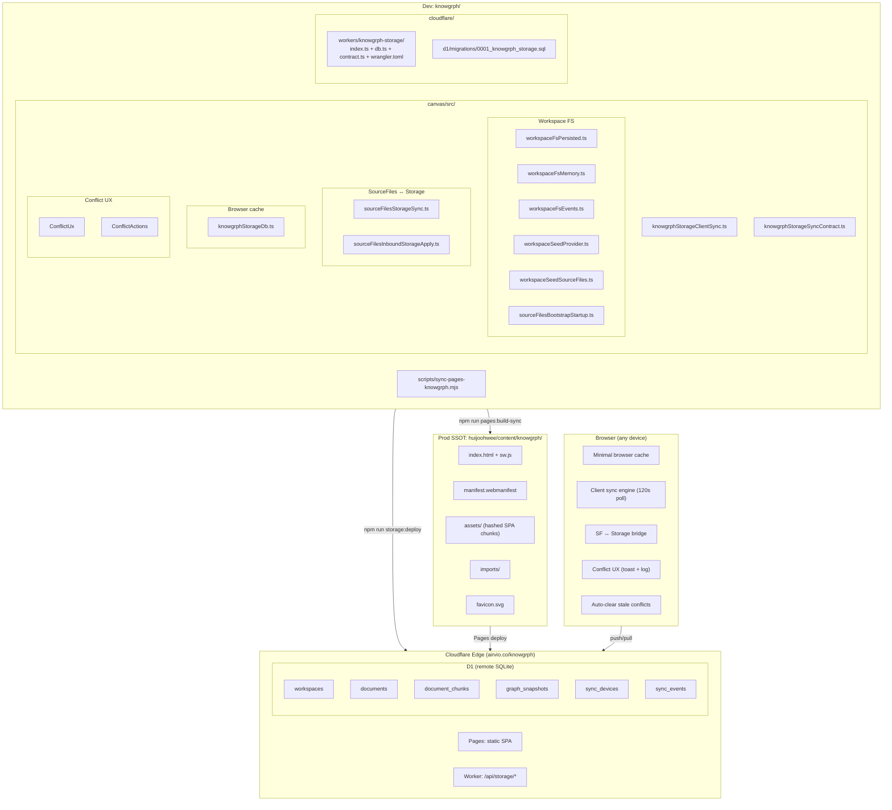
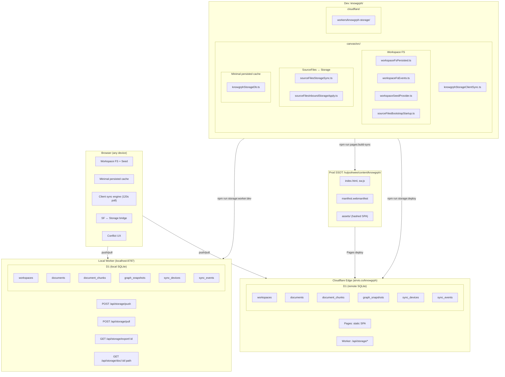

# Knowgrph Storage & Sync

**Context**: Canonical markdown documents, remote-first D1 persistence, minimal browser cache, and Cloudflare deployment.
**Intent**: Keep one canonical storage decision, one shared sync contract, and one conflict-resolution UX path.
**Directive**: Keep Git markdown canonical, make Cloudflare Worker + D1 the canonical shared store, own the Worker D1 contract through Drizzle, keep browser storage as a minimal non-canonical cache only, and defer PostgreSQL until collaboration or server retrieval materially requires it.

---

**Version**: 2.7.0
**Date**: 2026-05-24
**Status**: Deployed (Worker + D1 + Drizzle schema owner + seeded docs + minimal browser cache + public doc view)
**Owner**: Knowgrph canonical docs
**Supersedes**: `knowgrph-storage-document.md`, `knowgrph-storage-document-runtime-and-conflict-ux.md`, `knowgrph-storage-document-schemas-and-topology.md`, `knowgrph-sync-infrastructure-prd-tad.md`

## Companion Files

| File | Scope |
|---|---|
| `knowgrph-storage-sync-document.companion.md` | PRD summary, TAD runtime layers, conflict resolution, ADRs, deployment phases, quality attributes, token economics, validation |
| `knowgrph-storage-schemas.md` | D1 SQL, browser cache shapes, contract types, route contracts |
| `knowgrph-local-storage.md` | Browser LocalStorage keys (UI state, not sync) |
| `knowgrph-source-files-import.md` | Import workflows, format routing, geo layer registration |
| `knowgrph-multi-user-collaboration-prd.tad.md` | Multi-user auth, authorization, role-based access, SSOT transition |

---

## Storage Ladder

1. **Canonical authoring source**: Git markdown in `huijoohwee/docs/**` (single-author) or Cloudflare D1 (multi-user)
2. **Per-device cache**: minimal browser cache only; it is not canonical persistence
3. **Canonical shared store**: Cloudflare D1 through a Cloudflare Worker sync API owned by Drizzle schema/contracts
4. **Optional large-asset spillover**: Cloudflare R2 when assets stop fitting cleanly in document rows
5. **Future scale-up path**: PostgreSQL only when multi-user collaboration or server-side retrieval clearly outgrows D1

### SSOT Transition

The canonical authoring source depends on workspace membership:

- **Single-user workspace**: Filesystem (`huijoohwee/docs/`) remains SSOT. Seed script populates D1 from filesystem.
- **Multi-user workspace** (≥2 members): D1 becomes operational SSOT. Filesystem becomes bootstrap-only seed source. Optional D1→filesystem export script available for git-backed backup.

### Default Workspace Initialization Source

Users can configure a default import source URL via Settings → Workspace → `workspace.import.defaultSourceUrl`. When the workspace is empty and this URL is set, `ensureSeed()` fetches content from the URL and seeds the workspace, reusing the existing `importUrlFallback()` pipeline.

Supported URL types: Cloudflare D1 export endpoint, GitHub repo/folder/blob, any webpage, raw markdown URL, local dev path (via Vite proxy).

### Why This Remains The Default

- Git markdown stays the authoring source of truth for single-user; docs do not drift into a database-first workflow.
- D1 becomes SSOT only when multi-user collaboration requires a shared authoritative store.
- D1 + Drizzle keep the shared-store step operationally lean while moving schema ownership to typed Worker code.
- Browser cache remains bounded and non-canonical, so storage drift is neutralized at the source.
- Token savings come from chunk reuse, graph snapshot reuse, and bounded pull/push contracts.
- D1 write cost stays lean: read-first ensure* guards, pull skips writes on no-change, sync_events capped at 24h TTL, 120s poll interval.
- Conflict handling stays inside the existing toast/log/runtime path; no second UX system.
- Auto-clear of stale outbox conflicts after pull eliminates manual resolution after re-seeds.

---

## Architecture — As-Is



### As-Is Gaps

| Gap | Impact | Status |
|---|---|---|
| Cloudflare Worker not deployed to Edge | Client push/pull has no server endpoint | **Resolved** — Worker deployed at `airvio.co/api/storage/*` |
| D1 database not provisioned | No shared remote store exists | **Resolved** — D1 provisioned (`633355bf-…152`) |
| No cross-device sync | Workspace state is siloed per-browser | **Resolved** — push/pull + 120s polling loop |
| No seed write-back | Dev edits to seed docs don't flow back to `huijoohwee/docs/` | Deferred — filesystem export script planned |
| No user identity | Mutations are anonymous (device-scoped only) | Open — see multi-user collaboration PRD-TAD |
| No access control | Any device with workspace ID can read/write | Open — see multi-user collaboration PRD-TAD |
| Stale outbox conflicts after re-seed | 48+ conflicts require manual resolution | **Resolved** — auto-clear after pull |
| No public document view URL | Cannot share a readable link to a specific D1 document | **Resolved** — `GET /api/storage/doc/:workspaceId/:canonicalPath` + deep link canvas rendering |
| D1 write amplification on every request | Pull/export write rows even when idle; sync_events grows unboundedly | **Resolved** — read-first ensure*, pull skips writes on no-change, sync_events removed from pull/export, 24h TTL prune on push, poll interval 30s→120s |

---

## Happy Paths

### Path A — Local Filesystem (Single Author, Current Default)

```
1. Author edits .md files in huijoohwee/docs/
2. npm run storage:d1:seed:docs
3. D1 upserts documents with fresh revisions
4. Browser pulls from D1 on next 120s poll cycle
5. autoClearStaleOutboxConflicts removes any stale conflicts
6. Workspace renders updated docs
```

### Path B — Cloudflare D1 Export URL (Multi-User, Production)

```
1. Owner sets workspace.import.defaultSourceUrl in Settings
   → https://airvio.co/api/storage/export/{workspaceId}
2. New user opens workspace in browser
3. ensureSeed() finds empty workspace + URL set
4. Fetches export JSON from D1 endpoint
5. Extracts documents[].contentMd → seeds workspace
6. User edits in browser → push to D1
7. Other users pull on next poll cycle → state parity
```

### Path C — GitHub Repo Docs Folder (Import from External Source)

```
1. User sets workspace.import.defaultSourceUrl in Settings
   → https://github.com/user/repo/tree/main/docs
2. ensureSeed() calls importWorkspaceUrl() via existing pipeline
3. importGitHubFolder() fetches all .md files from the repo
4. Workspace populated with imported docs
5. Edits stay local (push to D1 if sync enabled)
```

### Path D — Recover Deleted Workspace Files

```
1. User deletes all workspace files (userClearedAll flag set)
2. To recover: clear localStorage flags in browser console:
   localStorage.removeItem('kg:ui:markdown:workspace:userClearedAllFiles')
   localStorage.removeItem('kg:ui:markdown:workspace:seeded')
   location.reload()
3. ensureSeed() re-seeds from configured source (filesystem or URL)
```

### Path E — Re-Seed Without Conflict Accumulation

```
1. npm run storage:d1:seed:docs (re-seeds D1 with fresh revisions)
2. Browser pulls on next poll cycle
3. autoClearStaleOutboxConflicts compares server revisions vs outbox
4. All stale conflicts auto-removed (serverRevision >= localRevision)
5. Toast auto-dismisses — zero user intervention
```

---

## Architecture — To-Be (Phase 1)



---

## Component Inventory

### Client (canvas/src/)

| Layer | Component | File | Status |
|---|---|---|---|
| Workspace FS | Minimal persisted cache | `features/workspace-fs/workspaceFsPersisted.ts` | Built |
| Workspace FS | In-memory fallback | `features/workspace-fs/workspaceFsMemory.ts` | Built |
| Workspace FS | Change events | `features/workspace-fs/workspaceFsEvents.ts` | Built |
| Workspace FS | Seed read/write | `features/workspace-fs/workspaceSeedProvider.ts` | Built |
| Workspace FS | Seed → SF hydration | `features/source-files/workspaceSeedSourceFiles.ts` | Built |
| Workspace FS | Bootstrap startup | `features/source-files/sourceFilesBootstrapStartup.ts` | Built |
| Source Files | Minimal persisted cache | `features/source-files/sourceFilesDb.ts` | Built |
| Source Files | Markdown folder cache | `features/source-files/markdownFsCache.ts` | Built |
| Graph Table | Minimal persisted cache | `lib/graph-table-db/graphTableDb.impl.ts` | Built |
| Cache store | Shared keyed rows + change events | `lib/storage/persistedCollectionStore.ts` | Built |
| SF ↔ Storage | Push bridge | `features/source-files/sourceFilesStorageSync.ts` | Built |
| SF ↔ Storage | Pull apply | `features/source-files/sourceFilesInboundStorageApply.ts` | Built |
| SF ↔ Storage | Runtime bootstrap | `features/source-files/SourceFilesPersistenceBootstrap.tsx` | Built |
| Cache store | Storage collections | `lib/storage/knowgrphStorageDb.ts` | Built |
| Sync engine | Client push/pull/loop | `lib/storage/knowgrphStorageClientSync.ts` | Built |
| Sync contract | Constants + builders | `lib/storage/knowgrphStorageSyncContract.ts` | Built |
| Conflict UX | Toast notification | `lib/storage/knowgrphStorageConflictUx.ts` | Built |
| Conflict UX | Resolution actions | `lib/storage/knowgrphStorageConflictActions.ts` | Built |
| Conflict UX | Action runtime | `lib/ui/uiActionRuntime.ts` | Built |
| Conflict UX | Toast surface | `components/ui/ToastHost.tsx` | Built |
| Conflict UX | History log surface | `features/panels/views/HistoryView.tsx` | Built |
| Conflict UX | Action buttons | `components/ui/UiActionButtons.tsx` | Built |

`SourceFilesPersistenceBootstrap.tsx` is the client-side SSOT orchestrator: seed-sync and rematerialize scheduling accept prepared requests when available, fall back to one resolver otherwise, and reuse caller-owned `sourceFiles` snapshots to keep Storage ↔ Source Files ↔ Workspace parity without redundant store reads.

### Cloudflare (cloudflare/)

| Layer | Component | File | Status |
|---|---|---|---|
| Worker | Request handlers | `workers/knowgrph-storage/index.ts` | Built |
| Worker | Public doc view route | `workers/knowgrph-storage/index.ts` (`/api/storage/doc/`) | **Built** — see ADR-009 |
| Canvas | Deep link runtime | `features/canvas/CanvasDocDeepLinkRuntime.tsx` | **Built** — renders `/doc/{workspaceId}/{path}` in canvas |
| Worker | D1 query helpers | `workers/knowgrph-storage/db.ts` | Built |
| Worker | Contract re-export | `workers/knowgrph-storage/contract.ts` | Built |
| Worker | Wrangler config | `workers/knowgrph-storage/wrangler.toml` | Built |
| D1 | Migration SQL | `d1/migrations/0001_knowgrph_storage.sql` | Built |
| Edge | Deployed Storage Worker | `cloudflare/workers/knowgrph-storage/wrangler.toml` + `index.ts` | **Deployed** — `knowgrph-storage` routes `airvio.co/api/storage/*` |
| Edge | Payment Worker | `cloudflare/workers/knowgrph-payment/wrangler.toml` + `index.ts` | **Deployed separately** — `knowgrph-payment` routes `airvio.co/api/payments/*` |
| Edge | Provisioned D1 | `633355bf-…152` | **Migrated** — remote D1 migrations apply through `npm run storage:d1:migrate:remote` |

### Deploy & Test

| Layer | Component | File | Status |
|---|---|---|---|
| Deploy | Pages sync script | `scripts/sync-pages-knowgrph.mjs` | Built |
| Deploy | Static build + sync | `npm run pages:build-sync` | Built |
| Deploy | Static + Workers deploy | `npm run pages:build-sync-cloudflare` -> `npm run workers:deploy` | Built |
| Test | D1 fake | `__tests__/helpers/fakeKnowgrphStorageD1.ts` | Built |
| Future | PostgreSQL backend | — | Deferred |

---

## Continuation

PRD summary, TAD runtime layers, conflict resolution, architectural decisions (ADRs), deployment phases, quality attributes, token economics, storage comparison, validation summary, and cross-repo documentation contract continue in [knowgrph-storage-sync-document.companion.md](knowgrph-storage-sync-document.companion.md).

See `knowgrph-storage-schemas.md` for D1 SQL, minimal cache shapes, contract type definitions, and route contracts.
See `knowgrph-local-storage.md` for browser LocalStorage key reference (UI state, not sync).
See `knowgrph-source-files-import.md` for import workflows, format routing, and geo layer registration.
