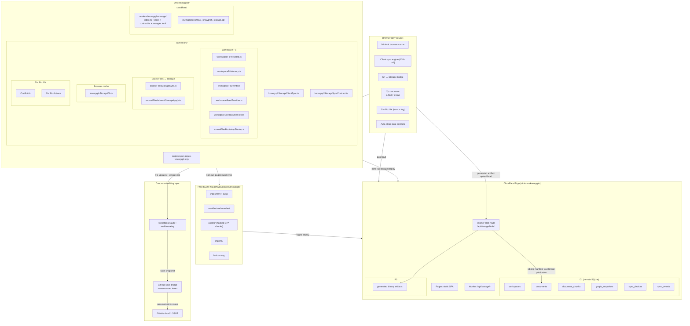
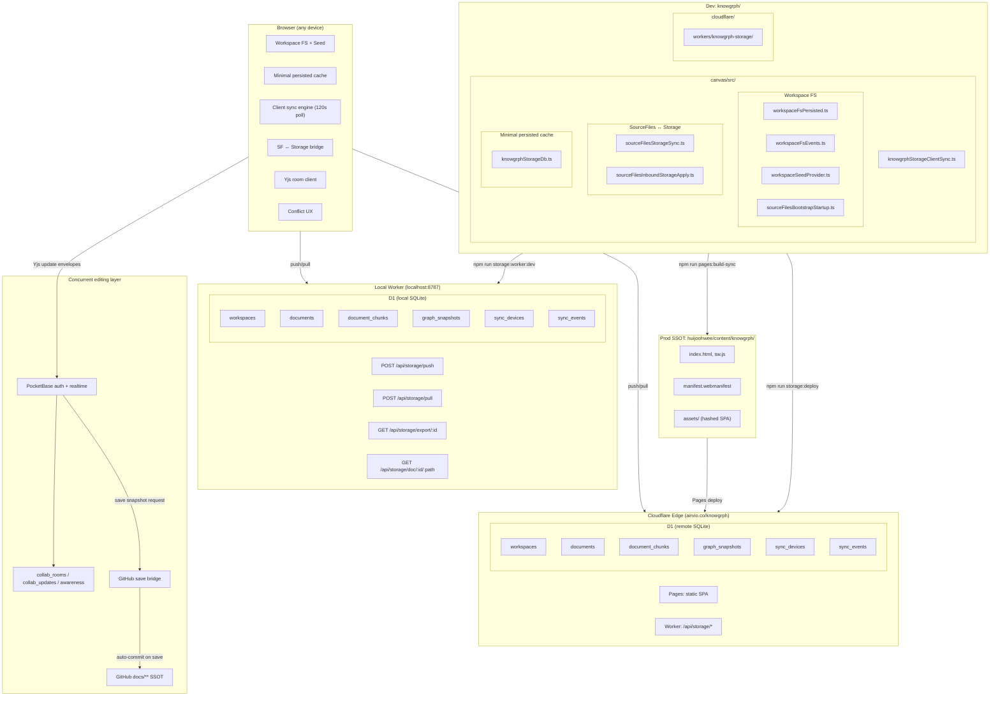

# Knowgrph Storage & Sync

**Context**: Canonical markdown documents, configurable local docs mirror sync, optional D1-backed Worker storage, PocketBase + Yjs collaborative editing, minimal browser cache, and Cloudflare deployment.
**Intent**: Keep one canonical storage decision, one shared sync contract, and one conflict-resolution UX path.
**Directive**: Keep GitHub `docs/**` canonical for Storage Sync. Use the local docs mirror as a working projection, use PocketBase + Yjs as the concurrent-editing layer, and use Cloudflare Worker + D1 only for explicit runtime/read-cache endpoints. Collaborators never touch Git; a server-side bridge commits saved CRDT snapshots back to GitHub. Never let two users edit raw JSON simultaneously without CRDT wrapping.

## Companion Files

| File | Scope |
|---|---|
| `knowgrph-storage-sync-document.companion.md` | PRD summary, TAD runtime layers, conflict resolution, ADRs, deployment phases, quality attributes, token economics, validation |
| `knowgrph-storage-schemas-document.md` | D1 SQL, browser cache shapes, contract types, route contracts |
| `knowgrph-local-storage.md` | Browser LocalStorage keys (UI state, not sync) |
| `knowgrph-source-files-import.md` | Import workflows, format routing, geo layer registration |
| `knowgrph-multi-user-collaboration-prd.tad.md` | Multi-user auth, authorization, role-based access, SSOT transition |

---

## Storage Ladder

1. **Canonical authoring source**: GitHub `docs/**` is SSOT; the configured local docs mirror (`huijoohwee/docs/**` by default for Dev) is a working projection
2. **Per-device cache**: minimal browser cache only; it is not canonical persistence
3. **Concurrent edit layer**: PocketBase + Yjs when ≥2 users edit the same file at the same time
4. **Save bridge**: server-side bridge serializes saved Yjs state and commits to GitHub; collaborators never touch Git directly
5. **Explicit shared/runtime store**: Cloudflare D1 through a Cloudflare Worker sync API owned by Drizzle schema/contracts for read/export/runtime metadata only
6. **Generated binary artifact store**: Cloudflare R2 owns generated image/video/binary bytes; D1 owns the sibling Markdown manifest that points to the R2 object through the Worker blob route
7. **Future scale-up path**: PostgreSQL only when server-side retrieval clearly outgrows D1/PocketBase responsibilities

### SSOT Transition

The canonical authoring source does not change with workspace membership: GitHub `docs/**` remains SSOT.

- **Single-user workspace**: Toolbar Storage Sync reads from and writes to the configured local docs mirror, which is expected to be a checkout/projection of the GitHub docs source.
- **Multi-user workspace**: PocketBase + Yjs becomes the live collaboration layer only while concurrent same-file editing is active. On save, the bridge serializes Yjs state and commits to GitHub. D1 remains a runtime read/export cache and never becomes the collaboration SSOT.

### Multi-User Concurrent Editing

When ≥2 users edit the same `*.md` or `*.json` file simultaneously, Git merge is insufficient — minified JSON merges are destructive, and polling-based D1 sync introduces unacceptable conflict rates at character-level edit frequency.

**Stack: PocketBase + Yjs**

PocketBase owns authentication/session state, room metadata, membership, and realtime fanout using its JavaScript SDK authentication store and collection `subscribe()` realtime API. Yjs owns merge state through `Y.Doc` update events and shared types; clients exchange encoded Yjs updates through the PocketBase collaboration collections/relay and apply them with `Y.applyUpdate()`.

| Doc type | Yjs primitive | Merge semantics |
|---|---|---|
| `*.md` | `Y.Text` | Character-level CRDT, zero conflicts |
| `*.json` | `Y.Map` / nested `Y.Map` + `Y.Array` | Field-level merge, prevents destructive overwrites on minified JSON |

**Constraint**: Never allow two users to edit raw minified JSON simultaneously without CRDT wrapping. Git merge on minified JSON produces non-deterministic field loss. All concurrent `*.json` edits must route through Yjs shared JSON types and serialize back to canonical formatted JSON only at save time.

**JSON guardrail**:

- Single-user raw JSON editing is allowed only when no active collaborator is present for the same file.
- When a second collaborator joins a `*.json` document, the raw JSON textarea/editor becomes read-only and the structured Yjs JSON editor becomes authoritative.
- Minified JSON is never committed directly from two clients. The bridge writes stable, formatted JSON generated from the Yjs shared model.

**Git sync bridge auto-commit contract**

```
User save / autosave boundary
  → bridge reads current PocketBase room membership and Y.Doc state
  → serialize Y.Text / Y.Map snapshot to *.md / canonical formatted *.json
  → GitHub Contents API (or GitHub App): PUT /repos/{owner}/{repo}/contents/docs/{path}
  → commit: "chore(sync): save {path} from collaboration bridge"
  → collaborators never touch Git — bridge owns all commits
  → GitHub docs branch/main stays SSOT
```

PocketBase realtime broadcasts Yjs update envelopes and awareness state (cursor, selection, active user) between clients. D1 remains the runtime export/read cache; it does not serve as the concurrent edit store.

---

### Default Workspace Initialization Source

Users can configure a default import source URL via Settings → Workspace → `workspace.import.defaultSourceUrl`. When the workspace is empty and this URL is set, `ensureSeed()` fetches content from the URL and seeds the workspace, reusing the existing `importUrlFallback()` pipeline.

Supported URL types: GitHub repo/folder/blob, any webpage, raw markdown URL, local dev path (via Vite proxy), and explicit Cloudflare D1 export endpoints for Worker/runtime validation.

### Toolbar Storage Sync

Toolbar → Workspace View → `Storage Sync` is the runtime gate for two storage paths that share GitHub as SSOT:

1. **Solo/local path**: Editor Workspace `/docs/**` ⇄ Source Files ⇄ configured local docs mirror.
2. **Concurrent path**: Editor Workspace `/docs/**` ⇄ Yjs document room ⇄ PocketBase realtime relay ⇄ GitHub save bridge.
3. **Generated artifact publication path**: Generated workspace artifact blob ⇄ `/api/storage/blob/:workspaceId/:canonicalPath*` ⇄ R2 object, plus a sibling Markdown manifest pushed through the Source Files storage publication helper into D1.

When on, the app keeps the workspace seed refresh loop active and allows same-file collaborative rooms to sync through PocketBase + Yjs. When off, seed refresh and collaboration room sync are paused; local Source Files persistence and graph composition remain local.

Generated artifact publication remains explicitly opt-in through the runtime storage setting. A generated image/video/binary artifact is considered synced across Dev, Prod, and Cloudflare only when both checks pass: the Worker blob URL responds through `GET|HEAD /api/storage/blob/:workspaceId/:canonicalPath*`, and the sibling manifest is readable through the D1 document route. AI/LLM generated media that participates in collaborative canvas state additionally uses `/api/storage/media/assets` to confirm the R2 object, persist D1 metadata/provenance, cache an operator-supplied access URL in KV when `KNOWGRPH_MEDIA_ACCESS_KV` is bound, and notify `KNOWGRPH_CANVAS_ROOM` when a collaboration room id is present. Local generated files, browser object URLs, provider URLs, and embedded `srcdoc` alone are proof of Dev output only, not Cloudflare persistence.

#### Media Upload And `@` Command Runtime

FloatingPanel Media is the rich-media catalog, not a storage settings panel. Upload Media from the panel and `@ Upload Media` from an active card field must call the same shared upload helper, produce the same image/audio/video asset record, and refresh the same Media inventory. The `@` insertion path adds an inline media chip to the selected card field without changing the surrounding text typography or recomputing the card surface.

| Runtime surface | Storage responsibility |
|---|---|
| FloatingPanel Media | List, rename, delete, open, and insert persisted media records through shared media inventory helpers. |
| `@ Upload Media` | Reuse FloatingPanel Media upload logic, then insert the resulting media record into the active card field as an inline chip. |
| R2 | Store image/audio/video binary blobs under the configured workspace/object prefix. |
| D1 | Store media asset metadata, provenance, content type, source action, and workspace/card/run context. |
| KV | Cache short-lived access URLs only when `KNOWGRPH_MEDIA_ACCESS_KV` is bound. |
| Durable Objects | Sync latest media room state and collaborator notifications when `KNOWGRPH_CANVAS_ROOM` is bound. |

### Why This Remains The Default

- GitHub `docs/**` stays the authoring source of truth; docs do not drift into a database-first workflow.
- GitHub stays SSOT for both solo and collaborative authoring; D1 is a runtime read/export cache, not an authoring SSOT.
- D1 + Drizzle keep the shared-store step operationally lean while moving schema ownership to typed Worker code.
- Browser cache remains bounded and non-canonical, so storage drift is neutralized at the source.
- Token savings come from chunk reuse, graph snapshot reuse, and bounded pull/push contracts.
- D1 write cost stays lean: read-first ensure* guards, pull skips writes on no-change, sync_events capped at 24h TTL, 120s poll interval.
- Conflict handling stays inside the existing toast/log/runtime path; no second UX system.
- Auto-clear of stale outbox conflicts after pull eliminates manual resolution after re-seeds.
- Yjs CRDT (Y.Text/Y.Map) eliminates destructive Git merge conflicts for concurrent sessions; raw minified JSON must never be Git-merged across simultaneous edits.
- GitHub save bridge auto-commits saved Yjs snapshots — GitHub SSOT is maintained without any manual Git workflow for collaborators.
- Generated binary artifacts reuse the same Storage Worker and Source Files storage publication owners: R2 stores bytes, D1 stores manifests, and Cloudflare persistence is never claimed without a readable blob route and manifest route.
- Collaborative generated media uses the MainPanel Cloudflare media topology and Storage Worker asset-sync route while FloatingPanel Media remains the rich-media browser: R2 stores image/audio/video bytes, D1 stores `media_artifacts` metadata/provenance, KV stores short-lived access URL cache entries only when a real namespace is bound, and the Durable Object stores the latest room asset notification.
- FloatingPanel Media upload accepts image, audio, and video files. The panel shows a local preview immediately, attempts the existing Worker media PUT route plus `/api/storage/media/assets` metadata route when runtime sync is enabled, writes bytes to the `knowgrph-storage-blobs` R2 bucket under the `airvio/` object prefix, stores a short-lived browser-openable access URL in KV when bound, and writes a lightweight Markdown media reference only after R2/D1 persistence is confirmed.

---

## Architecture — As-Is



### As-Is Gaps

| Gap | Impact | Status |
|---|---|---|
| Cloudflare Worker not deployed to Edge | Client push/pull has no server endpoint | **Resolved** — Worker deployed at `airvio.co/api/storage/*` |
| D1 database not provisioned | No shared remote store exists | **Resolved** — D1 provisioned (`633355bf-…152`) |
| No cross-device sync | Workspace state is siloed per-browser | **Resolved** — push/pull + 120s polling loop |
| No seed write-back | Dev edits to workspace docs don't flow back to `huijoohwee/docs/` | **Resolved** — `/docs/**` workspace writes flow through `upsertWorkspaceDocsMirrorText()` into the configured docs mirror root |
| No user identity | Mutations are anonymous (device-scoped only) | Open — see multi-user collaboration PRD-TAD |
| No access control | Any device with workspace ID can read/write | Open — see multi-user collaboration PRD-TAD |
| Stale outbox conflicts after re-seed | 48+ conflicts require manual resolution | **Resolved** — auto-clear after pull |
| No public document view URL | Cannot share a readable link to a specific D1 document | **Resolved** — `GET /api/storage/doc/:workspaceId/:canonicalPath` + deep link canvas rendering |
| D1 write amplification on every request | Pull/export write rows even when idle; sync_events grows unboundedly | **Resolved** — read-first ensure*, pull skips writes on no-change, sync_events removed from pull/export, 24h TTL prune on push, poll interval 30s→120s |
| No concurrent doc editing | Two users editing same `*.md`/`*.json` simultaneously causes destructive Git merge on minified JSON | **Built in Dev** — PocketBase + Yjs (`Y.Text`/`Y.Map`) + GitHub save bridge (Path F); deploy requires PocketBase collections and Worker GitHub secret |

---

## Happy Paths

### Path A — Local Filesystem (Single Author, Current Default)

```
1. Author edits .md files in huijoohwee/docs/
2. Toolbar → Workspace View → Storage Sync is on
3. Workspace seed polling reads the configured docs mirror root
4. Source Files materialize from the `/docs/**` workspace entries
5. Editor Workspace edits to `/docs/**` write through to the configured docs mirror root
6. Workspace renders updated docs
```

### Path B — Cloudflare D1 Export URL (Runtime Read Cache)

```
1. Owner sets workspace.import.defaultSourceUrl in Settings
   → https://airvio.co/api/storage/export/{workspaceId}
2. New user opens workspace in browser
3. ensureSeed() finds empty workspace + URL set
4. Fetches export JSON from D1 endpoint
5. Extracts documents[].contentMd → seeds workspace
6. User edits stay local unless Storage Sync joins a PocketBase/Yjs collaboration room
7. D1 remains a runtime read/export cache, not the authoring SSOT
```

### Path C — GitHub Repo Docs Folder (Import from External Source)

```
1. User sets workspace.import.defaultSourceUrl in Settings
   → https://github.com/user/repo/tree/main/docs
2. ensureSeed() calls importWorkspaceUrl() via existing pipeline
3. Source Files mirror hydration treats the GitHub `docs` tree URL as the authoritative seed and fetches Source Files-supported text/model files from the repo
4. Workspace populated with imported docs and supported source assets
5. Edits stay local unless an explicit Worker/D1 runtime path is enabled
```

### Path D — Recover Deleted Workspace Files

```
1. User deletes all workspace files (userClearedAll flag set)
2. To recover: clear localStorage flags in browser console:
   localStorage.removeItem('kg:ui:markdown:workspace:userClearedAllFiles')
   localStorage.removeItem('kg:ui:markdown:workspace:seeded')
   location.reload()
3. ensureSeed() re-seeds from configured source (filesystem or URL)
```

### Path E — Re-Seed Without Conflict Accumulation

```
1. npm run storage:d1:seed:docs (re-seeds D1 with fresh revisions)
2. Browser pulls on next poll cycle
3. autoClearStaleOutboxConflicts compares server revisions vs outbox
4. All stale conflicts auto-removed (serverRevision >= localRevision)
5. Toast auto-dismisses — zero user intervention
```

### Path F — Concurrent Multi-User Edit (PocketBase + Yjs + GitHub Save Bridge)

```
1. User A and User B open same *.md or *.json in workspace
2. Storage Sync is on, so the editor joins a PocketBase-backed Yjs room for that file
3. PocketBase realtime relay broadcasts Yjs update envelopes and awareness (cursor, selection)
4. Y.Text (*.md) / Y.Map (*.json) CRDTs merge edits character/field-level — zero conflict
   ⚠ Raw minified JSON must never be Git-merged across simultaneous sessions — route through Y.Map
5. On explicit save or autosave boundary:
   → GitHub save bridge serializes Y.Doc snapshot
   → Markdown writes from Y.Text; JSON writes from canonical formatted Y.Map/Y.Array projection
   → GitHub Contents API or GitHub App writes docs/{path}
   → commit: "chore(sync): save {path} from collaboration bridge"
6. Neither User A nor User B touches Git — bridge owns all commits
7. GitHub docs branch/main stays SSOT; D1 stays runtime export/read cache
```

### Path G — Generated Image/Video/Binary Artifact Persistence (R2 + D1 Manifest)

```
1. A runtime owner generates a binary artifact from a workspace path, for example image/video bytes for a KGC or rich-media output
2. Runtime storage sync is explicitly enabled and the artifact has a workspace id plus canonical path
3. `uploadGeneratedWorkspaceBlobToKnowgrphStorage()` posts the Blob to `/api/storage/blob/:workspaceId/:canonicalPath*`
4. The Storage Worker stores the bytes in R2 using the same workspace/canonical-path identity and returns the object key, content type, hash, size, and public Worker path
5. The generated output owner writes a sibling Markdown manifest through `writeKgcCompanionOutputBlob()` or the shared Source Files storage publication helper
6. D1 stores the manifest as a normal document; R2 stores the binary bytes
7. Acceptance requires both reads to succeed: manifest through `/api/storage/doc/:workspaceId/:manifestPath*`, bytes or metadata through `GET|HEAD /api/storage/blob/:workspaceId/:canonicalPath*`
```

**Constraint**: Do not infer Cloudflare persistence from a local artifact path, provider URL, browser object URL, or embedded `srcdoc`. Those are Dev/runtime evidence only until the R2 blob route and D1 manifest route are readable.

---

## Architecture — To-Be (Phase 1)



---

## Component Inventory

### Client (canvas/src/)

| Layer | Component | File | Status |
|---|---|---|---|
| Workspace FS | Minimal persisted cache | `features/workspace-fs/workspaceFsPersisted.ts` | Built |
| Workspace FS | In-memory fallback | `features/workspace-fs/workspaceFsMemory.ts` | Built |
| Workspace FS | Change events | `features/workspace-fs/workspaceFsEvents.ts` | Built |
| Workspace FS | Seed read/write | `features/workspace-fs/workspaceSeedProvider.ts` | Built |
| Workspace FS | Seed → SF hydration | `features/source-files/workspaceSeedSourceFiles.ts` | Built |
| Workspace FS | Bootstrap startup | `features/source-files/sourceFilesBootstrapStartup.ts` | Built |
| Source Files | Minimal persisted cache | `features/source-files/sourceFilesDb.ts` | Built |
| Source Files | Markdown folder cache | `features/source-files/markdownFsCache.ts` | Built |
| Graph Record DB | Minimal persisted cache facade | `lib/graph-record-db/index.ts` | Built |
| Graph Record DB | Minimal persisted cache implementation | `lib/graph-record-db/graphRecordDb.impl.ts` | Built |
| Cache store | Shared keyed rows + change events | `lib/storage/persistedCollectionStore.ts` | Built |
| SF ↔ Storage | Push bridge | `features/source-files/sourceFilesStorageSync.ts` | Built |
| SF ↔ Storage | Pull apply | `features/source-files/sourceFilesInboundStorageApply.ts` | Built |
| SF ↔ Storage | Runtime bootstrap | `features/source-files/SourceFilesPersistenceBootstrap.tsx` | Built |
| Generated binary artifacts | Blob upload owner | `features/source-files/sourceFilesBinaryStorage.ts` | Built; runtime-sync opt-in; posts generated image/video/binary bytes to the Storage Worker blob route |
| Generated binary artifacts | KGC binary manifest owner | `features/chat/chatHistoryWorkspace.output.ts` | Built; writes sibling Markdown manifest after R2 upload succeeds |
| Cache store | Storage collections | `lib/storage/knowgrphStorageDb.ts` | Built |
| Sync engine | Client push/pull/loop | `lib/storage/knowgrphStorageClientSync.ts` | Built |
| Sync contract | Constants + builders | `lib/storage/knowgrphStorageSyncContract.ts` | Built |
| Conflict UX | Toast notification | `lib/storage/knowgrphStorageConflictUx.ts` | Built |
| Conflict UX | Resolution actions | `lib/storage/knowgrphStorageConflictActions.ts` | Built |
| Conflict UX | Action runtime | `lib/ui/uiActionRuntime.ts` | Built |
| Conflict UX | Toast surface | `components/ui/ToastHost.tsx` | Built |
| Conflict UX | History log surface | `features/panels/views/HistoryView.tsx` | Built |
| Conflict UX | Action buttons | `components/ui/UiActionButtons.tsx` | Built |
| Collaboration | Yjs document rooms (`Y.Doc`, `Y.Text`, `Y.Map`) | `features/source-files/sourceFilesCollaborationYjs.ts` | Built |
| Collaboration | PocketBase auth, room metadata, realtime update relay | `features/source-files/sourceFilesPocketBaseYjsRoom.ts` + PocketBase collections: `collab_rooms`, `collab_updates`, `collab_awareness` | Built in Dev; requires PocketBase collection deployment |
| Collaboration | Markdown Workspace collaboration runtime | `features/source-files/useSourceFilesPocketBaseYjsCollaborationRuntime.ts` + `lib/markdown-workspace-runtime/MarkdownWorkspaceRuntime.impl.tsx` | Built; gated by Storage Sync and `VITE_KNOWGRPH_COLLAB_POCKETBASE_URL` |
| Collaboration | GitHub save bridge with server-owned token/App identity | `POST /api/storage/collab/save` in `workers/knowgrph-storage/index.ts` | Built; requires Worker `KNOWGRPH_STORAGE_GITHUB_TOKEN`, owner, and repo config; reads PocketBase room state when `KNOWGRPH_STORAGE_POCKETBASE_URL` is set |
| Collaboration | JSON CRDT guardrail | raw JSON editor gate + structured `Y.Map` owner | Built; bridge rejects concurrent JSON saves without Yjs state |

`SourceFilesPersistenceBootstrap.tsx` is the client-side SSOT orchestrator: seed-sync and rematerialize scheduling accept prepared requests when available, fall back to one resolver otherwise, and reuse caller-owned `sourceFiles` snapshots to keep Storage ↔ Source Files ↔ Workspace parity without redundant store reads.

### Cloudflare (cloudflare/)

| Layer | Component | File | Status |
|---|---|---|---|
| Worker | Request handlers | `workers/knowgrph-storage/index.ts` | Built |
| Worker | Public doc view route | `workers/knowgrph-storage/index.ts` (`/api/storage/doc/`) | **Built** — see ADR-009 |
| Worker | Generated binary blob route | `workers/knowgrph-storage/blob.ts` (`/api/storage/blob/`) | **Built** — stores bytes in R2 and serves artifact bodies/metadata through Worker-owned routes |
| Worker | Collaboration save bridge | `workers/knowgrph-storage/index.ts` (`/api/storage/collab/save`) | **Built in Dev** — reads PocketBase room state when configured, formats JSON, requires Yjs state for concurrent JSON, commits through GitHub Contents API |
| Canvas | Deep link runtime | `features/canvas/CanvasDocDeepLinkRuntime.tsx` | **Built** — renders `/doc/{workspaceId}/{path}` in canvas |
| Worker | D1 query helpers | `workers/knowgrph-storage/db.ts` | Built |
| Worker | Contract re-export | `workers/knowgrph-storage/contract.ts` | Built |
| Worker | Wrangler config | `workers/knowgrph-storage/wrangler.toml` | Built |
| D1 | Migration SQL | `d1/migrations/0001_knowgrph_storage.sql` | Built |
| Edge | Deployed Storage Worker | `cloudflare/workers/knowgrph-storage/wrangler.toml` + `index.ts` | **Deployed** — `knowgrph-storage` routes `airvio.co/api/storage/*` |
| Edge | Payment Worker | `cloudflare/workers/knowgrph-payment/wrangler.toml` + `index.ts` | **Deployed separately** — `knowgrph-payment` routes `airvio.co/api/payments/*` |
| Edge | Provisioned D1 | `633355bf-…152` | **Migrated** — remote D1 migrations apply through `npm run storage:d1:migrate:remote` |

### Deploy & Test

| Layer | Component | File | Status |
|---|---|---|---|
| Deploy | Pages sync script | `scripts/sync-pages-knowgrph.mjs` | Built |
| Deploy | Static build + sync | `npm run pages:build-sync` | Built |
| Deploy | Static + Workers deploy | `npm run pages:build-sync-cloudflare` -> `npm run workers:deploy` -> `npm run storage:deploy` | Built; storage deploy applies migrations, deploys the Worker, and re-seeds D1 docs |
| Test | D1 fake | `__tests__/helpers/fakeKnowgrphStorageD1.ts` | Built |
| Test | R2 fake | `__tests__/helpers/fakeKnowgrphStorageR2.ts` | Built |
| Test | Generated binary manifest flow | `__tests__/chatHistoryWorkspaceOutput.test.ts` (`chat.responseContract.storage.kgcBinaryOutputPublishesR2Manifest`) | Built |
| Test | Rich-media binary manifest flow | `__tests__/chatHistoryWorkspaceOutput.test.ts` (`chat.responseContract.storage.richMediaBinaryOutputPublishesR2Manifest`) | Built |
| Test | Worker blob route | `__tests__/sourceFilesStorageBlobSync.test.ts` (`sourceFiles.storageSync.r2BlobRoute.storesBinaryObject`) | Built |
| Test | PocketBase/Yjs collaboration + bridge guard | `__tests__/sourceFilesPocketBaseYjsCollaboration.test.ts` | Built |
| Future | PostgreSQL backend | — | Deferred |

---

## Continuation

PRD summary, TAD runtime layers, conflict resolution, architectural decisions (ADRs), deployment phases, quality attributes, token economics, storage comparison, validation summary, and cross-repo documentation contract continue in [knowgrph-storage-sync-document.companion.md](knowgrph-storage-sync-document.companion.md).

See `knowgrph-storage-schemas-document.md` for D1 SQL, minimal cache shapes, contract type definitions, and route contracts.
See `knowgrph-local-storage.md` for browser LocalStorage key reference (UI state, not sync).
See `knowgrph-source-files-import.md` for import workflows, format routing, and geo layer registration.
