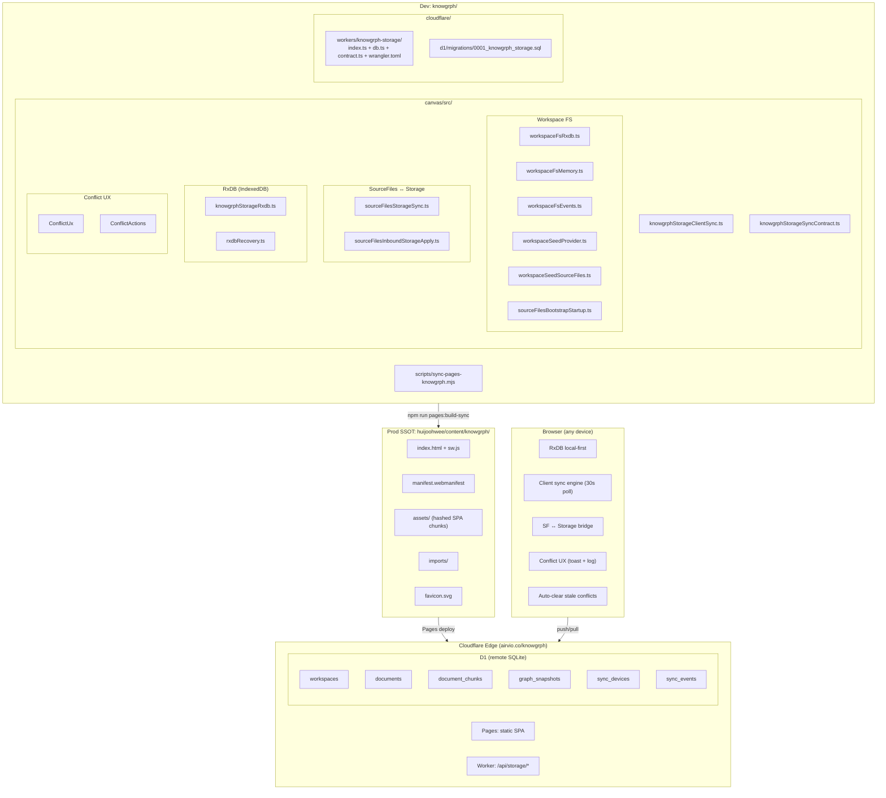
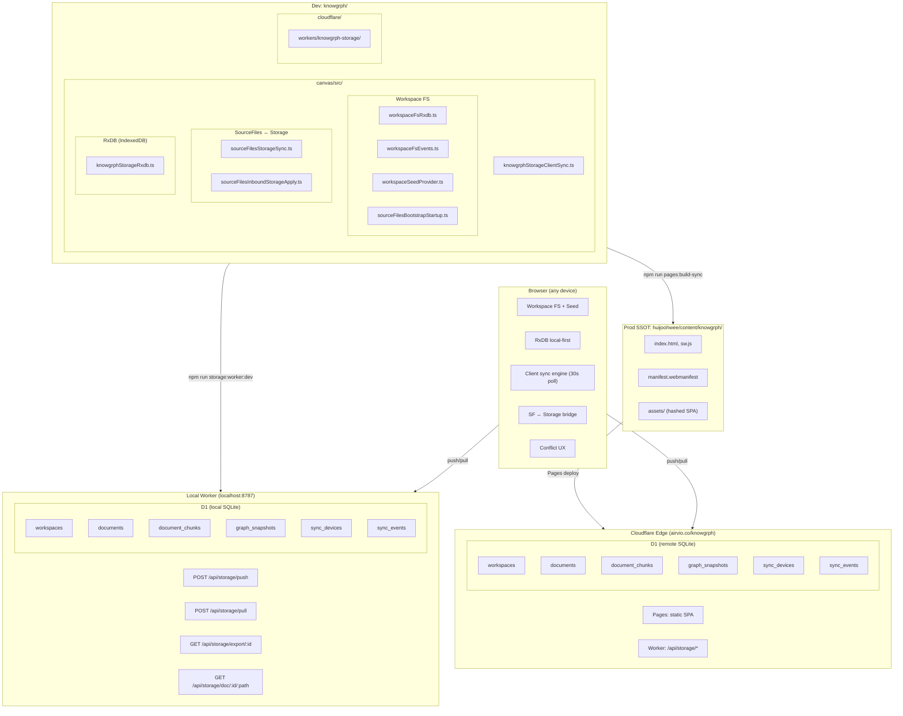
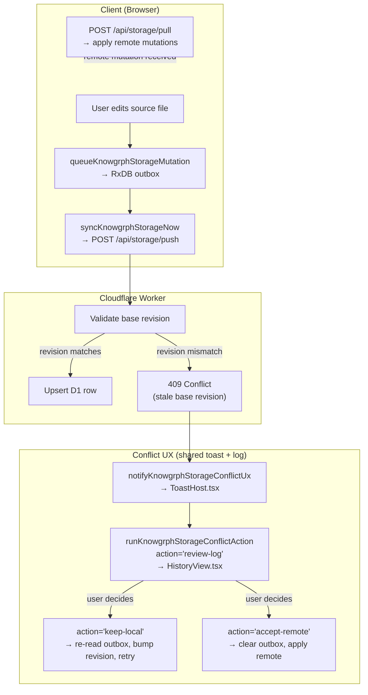

# Knowgrph Storage & Sync

**Context**: Canonical markdown documents, local-first canvas state, optional shared persistence, and Cloudflare deployment.
**Intent**: Keep one canonical storage decision, one shared sync contract, and one conflict-resolution UX path.
**Directive**: Keep Git markdown canonical, keep browser editing local-first through RxDB, use Cloudflare Worker + D1 as the first shared store, and defer PostgreSQL until collaboration or server retrieval materially requires it.

---

**Version**: 2.3.0
**Date**: 2026-05-08
**Status**: Deployed (Worker + D1 + seeded docs, auto-clear conflicts, default source URL, public doc view)
**Owner**: Knowgrph canonical docs
**Supersedes**: `knowgrph-storage-document.md`, `knowgrph-storage-document-runtime-and-conflict-ux.md`, `knowgrph-storage-document-schemas-and-topology.md`, `knowgrph-sync-infrastructure-prd-tad.md`

## Companion Files

| File | Scope |
|---|---|
| `knowgrph-storage-schemas.md` | D1 SQL, RxDB shapes, contract types, route contracts |
| `knowgrph-local-storage.md` | Browser LocalStorage keys (UI state, not sync) |
| `knowgrph-source-files-import.md` | Import workflows, format routing, geo layer registration |
| `knowgrph-multi-user-collaboration-prd.tad.md` | Multi-user auth, authorization, role-based access, SSOT transition |

---

## Storage Ladder

1. **Canonical authoring source**: Git markdown in `huijoohwee/docs/**` (single-author) or Cloudflare D1 (multi-user)
2. **Per-device working store**: RxDB in the browser (IndexedDB)
3. **First shared cloud store**: Cloudflare D1 through a Cloudflare Worker sync API
4. **Optional large-asset spillover**: Cloudflare R2 when assets stop fitting cleanly in document rows
5. **Future scale-up path**: PostgreSQL only when multi-user collaboration or server-side retrieval clearly outgrows D1

### SSOT Transition

The canonical authoring source depends on workspace membership:

- **Single-user workspace**: Filesystem (`huijoohwee/docs/`) remains SSOT. Seed script populates D1 from filesystem.
- **Multi-user workspace** (≥2 members): D1 becomes operational SSOT. Filesystem becomes bootstrap-only seed source. Optional D1→filesystem export script available for git-backed backup.

### Default Workspace Initialization Source

Users can configure a default import source URL via Settings → Workspace → `workspace.import.defaultSourceUrl`. When the workspace is empty and this URL is set, `ensureSeed()` fetches content from the URL and seeds the workspace, reusing the existing `importUrlFallback()` pipeline.

Supported URL types: Cloudflare D1 export endpoint, GitHub repo/folder/blob, any webpage, raw markdown URL, local dev path (via Vite proxy).

### Why This Remains The Default

- Git markdown stays the authoring source of truth for single-user; docs do not drift into a database-first workflow.
- D1 becomes SSOT only when multi-user collaboration requires a shared authoritative store.
- RxDB matches the current canvas runtime and preserves refresh-safe, offline-first editing.
- D1 keeps the first shared-store step operationally lean on Cloudflare.
- Token savings come from chunk reuse, graph snapshot reuse, and bounded pull/push contracts.
- Conflict handling stays inside the existing toast/log/runtime path; no second UX system.
- Auto-clear of stale outbox conflicts after pull eliminates manual resolution after re-seeds.

---

## Architecture — As-Is



### As-Is Gaps

| Gap | Impact | Status |
|---|---|---|
| Cloudflare Worker not deployed to Edge | Client push/pull has no server endpoint | **Resolved** — Worker deployed at `airvio.co/api/storage/*` |
| D1 database not provisioned | No shared remote store exists | **Resolved** — D1 provisioned (`633355bf-…152`) |
| No cross-device sync | Workspace state is siloed per-browser | **Resolved** — push/pull + 30s polling loop |
| No seed write-back | Dev edits to seed docs don't flow back to `huijoohwee/docs/` | Deferred — filesystem export script planned |
| No user identity | Mutations are anonymous (device-scoped only) | Open — see multi-user collaboration PRD-TAD |
| No access control | Any device with workspace ID can read/write | Open — see multi-user collaboration PRD-TAD |
| Stale outbox conflicts after re-seed | 48+ conflicts require manual resolution | **Resolved** — auto-clear after pull |
| No public document view URL | Cannot share a readable link to a specific D1 document | Open — see ADR-009 |

---

## Happy Paths

### Path A — Local Filesystem (Single Author, Current Default)

```
1. Author edits .md files in huijoohwee/docs/
2. npm run storage:d1:seed:docs
3. D1 upserts documents with fresh revisions
4. Browser pulls from D1 on next 30s poll cycle
5. autoClearStaleOutboxConflicts removes any stale conflicts
6. Workspace renders updated docs
```

### Path B — Cloudflare D1 Export URL (Multi-User, Production)

```
1. Owner sets workspace.import.defaultSourceUrl in Settings
   → https://airvio.co/api/storage/export/{workspaceId}
2. New user opens workspace in browser
3. ensureSeed() finds empty workspace + URL set
4. Fetches export JSON from D1 endpoint
5. Extracts documents[].contentMd → seeds workspace
6. User edits in browser → push to D1
7. Other users pull on next poll cycle → state parity
```

### Path C — GitHub Repo Docs Folder (Import from External Source)

```
1. User sets workspace.import.defaultSourceUrl in Settings
   → https://github.com/user/repo/tree/main/docs
2. ensureSeed() calls importWorkspaceUrl() via existing pipeline
3. importGitHubFolder() fetches all .md files from the repo
4. Workspace populated with imported docs
5. Edits stay local (push to D1 if sync enabled)
```

### Path D — Recover Deleted Workspace Files

```
1. User deletes all workspace files (userClearedAll flag set)
2. To recover: clear localStorage flags in browser console:
   localStorage.removeItem('kg:ui:markdown:workspace:userClearedAllFiles')
   localStorage.removeItem('kg:ui:markdown:workspace:seeded')
   location.reload()
3. ensureSeed() re-seeds from configured source (filesystem or URL)
```

### Path E — Re-Seed Without Conflict Accumulation

```
1. npm run storage:d1:seed:docs (re-seeds D1 with fresh revisions)
2. Browser pulls on next poll cycle
3. autoClearStaleOutboxConflicts compares server revisions vs outbox
4. All stale conflicts auto-removed (serverRevision >= localRevision)
5. Toast auto-dismisses — zero user intervention
```

---

## Architecture — To-Be (Phase 1)



---

## Component Inventory

### Client (canvas/src/)

| Layer | Component | File | Status |
|---|---|---|---|
| Workspace FS | RxDB-backed FS | `features/workspace-fs/workspaceFsRxdb.ts` | Built |
| Workspace FS | In-memory fallback | `features/workspace-fs/workspaceFsMemory.ts` | Built |
| Workspace FS | Change events | `features/workspace-fs/workspaceFsEvents.ts` | Built |
| Workspace FS | Seed read/write | `features/workspace-fs/workspaceSeedProvider.ts` | Built |
| Workspace FS | Seed → SF hydration | `features/source-files/workspaceSeedSourceFiles.ts` | Built |
| Workspace FS | Bootstrap startup | `features/source-files/sourceFilesBootstrapStartup.ts` | Built |
| SF ↔ Storage | Push bridge | `features/source-files/sourceFilesStorageSync.ts` | Built |
| SF ↔ Storage | Pull apply | `features/source-files/sourceFilesInboundStorageApply.ts` | Built |
| SF ↔ Storage | Runtime bootstrap | `features/source-files/SourceFilesPersistenceBootstrap.tsx` | Built |
| RxDB | Storage collections | `lib/storage/knowgrphStorageRxdb.ts` | Built |
| RxDB | Recovery | `lib/storage/rxdbRecovery.ts` | Built |
| Sync engine | Client push/pull/loop | `lib/storage/knowgrphStorageClientSync.ts` | Built |
| Sync contract | Constants + builders | `lib/storage/knowgrphStorageSyncContract.ts` | Built |
| Conflict UX | Toast notification | `lib/storage/knowgrphStorageConflictUx.ts` | Built |
| Conflict UX | Resolution actions | `lib/storage/knowgrphStorageConflictActions.ts` | Built |
| Conflict UX | Action runtime | `lib/ui/uiActionRuntime.ts` | Built |
| Conflict UX | Toast surface | `components/ui/ToastHost.tsx` | Built |
| Conflict UX | History log surface | `features/panels/views/HistoryView.tsx` | Built |
| Conflict UX | Action buttons | `components/ui/UiActionButtons.tsx` | Built |

### Cloudflare (cloudflare/)

| Layer | Component | File | Status |
|---|---|---|---|
| Worker | Request handlers | `workers/knowgrph-storage/index.ts` | Built |
| Worker | Public doc view route | `workers/knowgrph-storage/index.ts` (`/api/storage/doc/`) | Proposed — see ADR-009 |
| Worker | D1 query helpers | `workers/knowgrph-storage/db.ts` | Built |
| Worker | Contract re-export | `workers/knowgrph-storage/contract.ts` | Built |
| Worker | Wrangler config | `workers/knowgrph-storage/wrangler.toml` | Built |
| D1 | Migration SQL | `d1/migrations/0001_knowgrph_storage.sql` | Built |
| Edge | Deployed Worker | `wrangler.toml` + `index.ts` | **Pending deploy** (API token) |
| Edge | Provisioned D1 | `633355bf-…152` | **Pending migrate** (API token) |

### Deploy & Test

| Layer | Component | File | Status |
|---|---|---|---|
| Deploy | Pages sync script | `scripts/sync-pages-knowgrph.mjs` | Built |
| Test | D1 fake | `__tests__/helpers/fakeKnowgrphStorageD1.ts` | Built |
| Future | PostgreSQL backend | — | Deferred |

---

## PRD Summary

### Problem

Knowgrph source files exist in three disconnected locations:

1. **Dev** (`knowgrph/canvas/src/`) — live editing with RxDB local-first storage
2. **Prod SSOT** (`huijoohwee/content/knowgrph/`) — static build artifacts on Cloudflare Pages
3. **Docs seed** (`huijoohwee/docs/`) — canonical Markdown files for workspace initialization

The client-side sync engine is fully built but has **no server-side endpoint**. Multi-device continuity and collaborative editing are impossible.

### User Stories

| As a… | I want… | So that… |
|---|---|---|
| Developer editing source files | document edits to persist to a remote store automatically | I can resume work from any device |
| Developer running Dev server | seed file changes in `huijoohwee/docs/` to appear immediately | I can iterate on canonical docs without manual refresh |
| Developer editing a seed document | edits to write back to `huijoohwee/docs/` | canonical seed files stay in sync |
| Operator deploying to production | build-sync pipeline to remain the single static-artifact path | production SPA continues to serve from Prod SSOT |
| User on a mobile device | workspace state to sync via the same push/pull mechanism | seamless cross-device continuity |

### Acceptance Criteria

| Given | When | Then |
|---|---|---|
| Developer edits a source file | autosave debounce fires | document upsert queued in RxDB outbox and pushed to `/api/storage/push` |
| Push endpoint receives a mutation | D1 `documents` table upserted | response confirms stored revision, client clears outbox entry |
| Second device opens same workspace | client polls `/api/storage/pull` with last cursor | receives all mutations newer than cursor, applies to local RxDB |
| File changes in `huijoohwee/docs/` | Dev server seed polling cycle runs | workspace re-reads file and updates source file state |
| `npm run pages:build-sync` executed | build completes and sync runs | Prod SSOT reflects latest static artifacts |

### Success Metrics

| Metric | Baseline | Target |
|---|---|---|
| Push success rate | 0% (no endpoint) | 99.9% |
| Pull-to-apply latency | N/A | <2s p95 |
| Cross-device state parity | 0% (no sync) | 100% document parity |
| D1 free-tier utilization | $0/mo | <$5/mo at projected scale |

---

## TAD — Runtime Layers

### Shared Contract

`canvas/src/lib/storage/knowgrphStorageSyncContract.ts` keeps client, Worker, and test fixtures aligned on:

- entity kinds, mutation operations, route paths
- pull/push response shapes, export contract
- conflict summary shape
- API version: `2026-05-04`

### Browser Storage (RxDB)

`canvas/src/lib/storage/knowgrphStorageRxdb.ts` persists:

- local document copies, chunk cache, graph snapshots
- sync outbox, sync cursor

Local field names differ from remote to avoid RxDB reserved-name collisions (`documentRevision` vs `revision`, `isDeleted` vs `deleted`).

### Cloudflare Worker

`cloudflare/workers/knowgrph-storage/` implements:

- `POST /api/storage/push` — validate mutations, upsert D1 rows, emit sync events
- `POST /api/storage/pull` — query sync events after cursor, return mutations
- `GET /api/storage/export/:workspaceId` — full workspace snapshot (JSON)
- `GET /api/storage/doc/:workspaceId/:canonicalPath*` — public single-document view (text/markdown)

### Client Sync Loop

`canvas/src/lib/storage/knowgrphStorageClientSync.ts` provides:

- device id provisioning, mutation enqueueing
- immediate and scheduled sync runs
- workspace-scoped polling loop (30s default)
- export helper, conflict summary callbacks

### Canvas Runtime Integration

`canvas/src/features/source-files/` wires storage into active workspace:

- source-file edits enqueue storage mutations
- sync loop starts per active workspace
- pulled remote records applied back into visible `sourceFiles`
- graph recomposition follows pulled updates
- conflict notifications reuse shared toasts and logs

---

## Conflict Resolution

### Flow



### Rules

- Auto-clear stale outbox conflicts after pull: when server revision >= local revision, the conflict is stale (server already won) and the outbox row is removed without user intervention.
- Keep non-stale conflicting outbox rows retained until user action or later retry.
- Summarize unresolved conflicts at workspace scope.
- Expose `Keep Local`, `Accept Remote`, and `Review Log` through shared action descriptors.
- Dispatch actions through one runtime path (`uiActionRuntime.ts`).
- Reuse shared toast (`ToastHost.tsx`) and History log (`HistoryView.tsx`) rendering surfaces.
- Forbid a second storage-only modal, drawer, or panel system.
- Handle RxDB CONFLICT errors in workspace FS resilient wrapper: retry once before degrading to memory FS, preventing false "persistence unavailable" toasts from concurrent write race conditions.

---

## Architectural Decisions

### ADR-001: Keep RxDB As The Client Working Store

**Status**: Accepted. Current runtime already behaves local-first; RxDB matches existing browser persistence; replacing it adds migration cost without new product value.

### ADR-002: Choose SQLite / D1 As The First Shared Cloud Store

**Status**: Accepted. D1 fits Pages + Worker deployment shape; SQLite keeps TCO below PostgreSQL-first design; current shared requirements do not justify heavier operational stack.

**Alternatives considered**: Supabase (PostgreSQL) — requires rewriting D1-oriented schema; Turso (libSQL) — separate provider when D1 is already in account; Firebase — proprietary NoSQL, schema is relational; Self-hosted SQLite + Fly.io — higher ops burden, no edge co-location.

### ADR-003: Defer PostgreSQL Until Collaboration Or Retrieval Scale Requires It

**Status**: Accepted. Scale path is documented; MVP path remains lean; sync contract stays stable while backend changes later.

**Adoption gates**: multiple concurrent editors; server-side retrieval outgrows D1; vector search becomes runtime requirement; tenancy/analytics/audit justify managed DB overhead.

### ADR-004: Deploy Worker As Pages Function (Co-located With SPA)

**Status**: Accepted. Same domain avoids CORS; same deployment pipeline; D1 binding available via `wrangler.toml`.

**Trade-offs**: Pages Functions have 50ms CPU time limit on free tier (sufficient for CRUD); standalone Workers offer more flexibility for future WebSocket/Durable Object integration.

### ADR-005: Retain Polling-Based Sync (30s) For Phase 1

**Status**: Accepted. Client-side polling infrastructure already exists; acceptable latency for single-user / small-team use; avoids Durable Objects complexity.

### ADR-006: Seed Write-Back Via Node.js fs Only

**Status**: Accepted. `upsertWorkspaceInitializationSeedText` implements Node.js-only file write with `typeof window !== 'undefined'` guard; prevents browser-side filesystem access; docs directory is Dev-only concern.

### ADR-007: Auto-Clear Stale Outbox Conflicts After Pull

**Status**: Accepted. After every pull, `autoClearStaleOutboxConflicts()` compares pulled server revisions against conflicted outbox entries. When `serverRevision >= localRevision`, the conflict is stale (the server already has the authoritative version) and the outbox row is auto-removed. This eliminates manual conflict resolution after re-seeding D1.

**Alternatives considered**: (1) Require user to manually resolve each conflict — poor UX at scale (48+ conflicts). (2) Clear all conflicts unconditionally — risks losing legitimate local edits that are ahead of the server. (3) Reset outbox attempt count only — conflicts re-accumulate on next push.

### ADR-008: Default Workspace Initialization Source URL

**Status**: Accepted. `workspace.import.defaultSourceUrl` setting added to workspace settings registry (localStorage-backed, string, default empty). When set and the workspace is empty, `readWorkspaceInitializationDocsMirrorEntries()` fetches content from the URL using `fetchWorkspaceUrlContent()` and seeds the workspace. Priority chain: sourceFiles → folderHandle → folderCache → defaultSourceUrl → Vite proxy → Node fs.

**Alternatives considered**: (1) Hardcode D1 export URL — not configurable, breaks for users without D1. (2) Add a new seed provider type — unnecessary complexity when `importUrlFallback()` already handles all URL types. (3) Use Vite env var only — not user-configurable at runtime.

### ADR-009: Public Single-Document View Endpoint

**Status**: Proposed. Add `GET /api/storage/doc/:workspaceId/:canonicalPath*` Worker route that returns a single document's `content_md` as `text/markdown`. This provides a shareable, human-readable URL for any document stored in D1 without requiring the SPA or sync protocol.

**URL structure**: `https://airvio.co/api/storage/doc/{workspaceId}/{canonicalPath}`

| Segment | Source | Example |
|---|---|---|
| `workspaceId` | D1 `documents.workspace_id` | `kgws:abc123` |
| `canonicalPath` | D1 `documents.canonical_path` | `docs/knowgrph-maps-readme.md` |

**Response**: `200 Content-Type: text/markdown; charset=utf-8` with raw `content_md`. `404` if document not found. No authentication required (public read).

**Worker logic**:
1. Decode `workspaceId` and `canonicalPath` from URL path
2. Query D1: `SELECT content_md FROM documents WHERE workspace_id = ? AND canonical_path = ?`
3. Return `content_md` as plain text or 404

**Use cases**:
- Share a readable link to a specific document (browser renders markdown natively or via extension)
- Use as `workspace.import.defaultSourceUrl` input — `fetchWorkspaceUrlContent()` handles `text/markdown` responses
- Programmatic access via `curl` or API clients without JSON parsing

**Alternatives considered**: (1) `/knowgrph/docs/{path}` — rejected because SPA catch-all (`/knowgrph/*` → `index.html`) intercepts all paths under `/knowgrph/`; would require `_redirects` exception or Worker route priority override. (2) Extend `/export/` with query params — rejected because export returns full JSON workspace snapshot, not a single readable document. (3) Separate Cloudflare Pages function — rejected because the existing Worker already has D1 binding and route pattern; adding a route is zero operational overhead.

---

## Deployment Phases

### Phase 1 — Worker + D1 (DONE)

1. ~~Create `wrangler.toml` with D1 binding and Pages Function route pattern~~ ✅
2. ~~Apply D1 migration for 6 tables~~ ✅
3. ~~Deploy Worker handlers for push, pull, export~~ ✅
4. ~~Wire `pages:build-sync` to deploy Worker alongside static assets~~ ✅
5. ~~Verify end-to-end: Dev browser push → D1 → second browser pull → state parity~~ ✅

### Phase 1.5 — Conflict Resilience (DONE)

1. ~~Add `autoClearStaleOutboxConflicts()` to sync client~~ ✅ — auto-removes stale conflicts after pull
2. ~~Add `isRxConflictError()` retry in workspace FS resilient wrapper~~ ✅ — prevents false persistence degradation
3. ~~Verify: re-seed D1 → browser pull → conflicts auto-clear → toast dismisses~~ ✅

### Phase 2 — Default Source URL + Public Doc View + SSOT Transition (IN PROGRESS)

1. ~~Add `workspace.import.defaultSourceUrl` setting to workspace settings registry~~ ✅
2. ~~Extend `readWorkspaceInitializationDocsMirrorEntries()` priority chain with URL fetch step~~ ✅
3. Add `GET /api/storage/doc/:workspaceId/:canonicalPath*` Worker route for public single-document view
4. Implement D1→filesystem export script for git-backed backup
5. Update workspace creation flow to detect multi-member workspaces and flip SSOT to D1

### Phase 3 — Multi-User Auth + Authorization (PROPOSED)

1. Add D1 migration for `users`, `workspace_members`, `invitations` tables
2. Implement JWT auth middleware in Worker
3. Add role-based push/pull permission enforcement (owner, editor, viewer)
4. Extend conflict UX with user identity display
5. See `knowgrph-multi-user-collaboration-prd.tad.md` for full specification

### Phase 4 — Real-Time Collaboration (FUTURE)

1. Introduce Cloudflare Durable Objects for per-workspace WebSocket channels
2. Replace 30s polling with push-based mutation broadcast
3. Add device presence tracking via `sync_devices` table
4. Implement conflict resolution UI for concurrent edits

---

## Quality Attributes

| Attribute | Requirement |
|---|---|
| Performance | Push/pull round-trip <500ms p95; D1 queries <50ms p95 |
| Scalability | D1 free tier: 5M reads/day, 100K writes/day; pagination for >500 documents |
| Security | Optimistic concurrency via base revision; workspace-scoped isolation; no auth in Phase 1; JWT auth + RBAC in Phase 3 |
| Observability | Worker logs via `wrangler tail`; D1 metrics via Cloudflare dashboard; client telemetry via `pipelinePerf.ts` |
| Resilience | RxDB outbox survives crashes; retry with exponential backoff (max 3); cursor-based pull ensures no missed mutations; auto-clear stale conflicts after pull; RxDB CONFLICT retry before FS degradation |
| Maintainability | Worker is thin validation + D1 proxy; business logic stays client-side; numbered SQL migrations; settings-driven default source URL |

---

## Token-Economics Rules

- Store raw markdown once per document revision.
- Persist chunks and graph snapshots separately.
- Track `contentHash` and chunk hashes for reuse.
- Address chunks by semantic keys instead of offsets.
- Avoid resending unchanged chunks when hashes match.
- Prefer pulled delta application over full workspace reloads.

---

## Storage Comparison

| Option | Primary role | TCO | Token economics | Recommendation |
|---|---|---:|---|---|
| RxDB | Browser-local draft and cache store | Lowest | Strong via local chunk reuse | Required |
| SQLite / D1 | First shared store | Low | Strong via persisted chunks and revisions | Recommended |
| PostgreSQL | High-scale shared backend | Highest | Strong for future server retrieval | Deferred |

---

## Validation Summary

Focused tests cover:

- Shared contract routes and record shapes
- Worker push, pull, and export behavior
- Worker public doc view (single document markdown response)
- Client sync loop scheduling and result handling
- Source-files mutation enqueueing
- Inbound pulled-record application into visible source-files state
- Conflict UX dedupe behavior
- Shared toast/history action rendering and dispatch

Representative test files:

- `canvas/src/__tests__/knowgrphStorageContracts.test.ts`
- `canvas/src/__tests__/knowgrphStorageWorker.test.ts`
- `canvas/src/__tests__/knowgrphStorageClientSync.test.ts`
- `canvas/src/__tests__/sourceFilesStorageSync.test.ts`
- `canvas/src/__tests__/sourceFilesInboundStorageApply.test.ts`
- `canvas/src/__tests__/knowgrphStorageConflictUx.test.ts`
- `canvas/src/__tests__/uiActionSurfaces.testx`

---

## Cross-Repo Documentation Contract

These cross-repo docs must stay aligned:

- `knowgrph/todo-log.md`
- `knowgrph/docs/documents/knowgrph-storage-sync-document.md` (this file)
- `knowgrph/docs/documents/knowgrph-storage-schemas-document.md`
- `huijoohwee.github.io/docs/documents/hjh-workspace-todo-log.md`
- `huijoohwee.github.io/schema/AgenticRAG/README.md`
- `huijoohwee.github.io/schema/AgenticRAG/documentation.jsonld`
- `huijoohwee.github.io/schema/AgenticRAG/markdown.jsonld`
- `huijoohwee.github.io/schema/AgenticRAG/panels.jsonld`
- `huijoohwee.github.io/schema/AgenticRAG/knowgrph-documents-map.graph.jsonld`

---

## Continuation

See `knowgrph-storage-schemas.md` for D1 SQL, RxDB local shapes, contract type definitions, and route contracts.
See `knowgrph-local-storage.md` for browser LocalStorage key reference (UI state, not sync).
See `knowgrph-source-files-import.md` for import workflows, format routing, and geo layer registration.
