# Knowgrph Strybldr - PRD and TAD

## Document Map

This combined PRD/TAD follows `/Users/huijoohwee/Documents/GitHub/huijoohwee.github.io/guidelines/prd-tad-guidelines.md`. It defines a 3-hour hackathon slice for Knowgrph Strybldr: import an image, reverse engineer it into editable storyboard element cards, let the user update those cards, and generate or hand off a bounded video request through the existing BytePlus ModelArk run owners.

The contract is intentionally implementation-facing. It names the reusable owners, verifies economic constraints, and keeps the architecture neutral to project, file, and demo-image specifics.

## Executive Summary

Strybldr converts one imported image into a source-backed storyboard and video-generation handoff. The MVP must reuse Knowgrph’s existing Launch import, queryable-corpus media source units, Source Files parsing, Storyboard renderer, Floating Panel shell, settings/integrations, and BytePlus video-generation task owner.

The AI-native harness order is:

1. Local FOSS object detection with `transformers.js` and `Xenova/detr-resnet-50`.
2. Local privacy-safe human geometry with `@vladmandic/human`.
3. Optional BytePlus ModelArk Visual Grounding for ambiguous elements only.
4. Existing BytePlus ModelArk video task generation after user approval.

Base operation must not require a new backend, paid API call, hardcoded image, or duplicate workspace.

## Product Requirements

### Problem

Solo builders often have one reference image that encodes a product state, scene, mood, or concept. Turning that image into a short video demo usually requires manual object identification, storyboard writing, prompt formatting, and provider-specific retries. That wastes hackathon time and creates untracked cost.

### Hypothesis

If Knowgrph can import one image, produce editable element-level storyboard cards, and generate or prepare one bounded video handoff from the approved cards, then a solo dev can demo an AI-native image-to-video orchestration loop with high ROI, zero mandatory monthly TCO, and visible provenance.

### Personas

| Persona | Job To Be Done | Constraint |
|---|---|---|
| Solo founder | Convert one concept image into a video demo quickly. | Needs the smallest shippable loop. |
| Hackathon builder | Show perception, storyboard editing, and video orchestration. | Must be demoable in 3 hours. |
| Creative operator | Correct detected elements before expensive generation. | Needs editable evidence, not a black box. |
| Knowgrph maintainer | Extend existing surfaces without drift. | Must reuse shared owners. |

### User Journey

| Stage | Action | Touchpoint | Pain Point | Opportunity |
|---|---|---|---|---|
| Trigger | User has a reference image. | Toolbar -> Launch | Manual reverse engineering is slow. | Import one image as source truth. |
| Ingest | User imports the image. | Source Files | Image metadata alone is not storyboard-ready. | Start a Strybldr run from the source unit. |
| Detect | System extracts local visual evidence. | Strybldr panel | Raw labels vary in confidence. | Expose confidence and source boxes. |
| Storyboard | System creates cards. | Strybldr Mode | One-shot prompts are hard to trust. | Project element cards into Storyboard. |
| Update | User edits cards and order. | Storyboard cards | Generation often happens too early. | Require approval before video handoff. |
| Generate | System compiles one bounded video request. | BytePlus run owner | Video APIs can be slow or costly. | Reuse existing provider settings and fallback. |

### Epics And Acceptance Criteria

#### PRD-STB-E01 - Image Import

As a hackathon builder, I want to import an image through Launch so it becomes a traceable Strybldr source.

Acceptance criteria:

- Given a PNG, JPEG, WebP, GIF, or AVIF image, when Import Image runs, then Knowgrph creates a corpus media source unit with original name, MIME hint, byte size, source path, and source-unit ID.
- Given the source unit exists, when Strybldr starts, then the run links to that source-unit ID and does not create a duplicate workspace.
- `/goal`: imported image produces one Strybldr run linked to one corpus source unit.

#### PRD-STB-E02 - Local Detection First

As a solo founder, I want FOSS local detection before paid grounding so that cloud spend is optional.

Acceptance criteria:

- Given an imported image, when local object detection is requested, then the harness uses `pipeline("object-detection", "Xenova/detr-resnet-50")` and emits label, score, normalized box, provider, and evidence kind.
- Given human-like regions are present, when Human analysis is requested, then only non-identifying geometry can be emitted.
- Given local confidence is sufficient, when storyboard cards are compiled, then ModelArk Visual Grounding is skipped unless explicitly requested.
- `/goal`: run log proves local detection precedes any paid ModelArk grounding call.

#### PRD-STB-E03 - Editable Storyboard

As a creative operator, I want detected elements to become storyboard cards so I can inspect and correct the story before generation.

Acceptance criteria:

- Given Strybldr evidence, when the parser runs, then it creates graph nodes with `title`, `summary`, `action`, `prompt`, `mediaUrl`, `references`, `lane`, `order`, `strybldrRunId`, `strybldrSourceUnitId`, `strybldrElementId`, `sourceBox`, `confidence`, and `evidenceKind`.
- Given Strybldr Mode is active, when cards render, then Source, Storyboard, and Elements lanes are visible through the shared Storyboard surface.
- Given a runtime-ready Strybldr demo declares `kgParserRoutingContract`, when the parser runs, then parser logic, routing keys, diagram kinds, surfaces, edges, and fork policy come from opening frontmatter rather than filename heuristics or body-side graph mirrors.
- Given a user edits card text/order, when the graph updates, then video prompt compilation reads the updated graph rather than a detached prompt.
- Given a user drags the camera handle around the Floating Panel Camera sphere and clicks `Reframe`, then camera orbit coordinates, angle, level, shot size, and optional note persist on the selected graph node as `strybldrCamera` and the bounded media handoff reads that metadata instead of duplicating prompt-local camera text.
- Given the Camera sphere renders, when the active camera is at longitude `0`, `45`, `90`, `135`, `180`, `225`, `270`, or `315` and latitude `-90`, `-45`, `0`, `45`, or `90`, then the draggable handle, active meridian, active latitude, SVG ray polygon, and selected Wide/Medium/Close-up image frame all resolve from the shared 3D degree-grid camera geometry owner rather than renderer-local 2D offsets.
- `/goal`: Storyboard canvas displays cards derived from image evidence with editable properties.

#### PRD-STB-E04 - Bounded Video Handoff

As a user, I want one approved storyboard to compile into one bounded video request or fallback artifact.

Acceptance criteria:

- Given approved cards, when Toolbar Run All or Generate Video is requested in Strybldr Mode, then only approved card text and references are compiled.
- Given BytePlus ModelArk is configured, when the run is submitted, then existing video task settings and endpoint owners are reused.
- Given credentials are missing or the provider fails, when generation is requested, then the fallback includes approved storyboard, compiled prompt, and error reason.
- Given the workflow contains fork, review, runtime, or publish edges, when Storyboard/Strybldr surfaces render, then those edges remain source-owned `graphData.edges` projected through the shared surface and are not rewritten into renderer-local aliases.
- `/goal`: approved storyboard compiles into one video task or structured fallback.

#### PRD-STB-E05 - Observability And Economics

As a maintainer, I want time, token, and provider-cost observability so the demo proves economic discipline.

Acceptance criteria:

- Given a Strybldr run, when it completes, then logs include model names, elapsed time, cache hits, paid-call count, and cost fields when available.
- Given the same source hash is analyzed again, when cached results are valid, then cache hit is recorded.
- Given budget limits are exceeded, when generation is attempted, then a circuit breaker blocks unapproved spend.
- `/goal`: run artifacts expose elapsed time, paid-call count, cache hit state, and cost fields.

## Scope

### Must

- Add Launch -> Import Image.
- Add Canvas View Mode -> Strybldr Mode.
- Add Floating Panel -> Strybldr.
- Generate a Strybldr Markdown source artifact from imported image source units.
- Parse Strybldr Markdown into Storyboard-compatible graph cards.
- Use `transformers.js`, `Xenova/detr-resnet-50`, and `@vladmandic/human` harness owners.
- Reuse existing BytePlus video-generation owners for final handoff.

### Should

- Keep local image files in a transient registry for same-session browser ML analysis.
- Preserve source-unit provenance on every card.
- Use shared semantic-key helpers for graph cache identity.
- Default to no paid cloud grounding.

### Could

- Add explicit ModelArk Visual Grounding refinement UI.
- Add merge/split element operations beyond generic card editing.
- Add provider-neutral video handoff adapters.

### Won't

- Add a new backend service.
- Store biometric identity, face descriptors, demographic inference, emotion labels, or embeddings.
- Hardcode a demo image, route, file name, or provider key.
- Create duplicate import paths outside Source Files.

## ROI And TCO

ROI formula from the guideline:

```text
ROI Score = (User Impact x Reach) / (Build Hours + Monthly TCO + Token Cost / Month)
```

Hackathon estimate:

| Feature | Impact | Reach | Build Hours | Monthly TCO | Token Cost | ROI Posture |
|---|---:|---:|---:|---:|---:|---|
| Import Image -> Strybldr cards | 5 | 1 | 1.5 | 0 | 0 | High |
| Local DETR/Human analysis | 4 | 1 | 1.0 | 0 | 0 | High |
| BytePlus video handoff | 4 | 1 | 0.5 | 0 fixed | per run | Medium, user-approved |

The base loop remains TCO-zero. Paid spend is opt-in and visible.

## Technical Architecture

### Component Inventory

| Component | Owner | Responsibility |
|---|---|---|
| Launch Image Import | `canvas/src/lib/toolbar/LaunchDropdown.impl.tsx` | Expose image picker and call workspace bridge. |
| Workspace Image Action | `canvas/src/features/markdown-workspace/useWorkspaceFileActions/importActions.ts` | Import image through shared local import, generate Strybldr Markdown, switch UI to Strybldr. |
| Workspace Bridge | `canvas/src/features/markdown-explorer/workspaceActionBridge.ts` | Provide `importLocalImages` without coupling Launch to workspace internals. |
| Strybldr Feature Owner | `canvas/src/features/strybldr/*` | Types, Markdown serialization, parser, local file registry, local vision harness, panel view. |
| Strybldr Camera Owner | `canvas/src/features/strybldr/strybldrCamera.ts`, `canvas/src/features/strybldr/StrybldrCameraFloatingPanelView.tsx`, `canvas/src/features/strybldr/StrybldrCameraPanel.tsx` | Own the top-level FloatingPanel Camera surface, render selected-card media inside the SVG sphere frame, map draggable sphere orbit coordinates into graph-owned camera angle, eye level, shot size, and note metadata for selected cards, and compile it into media handoff prompts. |
| Shared Camera Geometry | `canvas/src/lib/camera/orbitSphere.ts` | Resolve degree-grid longitude/latitude points, 3D orbit vectors, frame-aware handle positions, ray target intersections, polygon footprints, hit-testing, drag snap, and active latitude/meridian metadata for FloatingPanel Camera and future renderer-neutral camera panels. |
| Parser Registry | `canvas/src/features/parsers/default.ts` | Register Strybldr parser before generic Markdown. |
| Renderer Registry | `canvas/src/lib/config.render.ts` | Keep canonical `storyboard` renderer ownership; Strybldr remains parser/workflow/panel identity on the shared Storyboard surface. |
| Storyboard Surface | `canvas/src/components/StoryboardCanvas*` | Render cards through existing storyboard model and kanban editing. |
| Floating Panel | `canvas/src/lib/toolbar/ToolbarToolMenu.impl.tsx` | Host Strybldr review and analysis controls. |
| Toolbar Run All | `canvas/src/components/Toolbar.tsx` and `canvas/src/features/canvas/utils.ts` | Reuse the shared workflow Run All event for Flow Editor and Strybldr. |
| BytePlus Video Owner | `canvas/src/features/chat/byteplusRunGeneration.ts` | Existing bounded video task generation and polling. |

### Data Flow

```mermaid
flowchart LR
  A["Launch: Import Image"] --> B["Workspace local import"]
  B --> C["Corpus media source unit"]
  C --> D["Strybldr Markdown artifact"]
  D --> E["Strybldr parser"]
  E --> F["Storyboard graph cards"]
  F --> G["Strybldr Mode / Strybldr panel"]
  G --> H["User updates cards"]
  H --> I["Approved video prompt"]
  I --> J["BytePlus video task or fallback"]
```



### Harness Contracts

#### Local Object Detection Harness

Input:

```ts
type Input = { input: File | Blob | string; sourceUnitId: string; threshold?: number }
```

Output:

```ts
type Output = Array<{
  id: string
  sourceUnitId: string
  label: string
  confidence: number
  sourceBox: { xmin: number; ymin: number; xmax: number; ymax: number; unit: "percentage" } | null
  evidenceKind: "local-object-detection"
  provider: "transformers-detr"
}>
```

Fallback: return existing source-metadata cards and log no detected objects.

#### Human Geometry Harness

Input: browser image/canvas/video element plus source-unit ID.

Output: privacy-safe person geometry cards only.

Forbidden output: face descriptors, identity matches, age, gender, race, emotion, demographic fields, or biometric embeddings.

#### Optional ModelArk Visual Grounding Harness

Input: source image reference plus low-confidence element proposals.

Output: refined element labels/boxes with `evidenceKind: "modelark-visual-grounding"`.

Circuit breaker: max one refinement pass per user action; no automatic cloud retries.

### Strybldr Markdown Contract

Strybldr artifacts are normal Markdown files with YAML frontmatter and a fenced JSON payload:

````markdown
---
kgStrybldrStoryboard: true
kgCanvasRenderMode: "2d"
kgCanvas2dRenderer: "storyboard"
strybldrRunId: "strybldr-..."
---

```json strybldr-storyboard
{ "version": 1, "runId": "...", "sources": [], "elements": [] }
```
````

Parser output must include graph metadata:

```json
{
  "kind": "strybldr-storyboard",
  "parserId": "strybldr-storyboard",
  "kgCanvasRenderMode": "2d",
  "kgCanvas2dRenderer": "strybldr",
  "graphSemanticKey": "..."
}
```

### Deployment Topology

| Stage | Path | Requirement |
|---|---|---|
| Dev | `/Users/huijoohwee/Documents/GitHub/knowgrph` | Implement, typecheck, focused tests, browser smoke. |
| Prod mirror | `/Users/huijoohwee/Documents/GitHub/huijoohwee/content/knowgrph` | Sync built/static output only after validation. |
| Cloudflare | `https://airvio.co/knowgrph` | Publish only with correct Wrangler credentials and live smoke. |

## ADRs

### ADR-STB-001 - Reuse Storyboard Surface

Decision: `storyboard` is the canonical 2D renderer ID for Strybldr-capable documents; Strybldr-specific behavior is identified by `kgStrybldrStoryboard`, `strybldr-storyboard` parser metadata, and the Strybldr panel/workflow owners.

Rationale: new UX label, no duplicate renderer. Lower build time, lower regression risk, no extra bundle surface.

Naming directive: use `storyboard` for renderer ids, Canvas View labels, generated frontmatter, and import presets. Strybldr remains a workflow and panel name only; do not add storyboard aliases or compatibility remaps.

TCO/FOSS: zero new service, zero paid cost.

### ADR-STB-002 - Markdown Artifact As Source Of Truth

Decision: Strybldr runs serialize into Markdown with a JSON payload and parse back into GraphData.

Rationale: Source Files, parser cache, graph composition, and export behavior already exist.

TCO/FOSS: zero backend storage, no paid database.

### ADR-STB-003 - Local FOSS First

Decision: DETR and Human run locally before optional ModelArk grounding.

Rationale: avoids token/API spend, works offline after model assets are available, and gives visible provenance.

TCO/FOSS: FOSS-first; paid call requires user action.

### ADR-STB-004 - Privacy-Safe Human Geometry

Decision: Human can support pose/person geometry only; identity and demographic outputs are disabled and forbidden.

Rationale: storyboarding needs structure, not identity.

TCO/FOSS: no external identity service; no biometric data retention.

## Quality Attributes

| Attribute | Scenario | Target |
|---|---|---|
| Performance | Import one image and create Strybldr cards. | UI remains responsive; heavy ML runs on explicit user action. |
| Cost | Run base demo without paid credentials. | Zero mandatory API spend. |
| Token economy | Compile video prompt from approved cards only. | No repeated raw-image prompt calls. |
| Privacy | Human geometry is enabled. | No identity, emotion, demographic, or embedding persistence. |
| Reliability | Provider credentials missing. | Storyboard remains usable; video fallback is structured. |
| Maintainability | New surfaces added. | Shared import, parser, renderer, and panel owners remain canonical. |

## Validation Plan

| Gate | Command / Check | Expected |
|---|---|---|
| Parser/unit | `strybldr.markdown.parseStoryboardGraph` | Strybldr Markdown parses to Storyboard graph cards. |
| Renderer registry | `strybldr.renderer.sharedSurfaceRegistry` | `strybldr` maps to Storyboard surface. |
| Launch/panel | `strybldr.launchImage.floatingPanelOwners` | Launch, workspace bridge, and Floating Panel owners are wired. |
| Camera geometry | `strybldr.renderer.sharedSurfaceRegistry` focused camera checks | FloatingPanel Camera uses shared 3D degree-grid orbit vectors for handle, meridian/latitude highlight, frame-aware ray polygon, and Wide/Medium/Close-up frame alignment across front and diagonal poses. |
| Harness | `strybldr.visionHarness.requiredProvidersPrivacyGuard` | DETR/Human imports and privacy guards exist. |
| Typecheck | `npm --prefix canvas exec tsc -- -p canvas/tsconfig.json --noEmit --pretty false` | Exit 0. |
| Hygiene | `npm run hygiene:check` | Exit 0. |
| Browser smoke | Open local app, use Launch -> Import Image, view Strybldr Mode/Panel, then Toolbar -> Run All. | Cards render and video handoff/fallback completes without runtime errors. |
| Deploy smoke | Open `https://airvio.co/knowgrph` after publish. | Route loads and no bad runtime requests. |

## Traceability

| PRD Story | TAD Owner | Verification |
|---|---|---|
| PRD-STB-E01 | Launch Image Import, Workspace Image Action | Import Image creates source unit and Strybldr artifact. |
| PRD-STB-E02 | Local Detection Harness, Human Geometry Harness | Provider-specific harness tests and privacy guards. |
| PRD-STB-E03 | Strybldr Parser, Renderer Registry, Storyboard Surface | Strybldr cards render in shared Storyboard surface. |
| PRD-STB-E04 | BytePlus Video Owner | Approved storyboard can compile to existing video handoff. |
| PRD-STB-E05 | Run metadata, semantic keys, tests | Graph metadata and validation gates expose provenance. |

## Open Questions

| Question | Default For Hackathon |
|---|---|
| Should ModelArk Visual Grounding be exposed as a visible button or automatic low-confidence refinement? | Visible user action only. |
| Should binary image bytes be persisted? | No; keep source metadata and transient session file registry. |
| Should video generation be automatic after import? | No; user approval required. |
| Should Storyboard mode be renamed? | Keep existing Storyboard; add Strybldr Mode as image-to-storyboard path. |

## Definition Of Done

- `docs/documents/knowgrph-strybldr-prd-tad.md` has valid YAML frontmatter and stays under repository hygiene budgets.
- `Import Image` exists in Launch and routes through the workspace bridge.
- `Strybldr Mode` exists in Canvas View Mode and maps to the shared Storyboard surface.
- `Strybldr` exists in Floating Panel.
- Imported images generate Strybldr Markdown artifacts with source-unit provenance.
- Strybldr parser emits Storyboard-compatible GraphData with evidence properties.
- FloatingPanel Camera reads and writes `strybldrCamera` through graph metadata, uses shared 3D degree-grid geometry for draggable handle, active meridian/latitude, SVG ray polygon, and selected shot frame alignment, and avoids renderer-local camera math.
- DETR/Human harness files are present and privacy-safe.
- Focused tests and TypeScript pass.
- Dev -> Prod -> Cloudflare status is reported with exact publish result.
