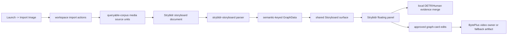

# Knowgrph Stryfork - PRD and TAD

## Document Map

This document makes Stryfork existing-repo-relevant. Stryfork is a product-level
story-fork workflow over the existing `strybldr` runtime, not a new runtime ID,
parser family, renderer, standalone harness, or generated-artifact stack.

The current repository already has the canonical implementation slice:

- Import images through Launch and Source Files.
- Materialize corpus media source units.
- Create `.strybldr.md` storyboard documents.
- Parse those documents into semantic-keyed `GraphData`.
- Render them on the shared Storyboard surface through the `strybldr` renderer.
- Let the Strybldr floating panel run local evidence analysis, edit cards, and
  compile a bounded video handoff or fallback artifact.

Operational rollout context follows Dev -> Prod -> Cloudflare. Concrete local
paths, account identifiers, and host routes are execution evidence for a
specific rollout, not reusable contract values. Runtime code, tests, fixtures,
and persisted documents must not hardcode them.

## Existing Repo Fit

Stryfork means: take a source artifact, preserve its provenance, derive editable
storyboard structure, and produce an approved handoff from that structure. The
repo-relevant MVP is image-backed because the current implementation already
supports image import, local image analysis, storyboard projection, and video
handoff.

The canonical runtime name remains `strybldr`. This document must not cause a
new `stryfork` renderer, parser, store field, toolbar branch, fixture, test
alias, or panel name. Future video or URL story-forking must enter through the
same Source Files and queryable-corpus source-unit contracts before reaching the
same Strybldr graph projection.

## Legacy Neutralization

The prior Stryfork draft described a separate transcript extraction and
standalone storyboard rendering pipeline. That is not the current repo shape and
is removed from this contract.

The valid contract is:

- No separate harness outside the existing web app and workspace import owners.
- No source-specific fixture as an acceptance dependency.
- No generated sidecar JSON, SVG-frame, or HTML-player artifact family as the
  canonical output.
- No custom graph node type for storyboard panels. Strybldr uses ordinary graph
  nodes projected through the shared Storyboard model.
- No runtime aliases that remap stale names into the canonical `strybldr`
  implementation.
- No downstream patch that repairs imported or generated output after the fact.
  Source truth must be neutralized at import, parse, graph projection, or handoff
  ownership.

# Part I - Product Requirements Document

## Feature

Stryfork is the source-backed story-fork workflow for Knowgrph. In the current
repo it is implemented as the Strybldr image-to-storyboard path.

## Problem

A solo builder can start from a reference image or visual source, but turning it
into a traceable storyboard and provider-ready video request usually requires
manual object listing, prompt writing, provider-specific handoff, and untracked
fallback notes. This creates duplicate work and makes it hard to prove which
source image produced which storyboard card.

## Hypothesis

If Knowgrph reuses its existing import, source-unit, Strybldr, Storyboard,
semantic-key, and BytePlus owners, then a source image can become an editable
storyboard and bounded video handoff without a new backend, duplicate renderer,
hardcoded source, stale fixture, or hidden paid call.

## Personas

| Persona | Job To Be Done | Constraint |
|---|---|---|
| Solo founder | Fork a source image into a storyboard quickly. | Needs a small, local-first loop. |
| Creative operator | Inspect and correct cards before generation. | Needs editable evidence and provenance. |
| Knowgrph maintainer | Extend story workflows without runtime drift. | Needs shared owners and semantic-key reuse. |

## User Journey

| Stage | Action | Existing Touchpoint | Required Behavior |
|---|---|---|---|
| Trigger | User has a visual source. | Launch -> Import Image | No hardcoded image or fixture. |
| Ingest | User imports image files. | Source Files import actions | Create corpus source units and a `.strybldr.md` document. |
| Project | Workspace applies the document. | Strybldr parser and Storyboard surface | Render source, storyboard, and element lanes from graph state. |
| Analyse | User runs local analysis. | Strybldr floating panel | Use local DETR/Human evidence first; keep privacy guardrails. |
| Edit | User edits title, summary, action, prompt, and order. | Shared graph update path | Update graph card fields, not a detached prompt. |
| Handoff | User generates video or fallback. | BytePlus video owner and workspace FS | Write one structured handoff artifact with cost evidence. |
| Publish | Repo is mirrored and deployed. | Pages sync and Cloudflare deploy scripts | Do not claim Cloudflare success without a successful deploy. |

## User Stories And Acceptance Criteria

### PRD-SF-E01 - Source-Backed Import

As a Knowgrph user, I want a source image to create one traceable storyboard
document so I can fork the source without a duplicate workspace.

Acceptance criteria:

- Given supported image files, when Launch -> Import Image runs, then workspace
  import creates corpus media source units with source-unit IDs, original names,
  MIME hints, byte sizes, source paths, and hashes.
- Given image source units exist, when the import commit finalizes, then one
  `.strybldr.md` document is created through the Strybldr feature owner and
  focused instead of a raw source file.
- `/goal`: imported images produce one applied Strybldr graph linked to corpus
  source-unit provenance, with no source-specific fixture or hardcoded file name.

### PRD-SF-E02 - Shared Storyboard Projection

As a creative operator, I want the story fork to appear as ordinary storyboard
cards so I can edit and connect it like other Knowgrph graph content.

Acceptance criteria:

- Given a `.strybldr.md` document, when the parser registry loads it, then the
  `strybldr-storyboard` parser wins before generic Markdown parsing.
- Given the parser emits graph data, when Strybldr mode renders, then it uses the
  shared Storyboard surface and exposes Source, Storyboard, and Elements lanes.
- Given graph metadata is emitted, when downstream caches inspect identity, then
  `graphSemanticKey` is derived through the shared semantic-key helper.
- `/goal`: Storyboard rendering works through existing graph and renderer owners,
  with no duplicate renderer surface or stale panel-node type.

### PRD-SF-E03 - Local Evidence First

As a solo founder, I want local evidence extraction before any paid service so
the base loop remains usable without cloud spend.

Acceptance criteria:

- Given a same-session imported image file, when local analysis runs, then DETR
  object detection emits element labels, confidence, normalized boxes, provider,
  and evidence kind.
- Given human geometry is requested, when analysis runs, then identity,
  descriptors, emotion, demographic, liveness, and embedding outputs remain
  disabled.
- Given analysis times out or finds no objects, when the panel handles the
  result, then existing source-backed fallback cards remain available without
  regenerating unrelated graph state.
- `/goal`: local evidence is additive and bounded; no paid call is required for
  Stryfork/Strybldr review.

### PRD-SF-E04 - Editable Approval Gate

As a creative operator, I want to revise storyboard cards before video handoff
so the approved graph is the source of truth.

Acceptance criteria:

- Given a selected card, when the user saves title, summary, action, prompt, or
  order changes, then the existing graph node is updated in place.
- Given a card has been edited, when the handoff is compiled, then card fields
  are read from current graph state.
- Given there are no approved cards, when Generate Video runs, then the panel
  blocks the handoff and shows a warning.
- `/goal`: no detached prompt cache, backfilled artifact, or downstream rewrite
  may override the graph card contract.

### PRD-SF-E05 - Bounded Video Handoff

As a user, I want one approved story fork to become one video request or one
structured fallback artifact.

Acceptance criteria:

- Given approved cards and BytePlus ModelArk is the active provider, when
  Generate Video runs, then Strybldr reuses the existing BytePlus video task
  owner and passes only approved card text and references.
- Given provider credentials are missing, inactive, or failing, when Generate
  Video runs, then the workspace receives a structured fallback Markdown
  artifact with provider, elapsed time, paid-call count, cache-hit state, prompt,
  approved cards, and error reason.
- `/goal`: video generation is bounded and observable; fallback is a first-class
  artifact, not a hidden error branch.

### PRD-SF-E06 - Neutrality And Cleanup

As a maintainer, I want Stryfork to remove stale assumptions instead of layering
compatibility shims over them.

Acceptance criteria:

- Given renderer configuration, when `strybldr` is resolved, then it has no
  stale aliases and maps to the shared Storyboard surface.
- Given toolbar Run All dispatch runs, when the active renderer is `strybldr`,
  then it uses the same shared run event path as other eligible renderers.
- Given tests cover this feature, when they assert old names, duplicate fallback
  owners, or runtime remaps, then those assertions must be removed or retargeted
  to the canonical owner.
- `/goal`: no backfill, duplicate import branch, legacy remap, stale fixture, or
  local hardcode remains as part of the Stryfork contract.

## Scope

### Must

- Reuse Launch -> Import Image.
- Reuse workspace import actions and corpus media source units.
- Reuse Strybldr Markdown serialization and parsing.
- Reuse the shared Storyboard surface for `strybldr`.
- Reuse shared semantic-key helpers for graph identity.
- Reuse Strybldr floating panel card editing, local analysis, and video handoff.
- Reuse existing BytePlus video generation owner and structured fallback
  artifact writer.

### Should

- Keep same-session image files in the existing transient registry for local
  browser ML analysis.
- Preserve source-unit provenance on every source, frame, and element card.
- Keep local analysis bounded by timeout and batch-size guardrails.
- Keep deployment validation in the Dev -> Prod -> Cloudflare order.

### Could

- Add a future video-source mode only after video/transcript evidence becomes a
  neutral corpus source-unit type.
- Add provider-neutral handoff adapters only after the BytePlus owner remains
  stable and the adapter boundary is shared.
- Add storyboard comparison only as a Storyboard-surface extension, not a new
  renderer.

### Won't

- Add a new backend service for Stryfork.
- Add a second parser, renderer, workspace, toolbar bridge, or graph identity
  helper.
- Store biometric identity, face descriptors, demographic inference, emotion
  labels, liveness scores, or embeddings.
- Hardcode a demo image, source URL, local path, provider key, route, or test
  fixture.
- Introduce runtime aliases for stale feature names.

## Success Metrics

| Metric | Baseline | Target | Validation |
|---|---:|---:|---|
| Source-to-storyboard path | Manual prompt writing | One Import Image run | Focused Strybldr tests |
| Mandatory paid calls | Possible provider-first flow | 0 | Local-analysis and fallback tests |
| Renderer duplication | Risk of new surface | 0 new surfaces | Renderer registry test |
| Graph identity helpers | Risk of local hash logic | Shared helper only | Parser/metadata test |
| Fallback observability | Hidden provider error | Structured Markdown artifact | Video handoff test |
| Deployment drift | Dev-only change | Dev -> Prod -> Cloudflare proof | Pages sync/deploy output |

# Part II - Technical Architecture Document

## Architecture Overview



No node in this flow is allowed to fork a project-specific, file-specific, or
provider-specific downstream repair path. If a new source kind is needed, it
must be normalized upstream as a corpus source unit before it reaches Strybldr.

## Component Inventory

| Component | Existing Owner | Responsibility |
|---|---|---|
| Launch image entry | `canvas/src/lib/toolbar/LaunchDropdown.impl.tsx` | Expose Import Image and pass files to the workspace bridge. |
| Bridge retry | `canvas/src/lib/toolbar/launchImageImportBridge.ts` | Open Workspace when needed and retry the import bridge before warning. |
| Workspace import | `canvas/src/features/markdown-workspace/useWorkspaceFileActions/importActions.ts` | Import image files, register source units, create Strybldr Markdown, focus/apply graph, switch to Strybldr. |
| Image registry | `canvas/src/features/strybldr/strybldrImageFileRegistry.ts` | Keep same-session `File` handles for local browser analysis. |
| Strybldr document owner | `canvas/src/features/strybldr/strybldrStoryboard.ts` | Build, serialize, parse, project, merge, and hand off Strybldr storyboard data. |
| Strybldr types | `canvas/src/features/strybldr/strybldrTypes.ts` | Define source, element, evidence, and handoff contracts. |
| Local vision | `canvas/src/features/strybldr/strybldrLocalVision.ts` | Run local DETR and privacy-safe Human geometry analysis. |
| Parser registry | `canvas/src/features/strybldr/parserSpecs.ts` and `canvas/src/features/parsers/default.ts` | Register Strybldr parsing before generic Markdown. |
| Renderer registry | `canvas/src/lib/config.render.ts` | Keep `strybldr` as a renderer that reuses the Storyboard surface and has no aliases. |
| Storyboard model | `canvas/src/components/StoryboardCanvas/storyboardModel.ts` | Render lanes/cards from graph data through shared semantic-keyed board logic. |
| Semantic identity | `canvas/src/lib/graph/semanticKey.ts` | Build graph semantic keys for caches and runtime derivations. |
| Floating panel | `canvas/src/features/strybldr/StrybldrFloatingPanelView.tsx` | Run local analysis, edit cards, consume Run All, and create video/fallback artifacts. |
| Video task owner | `canvas/src/features/chat/byteplusRunGeneration.ts` | Submit bounded BytePlus video tasks when configured. |
| Regression tests | `canvas/src/__tests__/strybldr.test.ts` | Guard parsing, renderer ownership, import wiring, video fallback, and privacy constraints. |

## Data Contracts

### Strybldr Markdown

Strybldr Markdown is the only canonical file artifact for the current Stryfork
workflow.

Required frontmatter:

```yaml
kgStrybldrStoryboard: true
kgCanvasRenderMode: "2d"
kgCanvas2dRenderer: "strybldr"
strybldrRunId: "<stable-run-id>"
```

Required body payload:

````text
```json strybldr-storyboard
{
  "version": 1,
  "runId": "...",
  "createdAtMs": 0,
  "sources": [],
  "elements": []
}
```
````

The parser must reject malformed payloads by returning an empty Strybldr graph
with a warning instead of invoking a fallback parser that would create unrelated
Markdown graph state.

### Source Contract

Each `StrybldrSource` must preserve:

- `sourceUnitId`
- `workspacePath`
- `relativePath`
- `originalName`
- `mediaKind`
- `mimeHint`
- `byteSize`
- `textHash`
- optional `mediaUrl`

Source identity is derived from source-unit and workspace metadata. It must not
depend on a specific file path, visible file name, local absolute root, or demo
image.

### Element Contract

Each `StrybldrElement` must preserve:

- `id`
- `sourceUnitId`
- `label`
- `confidence`
- optional `sourceBox`
- `evidenceKind`
- `provider`
- `order`
- optional `summary`, `action`, and `prompt`

Allowed `evidenceKind` values are `source-metadata`, `local-object-detection`,
`local-human-geometry`, `modelark-visual-grounding`, and `user-edit`.

Allowed provider values are `fallback`, `transformers-detr`, `human`, and
`byteplus-modelark`.

### Graph Projection

The Strybldr graph projection must use the existing node types:

| Node Type | Lane | Source |
|---|---|---|
| `StrybldrImageSource` | Source | Corpus source unit metadata |
| `StoryboardFrame` | Storyboard | Per-source frame card |
| `StoryboardElement` | Elements | Fallback, local evidence, grounding evidence, or user edit |

Required graph metadata:

- `kind: "strybldr-storyboard"`
- `parserId: "strybldr-storyboard"`
- `strybldrRunId`
- `sourcesCount`
- `elementsCount`
- `kgCanvasRenderMode: "2d"`
- `kgCanvas2dRenderer: "strybldr"`
- `graphSemanticKey`

`graphSemanticKey` must be built through
`buildScopedGraphSemanticKey("strybldr-storyboard", { graphData })`.

### Handoff Contract

The video handoff must be compiled from current graph cards only. It must include
card IDs, lanes, titles, summaries, actions, prompts, references, order, and
source-unit IDs. The compiled prompt must instruct the provider to use only the
approved card fields and references.

Fallback Markdown must include:

- `kgStrybldrVideoHandoff: true`
- `status`
- `provider`
- optional `model`
- `elapsedMs`
- `paidCallCount`
- `cacheHit`
- optional `renderUrl`
- optional `sourceUrl`
- optional `errorReason`
- compiled prompt
- approved cards JSON

## Validation Plan

Run focused tests first:

```bash
npm --prefix canvas run test:ci:unit -- strybldr
```

Run changed-file hygiene:

```bash
npm run hygiene:check
```

Run type checking when code changes accompany this document:

```bash
npm --prefix canvas exec tsc -- -p canvas/tsconfig.json --noEmit --pretty false
```

Before Cloudflare reporting, keep the deployment chain explicit:

```bash
npm run pages:build
npm run pages:sync
npm run pages:check-sync
```

Only claim Cloudflare deployment after the deploy command succeeds with the
intended account and project:

```bash
npm run pages:deploy-cloudflare
```

## Validation Evidence

Current evidence for this implementation contract:

| Stage | Command | Result | Notes |
|---|---|---|---|
| Dev focused regression | `npm --prefix canvas run test:ci:unit -- strybldr` | Passed: 5/5 Strybldr tests | Covers parser, renderer registry, import wiring, video fallback, and privacy guard. |
| Dev changed-file hygiene | `npm run hygiene:check` | Passed | Validates the current changed-file set against repo hygiene checks. |
| Dev type check | `npm --prefix canvas exec tsc -- -p canvas/tsconfig.json --noEmit --pretty false` | Passed | Required because this contract points at active TypeScript owners. |
| Prod build | `npm run pages:build` | Passed | Vite emitted existing dynamic/static import warnings but exited successfully. |
| Prod mirror | `npm run pages:sync` then `npm run pages:check-sync` | Passed | Publish mirror is up to date with the rebuilt app output. |
| Cloudflare publish | `npm run pages:deploy-cloudflare` | Passed | The local Cloudflare env loader no longer promotes the DNS token into Wrangler's generic API token names. A clean shell now uses the existing Wrangler OAuth login with Pages access, and the Pages deploy completed successfully. |

## Test Coverage Matrix

| Requirement | Test Owner | Expected Guard |
|---|---|---|
| Strybldr Markdown parses to graph | `canvas/src/__tests__/strybldr.test.ts` | Parser ID, renderer metadata, source-unit provenance, semantic key, Storyboard lanes. |
| Renderer reuses shared surface | `canvas/src/__tests__/strybldr.test.ts` | `strybldr` resolves canonically, has no aliases, maps to Storyboard, supports Run All. |
| Import Image wiring | `canvas/src/__tests__/strybldr.test.ts` | Launch, bridge retry, workspace action bridge, import action, floating panel, and Run All wiring. |
| Video fallback | `canvas/src/__tests__/strybldr.test.ts` | Handoff reads edited graph cards and writes structured fallback cost evidence. |
| Privacy guard | `canvas/src/__tests__/strybldr.test.ts` | Local vision uses DETR/Human and disables identity-sensitive Human features. |

## ADRs

### ADR-001 - Stryfork Reuses Strybldr Runtime

Decision: Stryfork remains a document-level product contract. Runtime work uses
the canonical `strybldr` owners.

Rationale: The repo already has import, parsing, rendering, local analysis,
editing, and handoff owners. Adding a second runtime name would create churn,
alias pressure, and duplicate tests.

### ADR-002 - Storyboard Surface Is Shared

Decision: `strybldr` remains a `Canvas2dRendererId` that maps to the Storyboard
surface.

Rationale: The shared Storyboard model already converts graph cards into lanes.
Stryfork requirements are card and provenance requirements, not a new rendering
surface.

### ADR-003 - Shared Semantic Key Is Mandatory

Decision: Graph identity and cache identity must use
`buildScopedGraphSemanticKey`.

Rationale: Local hash helpers would create stale cache behavior, recomputation,
and cross-surface drift.

### ADR-004 - Local Evidence First, Paid Provider After Approval

Decision: Local detection and privacy-safe geometry are review aids. Paid video
generation only happens through the existing BytePlus owner after approved graph
cards exist.

Rationale: This keeps the base workflow TCO-zero and makes paid calls visible.

### ADR-005 - Future Video Forking Must Enter Upstream

Decision: If URL or video story forking is added later, it must first become a
neutral Source Files/queryable-corpus source-unit path, then reuse the same
Strybldr graph and handoff contracts.

Rationale: A parallel extraction pipeline would bypass the current import,
provenance, parser, renderer, and semantic-key owners.

## Cleanup And Hardcode Guardrails

- Do not add fixture-only source names to runtime code.
- Do not add local absolute paths to tests, bundle config, graph metadata, or
  workspace artifacts.
- Do not add renderer aliases for stale names.
- Do not make the parser remap stale document kinds into Strybldr.
- Do not write provider-specific prompt schema into Storyboard rendering.
- Do not repair imported output after rendering; fix the owner that generated
  the wrong source, graph, or handoff shape.
- Do not recompute graph projection on unrelated text, layout, viewport, or
  panel-open state changes.
- Do not preserve tests that assert stale architecture; retarget them to the
  canonical owner or remove them.

## Implementation Backlog

### Current Contract

- Keep this document aligned with `docs/documents/knowgrph-strybldr-prd-tad.md`.
- Keep Stryfork acceptance criteria tied to existing Strybldr tests.
- Keep Dev -> Prod -> Cloudflare validation evidence separate from runtime code.

### Future Extensions

- Add video-source source units only through shared import and corpus owners.
- Add transcript-derived elements only after transcript evidence has neutral
  source-unit provenance.
- Add provider-neutral handoff adapters only as shared handoff owner extensions.
- Add compare/diff workflows only as Storyboard surface features.

## Implementation Checklist

- [x] Prior standalone pipeline assumptions removed from this PRD/TAD.
- [x] Runtime identity constrained to canonical `strybldr` owners.
- [x] Parser, renderer, import, local-analysis, and handoff owners named.
- [x] Semantic-key helper reuse made mandatory.
- [x] Hardcoded source/fixture/path/provider assumptions forbidden.
- [x] Focused test command identified.
- [x] Dev validation run recorded.
- [x] Prod mirror sync recorded.
- [x] Cloudflare deployment or credential blocker recorded.
