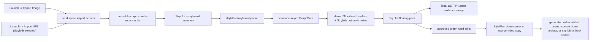

# Knowgrph Stryfork - PRD and TAD
## Document Map
This document makes Stryfork existing-repo-relevant. Stryfork is a product-level
story-fork workflow over the existing `strybldr` runtime, not a new runtime ID,
parser family, renderer, standalone harness, or generated-artifact stack.
The current repository already has the canonical implementation slice:
- Import images, renderer-selected URLs, or existing Strybldr Markdown through Launch and Source Files.
- Materialize neutral corpus source units and `.strybldr.md` storyboard documents.
- Derive timestamped video-frame thumbnails through the shared remote-video frame extraction route when a renderer-selected video URL reaches Strybldr.
- Parse those documents into semantic-keyed `GraphData` and render them on the shared Storyboard surface and Strybldr bottom timeline through `strybldr`.
- Let the Strybldr floating panel run local evidence analysis, edit cards, and compile a bounded generated-video, copied-source video, or explicit-fallback handoff artifact.
The E2E video-ingestion contract is Import URL -> parsing -> rendering -> shared transport review -> generation.
Operational rollout context follows Dev -> Prod -> Cloudflare. Concrete local
paths, account identifiers, and host routes are execution evidence for a
specific rollout, not reusable contract values. Runtime code, tests, fixtures,
and persisted documents must not hardcode them.
## Existing Repo Fit
Stryfork means: take a source artifact, preserve its provenance, derive editable storyboard structure, and produce an approved handoff from that structure. The repo-relevant MVP started image-backed because the implementation already supports image import, local image analysis, storyboard projection, and video handoff.
The renderer-selected Import URL path now enters through the same workspace import and corpus source-unit owners before creating a Strybldr document; URL/video-specific evidence is input data, not a second runtime. The Strybldr bottom timeline reuses the Animatic transport controls so parsed cards can be reviewed before explicit video generation.
The canonical runtime name remains `strybldr`. This document must not cause a
new `stryfork` renderer, parser, store field, toolbar branch, fixture, test
alias, or panel name. Video or URL story-forking must enter through the same
Source Files and queryable-corpus source-unit contracts before reaching the same
Strybldr graph projection.
## Legacy Neutralization
The prior Stryfork draft described a separate transcript extraction and standalone storyboard rendering pipeline. That is not the current repo shape and is removed from this contract.
The valid contract is:
- No separate harness outside the existing web app and workspace import owners.
- No source-specific fixture as an acceptance dependency.
- No generated sidecar JSON, SVG-frame, or HTML-player artifact family as the canonical output.
- No custom graph node type for storyboard panels. Strybldr uses ordinary graph nodes projected through the shared Storyboard model.
- No runtime aliases that remap stale names into the canonical `strybldr` implementation.
- No downstream patch that repairs imported or generated output after the fact.
  Source truth must be neutralized at import, parse, graph projection, or handoff
  ownership.
# Part I - Product Requirements Document
## Feature
Stryfork is the source-backed story-fork workflow for Knowgrph. In the current
repo it is implemented as the Strybldr source-to-storyboard path for imported
images and renderer-selected imported URLs.
## Problem
A solo builder can start from a reference image, URL, or existing video source, but turning it into a traceable storyboard and provider-ready video request usually requires manual object listing, prompt writing, provider-specific handoff, and untracked fallback notes.
This creates duplicate work and makes it hard to prove which source produced which storyboard card.
## Hypothesis

If Knowgrph reuses its existing import, source-unit, Strybldr, Storyboard, Animatic transport-control, semantic-key, and BytePlus owners, then an imported source can become an editable storyboard and bounded video handoff without a new backend, duplicate renderer, hardcoded source, stale fixture, or hidden paid call.

## Personas

| Persona | Job To Be Done | Constraint |
|---|---|---|
| Solo founder | Fork an imported source into a storyboard quickly. | Needs a small, local-first loop. |
| Creative operator | Inspect and correct cards before generation. | Needs editable evidence and provenance. |
| Knowgrph maintainer | Extend story workflows without runtime drift. | Needs shared owners and semantic-key reuse. |

## User Journey

| Stage | Action | Existing Touchpoint | Required Behavior |
|---|---|---|---|
| Trigger | User has a visual source, URL/video source, or existing Strybldr Markdown source. | Launch -> Import Image, Launch -> Import URL with Strybldr selected, or Launch -> Import local files | No hardcoded image, URL, path, or fixture. |
| Ingest | User imports image files, a renderer-selected URL, or an existing Strybldr Markdown file. | Source Files / URL import actions | Create corpus source units and a `.strybldr.md` document when needed; directly activate imported Strybldr Markdown when already present. |
| Project | Workspace applies the document. | Strybldr parser, Storyboard surface, frame extraction, and bottom timeline | Render source, storyboard, element lanes, frame thumbnails, and transport-scrubbable cards from graph state. |
| Analyse | User runs local analysis. | Strybldr floating panel | Use local DETR/Human evidence first; keep privacy guardrails. |
| Edit | User edits title, summary, action, prompt, and order. | Shared graph update path | Update graph card fields, not a detached prompt. |
| Handoff | User creates a video result. | BytePlus video owner, Strybldr source-video copy, and workspace FS | Write one structured handoff artifact with cost evidence; when BytePlus credentials are active, create a generated video artifact with `renderUrl` and `sourceUrl`; when provider credentials fail and source video evidence exists, create a copied-source video artifact instead of fallback. |
| Publish | Repo is mirrored and deployed. | Pages sync and Cloudflare deploy scripts | Do not claim Cloudflare success without a successful deploy. |

## User Stories And Acceptance Criteria

### PRD-SF-E01 - Source-Backed Import

As a Knowgrph user, I want an imported source to create one traceable storyboard
document so I can fork the source without a duplicate workspace.

Acceptance criteria:

- Given supported image files, when Launch -> Import Image runs, then workspace
  import creates corpus media source units with source-unit IDs, original names,
  MIME hints, byte sizes, source paths, and hashes.
- Given image source units exist, when the import commit finalizes, then one
  `.strybldr.md` document is created through the Strybldr feature owner and
  focused instead of a raw source file.
- Given Import URL runs with `strybldr` selected, when the imported URL document
  is committed, then one neutral URL corpus source unit is created and one
  `.strybldr.md` document is focused before the raw source document.
- Given a renderer-selected video URL reaches Strybldr, when graph cards are
  projected, then source, frame, and element cards expose a neutral
  `/__video_frame` thumbnail request at the derived timestamp and retain a
  provider-safe thumbnail fallback reference when available.
- Given Import local files selects an existing Strybldr Markdown document, when
  the import applies, then the imported file is focused, `Canvas View Mode`
  resolves to `2D Renderer: Strybldr`, and the Strybldr Run all consumer panel is
  mounted without a path-specific branch.
- `/goal`: imported images, renderer-selected URLs, and existing Strybldr
  Markdown files produce one applied Strybldr graph linked to source
  provenance, with no source-specific fixture or hardcoded file name.

### PRD-SF-E02 - Shared Storyboard Projection

As a creative operator, I want the story fork to appear as ordinary storyboard
cards so I can edit and connect it like other Knowgrph graph content.

Acceptance criteria:

- Given a `.strybldr.md` document, when the parser registry loads it, then the
  `strybldr-storyboard` parser wins before generic Markdown parsing.
- Given the parser emits graph data, when Strybldr mode renders, then it uses the shared Storyboard surface and bottom timeline, exposing Source, Storyboard, Elements, and transport-scrubbable card review.
- Given the bottom timeline mounts, when the user plays, pauses, changes rate, or scrubs, then Strybldr reuses `TimelineTransportControls` and `useTimelineTransportPlayback` from the Animatic transport path.
- Given graph metadata is emitted, when downstream caches inspect identity, then
  `graphSemanticKey` is derived through the shared semantic-key helper.
- `/goal`: Storyboard rendering works through existing graph and renderer owners,
  with no duplicate renderer surface or stale panel-node type.

### PRD-SF-E03 - Local Evidence First

As a solo founder, I want local evidence extraction before any paid service so
the base loop remains usable without cloud spend.

Acceptance criteria:

- Given a same-session imported image file, when local analysis runs, then DETR
  object detection emits element labels, confidence, normalized boxes, provider,
  and evidence kind.
- Given human geometry is requested, when analysis runs, then identity,
  descriptors, emotion, demographic, liveness, and embedding outputs remain
  disabled.
- Given analysis times out or finds no objects, when the panel handles the
  result, then existing source-backed fallback cards remain available without
  regenerating unrelated graph state.
- `/goal`: local evidence is additive and bounded; no paid call is required for
  Stryfork/Strybldr review.

### PRD-SF-E04 - Editable Approval Gate

As a creative operator, I want to revise storyboard cards before video handoff
so the approved graph is the source of truth.

Acceptance criteria:

- Given a selected card, when the user saves title, summary, action, prompt, or
  order changes, then the existing graph node is updated in place.
- Given a card has been edited, when the handoff is compiled, then card fields
  are read from current graph state.
- Given there are no approved cards, when Generate Video runs, then the panel
  blocks the handoff and shows a warning.
- `/goal`: no detached prompt cache, backfilled artifact, or downstream rewrite
  may override the graph card contract.

### PRD-SF-E05 - Bounded Video Handoff

As a user, I want one approved story fork to become one generated video request,
one copied-source video fork, or one structured fallback artifact only when no
playable source video exists.

Acceptance criteria:

- Given approved cards and BytePlus ModelArk is the active provider with active credentials, when Generate Video runs, then Strybldr reuses the existing BytePlus video task owner, passes only approved card text and references, waits for the bounded task polling window, downloads the generated video through the shared asset proxy, and writes a generated `strybldr-video-*.md` artifact with `status: generated`, `renderUrl`, `sourceUrl`, provider, model, elapsed time, paid-call count, cache-hit state, prompt, and approved cards.
- Given provider credentials are missing, inactive, or failing and the imported graph carries source video evidence, when Generate Video runs, then the workspace receives a non-fallback `strybldr-video-*.md` copied-source artifact with `status: copied`, `renderUrl`, `sourceUrl`, provider, elapsed time, zero paid-call count, cache-hit state, copy reason, prompt, and approved cards.
- Given provider credentials are missing, inactive, or failing and no playable source video evidence exists, when Generate Video runs, then the workspace receives a structured fallback Markdown artifact with provider, elapsed time, paid-call count, cache-hit state, prompt, approved cards, and error reason.
- `/goal`: the stricter Stryfork demo must be able to fork/clone/reverse-engineer the imported video into parsed, transport-reviewed, approved storyboard cards and recreate a new provider video when active credentials are available; fallback is only the explicit no-source-video or provider-failure branch.

### PRD-SF-E06 - Neutrality And Cleanup

As a maintainer, I want Stryfork to remove stale assumptions instead of layering
compatibility shims over them.

Acceptance criteria:

- Given renderer configuration, when `strybldr` is resolved, then it has no
  stale aliases and maps to the shared Storyboard surface.
- Given toolbar Run All dispatch runs, when the active renderer is `strybldr`,
  then it uses the same shared run event path as other eligible renderers.
- Given toolbar Run All is enabled for a renderer whose consumer lives in a
  floating panel, when the user clicks Run All, then the toolbar opens that
  shared panel owner before dispatching the run event.
- Given tests cover this feature, when they assert old names, duplicate fallback
  owners, or runtime remaps, then those assertions must be removed or retargeted
  to the canonical owner.
- `/goal`: no backfill, duplicate import branch, legacy remap, stale fixture, or
  local hardcode remains as part of the Stryfork contract.

## Scope

### Must

- Reuse Launch -> Import Image.
- Reuse Launch -> Import URL when `strybldr` is explicitly selected.
- Reuse workspace import actions and corpus media source units.
- Reuse Strybldr Markdown serialization and parsing.
- Reuse the shared Storyboard surface and Animatic transport-control path for `strybldr`.
- Reuse shared semantic-key helpers for graph identity.
- Reuse Strybldr floating panel card editing, local analysis, and video handoff.
- Reuse existing BytePlus video generation owner and structured fallback
  artifact writer.

### Should

- Keep same-session image files in the existing transient registry for local
  browser ML analysis.
- Preserve source-unit provenance on every source, frame, and element card.
- Keep local analysis bounded by timeout and batch-size guardrails.
- Keep deployment validation in the Dev -> Prod -> Cloudflare order.
- Do not claim generated-video E2E while the deployed BytePlus secret is inactive.

### Could

- Add richer video-source extraction only after video/transcript evidence
  remains a neutral corpus source-unit type.
- Add provider-neutral handoff adapters only after the BytePlus owner remains
  stable and the adapter boundary is shared.
- Add storyboard comparison only as a Storyboard-surface extension, not a new
  renderer.

### Won't

- Add a new backend service for Stryfork.
- Add a second parser, renderer, workspace, toolbar bridge, or graph identity
  helper.
- Store biometric identity, face descriptors, demographic inference, emotion
  labels, liveness scores, or embeddings.
- Hardcode a demo image, source URL, local path, provider key, route, or test
  fixture.
- Introduce runtime aliases for stale feature names.

## Success Metrics

| Metric | Baseline | Target | Validation |
|---|---:|---:|---|
| Source-to-storyboard path | Manual prompt writing | One Import Image or Strybldr Import URL run | Focused Strybldr and Import URL tests |
| Mandatory paid calls | Possible provider-first flow | 0 | Local-analysis and fallback tests |
| Renderer duplication | Risk of new surface | 0 new surfaces | Renderer registry test |
| Graph identity helpers | Risk of local hash logic | Shared helper only | Parser/metadata test |
| Video recreation | Fallback-only risk | Generated video artifact when credentials are active | BytePlus video task test and Strybldr generated-artifact E2E |
| Fallback observability | Hidden provider error | Structured Markdown artifact | Video handoff test |
| Deployment drift | Dev-only change | Dev -> Prod -> Cloudflare proof | Pages sync/deploy output |

# Part II - Technical Architecture Document

## Architecture Overview



No node in this flow is allowed to fork a project-specific, file-specific, or
provider-specific downstream repair path. If a new source kind is needed, it
must be normalized upstream as a corpus source unit before it reaches Strybldr.

## Component Inventory

| Component | Existing Owner | Responsibility |
|---|---|---|
| Launch image entry | `canvas/src/lib/toolbar/LaunchDropdown.impl.tsx` | Expose Import Image and pass files to the workspace bridge. |
| Launch URL entry | `canvas/src/lib/toolbar/LaunchDropdown.impl.tsx` and `canvas/src/lib/toolbar/ImportUrlRendererSelect.tsx` | Expose Import URL and the explicit Strybldr renderer selection. |
| Bridge retry | `canvas/src/lib/toolbar/launchImageImportBridge.ts` | Open Workspace when needed and retry the import bridge before warning. |
| Workspace import | `canvas/src/features/markdown-workspace/useWorkspaceFileActions/importActions.ts` and `canvas/src/features/markdown-workspace/workspaceImport/urlImport.ts` | Import image files, renderer-selected URLs, or existing Strybldr Markdown, register source units, create Strybldr Markdown when needed, focus/apply graph, switch to Strybldr. |
| URL content import | `canvas/src/features/markdown-workspace/workspaceImport/urlContent.ts` and `youtubeEntryText.ts` | Convert URL evidence into workspace Markdown while preserving source URL metadata and media kind. |
| Video frame extraction | `canvas/src/lib/rich-media/server/videoFrameServer.ts`, `cloudflare/pages/video-frame.mjs`, `knowgrph_parser/video_frame_cmd.py`, and `grph-shared/src/rich-media/providers.ts` | Resolve a supported remote video stream with yt-dlp, extract a single PNG/JPEG frame with FFmpeg, cache it under the publish mirror image root, serve it in Dev through `/__video_frame`, and serve the matching pre-generated static frame on Cloudflare without edge FFmpeg work. |
| Image registry | `canvas/src/features/strybldr/strybldrImageFileRegistry.ts` | Keep same-session `File` handles for local browser analysis. |
| Strybldr document owner | `canvas/src/features/strybldr/strybldrStoryboard.ts` | Build, serialize, parse, project, merge, and hand off Strybldr storyboard data. |
| Strybldr import surface | `canvas/src/features/strybldr/strybldrImportSurface.ts` | Detect Strybldr graph/text imports and mount the canonical Strybldr renderer plus floating-panel Run all consumer. |
| Strybldr types | `canvas/src/features/strybldr/strybldrTypes.ts` | Define source, element, evidence, and handoff contracts. |
| Local vision | `canvas/src/features/strybldr/strybldrLocalVision.ts` | Run local DETR and privacy-safe Human geometry analysis. |
| Parser registry | `canvas/src/features/strybldr/parserSpecs.ts` and `canvas/src/features/parsers/default.ts` | Register Strybldr parsing before generic Markdown. |
| Renderer registry | `canvas/src/lib/config.render.ts` | Keep `strybldr` as a renderer that reuses the Storyboard surface and has no aliases. |
| Storyboard model and timeline | `canvas/src/components/StoryboardCanvas/storyboardModel.ts` and `storyboardTimeline.ts` | Render lanes/cards from graph data and derive neutral timeline items through shared semantic-keyed board logic. |
| Shared timeline transport | `canvas/src/components/timeline/TimelineTransportControls.tsx` and `timelineTransport.ts` | Own play/pause, rate, slider, clamping, and animation-frame playback shared with Animatic. |
| Strybldr timeline panel | `canvas/src/features/strybldr/StrybldrTimelineBottomPanel.tsx` | Mount the bottom panel, derive timeline items from Storyboard cards, and select cards without starting generation. |
| Semantic identity | `canvas/src/lib/graph/semanticKey.ts` | Build graph semantic keys for caches and runtime derivations. |
| Floating panel | `canvas/src/features/strybldr/StrybldrFloatingPanelView.tsx` | Run local analysis, edit cards, consume Run All, and create generated, copied-source, or fallback artifacts. |
| Video task owner | `canvas/src/features/chat/byteplusRunGeneration.ts` | Submit bounded BytePlus video tasks when configured. |
| Regression tests | `canvas/src/__tests__/strybldr.test.ts` | Guard parsing, renderer ownership, import wiring, copied-source video handoff, provider generation reachability, fallback, and privacy constraints. |

## Data Contracts

### Strybldr Markdown

Strybldr Markdown is the only canonical file artifact for the current Stryfork
workflow.

Required frontmatter:

```yaml
kgStrybldrStoryboard: true
kgCanvasRenderMode: "2d"
kgCanvas2dRenderer: "strybldr"
strybldrRunId: "<stable-run-id>"
```

Required body payload:

````text
```json strybldr-storyboard
{
  "version": 1,
  "runId": "...",
  "createdAtMs": 0,
  "sources": [],
  "elements": []
}
```
````

The parser must reject malformed payloads by returning an empty Strybldr graph
with a warning instead of invoking a fallback parser that would create unrelated
Markdown graph state.

### Source Contract

Each `StrybldrSource` must preserve:

- `sourceUnitId`
- `workspacePath`
- `relativePath`
- `originalName`
- `mediaKind`
- `mimeHint`
- `byteSize`
- `textHash`
- optional `mediaUrl`
- derived frame thumbnail evidence for supported remote video sources, using a
  semantic-keyed `/__video_frame` request and a provider-safe thumbnail fallback
  when available

Source identity is derived from source-unit and workspace metadata. It must not
depend on a specific file path, visible file name, local absolute root, demo
image, or demo URL.

### Element Contract

Each `StrybldrElement` must preserve:

- `id`
- `sourceUnitId`
- `label`
- `confidence`
- optional `sourceBox`
- `evidenceKind`
- `provider`
- `order`
- optional `summary`, `action`, and `prompt`

Allowed `evidenceKind` values are `source-metadata`, `local-object-detection`,
`local-human-geometry`, `modelark-visual-grounding`, and `user-edit`.

Allowed provider values are `fallback`, `transformers-detr`, `human`, and
`byteplus-modelark`.

### Graph Projection

The Strybldr graph projection must use the existing node types:

| Node Type | Lane | Source |
|---|---|---|
| `StrybldrImageSource` | Source | Corpus source unit metadata |
| `StoryboardFrame` | Storyboard | Per-source frame card |
| `StoryboardElement` | Elements | Fallback, local evidence, grounding evidence, or user edit |

Required graph metadata:

- `kind: "strybldr-storyboard"`
- `parserId: "strybldr-storyboard"`
- `strybldrRunId`
- `sourcesCount`
- `elementsCount`
- `kgCanvasRenderMode: "2d"`
- `kgCanvas2dRenderer: "strybldr"`
- `graphSemanticKey`

`graphSemanticKey` must be built through
`buildScopedGraphSemanticKey("strybldr-storyboard", { graphData })`.

Timeline position is derived from the shared Storyboard board via `buildStoryboardTimelineItems`; the bottom panel may select graph cards for review, but it must not compile prompts, call providers, or write handoff files.

### Handoff Contract

The video handoff must be compiled from current graph cards only. It must include
card IDs, lanes, titles, summaries, actions, prompts, references, order, and
source-unit IDs. The compiled prompt must instruct the provider to use only the
approved card fields and references.

Generated video Markdown, copied-source Markdown, and fallback Markdown share the same handoff shape. Generated video Markdown must include `status: generated`, `renderUrl`, and `sourceUrl`; copied-source Markdown must include `status: copied`, `renderUrl`, `sourceUrl`, and `copyReason`; fallback Markdown must include a non-empty `errorReason`.

Handoff Markdown must include `kgStrybldrVideoHandoff: true`, `status`, `provider`, optional `model`, `elapsedMs`, `paidCallCount`, `cacheHit`, optional `renderUrl`, optional `sourceUrl`, optional `copyReason`, optional `errorReason`, compiled prompt, and approved cards JSON.

## Validation Plan

Run focused tests first:

```bash
npm --prefix canvas run test:ci:unit -- strybldr
npm --prefix canvas run test:ci:unit -- workspace.importUrl.youtube.strybldrStoryboard
npm --prefix canvas run test:ci:unit -- youtube
KNOWGRPH_FORBID_HARDCODE_INPUT="/path/to/demo.md" npm --prefix canvas run test:ci:unit -- policy.forbidHardcodedYouTubeUrlLiteral
```

Run changed-file hygiene:

```bash
npm run hygiene:check
```

Run type checking when code changes accompany this document:

```bash
npm --prefix canvas exec tsc -- -p canvas/tsconfig.json --noEmit --pretty false
```

Before Cloudflare reporting, keep the deployment chain explicit:

```bash
npm run pages:build
npm run pages:sync
npm run pages:check-sync
```

Only claim Cloudflare deployment after the deploy command succeeds with the
intended account and project:

```bash
npm run pages:deploy-cloudflare
```

## Validation Evidence

Current evidence for this implementation contract after the Import
URL-to-Strybldr enhancement:

| Stage | Command | Result | Notes |
|---|---|---|---|
| Dev URL-to-Strybldr regression | `npm --prefix canvas run test:ci:unit -- workspace.importUrl.youtube.strybldrStoryboard` | Passed: 1/1 | Proves renderer-selected Import URL writes a neutral URL corpus source unit, focuses the generated `.strybldr.md` graph document, and produces a runnable Run All handoff prompt. |
| Dev URL-to-Strybldr frame extraction regression | `npm --prefix canvas run test:ci:unit -- workspace.importUrl.youtube.strybldrStoryboard` | Passed: 1/1 | Proves renderer-selected YouTube Import URL derives `/__video_frame` image evidence from neutral source URL metadata while retaining the normal YouTube thumbnail as a provider-safe fallback. |
| Dev local Strybldr Markdown import regression | `KNOWGRPH_STRYFORK_DEMO_INPUT=... npm --prefix canvas run test:ci:unit -- workspace.import.localFiles.strybldrRunnableRunAllSurface` | Passed: 1/1 | Uses an external validation file path to prove local import focuses the document, activates `2D Renderer: Strybldr`, mounts the Run all consumer, exposes Source/Elements lanes, derives frame-extraction references, and compiles a handoff prompt without embedding the URL or local path in repo code. |
| Dev real frame extraction command | `python3 -m knowgrph_parser video-frame --emit json --url <external-demo-url> --time 0 --format png --output ../huijoohwee/image/knowgrph/video-frame/frame-c0a158fe-t0.png --timeout-s 180` | Passed | Produced a PNG frame through yt-dlp plus FFmpeg fallback at `/image/knowgrph/video-frame/frame-c0a158fe-t0.png`; the demo URL remains external validation input, not a repo-code literal. |
| Dev Strybldr regression | `npm --prefix canvas run test:ci:unit -- strybldr` | Passed: 9/9 | Covers parser, renderer registry, Import Image wiring, Import URL wiring, local Strybldr Markdown import activation, provider-backed recreation reachability, bounded external-provider fallback, Source Files refresh, and privacy guard. |
| Dev Animatic/Strybldr transport source contract | focused source-contract import of `animaticCanvasSourceContract.test.ts` and `strybldr.test.ts` | Passed | Proves Strybldr mounts `StrybldrTimelineBottomPanel`, reuses `TimelineTransportControls` and `useTimelineTransportPlayback`, and keeps Storyboard timeline projection in a shared helper. |
| Dev YouTube/import regression | `KNOWGRPH_FORBID_HARDCODE_INPUT=... npm --prefix canvas run test:ci:unit -- youtube` | Passed: 14/14 | Covers dynamic hardcode validation input, YouTube import, preview behavior, and URL-to-Strybldr creation. |
| Dev toolbar Run All regression | `npm --prefix canvas run test:ci:unit -- toolbar.workspaceSelect.visibleWhenCollapsed` | Passed: 1/1 | Covers shared Run All readiness plus renderer-owned panel activation before dispatch. |
| Dev renderer preset regression | `npm --prefix canvas run test:ci:unit -- workspaceImport.urlImport.rendererSelectionDocumentMode` and `npm --prefix canvas run test:ci:unit -- workspaceImport.urlImport.htmlRendererPresetsFetch` | Passed: 2/2 | Covers the expanded Import URL renderer selection and canvas frontmatter presets. |
| Dev type check | `npm --prefix canvas run typecheck` | Passed | Required because this contract points at active TypeScript owners. |
| Browser E2E runnable URL path | `KNOWGRPH_APP_URL=http://127.0.0.1:5175/ KNOWGRPH_E2E_CHROME_EXECUTABLE=... KNOWGRPH_E2E_HEADLESS=1 KNOWGRPH_STRYFORK_DEMO_INPUT=... npm --prefix canvas run validate:stryfork-generated-video` | Passed | Fresh import showed Strybldr Source/Elements lanes and toolbar Run All wrote a new fallback handoff with 4 cards and 16 references, including `/__video_frame` plus `ytimg` fallback references. |
| Dev frame endpoint | `GET http://127.0.0.1:5175/__video_frame?...time=0&format=png` and `GET ...&emit=json` | Passed | Returned a 640x360 PNG and JSON with `publicUrl: /image/knowgrph/video-frame/frame-c0a158fe-t0.png`, `bytes: 327598`, and `cached: true`. |
| Cloudflare frame endpoint | `GET https://airvio.co/__video_frame?...time=0&format=png&emit=json` and image GET | Passed | Live Pages Function maps the shared semantic frame request to the pre-generated static asset, returns `bytes: 327598`, and serves a 640x360 PNG from `airvio.co`. |
| Prod sync and deploy | `npm run pages:build-sync`, `npm run pages:functions:build`, `npx wrangler pages deploy ../huijoohwee --project-name=joohwee --branch=main --commit-dirty=true`, `npm run pages:check-sync` | Passed | Published to Cloudflare Pages preview `https://eb61e7a9.joohwee.pages.dev` and custom domain `https://airvio.co/knowgrph/`; publish sync is current. |
| Live generated-video credential gate | `GET https://airvio.co/__chat_proxy/api/v3/models` with `X-KG-Chat-Provider: byteplus-modelark` | Blocked: BytePlus `401 AuthenticationError` | Cloudflare Pages has `KNOWGRPH_CHAT_PROXY_BYTEPLUS_API_KEY`, but the upstream reports the API key status is not active. Rotate this secret or use BYOK before claiming generated-video E2E. |

## Test Coverage Matrix

| Requirement | Test Owner | Expected Guard |
|---|---|---|
| Strybldr Markdown parses to graph | `canvas/src/__tests__/strybldr.test.ts` | Parser ID, renderer metadata, source-unit provenance, semantic key, Storyboard lanes. |
| Renderer reuses shared surface | `canvas/src/__tests__/strybldr.test.ts` | `strybldr` resolves canonically, has no aliases, maps to Storyboard, supports Run All. |
| Strybldr reuses Animatic transport controls | `canvas/src/__tests__/strybldr.test.ts` and `animaticCanvasSourceContract.test.ts` | Bottom panel mounts from CanvasViewport, uses shared transport controls/playback, and avoids a local range slider duplicate. |
| Import Image wiring | `canvas/src/__tests__/strybldr.test.ts` | Launch, bridge retry, workspace action bridge, import action, floating panel, and Run All wiring. |
| Import URL Strybldr wiring | `canvas/src/__tests__/workspaceImportUrlStubNoFetch.test.ts` | Strybldr-selected YouTube import creates a source Markdown document, a video corpus source unit, and a focused `.strybldr.md` document. |
| Import local Strybldr Markdown wiring | `canvas/src/__tests__/workspaceImportLocal.test.ts` | External-input Strybldr Markdown imports as a focused runnable graph with Strybldr panel and Run all handoff readiness. |
| Frame extraction evidence | `canvas/src/__tests__/workspaceImportUrlStubNoFetch.test.ts`, `canvas/src/__tests__/workspaceImportLocal.test.ts`, and `canvas/src/__tests__/videoFramePreview.test.ts` | Strybldr graph cards carry semantic `/__video_frame` references, keep provider-safe thumbnail fallback evidence, and use neutral frame cache names. |
| Hardcode guard | `canvas/src/__tests__/youtubeImportAction.test.ts` | External validation input URLs and YouTube IDs are forbidden in the repo source tree. |
| Video fallback | `canvas/src/__tests__/strybldr.test.ts` | Handoff reads edited graph cards and writes structured fallback cost evidence. |
| Provider-backed video recreation | `canvas/src/__tests__/strybldr.test.ts` and `canvas/src/__tests__/byteplusRunGeneration.test.ts` | Strybldr waits for the BytePlus bounded polling window, and BytePlus video task polling downloads a generated MP4 through the shared asset proxy. |
| Privacy guard | `canvas/src/__tests__/strybldr.test.ts` | Local vision uses DETR/Human and disables identity-sensitive Human features. |

## ADRs

### ADR-001 - Stryfork Reuses Strybldr Runtime

Decision: Stryfork remains a document-level product contract. Runtime work uses
the canonical `strybldr` owners.

Rationale: The repo already has import, parsing, rendering, local analysis,
editing, and handoff owners. Adding a second runtime name would create churn,
alias pressure, and duplicate tests.

### ADR-002 - Storyboard Surface Is Shared

Decision: `strybldr` remains a `Canvas2dRendererId` that maps to the Storyboard surface and uses the shared Animatic transport-control path for bottom timeline review.

Rationale: The shared Storyboard model already converts graph cards into lanes. Stryfork requirements are card, provenance, and timeline-review requirements, not a new rendering or playback surface.

### ADR-003 - Shared Semantic Key Is Mandatory

Decision: Graph identity and cache identity must use
`buildScopedGraphSemanticKey`.

Rationale: Local hash helpers would create stale cache behavior, recomputation,
and cross-surface drift.

### ADR-004 - Local Evidence First, Paid Provider After Approval

Decision: Local detection and privacy-safe geometry are review aids. Paid video
generation only happens through the existing BytePlus owner after approved graph
cards exist, and the Strybldr panel must allow the full bounded BytePlus task
polling window before falling back.

Rationale: This keeps the base workflow TCO-zero and makes paid calls visible.

### ADR-005 - URL And Video Forking Enters Upstream

Decision: URL or video story forking must first become a neutral Source
Files/queryable-corpus source-unit path, then reuse the same Strybldr graph and
handoff contracts.

Rationale: A parallel extraction pipeline would bypass the current import,
provenance, parser, renderer, and semantic-key owners.

## Cleanup And Hardcode Guardrails

- Do not add fixture-only source names to runtime code.
- Do not add local absolute paths to tests, bundle config, graph metadata, or
  workspace artifacts.
- Do not add renderer aliases for stale names.
- Do not make the parser remap stale document kinds into Strybldr.
- Do not write provider-specific prompt schema into Storyboard rendering.
- Do not add a Strybldr-only playhead, range slider, rate list, or playback loop.
- Do not repair imported output after rendering; fix the owner that generated
  the wrong source, graph, or handoff shape.
- Do not recompute graph projection on unrelated text, layout, viewport, or
  panel-open state changes.
- Do not preserve tests that assert stale architecture; retarget them to the
  canonical owner or remove them.

## Implementation Backlog

### Current Contract

- Keep this document aligned with `docs/documents/knowgrph-strybldr-prd-tad.md`.
- Keep Stryfork acceptance criteria tied to existing Strybldr tests.
- Keep Dev -> Prod -> Cloudflare validation evidence separate from runtime code.

### Future Extensions

- Add video-source source units only through shared import and corpus owners.
- Add transcript-derived elements only after transcript evidence has neutral
  source-unit provenance.
- Add provider-neutral handoff adapters only as shared handoff owner extensions.
- Add compare/diff workflows only as Storyboard surface features.

## Implementation Checklist

- [x] Prior standalone pipeline assumptions removed from this PRD/TAD.
- [x] Runtime identity constrained to canonical `strybldr` owners.
- [x] Parser, renderer, import, local-analysis, and handoff owners named.
- [x] Semantic-key helper reuse made mandatory.
- [x] Hardcoded source/fixture/path/provider assumptions forbidden.
- [x] Focused test command identified.
- [x] Dev validation run recorded.
- [x] Prod mirror sync recorded.
- [x] Cloudflare deployment or credential blocker recorded.
- [x] Provider-backed video recreation remains reachable in the shared Strybldr owner instead of timing out before BytePlus can finish.
- [x] Strybldr timeline review reuses the Animatic transport-control path.
- [ ] Live generated-video E2E completed with active BytePlus credentials.
