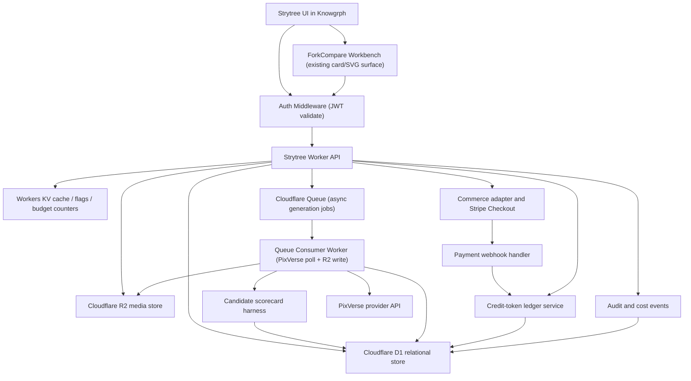
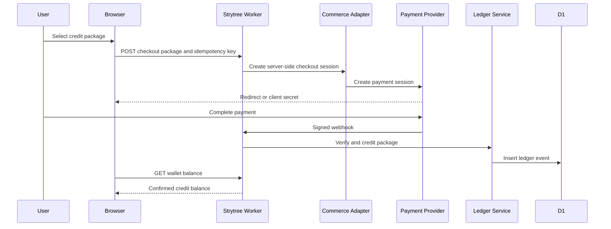
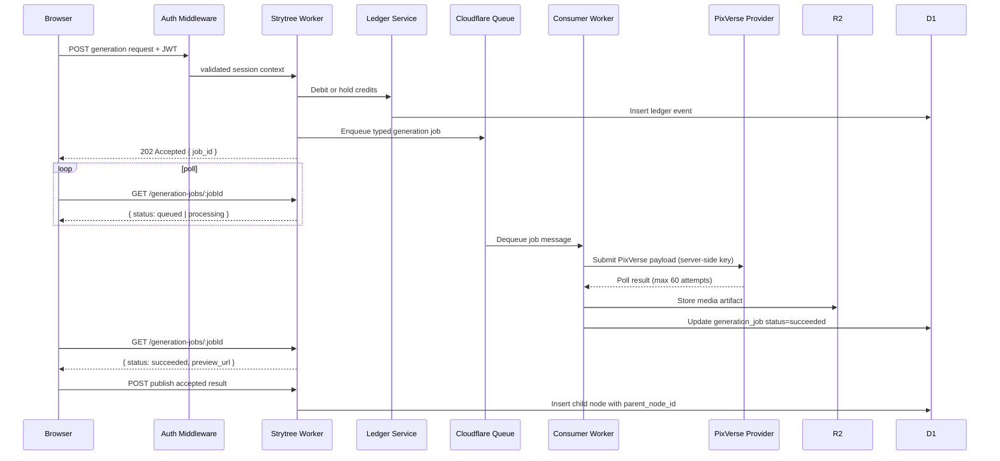
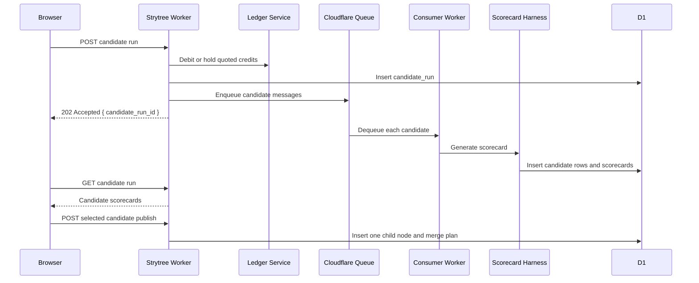
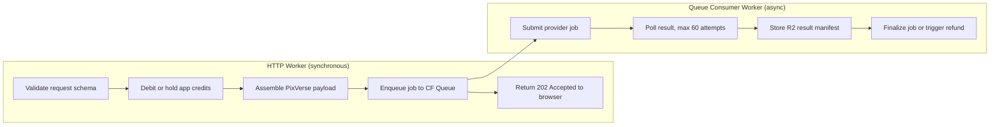
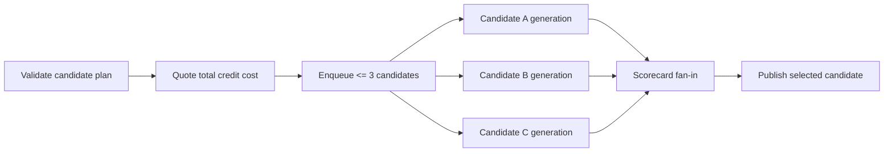

# Knowgrph Strytree Storytree - PRD and TAD

## Document Map

This combined PRD/TAD follows `guidelines/prd-tad-guidelines.md` (repo root of `huijoohwee.github.io`).

The document has two jobs:

1. Record what the observed Strytree prototype actually does without retaining the prototype URL in this repo.
2. Define the production Knowgrph contract for a Strytree-style interactive storytree with real access control, persistence, wallet/credit-token accounting, payment settlement, graph rendering, and PixVerse generation harnessing.

The observed page is a static edge-hosted HTML/CSS/vanilla-JS app. It has convincing UI behavior but no real auth, no database, no durable wallet, no real payment settlement, and no active PixVerse generation in the live configuration. This PRD/TAD preserves the useful product pattern while replacing mock client state with server-owned ledgers and auditable data flows.

---

# Part A - Source Analysis

## A1. Observed Strytree Prototype

> **Historical source analysis only.** Part A records observed prototype behavior as historical source analysis only. It is NOT the target implementation contract; the runtime edge contract is defined in the frontmatter `kgSharedRendererContract` + `flow.storyEdgeProjection` and in Part C "Edge Rendering Contract".

### Delivery Shape

| Area | Observed Implementation |
|---|---|
| Hosting | Third-party static edge hosting |
| App shell | One standalone static HTML artifact |
| Framework | None detected; plain HTML, CSS, and vanilla JavaScript |
| Graph rendering | SVG story tree with HTML cards embedded through `foreignObject` |
| Decorative canvas | One fixed `<canvas id="starfield">` for background stars only |
| State | In-memory JavaScript object `S` |
| Persistence | None; reload resets changes |
| Auth | None |
| Payment | Mocked client-side unlock toast |
| Credit tokens | Mocked client-side integer counter |
| PixVerse | API path scaffolded but `DEMO_MODE: true` and empty API key |

### Prototype State Object

The page keeps runtime state in one browser object:

```js
S = {
  nodes,
  tokenBalance,
  unlockedNodes,
  likedNodes,
  currentPage,
  selectedNodeId,
  modalParentId,
  modalPhase,
  modalResult,
  modalPrompt,
  modalSelectedChars,
  modalSelectedScene,
  treeTransform,
  treePositions
}
```

This is the entire "database" for active user behavior. It is not persisted to disk, storage, or a backend.

### Prototype Node Shape

Each story branch is a node:

```js
{
  nodeId,
  parentId,
  storyId,
  title,
  synopsis,
  prompt,
  authorId,
  authorName,
  duration,
  ageDays,
  isFreeWindow,
  unlockPrice,
  likes,
  impressions,
  paidUnlocks,
  isProtected,
  status,
  videoUrl,
  ownAssetIds
}
```

Edges are not stored independently. The prototype derives an edge when a node has a `parentId`.

### Prototype Access Behavior

Access is a display check:

```js
isUnlocked = node.isFreeWindow || S.unlockedNodes.has(nodeId)
```

If unlocked, the panel shows the branch video. If locked, it shows a blurred preview and an unlock button. There is no identity proof, entitlement record, server validation, or persistence.

### Prototype Credit-Token Behavior

Generation starts with:

```js
tokenBalance: 100
```

Each generation request requires 5 credit tokens:

```js
if (S.tokenBalance < 5) reject
S.tokenBalance -= 5
```

On generation failure, the prototype refunds the in-memory counter:

```js
S.tokenBalance += 5
```

This is not a ledger. It can be edited in DevTools and disappears on reload.

### Prototype Unlock Payment Behavior

Unlocking a locked branch calls:

```js
S.unlockedNodes.add(nodeId)
toast("paid mock: creator CNY 1.5, platform CNY 0.4")
```

No payment processor is called. No creator balance is credited. No platform fee is booked. `paidUnlocks` is not durably incremented.

### Prototype PixVerse Behavior

The live configuration has:

```js
PIXVERSE_API_KEY: ""
DEMO_MODE: true
PIXVERSE_BASE: "https://app-api.pixverse.ai"
```

The code includes a real generation path for `/openapi/v2/video/fusion/generate` and polling through `/openapi/v2/video/result/{video_id}`, but the live page falls back to preset demo results because demo mode is enabled and the API key is empty.

### Prototype Calculation Engine

| Calculation | Prototype Rule |
|---|---|
| Active branch count | `nodes where status !== "dropped"` |
| Total likes | Sum of all `node.likes` |
| Like rate | `likes / impressions * 100`, one decimal, or `-` |
| Hot node color | `likes > 100` |
| Dropped node color | `status === "dropped"` |
| Locked state | Special `node_locked` id or not free and no video |
| Edge existence | `parentId` exists (historical prototype only) |
| Edge shape | SVG cubic Bezier from parent card right edge to child card left edge (historical prototype only) |
| Layout x | `depth * 240 + 80` |
| Layout y | Center parent over recursive subtree leaf height with `Y_GAP = 130` |
| Zoom | SVG root group `scale(k)`, clamped from `0.3` to `2` |

The observed logic is a deterministic recursive tree layout, not a graph database, graph algorithm library, canvas engine, or physics simulation.

---

# Part B - Product Requirements Document

## B1. Problem Statement

Interactive AI video storytelling needs more than a polished graph UI. A user must be able to enter a story universe, fork a branch, spend credits to generate media, unlock paid branches, and trust that every entitlement, creator credit, and platform fee is recorded durably.

The Strytree prototype proves the interaction model: a visual story tree, branch cards, inherited visual assets, token-gated generation, and paid unlock affordances. The production gap is that all sensitive state is client-side mock state.

Knowgrph can turn this pattern into a reliable product slice by preserving the min-viable graph UX while moving identity, persistence, wallet, payment, generation, and access decisions behind server-owned contracts.

## B2. Falsifiable Hypothesis

If Knowgrph implements a Strytree-style storytree with:

- server-owned story graph persistence,
- durable anonymous-to-authenticated user access,
- an append-only credit-token ledger,
- webhook-confirmed token purchases,
- transactional branch unlocks,
- PixVerse calls behind a harness boundary,
- and client-side SVG rendering fed by signed graph snapshots,

then users can co-create and monetize story branches without trusting mutable browser state, while Knowgrph keeps the MVP within a low-TCO Cloudflare topology.

## B3. Personas

| Persona | Job To Be Done | Constraint |
|---|---|---|
| Viewer | Browse a story universe and preview branches. | Should not need an account for public/free synopsis access. |
| Co-creator | Fork a branch and generate a new video continuation. | Needs clear credit-token cost, retry/refund handling, and publish confirmation. |
| Paying fan | Unlock a protected branch. | Needs durable entitlement after reload and across devices. |
| Creator | Earn from unlocks of protected branches. | Needs auditable split and payout-ready ledger entries. |
| Knowgrph operator | Run the system cheaply and safely. | Needs server-side keys, low egress, traceable jobs, and bounded provider spend. |

## B4. User Journey

| Stage | Action | Touchpoint | Pain Point | Opportunity |
|---|---|---|---|---|
| Trigger | User sees a story universe. | Strytree home or Knowgrph MainPanel entry | Static demos do not retain engagement. | Show living branch count and hot branches from database stats. |
| Discover | User opens the story tree. | SVG storytree canvas | Dense branches can be hard to scan. | Compute deterministic layout and status coloring from graph state. |
| Preview | User selects a branch. | Node panel | Full video may be protected. | Always show free synopsis and entitlement-aware preview. |
| Commit | User chooses to generate or unlock. | Generate modal or unlock button | Users need cost clarity before spending. | Quote credit-token or currency cost before server commit. |
| Generate | User writes a continuation. | PixVerse harness modal | Provider calls are slow and paid. | Debit/hold credits transactionally and refund on failed provider job. |
| Publish | User accepts generated result. | Storytree update | New branch must survive reload and sync. | Persist node, media artifact, and parent edge in one server transaction. |
| Return | User revisits later. | Same account/session | Client-only unlocks vanish. | Durable entitlement and wallet ledger restore state. |

## B5. Product Epics And Acceptance Criteria

### PRD-STR-E01 - Access And Identity

As a viewer, I want to browse public story trees without friction, so that discovery is instant.

As a co-creator or payer, I want a durable identity/session, so that unlocks, purchases, and generated branches remain mine after reload.

**PRD-STR-E01-AC-01** — Anonymous public browsing
Given an unauthenticated visitor, when they open a public story, then they can view public metadata, free synopsis, visible branch topology, and free-window videos without creating an account.

> **`/goal` translation**: `anonymous-access tests pass: public story snapshot returns nodes, synopsis, and free-window video URLs without a session cookie; no 401 or redirect is returned`

**PRD-STR-E01-AC-02** — Value-gated action enforcement
Given a visitor attempts to generate, purchase credits, unlock a branch, or publish a branch, when the action is submitted, then the server requires a durable session or authenticated user before spending or granting value.

> **`/goal` translation**: `auth-gate tests pass: generation, checkout, unlock, and publish endpoints return 401 when called without a valid session token; no ledger event or entitlement is created`

**PRD-STR-E01-AC-03** — Anonymous-to-authenticated account linking
Given an anonymous user later authenticates, when account linking succeeds, then eligible anonymous session entitlements and ledger entries are attached to the durable user without duplication.

> **`/goal` translation**: `account-linking tests pass: entitlement count for the durable user after linking equals the anonymous session count and no duplicate ledger events exist`

### PRD-STR-E02 - Persistent Story Graph

As a co-creator, I want a generated branch to become a durable child of the selected node, so that the story tree is shared and reload-safe.

**PRD-STR-E02-AC-01** — Server-fed graph snapshot
Given a story has nodes, when the client fetches the tree, then the API returns a signed graph snapshot with nodes, parent ids, aggregate stats, asset references, and entitlement hints.

> **`/goal` translation**: `snapshot-api tests pass: GET /api/strytree/stories/:id/tree returns all D1-backed nodes with parent_node_id, entitlement_hint, stats, and a snapshot version field`

**PRD-STR-E02-AC-02** — Durable branch publish
Given a branch is published, when the server accepts it, then a node row is inserted with `parent_node_id`, media artifact references, creator id, status, and audit timestamps.

> **`/goal` translation**: `publish tests pass: child node exists in D1 after publish call; reload of the snapshot returns the child node without any client-only state`

**PRD-STR-E02-AC-03** — Edge derivation from parent_node_id
Given a node has `parent_node_id`, when the graph is rendered, then the client derives one edge from the parent to child without needing a separate edge table.

> **`/goal` translation**: `graph-render unit tests pass: edge list derived from nodes with non-null parent_node_id exactly matches expected parent-child pairs; no edge table query is made`

The derived edge SHALL be projected through `kgSharedRendererContract@shared-renderer-contract/v1` using `buildScopedGraphSemanticKey` for identity and the `flow` port/handle/`socket_types` model for typing; local/downstream patches, alias stacking, and hardcoded edge logic are forbidden.

### PRD-STR-E03 - Credit-Token Wallet

As a co-creator, I want generation cost to be debited fairly and refunded on failure, so that paid provider errors do not consume my credits.

**PRD-STR-E03-AC-01** — Pre-call debit or hold
Given a user has a wallet balance, when generation starts, then the server creates an idempotent ledger debit or hold before calling the provider.

> **`/goal` translation**: `ledger-debit tests pass: a ledger event of type generation_debit exists in D1 before any PixVerse API call is initiated; no provider call is made when ledger insert fails`

**PRD-STR-E03-AC-02** — Success finalization
Given the provider succeeds, when the generated result is attached, then the hold is finalized or the debit remains committed.

> **`/goal` translation**: `ledger-finalize tests pass: generation_job.status is succeeded and no refund event exists in the ledger after a simulated provider success`

**PRD-STR-E03-AC-03** — Failure refund
Given the provider fails or times out before a usable artifact is produced, when the job closes, then the server records a refund event tied to the original debit or hold.

> **`/goal` translation**: `ledger-refund tests pass: a refund_credit ledger event linked to the original generation_debit exists after a simulated provider failure; user balance_after reflects the refund`

**PRD-STR-E03-AC-04** — Idempotent debit
Given two identical client submissions arrive, when idempotency keys match, then the ledger applies only one debit.

> **`/goal` translation**: `idempotency tests pass: submitting the same generation request twice with the same idempotency_key produces exactly one ledger event and one generation_job row`

### PRD-STR-E04 - Payment-To-Credit Purchase

As a paying user, I want to buy credits through a trusted payment flow, so that my balance is credited only after confirmed payment.

**PRD-STR-E04-AC-01** — Server-side checkout session
Given a user selects a credit package, when checkout begins, then the Worker creates a server-side checkout or payment session with package id, user id, and idempotency metadata.

> **`/goal` translation**: `checkout tests pass: POST /api/strytree/checkout/sessions returns a provider session id and redirect_url; no ledger event exists at session creation time`

**PRD-STR-E04-AC-02** — Webhook-confirmed wallet credit
Given the payment provider sends a success webhook, when the webhook signature and payment status are verified, then the server credits the user's wallet through an append-only ledger event.

> **`/goal` translation**: `webhook-credit tests pass: replaying a valid signed webhook fixture inserts exactly one purchase_credit ledger event; user balance increases by the package credit amount`

**PRD-STR-E04-AC-03** — Pending state before webhook
Given the browser returns to the success page before webhook fulfillment, when the wallet is queried, then the UI shows pending status until the server ledger confirms credit.

> **`/goal` translation**: `wallet-pending tests pass: GET /api/strytree/wallet returns pending_payment status when a checkout session exists but no ledger credit event has been written`

**PRD-STR-E04-AC-04** — Idempotent webhook replay
Given a webhook is replayed, when the event id already exists, then no duplicate credits are issued.

> **`/goal` translation**: `replay tests pass: sending the same webhook payload twice results in exactly one ledger event and one credit increment; second replay returns 200 without writing a second row`

### PRD-STR-E05 - Branch Unlock And Creator Split

As a paying fan, I want to unlock protected branches once, so that I can return to them later.

As a creator, I want unlock revenue to be attributable, so that creator earnings can be audited.

**PRD-STR-E05-AC-01** — Transactional unlock with split
Given a protected branch has an unlock price, when an eligible user confirms unlock, then the server transaction records wallet debit, entitlement grant, creator credit, platform fee, and idempotency key.

> **`/goal` translation**: `unlock tests pass: POST /api/strytree/nodes/:nodeId/unlock writes one strytree_unlocks row, one wallet debit ledger event, one creator_credit metadata entry, and one platform_fee metadata entry in a single D1 transaction`

**PRD-STR-E05-AC-02** — Idempotent re-unlock
Given a user has already unlocked a branch, when they open it again, then the server returns entitlement as true without charging again.

> **`/goal` translation**: `re-unlock tests pass: a second unlock request for the same user-node pair returns entitlement: full and no new ledger debit event`

**PRD-STR-E05-AC-03** — Insufficient balance rejection
Given insufficient balance, when unlock is requested, then no entitlement or creator credit is created and the API returns a typed insufficient-balance error.

> **`/goal` translation**: `insufficient-balance tests pass: unlock request when balance < unlock_price_credits returns 402 with error code insufficient_balance and no strytree_unlocks or ledger row is written`

### PRD-STR-E06 - PixVerse Generation Harness

As a co-creator, I want inherited characters and scenes to be assembled into a bounded generation request, so that visual continuity survives branch forks.

**PRD-STR-E06-AC-01** — Ancestor asset inheritance
Given a selected parent node, when the generate modal opens, then inherited character, scene, and style assets are loaded from ancestor assets.

> **`/goal` translation**: `asset-inheritance tests pass: generation modal receives asset_ids from all ancestor nodes in the parent chain up to the story root; no UI-side asset assembly is performed`

**PRD-STR-E06-AC-02** — Typed payload validation before provider call
Given a user submits prompt, selected characters, scene, model, duration, and camera movement, when validation passes, then a typed harness payload is created before any provider call.

> **`/goal` translation**: `harness-validation tests pass: malformed generation requests are rejected at the schema validation step with a typed error and no ledger debit or provider call occurs`

**PRD-STR-E06-AC-03** — Server-side credentials
Given PixVerse credentials are configured, when generation is submitted, then the Worker or local harness calls PixVerse using server-side secrets, not browser-exposed keys.

> **`/goal` translation**: `credential-audit passes: build scan of client bundle finds no PIXVERSE_API_KEY string; Worker integration test confirms provider call uses env-injected secret`

**PRD-STR-E06-AC-04** — Structured fallback on provider failure
Given PixVerse is unavailable, when generation is requested, then the system returns a structured fallback artifact with prompt, asset refs, cost event, and error reason.

> **`/goal` translation**: `fallback tests pass: simulated provider 5xx returns status failed, a structured fallback_artifact JSON, and a refund ledger event; no R2 write is attempted`

### PRD-STR-E07 - Observability And Governance

As a Knowgrph operator, I want every value-changing action to have audit records, so that disputes and cost overruns can be investigated.

**PRD-STR-E07-AC-01** — Audit event coverage
Given a generation, purchase, unlock, refund, publish, or moderation action occurs, when the operation completes, then an audit event exists with actor, object, idempotency key, status, timestamps, and cost fields where applicable.

> **`/goal` translation**: `audit-coverage tests pass: after executing one each of generation, purchase, unlock, refund, publish, and moderation fixture actions, strytree_audit_events contains exactly one row per action with non-null actor_user_id, object_type, object_id, status, and created_at`

**PRD-STR-E07-AC-02** — Budget circuit breaker
Given provider spend exceeds budget, when a new generation is attempted, then a circuit breaker blocks the job and returns a typed budget error.

> **`/goal` translation**: `circuit-breaker tests pass: POST /api/strytree/generation-jobs returns 429 with error code provider_budget_exceeded when the daily provider spend counter in KV is at or above the configured limit; no ledger debit or provider call is made`

**PRD-STR-E07-AC-03** — Moderation gate
Given public content is published, when moderation status is unresolved, then the branch is not promoted to public discovery.

> **`/goal` translation**: `moderation-gate tests pass: a node with moderation_status pending or rejected is absent from the public snapshot response and absent from active_branch_count`

### PRD-STR-E08 - ForkCompare Branch Candidate Workbench

As a solo creator, I want to generate, compare, score, and merge multiple continuation candidates from one parent branch, so that I can choose the highest-value story path without wasting provider credits or losing visual continuity.

As a Knowgrph operator, I want every candidate to carry a cost, latency, moderation, and continuity scorecard, so that Strytree can optimize for token performance, TCO, and publishing quality rather than raw model output volume.

**PRD-STR-E08-AC-01** — Bounded candidate fan-out
Given a creator selects a parent story node, when they request continuation candidates, then the server creates a bounded candidate run with `max_candidates <= 3`, `max_provider_calls <= 3`, a declared credit quote, and a hard timeout before any provider call is made.

> **`/goal` translation**: `candidate-run tests pass: POST /api/strytree/candidate-runs inserts one bounded run row, rejects max_candidates > 3, writes no provider job before schema validation and quote acceptance, and returns 202 with candidate_run_id`

**PRD-STR-E08-AC-02** — Cost-aware candidate scorecard
Given candidates complete or fail, when the workbench reads the run, then each candidate displays provider, credit cost, elapsed time, fallback status, moderation state, inherited asset coverage, continuity score, and publish eligibility.

> **`/goal` translation**: `candidate-scorecard tests pass: GET /api/strytree/candidate-runs/:id returns scorecards for every candidate with non-null provider, credit_cost, elapsed_ms, moderation_status, inherited_asset_count, continuity_score, and publish_eligible fields`

**PRD-STR-E08-AC-03** — Merge selected candidate into one durable branch
Given the creator selects a candidate, when they publish or merge it, then the server inserts exactly one child node with `parent_node_id`, stores rejected candidates as private audit artifacts, and invalidates the story snapshot cache.

> **`/goal` translation**: `candidate-merge tests pass: POST /api/strytree/candidates/:candidateId/publish creates one strytree_nodes child row, links it to selected_candidate_id, preserves rejected candidates as non-public rows, and the next snapshot includes exactly one new child edge`

**PRD-STR-E08-AC-04** — Existing-surface, Cloudflare-native UI
Given the candidate workbench is enabled, when it renders in Knowgrph, then it uses the existing Strybldr/Storyboard/Strytree SVG/HTML card surface and Cloudflare bindings already in the topology; no external graph UI package, hosted database service, or alternate hosting path is introduced.

> **`/goal` translation**: `candidate-workbench stack guard passes: source scan and dependency lockfile scan show no new graph-rendering package, no new hosted database SDK, and no non-Cloudflare deployment target for Strytree candidate workbench code`

## B6. MoSCoW Prioritization

**ROI formula**: `ROI = (User Impact × Reach) / (Build Hours + Monthly TCO + Token Cost / Month)`
User Impact: 1–5 (pain severity × frequency). Reach: estimated sessions/month at MVP. Build Hours: solo-dev estimate. Monthly TCO: infra + API cost. Token Cost: provider credit cost at target load.

| Priority | Feature | Impact | Reach | Build h | TCO/mo | Token/mo | ROI | Rationale |
|---|---|---:|---:|---:|---:|---:|---:|---|
| **Must** | Persistent story graph with parent-derived edges | 5 | 50 | 10 | 0 | 0 | 25.0 | Zero-dependency schema; highest product foundation value. |
| **Must** | Server-owned credit-token ledger | 5 | 50 | 8 | 0 | 0 | 31.3 | Required before any real payment or generation spend. |
| **Must** | Payment webhook-to-ledger crediting | 5 | 30 | 10 | 0 | 0 | 15.0 | Prevents client-side balance fraud. |
| **Must** | Unlock transaction with entitlement and split | 5 | 30 | 10 | 0 | 0 | 15.0 | Required for monetization claims. |
| **Must** | PixVerse server-side harness boundary | 5 | 30 | 12 | 0 | 5 | 8.8 | Prevents browser key exposure; bounds provider spend. |
| **Should** | ForkCompare branch candidate workbench | 4 | 40 | 8 | 0 | 3 | 14.5 | Reuses existing card/SVG surfaces to improve branch quality per credit spent. |
| **Should** | Async job queue for generation polling | 4 | 30 | 6 | 0 | 0 | 20.0 | Decouples HTTP from provider poll; required for > 30 s generation. |
| **Should** | Atomic credit debit via Durable Object or Postgres lock | 4 | 30 | 5 | 0 | 0 | 24.0 | Prevents double-spend under concurrent requests. |
| **Should** | Anonymous-to-authenticated account linking | 4 | 20 | 8 | 0 | 0 | 10.0 | Improves conversion without blocking MVP. |
| **Could** | Durable Objects for live collaborative branch editing | 3 | 10 | 16 | 0 | 0 | 1.9 | Valuable later; not required for async story publishing. |
| **Could** | Graph analytics ranking and recommendations | 2 | 20 | 14 | 0 | 2 | 2.5 | Useful after activity data exists. |
| **Won't** | Client-owned wallet mutation | 0 | — | — | — | — | 0.0 | Security anti-pattern. |
| **Won't** | Exposing PixVerse API key in static HTML | 0 | — | — | — | — | 0.0 | Credential leakage anti-pattern. |

### Min-Viable Scope

The smallest production-grade slice is:

1. Public story browsing with server-fed graph snapshot.
2. Durable session/auth gate for value-changing actions.
3. D1-backed story nodes with parent-derived edges.
4. R2-backed media asset references.
5. Append-only credit-token ledger with atomic debit (Durable Object or Postgres row lock).
6. Async job queue (Cloudflare Queue) decoupling generation submission from provider polling.
7. Stripe or existing Knowgrph commerce checkout with webhook-confirmed wallet credit.
8. Transactional branch unlock entitlement.
9. PixVerse generation behind a server-side harness with debit/refund.

### Recommended Add-On Scope

The highest-ROI enhancement after the secure Strytree MVP is the **ForkCompare Branch Candidate Workbench**:

1. Creator selects a parent story node and requests up to three continuation candidates.
2. The server validates the fan-out plan, quotes total credit cost, and enqueues bounded candidate jobs through the same Cloudflare Queue path.
3. The consumer writes candidate artifacts to R2, candidate rows to D1, and scorecards with cost, continuity, moderation, and fallback fields.
4. The UI renders candidate cards inside the existing Strybldr/Storyboard/Strytree SVG/HTML surface.
5. Creator publishes exactly one selected candidate as a durable child node; rejected candidates remain private audit artifacts.

This add-on is recommended because it converts AI spend into better editorial choice without adding a new graph library, database service, or hosting surface. It is min-viable-max-value: small schema/API/UI extension, high creator value, bounded provider calls, clear token/cost accounting.

### Out Of Scope

- Real-time multi-user branch editing.
- Secondary marketplace payout automation.
- Recommendation ranking beyond basic likes/impressions.
- Native mobile app.
- Blockchain-only payment settlement.
- Biometric identity persistence or face recognition.

## B7. Success Metrics

| Metric | Baseline | Target | Timeline |
|---|---:|---:|---|
| Public tree load success | Prototype static only | 99% API snapshot success in preview | MVP |
| Durable branch publish | 0 | 1 persisted child branch after reload | MVP |
| Ledger double-spend incidents | Not applicable | 0 duplicate debits under retry tests | MVP |
| Webhook duplicate credit incidents | Not applicable | 0 duplicate credits under replay fixture | MVP |
| Generation refund correctness | Mock refund only | 100% provider failure refunds in tests | MVP |
| Unlock entitlement persistence | In-memory only | Entitlement survives reload and new device session | MVP |
| Credit-token cost per generation | 5 mock credits | Configurable server quote, default 5 credits | MVP |
| Monthly TCO | Static hosting only | Cloudflare free/low tier plus payment/provider variable cost | MVP |
| LLM/model token budget | None | Cost log per AI/provider call | MVP |
| Candidate compare cost transparency | None | 100% candidate cards show credit cost, elapsed time, fallback status, and publish eligibility | Add-on |
| Candidate merge correctness | None | Exactly one selected candidate becomes a public child node per publish action | Add-on |
| Candidate provider waste | Unknown | Rejected candidate artifacts stay private and auditable; no public graph mutation | Add-on |

---

# Part C - Technical Architecture Document

## C1. Architecture Overview

From prototype to production:



The client remains responsible for local interaction, SVG layout, preview UI, and optimistic disabled states. The server owns anything that grants or spends value.

## C2. Journey To System Mapping

| Journey Stage | Workflow | Data Flow | Component |
|---|---|---|---|
| Discover | Fetch public story | Story snapshot read | Storytree Snapshot API |
| Preview | Open node panel | Entitlement hint and media URL | Access Policy Service |
| Commit | Quote spend | Cost quote read | Credit Ledger Service |
| Generate | Submit generation | Debit/hold -> PixVerse job -> artifact | Generation Harness |
| Compare | Request candidate alternatives | Bounded fan-out -> candidate scorecards -> selected merge | ForkCompare Workbench |
| Publish | Attach result | Generation result -> node insert -> graph snapshot | Story Graph Service |
| Purchase | Buy credits | Checkout session -> webhook -> ledger credit | Commerce Adapter |
| Unlock | Unlock branch | Debit -> entitlement -> creator/platform split | Unlock Transaction Service |

## C3. Target Components

| Layer | Component | Responsibility | Implemented Owner |
|---|---|---|---|
| UI | Strytree Entry Surface | Opens Strybldr/Storytree mode from existing renderer controls and floating panel. | `canvas/src/features/strybldr/StrybldrFloatingPanelView.tsx`; `canvas/src/components/StoryboardCanvas.tsx` |
| UI | Storytree SVG Renderer | Renders nodes and node panel and PROJECTS parent_node_id-derived edges through the shared renderer contract (view state only; no edge recomputation), with pan and zoom, on the existing Storyboard/Strybldr canvas. | `canvas/src/components/StoryboardCanvas.tsx`; `canvas/src/features/strybldr/strybldrStoryboard.ts` |
| UI | Generation Action Surface | Collects or drafts continuation prompts through existing storytree card actions and Run all handoff. | `canvas/src/components/StoryboardCanvas.tsx`; `canvas/src/features/strybldr/strytreeWorkflow.ts` |
| UI | Wallet/Unlock Controls | Displays quote/unlock controls and local proof states while server-owned wallet APIs own mutation. | `canvas/src/components/StoryboardCanvas.tsx`; `cloudflare/workers/knowgrph-payment/strytreeApi.ts` |
| UI | ForkCompare Workbench | Renders up to three private candidate cards, scorecards, merge controls, and publish eligibility inside the existing card/SVG surface. | `canvas/src/components/StoryboardCanvas.tsx`; `canvas/src/features/strybldr/strytreeWorkflow.ts` |
| API | Auth Middleware | Validates Strytree session bearer tokens at Worker edge; attaches session context to every request. | `cloudflare/workers/knowgrph-payment/strytreeApi.ts` |
| API | Storytree Snapshot API | Serves public graph snapshot plus entitlement hints. | `cloudflare/workers/knowgrph-payment/strytreeApi.ts` |
| API | Story Graph Service | Persists stories, nodes, assets, stats, and status. | `cloudflare/workers/knowgrph-payment/strytreeApi.ts`; `cloudflare/d1/migrations/0004_strytree_storytree.sql` |
| API | Access Policy Service | Resolves free-window, ownership, and unlock entitlement. | `cloudflare/workers/knowgrph-payment/strytreeApi.ts` |
| API | Credit Ledger Service | Owns all credit-token balance mutations; atomic debit via Durable Object with D1 audit persistence. | `StrytreeCreditLedgerActor`; `cloudflare/workers/knowgrph-payment/strytreeApi.ts` |
| API | Commerce Adapter | Creates checkout sessions and receives signed webhooks. | `cloudflare/workers/knowgrph-payment/strytreeApi.ts`; `cloudflare/workers/knowgrph-payment/index.ts` |
| API | Unlock Transaction Service | Debits wallet and grants entitlement atomically. | `cloudflare/workers/knowgrph-payment/strytreeApi.ts` |
| API | Generation Harness | Validates PixVerse payload, debits/refunds, enqueues job, handles fallback. | `cloudflare/workers/knowgrph-payment/strytreeApi.ts` |
| API | Candidate Run Service | Validates candidate fan-out, quotes cost, creates candidate run rows, and coordinates publish of one selected candidate. | `cloudflare/workers/knowgrph-payment/strytreeApi.ts` |
| API | Candidate Scorecard Harness | Scores completed candidates for continuity, inherited asset coverage, moderation state, latency, and credit cost without adding hidden model calls. | `cloudflare/workers/knowgrph-payment/strytreeApi.ts`; `canvas/src/features/strybldr/strybldrStoryboard.ts` |
| Async | Async Job Queue | Decouples generation submission from provider polling; consumer Worker polls PixVerse and writes R2. | `cloudflare/workers/knowgrph-payment/index.ts`; `cloudflare/workers/knowgrph-payment/strytreeApi.ts` |
| API | Audit Event Service | Records all value-changing actions with idempotency key, actor, and cost fields where Strytree routes mutate state. | `cloudflare/workers/knowgrph-payment/strytreeApi.ts` |
| Data | D1 | Relational graph, wallet ledger, entitlements, audit events. | Cloudflare D1 |
| Data | R2 | Videos, posters, thumbnails, prompt artifacts, provider outputs. | Cloudflare R2 |
| Data | KV | Read-heavy graph cache, feature flags, idempotency short cache, budget counters. | Workers KV |
| Runtime | Durable Object | Per-user atomic credit-ledger mutation actor for debit, credit, refund, and idempotent replay; future live branch editing room. | `StrytreeCreditLedgerActor` |

## C4. Data Model

### D1 Tables

```sql
CREATE TABLE strytree_users (
  id TEXT PRIMARY KEY,
  auth_subject TEXT,
  display_name TEXT NOT NULL,
  role TEXT NOT NULL DEFAULT 'user',
  created_at TEXT NOT NULL,
  updated_at TEXT NOT NULL
);

CREATE TABLE strytree_sessions (
  id TEXT PRIMARY KEY,
  user_id TEXT,
  anonymous_subject TEXT,
  created_at TEXT NOT NULL,
  expires_at TEXT NOT NULL,
  linked_at TEXT,
  FOREIGN KEY (user_id) REFERENCES strytree_users(id)
);

CREATE TABLE strytree_stories (
  id TEXT PRIMARY KEY,
  slug TEXT NOT NULL UNIQUE,
  title TEXT NOT NULL,
  tagline TEXT,
  status TEXT NOT NULL,
  poster_object_key TEXT,
  root_node_id TEXT,
  created_at TEXT NOT NULL,
  updated_at TEXT NOT NULL
);

CREATE TABLE strytree_nodes (
  id TEXT PRIMARY KEY,
  story_id TEXT NOT NULL,
  parent_node_id TEXT,
  creator_user_id TEXT NOT NULL,
  title TEXT NOT NULL,
  synopsis TEXT NOT NULL,
  prompt TEXT,
  status TEXT NOT NULL,
  visibility TEXT NOT NULL,
  is_free_window INTEGER NOT NULL DEFAULT 1,
  unlock_price_credits INTEGER NOT NULL DEFAULT 0,
  video_object_key TEXT,
  thumbnail_object_key TEXT,
  age_days INTEGER NOT NULL DEFAULT 0,
  likes_count INTEGER NOT NULL DEFAULT 0,
  impressions_count INTEGER NOT NULL DEFAULT 0,
  paid_unlocks_count INTEGER NOT NULL DEFAULT 0,
  moderation_status TEXT NOT NULL DEFAULT 'pending',
  created_at TEXT NOT NULL,
  updated_at TEXT NOT NULL,
  FOREIGN KEY (story_id) REFERENCES strytree_stories(id),
  FOREIGN KEY (parent_node_id) REFERENCES strytree_nodes(id),
  FOREIGN KEY (creator_user_id) REFERENCES strytree_users(id)
);

CREATE INDEX idx_strytree_nodes_story_parent
  ON strytree_nodes(story_id, parent_node_id);

CREATE TABLE strytree_assets (
  id TEXT PRIMARY KEY,
  story_id TEXT NOT NULL,
  owner_node_id TEXT,
  asset_type TEXT NOT NULL,
  name TEXT NOT NULL,
  ref_name TEXT,
  pixverse_img_id TEXT,
  object_key TEXT,
  prompt_prefix TEXT,
  negative_prompt TEXT,
  created_at TEXT NOT NULL,
  FOREIGN KEY (story_id) REFERENCES strytree_stories(id),
  FOREIGN KEY (owner_node_id) REFERENCES strytree_nodes(id)
);

CREATE TABLE strytree_node_asset_refs (
  node_id TEXT NOT NULL,
  asset_id TEXT NOT NULL,
  ref_role TEXT NOT NULL,
  created_at TEXT NOT NULL,
  PRIMARY KEY (node_id, asset_id, ref_role),
  FOREIGN KEY (node_id) REFERENCES strytree_nodes(id),
  FOREIGN KEY (asset_id) REFERENCES strytree_assets(id)
);

CREATE TABLE strytree_unlocks (
  id TEXT PRIMARY KEY,
  user_id TEXT NOT NULL,
  node_id TEXT NOT NULL,
  ledger_event_id TEXT NOT NULL,
  idempotency_key TEXT NOT NULL UNIQUE,
  created_at TEXT NOT NULL,
  UNIQUE (user_id, node_id),
  FOREIGN KEY (user_id) REFERENCES strytree_users(id),
  FOREIGN KEY (node_id) REFERENCES strytree_nodes(id)
);

CREATE TABLE strytree_token_ledger (
  id TEXT PRIMARY KEY,
  user_id TEXT NOT NULL,
  event_type TEXT NOT NULL,
  amount_credits INTEGER NOT NULL,
  balance_after_credits INTEGER NOT NULL,
  related_object_type TEXT,
  related_object_id TEXT,
  provider_event_id TEXT,
  idempotency_key TEXT NOT NULL UNIQUE,
  metadata_json TEXT,
  created_at TEXT NOT NULL,
  FOREIGN KEY (user_id) REFERENCES strytree_users(id)
);

CREATE TABLE strytree_generation_jobs (
  id TEXT PRIMARY KEY,
  user_id TEXT NOT NULL,
  story_id TEXT NOT NULL,
  parent_node_id TEXT NOT NULL,
  status TEXT NOT NULL,
  debit_ledger_event_id TEXT,
  refund_ledger_event_id TEXT,
  provider TEXT NOT NULL,
  provider_job_id TEXT,
  request_json TEXT NOT NULL,
  result_json TEXT,
  error_code TEXT,
  error_message TEXT,
  created_at TEXT NOT NULL,
  updated_at TEXT NOT NULL
);

CREATE TABLE strytree_candidate_runs (
  id TEXT PRIMARY KEY,
  user_id TEXT NOT NULL,
  story_id TEXT NOT NULL,
  parent_node_id TEXT NOT NULL,
  status TEXT NOT NULL,
  max_candidates INTEGER NOT NULL,
  quoted_cost_credits INTEGER NOT NULL,
  idempotency_key TEXT NOT NULL UNIQUE,
  request_json TEXT NOT NULL,
  scorecard_json TEXT,
  created_at TEXT NOT NULL,
  updated_at TEXT NOT NULL,
  FOREIGN KEY (user_id) REFERENCES strytree_users(id),
  FOREIGN KEY (story_id) REFERENCES strytree_stories(id),
  FOREIGN KEY (parent_node_id) REFERENCES strytree_nodes(id)
);

CREATE TABLE strytree_branch_candidates (
  id TEXT PRIMARY KEY,
  candidate_run_id TEXT NOT NULL,
  generation_job_id TEXT,
  user_id TEXT NOT NULL,
  story_id TEXT NOT NULL,
  parent_node_id TEXT NOT NULL,
  provider TEXT NOT NULL,
  status TEXT NOT NULL,
  title TEXT,
  synopsis TEXT,
  prompt TEXT,
  video_object_key TEXT,
  thumbnail_object_key TEXT,
  credit_cost INTEGER NOT NULL DEFAULT 0,
  elapsed_ms INTEGER NOT NULL DEFAULT 0,
  inherited_asset_count INTEGER NOT NULL DEFAULT 0,
  continuity_score REAL NOT NULL DEFAULT 0,
  moderation_status TEXT NOT NULL DEFAULT 'pending',
  publish_eligible INTEGER NOT NULL DEFAULT 0,
  result_json TEXT,
  token_cost_json TEXT,
  created_at TEXT NOT NULL,
  updated_at TEXT NOT NULL,
  FOREIGN KEY (candidate_run_id) REFERENCES strytree_candidate_runs(id),
  FOREIGN KEY (generation_job_id) REFERENCES strytree_generation_jobs(id),
  FOREIGN KEY (user_id) REFERENCES strytree_users(id),
  FOREIGN KEY (story_id) REFERENCES strytree_stories(id),
  FOREIGN KEY (parent_node_id) REFERENCES strytree_nodes(id)
);

CREATE TABLE strytree_candidate_merge_plans (
  id TEXT PRIMARY KEY,
  user_id TEXT NOT NULL,
  story_id TEXT NOT NULL,
  parent_node_id TEXT NOT NULL,
  selected_candidate_id TEXT NOT NULL,
  status TEXT NOT NULL,
  merge_json TEXT NOT NULL,
  published_node_id TEXT,
  idempotency_key TEXT NOT NULL UNIQUE,
  created_at TEXT NOT NULL,
  updated_at TEXT NOT NULL,
  FOREIGN KEY (user_id) REFERENCES strytree_users(id),
  FOREIGN KEY (story_id) REFERENCES strytree_stories(id),
  FOREIGN KEY (parent_node_id) REFERENCES strytree_nodes(id),
  FOREIGN KEY (selected_candidate_id) REFERENCES strytree_branch_candidates(id),
  FOREIGN KEY (published_node_id) REFERENCES strytree_nodes(id)
);

CREATE TABLE strytree_audit_events (
  id TEXT PRIMARY KEY,
  actor_user_id TEXT,
  action TEXT NOT NULL,
  object_type TEXT NOT NULL,
  object_id TEXT NOT NULL,
  status TEXT NOT NULL,
  idempotency_key TEXT,
  metadata_json TEXT,
  created_at TEXT NOT NULL
);
```

### Edge Strategy

`strytree_nodes.parent_node_id` is the edge SSOT for MVP. A separate `story_edges` table is rejected until there is a measured need for non-tree graph edges, edge labels, branch merges, or graph analytics that cannot be derived cheaply.

### Edge Rendering Contract

**Renderer-projection policy.** Edges are a pure projection of source-owned data. The frontmatter (`kgSharedRendererContract`, `flow.storyEdgeProjection`) and the source payloads (`strytree_nodes.parent_node_id`) own all edge data; renderers project view state only. Renderers MUST NOT re-calculate, re-compute, or re-render source-owned edges, and MUST NOT own, mutate, or duplicate edge data.

**Renderer-agnostic rule.** The same shared `kgSharedRendererContract@shared-renderer-contract/v1` + `buildScopedGraphSemanticKey` (edge identity) + `socket_types` (edge/socket typing) + the `flow` port/handle model (`flow.edgeType`, `flow.direction`, per-node `handles`, `flow:portTypes`) drives edge projection regardless of the active 2D renderer. Any renderer-specific edge code path, per-renderer hardcode, or per-renderer fork of edge logic is forbidden; the supported renderer set is projected data, never a branch target.

**Cross-document unification rule.** Strytree `parent_node_id`-derived edges and the demo flow nodes/handles resolve to the SAME shared edge projection across `flowEditor | Storyboard | Strybldr`. Switching the active renderer among these three MUST produce no recompute, no re-render, no duplicate, and no stale edge state — the same logical edge projects identically for every supported renderer.

## C5. Access Control Contract

### Access Levels

| Access Level | Allowed Behavior | Required State |
|---|---|---|
| Anonymous viewer | Browse public stories, see topology, read synopsis, watch free-window videos. | HMAC session or no session for static public reads. |
| Durable user | Generate branches, buy credits, unlock protected videos, publish branches. | `strytree_users.id` and valid session. |
| Creator | Edit own draft branches, inspect own revenue events. | User owns node or story role grant. |
| Operator | Moderate, hide, refund, inspect audit trails. | Admin/operator role. |

### Entitlement Decision

```text
can_view_full_video =
  node.visibility == "public"
  AND node.moderation_status == "approved"
  AND (
    node.is_free_window == true
    OR user owns node
    OR user has strytree_unlocks(user_id, node_id)
    OR user has operator role
  )
```

The browser can receive an `entitlement_hint`, but the media URL must be generated by the server only after the entitlement decision.

## C6. Payment And Credit-Token Workflow

### Workflow: Buy Credit Tokens

**Trigger**: User selects a credit package.

**Actors**: Browser, Strytree Worker, Commerce Adapter, Stripe or existing payment provider, Webhook Handler, Ledger Service.

**Happy path**:
1. Browser posts `{ package_id, idempotency_key }` to the checkout endpoint.
2. Worker verifies session and package.
3. Commerce Adapter creates a checkout session server-side.
4. User completes payment on provider-hosted UI.
5. Provider sends signed webhook.
6. Webhook Handler verifies signature, event type, amount, currency, package id, and user id.
7. Ledger Service inserts `purchase_credit` event and updates balance.
8. Browser polls wallet or receives refresh state.

**Alternate paths**:
- User abandons checkout: payment session expires; no ledger event.
- Browser returns before webhook: wallet shows pending payment status.

**Error paths**:
- Webhook signature invalid: reject and audit.
- Duplicate webhook: return success without duplicate ledger event.
- Amount/package mismatch: quarantine event and do not credit.

**Postconditions**:
- A successful payment has exactly one durable ledger credit.
- Balance shown by UI is derived from server ledger, not browser state.



### Workflow: Generate New Branch

**Trigger**: User confirms `Generate - 5 credits` in the modal.

**Actors**: Browser, Strytree Worker, Auth Middleware, Ledger Service, Cloudflare Queue, Queue Consumer Worker, PixVerse Provider, R2, D1.

**Happy path**:
1. Browser posts prompt, parent node id, selected assets, generation options, and idempotency key.
2. Auth Middleware validates JWT session.
3. Worker validates parent node, asset inheritance, and quoted cost.
4. Ledger Service records generation debit or hold with idempotency key.
5. Worker enqueues a typed generation job message to Cloudflare Queue; returns `202 Accepted` with `job_id` immediately.
6. Browser polls `GET /api/strytree/generation-jobs/:jobId` for status.
7. Queue Consumer Worker dequeues the message, calls PixVerse with server-side credentials.
8. Consumer polls PixVerse within bounded timeout; writes result media to R2.
9. Consumer updates `strytree_generation_jobs` status to `succeeded` and records artifact keys.
10. Browser sees `succeeded` on next poll; user previews result.
11. User publishes result; Worker inserts a new node with `parent_node_id` and media keys.

**Alternate paths**:
- Provider returns text-only fallback: consumer records fallback artifact; user may publish a draft node without video.
- User rejects preview: generation job remains archived but no public node is inserted; debit stays committed.

**Error paths**:
- Insufficient credits: Worker rejects before debit and enqueue; returns 402.
- Ledger insert fails: Worker does not enqueue; returns 500; no provider call occurs.
- Queue consumer: provider failure after max polls records refund event and updates job status to `failed`.
- Moderation failure: Consumer keeps artifact private; job status set to `moderated`; no public node inserted.

**Postconditions**:
- No provider call occurs without a prior server ledger event.
- No public branch is inserted without moderation and publish confirmation.
- HTTP request lifecycle (Worker) is decoupled from provider poll lifecycle (Consumer).



### Workflow: Compare And Merge Candidate Branches

**Trigger**: Creator selects a parent node and requests `Compare candidates`.

**Actors**: Browser, Strytree Worker, Candidate Run Service, Credit Ledger Service, Cloudflare Queue, Queue Consumer Worker, Candidate Scorecard Harness, R2, D1.

**Happy path**:
1. Browser posts parent node id, prompt, candidate count, options, and idempotency key.
2. Worker validates session, parent node, candidate count, asset inheritance, budget state, and quoted cost.
3. Ledger Service records one bounded candidate-run debit or hold.
4. Candidate Run Service inserts `strytree_candidate_runs` and enqueues up to three candidate messages.
5. Queue Consumer Worker executes each candidate through the existing generation harness.
6. Candidate Scorecard Harness writes cost, elapsed time, inherited asset count, continuity score, moderation state, and publish eligibility.
7. Browser reads the candidate run and renders scorecards as private cards.
8. Creator publishes one selected candidate.
9. Worker inserts one child node with `parent_node_id`, links it to the selected candidate, and invalidates the story snapshot cache.

**Alternate paths**:
- One candidate fails: scorecard marks fallback/failed while successful candidates remain publishable.
- Creator rejects all candidates: candidate run stays private; no public node is inserted.

**Error paths**:
- Candidate count exceeds bound: reject before debit.
- Budget counter is exhausted: reject before debit and enqueue.
- Selected candidate is not publish eligible: reject and audit.

**Postconditions**:
- Candidate generation is bounded by `max_candidates <= 3`.
- Rejected candidates are private audit artifacts.
- Exactly one selected candidate may become a public child node per merge action.



### Workflow: Unlock Protected Branch

**Trigger**: User confirms unlock.

**Actors**: Browser, Strytree Worker, Access Policy Service, Ledger Service, D1.

**Happy path**:
1. Browser posts `{ node_id, quote_id, idempotency_key }`.
2. Worker verifies session, node lock status, current quote, and not already unlocked.
3. Ledger Service records wallet debit.
4. Unlock Transaction Service records entitlement.
5. Ledger Service records creator credit and platform fee metadata.
6. Snapshot API returns full entitlement on next read.

**Alternate paths**:
- Already unlocked: return current entitlement without debit.
- Free window reopened: return entitlement through policy without debit.

**Error paths**:
- Insufficient balance: reject without debit or entitlement.
- Node hidden/moderation rejected: reject and audit.

**Postconditions**:
- Unlock creates at most one entitlement per user-node pair.
- Creator/platform split is audit-visible.

## C7. API Contracts

### GET `/api/strytree/stories/:storyId/tree`

Response:

```json
{
  "story": {
    "id": "story_001",
    "title": "Coldwave Rebirth",
    "status": "alive",
    "poster_url": "https://..."
  },
  "nodes": [
    {
      "id": "node_root",
      "parent_node_id": null,
      "title": "Root",
      "synopsis": "Always free synopsis",
      "status": "alive",
      "is_free_window": true,
      "unlock_price_credits": 0,
      "likes_count": 520,
      "impressions_count": 12000,
      "entitlement_hint": "full",
      "thumbnail_url": "https://..."
    }
  ],
  "assets": [],
  "stats": {
    "active_branch_count": 7,
    "total_likes": 922
  },
  "snapshot": {
    "version": 3,
    "generated_at": "2026-05-30T00:00:00Z"
  }
}
```

Errors:

| Code | Meaning | Handling |
|---|---|---|
| `story_not_found` | Story id missing or hidden. | Show not-found surface. |
| `snapshot_unavailable` | D1/cache unavailable. | Retry with backoff or stale cache. |

### POST `/api/strytree/generation-jobs`

Request:

```json
{
  "story_id": "story_001",
  "parent_node_id": "node_a",
  "idempotency_key": "uuid",
  "prompt": "The next scene...",
  "selected_asset_ids": ["asset_lx", "asset_scene_meeting"],
  "image_references": [
    {
      "type": "subject",
      "img_id": 123,
      "ref_name": "lead_character"
    }
  ],
  "options": {
    "duration_seconds": 5,
    "model": "v6",
    "camera_movement": "push_in",
    "quality": "720p",
    "aspect_ratio": "9:16"
  }
}
```

Response:

```json
{
  "job_id": "gen_123",
  "status": "queued",
  "quoted_cost_credits": 5,
  "ledger_event_id": "ledger_123"
}
```

### GET `/api/strytree/generation-jobs/:jobId`

Response (in progress):

```json
{
  "job_id": "gen_123",
  "status": "processing",
  "provider_job_id": "pv_abc"
}
```

Response (succeeded):

```json
{
  "job_id": "gen_123",
  "status": "succeeded",
  "video_object_key": "strytree/gen_123/video.mp4",
  "thumbnail_object_key": "strytree/gen_123/thumb.jpg",
  "preview_url": "https://...",
  "provider_url": "https://provider-result.example/video.mp4"
}
```

Response (failed):

```json
{
  "job_id": "gen_123",
  "status": "failed",
  "error_code": "provider_unavailable",
  "refund_ledger_event_id": "ledger_refund_123"
}
```

Errors:

| Code | Meaning | Handling |
|---|---|---|
| `job_not_found` | Job id missing or not owned by requester. | Return 404. |
| `unauthorized` | No valid session. | Return 401. |

### POST `/api/strytree/candidate-runs`

Request:

```json
{
  "story_id": "story_001",
  "parent_node_id": "node_a",
  "idempotency_key": "uuid",
  "max_candidates": 3,
  "prompt": "Explore three high-contrast continuation options.",
  "selected_asset_ids": ["asset_lx", "asset_scene_meeting"],
  "options": {
    "duration_seconds": 5,
    "quality": "720p",
    "aspect_ratio": "9:16",
    "scorecard_mode": "cost_continuity"
  }
}
```

Response:

```json
{
  "candidate_run_id": "candrun_123",
  "status": "queued",
  "max_candidates": 3,
  "quoted_cost_credits": 15
}
```

### GET `/api/strytree/candidate-runs/:candidateRunId`

Response:

```json
{
  "candidate_run_id": "candrun_123",
  "status": "completed",
  "parent_node_id": "node_a",
  "scorecards": [
    {
      "candidate_id": "cand_001",
      "provider": "pixverse",
      "status": "succeeded",
      "credit_cost": 5,
      "elapsed_ms": 64000,
      "inherited_asset_count": 4,
      "continuity_score": 0.82,
      "moderation_status": "approved",
      "publish_eligible": true,
      "preview_url": "https://..."
    }
  ]
}
```

### POST `/api/strytree/candidates/:candidateId/publish`

Request:

```json
{
  "idempotency_key": "uuid",
  "title": "The Ice Relay",
  "synopsis": "A selected continuation synopsis.",
  "merge_notes": "Use candidate motion, keep parent character refs."
}
```

Response:

```json
{
  "published_node_id": "node_child_123",
  "parent_node_id": "node_a",
  "selected_candidate_id": "cand_001",
  "snapshot_version": 4
}
```

Errors:

| Code | Meaning | Handling |
|---|---|---|
| `candidate_bound_exceeded` | Requested candidate count exceeds configured cap. | Return 400 before debit. |
| `candidate_not_publishable` | Candidate failed, is moderated, or is already published. | Return 409 and preserve private candidate. |
| `candidate_run_not_found` | Run is missing or not owned by requester. | Return 404. |

### POST `/api/strytree/nodes/:nodeId/unlock`

Request:

```json
{
  "quote_id": "quote_123",
  "idempotency_key": "uuid"
}
```

Response:

```json
{
  "node_id": "node_a",
  "entitlement": "full",
  "ledger_event_id": "ledger_unlock_123",
  "creator_credit_credits": 4,
  "platform_fee_credits": 1
}
```

### POST `/api/strytree/checkout/sessions`

Request:

```json
{
  "package_id": "credits_100",
  "idempotency_key": "uuid"
}
```

Response:

```json
{
  "checkout_session_id": "provider_session_id",
  "payment_session_id": "strypay_123",
  "status": "open",
  "package_id": "credits_100",
  "credit_amount": 100,
  "amount_total": 1800,
  "currency": "usd",
  "redirect_url": "https://checkout.example/..."
}
```

### POST `/api/strytree/checkout/sessions/:sessionId/complete`

Purpose: local/testable settlement path that exercises the same D1 token-ledger owner the production signed provider webhook must call.

Request:

```json
{
  "idempotency_key": "uuid"
}
```

Response:

```json
{
  "payment_session_id": "strypay_123",
  "status": "completed",
  "package_id": "credits_100",
  "credit_amount": 100,
  "ledger_event_id": "ledger_purchase_123",
  "balance_after_credits": 140,
  "idempotent_replay": false
}
```

### POST `/api/strytree/checkout/webhook`

Purpose: signed provider settlement path. The route verifies the raw webhook payload with a timestamped HMAC signature, locates the Strytree payment session by provider session id or metadata, and invokes the same `settlePaymentSession` owner used by the local completion route. Wallet credit is never issued before this route or the local fixture route settles the session.

Headers:

```http
strytree-signature: t=unix_seconds,v1=hmac_sha256
```

Request:

```json
{
  "id": "evt_provider_123",
  "type": "checkout.session.completed",
  "data": {
    "object": {
      "id": "provider_session_id",
      "payment_status": "paid",
      "metadata": {
        "strytree_payment_session_id": "strypay_123"
      }
    }
  }
}
```

Response:

```json
{
  "received": true,
  "provider_event_id": "evt_provider_123",
  "payment_session_id": "strypay_123",
  "status": "completed",
  "ledger_event_id": "ledger_purchase_123",
  "balance_after_credits": 140,
  "idempotent_replay": false
}
```

### GET `/api/strytree/wallet`

Purpose: server-owned wallet read model. The route returns committed ledger balance plus pending checkout sessions that have not yet been settled by the signed webhook or local completion fixture.

Response:

```json
{
  "wallet_status": "pending_payment",
  "balance_credits": 40,
  "pending_payment": true,
  "pending_credit_amount": 100,
  "pending_payment_sessions": [
    {
      "payment_session_id": "strypay_123",
      "checkout_session_id": "provider_session_id",
      "status": "open",
      "package_id": "credits_100",
      "credit_amount": 100
    }
  ]
}
```

## C8. AI Harness Contract

### Component: PixVerse Generation Harness

**Responsibility**: The harness validates a typed Strytree generation request, constructs the provider payload, executes a bounded PixVerse job when server-side credentials and media refs exist, stores R2 result manifests, and emits cost/audit logs. If credentials are absent in local/demo mode, the same Queue consumer writes a provider-safe local manifest without exposing any provider key to the browser.

**Input schema**:

```json
{
  "job_id": "string",
  "user_id": "string",
  "story_id": "string",
  "parent_node_id": "string",
  "prompt": "string",
  "image_references": [
    {
      "type": "subject | background",
      "img_id": "string",
      "ref_name": "string"
    }
  ],
  "negative_prompt": "string",
  "model": "string",
  "duration": "number",
  "quality": "string",
  "aspect_ratio": "string",
  "motion_mode": "string",
  "camera_movement": "string",
  "seed": "number"
}
```

**Output schema**:

```json
{
  "job_id": "string",
  "status": "succeeded | failed | moderated | timed_out",
  "provider_job_id": "string",
  "video_object_key": "string",
  "thumbnail_object_key": "string",
  "synopsis": "string",
  "error_code": "string",
  "error_message": "string"
}
```

**Cost log fields**:

```json
{
  "provider": "pixverse",
  "model": "v6",
  "credit_cost": 5,
  "provider_cost_usd_estimate": 0,
  "prompt_tokens": 0,
  "completion_tokens": 0,
  "cache_hits": 0,
  "elapsed_ms": 0
}
```

**Token budget**:

Strytree uses two token concepts:

- App credit tokens: spendable wallet credits for generation and unlock.
- AI/model tokens: provider/LLM accounting fields required by the PRD/TAD guideline.

PixVerse video calls may not expose LLM prompt/completion tokens. The harness still records prompt length, credit cost, provider job duration, and estimated provider cost. If a future LLM prompt enhancer is added, it must emit `{ model, prompt_tokens, completion_tokens, cache_hits, estimated_cost_usd }`.

**Orchestration topology**:

Fan-out / sequential: the HTTP Worker (fan-out leg) validates, debits, and enqueues synchronously; the Queue Consumer Worker (sequential leg) polls, stores, and updates asynchronously. These two legs run in separate Workers to decouple HTTP timeout from provider latency.



**Max-iteration bound**: 60 polls.

**Circuit breaker**:

- Stop polling after configured timeout.
- Stop before provider call when user balance is insufficient.
- Stop before provider call when daily provider budget is exhausted. `STRYTREE_DAILY_PROVIDER_BUDGET_CENTS=0` disables the breaker for local/demo mode; when the limit is positive, the Worker reads `STRYTREE_PROVIDER_BUDGET_KV` and returns `provider_budget_exceeded` before debit/enqueue if spend is at or above the limit.
- Stop after moderation failure and do not publish public branch.

**Fallback path**:

Return structured fallback artifact:

```json
{
  "status": "failed",
  "fallback_type": "prompt_artifact",
  "compiled_prompt": "string",
  "selected_assets": [],
  "error_code": "provider_unavailable"
}
```

### Component: ForkCompare Candidate Harness

**Responsibility**: The harness coordinates a bounded candidate fan-out, reuses the existing generation harness for each candidate, normalizes scorecards, and exposes one publishable selected candidate without mutating the public story graph until the creator confirms merge.

**Input schema**:

```json
{
  "candidate_run_id": "string",
  "user_id": "string",
  "story_id": "string",
  "parent_node_id": "string",
  "max_candidates": 3,
  "prompt": "string",
  "selected_asset_ids": ["string"],
  "options": {
    "duration_seconds": "number",
    "quality": "string",
    "aspect_ratio": "string",
    "scorecard_mode": "cost_continuity"
  }
}
```

**Output schema**:

```json
{
  "candidate_run_id": "string",
  "status": "queued | processing | completed | failed",
  "scorecards": [
    {
      "candidate_id": "string",
      "provider": "string",
      "status": "succeeded | failed | fallback",
      "credit_cost": "number",
      "elapsed_ms": "number",
      "inherited_asset_count": "number",
      "continuity_score": "number",
      "moderation_status": "approved | pending | rejected",
      "publish_eligible": "boolean"
    }
  ]
}
```

**Cost log fields**:

```json
{
  "provider": "forkcompare",
  "candidate_count": 3,
  "credit_cost_total": 15,
  "prompt_tokens": 0,
  "completion_tokens": 0,
  "cache_hits": 0,
  "elapsed_ms": 0
}
```

**Token budget**:

The MVP scorecard uses deterministic heuristics over available metadata: inherited asset count, prompt length, provider outcome, moderation state, elapsed time, and credit cost. It must not add hidden LLM calls. If a future scorer uses Workers AI or another model, it must be feature-flagged and capped to one scorer pass per candidate run with explicit `{ model, prompt_tokens, completion_tokens, cache_hits, estimated_cost_usd }`.

**Orchestration topology**:

Fan-out / fan-in. The HTTP Worker validates and enqueues a bounded run. The consumer fan-outs candidate messages through the generation harness. The scorecard harness fan-ins completed candidate metadata and writes one normalized scorecard set.



**Max-iteration bound**:

- `max_candidates <= 3`
- `max_provider_calls <= 3`
- `max_scorecard_passes = 1`
- provider polling inherits the 60-poll bound from the PixVerse harness

**Circuit breaker**:

- Stop before debit when requested candidate count exceeds bound.
- Stop before enqueue when total quoted credit cost exceeds user balance.
- Stop before provider calls when daily provider budget is exhausted.
- Stop public publish when moderation or scorecard marks candidate ineligible.

**Fallback path**:

If every candidate fails, the run remains private and returns scorecards with failure reasons plus a single optional prompt artifact. No story node is inserted and no public graph cache is invalidated.

## C9. Client Graph And Calculation Engine

The client may keep the lightweight prototype layout algorithm, but it must consume server snapshots.

### Layout Algorithm

1. Build `childrenByParent` from `node.parent_node_id`.
2. Compute subtree leaf height recursively.
3. Assign `x = depth * X_GAP + X_OFFSET`.
4. Assign `y = yTop + (height - 1) * Y_GAP / 2`.
5. Draw edges from parent right edge to child left edge.
6. Draw nodes as SVG groups with HTML cards through `foreignObject`.

### Derived UI State

| UI State | Source |
|---|---|
| Hot node | Server stat or client threshold over `likes_count`; default `likes_count > 100`. |
| Dropped node | `status === "dropped"`. |
| Locked node | `entitlement_hint !== "full"` and not free-window. |
| Like rate | Prefer server aggregate; client may display `likes_count / impressions_count`. |
| Active branch count | Server stat to avoid client drift. |
| Total likes | Server stat to avoid partial snapshot drift. |

### Canvas Boundary

The Strytree prototype uses `<canvas>` only for the starfield background. The story graph is SVG. Knowgrph should keep this separation:

- Canvas: optional decorative or preview-only effects.
- SVG/HTML: story graph, nodes, edges, hit targets, accessibility labels, video cards.
- Server: authoritative graph, wallet, access, and provider state.

### ForkCompare Workbench Boundary

The candidate workbench must remain a projection of server candidate-run state, not a second graph runtime:

- Candidate cards reuse existing Strybldr/Storyboard/Strytree card surfaces.
- Candidate edges are preview-only until one candidate is published as a child node.
- Candidate scorecards come from `strytree_branch_candidates`, not browser-only scoring.
- Candidate publish writes one server child node and then refreshes the normal story snapshot.
- Client state may track selection and panel open/close, but it must not own candidate cost, entitlement, moderation, or publish eligibility.

## C10. Data Flows

### Data Flow: Story Snapshot

| Stage | Component | Input Format | Output Format | Persistence | Error Handling |
|---|---|---|---|---|---|
| Ingest | Snapshot API | `story_id`, session cookie | Query params and session context | None | 401 only for private stories |
| Transform | Story Graph Service | D1 rows | Node/asset JSON snapshot | KV optional cache | Stale cache fallback |
| Store | D1/R2 | Nodes/assets/media | SQL rows/object keys | Durable | D1 transaction rollback |
| Serve | Worker API | Snapshot JSON | Browser graph state | CDN/KV | Typed API error |

### Data Flow: Credit Purchase

| Stage | Component | Input Format | Output Format | Persistence | Error Handling |
|---|---|---|---|---|---|
| Ingest | Checkout endpoint | Package id | Provider session | D1 pending payment | Invalid package rejection |
| Transform | Payment provider | Payment action | Signed webhook | Provider ledger | Provider retry |
| Store | Ledger Service | Webhook event | Ledger credit row | D1 | Idempotent replay skip |
| Serve | Wallet endpoint | User id | Balance JSON | D1 derived balance | Pending state |

### Data Flow: Unlock

| Stage | Component | Input Format | Output Format | Persistence | Error Handling |
|---|---|---|---|---|---|
| Ingest | Unlock endpoint | Node id, quote id, idempotency key | Spend request | None | Quote mismatch rejection |
| Transform | Access Policy + Ledger | User, node, balance | Debit + entitlement | D1 transaction | Insufficient balance |
| Store | Unlock Service | Entitlement row | Unlock record | D1 | Unique constraint idempotency |
| Serve | Snapshot API | User/node | `entitlement_hint: full` | D1/KV invalidation | Retry snapshot |

### Data Flow: Generation

| Stage | Component | Input Format | Output Format | Persistence | Error Handling |
|---|---|---|---|---|---|
| Ingest | Generation endpoint (HTTP Worker) | Prompt/options/assets + JWT | Job row + debit + queue message | D1 (ledger + job) | Schema validation; 402 on insufficient balance |
| Enqueue | Cloudflare Queue | Typed job message | Queue delivery to consumer | CF Queue (at-least-once) | Retry on consumer failure; dead-letter on max retries |
| Transform | Queue Consumer Worker → PixVerse | Typed harness payload | Provider job id | D1 (job status) | Refund on provider failure; structured fallback artifact |
| Store | Artifact writer (consumer) | Provider video URL/blob | R2 object key | R2 | Object write retry; fallback if R2 unavailable |
| Serve | Generation status endpoint | Job id + JWT | Status/result JSON | D1 | 404 on missing job; 401 on wrong owner |

### Data Flow: Candidate Compare

| Stage | Component | Input Format | Output Format | Persistence | Error Handling |
|---|---|---|---|---|---|
| Ingest | Candidate run endpoint | Parent node, prompt, max candidates, options | Candidate run row + quote | D1 | Reject count > 3; reject insufficient balance |
| Enqueue | Cloudflare Queue | Candidate messages | Candidate delivery to consumer | CF Queue | Retry failed candidates; cap retries |
| Transform | Generation Harness + Scorecard Harness | Candidate payloads and provider results | Candidate rows + scorecards | D1/R2 | Mark candidate failed; keep run private if all fail |
| Store | Candidate artifact writer | Result media and metadata | R2 object keys + D1 candidate rows | R2/D1 | Preserve fallback artifact when media write fails |
| Serve | Candidate run endpoint | Candidate run id + JWT | Scorecard JSON | D1 | 404 on missing run; 401 on wrong owner |
| Merge | Candidate publish endpoint | Selected candidate id | Child node + merge plan | D1/KV invalidation | Reject non-publishable candidate |

## C11. Quality Attributes

| Attribute | Scenario | Pattern | Validation |
|---|---|---|---|
| Security | User modifies token balance in browser. | Server-owned ledger; UI balance read-only. | Unit tests reject client-supplied balance. |
| Security | PixVerse key leaked through static JS. | Server-side harness secrets only. | Build scan for provider secrets in client bundle. |
| Consistency | Duplicate webhook arrives. | Provider event id and idempotency key unique constraints. | Replay webhook fixture twice. |
| Consistency | Double-click unlock button. | Idempotent unlock key and unique `(user_id, node_id)`. | Parallel unlock test. |
| Performance | Story tree loads under normal branch counts. | KV cached snapshot plus client SVG layout. | Browser smoke with 100, 500, 1000 nodes. |
| Scalability | Hot story gets many reads. | Cache public snapshots; D1 for writes. | Load test snapshot route. |
| Observability | Provider generation fails. | Audit event, job error, refund ledger link. | Failure fixture proves refund and audit. |
| Token Cost | Generation costs exceed budget. | Quote, debit/hold, circuit breaker, cost log. | Budget-exceeded test. |
| TCO | MVP must avoid fixed monthly infra where possible. | Cloudflare D1/R2/KV free/low tier and provider variable cost. | Monthly cost review and ADR update. |
| Token Performance | Candidate fan-out hides extra model calls. | Bounded `max_candidates <= 3`; deterministic scorecard by default; model scorer behind feature flag only. | Candidate-run test asserts provider call count and scorecard token log. |
| TCO | Candidate workbench adds a new external graph/database/hosting dependency. | Reuse existing UI surface and Cloudflare bindings; dependency guard in CI. | Stack guard test scans lockfile and route config. |

## C12. Deployment Strategy

Follow the existing Knowgrph topology:

```text
Dev repo -> Prod mirror -> Cloudflare
```

MVP deployment path:

1. Implement feature and docs in the Knowgrph dev repo root.
2. Keep static/read-only UI compatible with local preview.
3. Add Cloudflare Worker routes behind the existing Pages/Worker topology.
4. Add Cloudflare Queue binding and consumer Worker for async generation jobs.
5. Use D1 migrations for schema.
6. Use R2 for generated media and reference assets.
7. Use environment-backed secrets for payment and PixVerse credentials.
8. Add ForkCompare candidate tables and routes only after the secure generation/ledger path is green.
9. Keep ForkCompare UI inside existing Strybldr/Storyboard/Strytree surfaces; no new frontend graph dependency.
10. Sync to prod mirror with the canonical pages sync path.
11. Validate with local smoke, D1 migration dry run, webhook fixture, ledger tests, Queue consumer integration test, candidate-run stack guard, and Cloudflare preview URL.

Rollback:

- Disable Strytree write routes through feature flag.
- Disable Cloudflare Queue consumer Worker binding; drain in-flight messages before disabling.
- Keep public story snapshot read-only.
- Preserve ledger and entitlement tables.
- Do not delete generated R2 media during rollback.

## C13. Traceability Matrix

| PRD Requirement | TAD Component | Interface | `/goal` Condition |
|---|---|---|---|
| PRD-STR-E01-AC-01 | Access Policy Service | Public snapshot (no session) | Anonymous-access tests pass: public snapshot returns without auth. |
| PRD-STR-E01-AC-02 | Auth Middleware | All value-changing endpoints | Auth-gate tests pass: generation/unlock/publish return 401 without session. |
| PRD-STR-E01-AC-03 | Access Policy Service | Account linking endpoint | Account-linking tests pass: entitlements migrate; no duplicates. |
| PRD-STR-E02-AC-01 | Story Graph Service | GET /api/strytree/stories/:id/tree | Snapshot API tests pass: all D1 nodes returned with parent_node_id and entitlement_hint. |
| PRD-STR-E02-AC-02 | Story Graph Service | POST publish | Publish tests pass: child node persists in D1; reload returns it. |
| PRD-STR-E02-AC-03 | Storytree SVG Renderer (client) | Client-side edge derivation | Graph-render unit tests pass: edges derived from parent_node_id; no edge table query. |
| PRD-STR-E03-AC-01 | Credit Ledger Service | Ledger debit API | Ledger-debit tests pass: event exists before provider call. |
| PRD-STR-E03-AC-02 | Credit Ledger Service | Ledger finalize API | Ledger-finalize tests pass: no refund event after success. |
| PRD-STR-E03-AC-03 | Credit Ledger Service + Queue Consumer | Refund path | Ledger-refund tests pass: refund event linked to debit after provider failure. |
| PRD-STR-E03-AC-04 | Credit Ledger Service | Idempotency key constraint | Idempotency tests pass: duplicate submission produces one ledger event. |
| PRD-STR-E04-AC-01 | Commerce Adapter | POST /api/strytree/checkout/sessions | Checkout tests pass: session returned; no ledger event at creation. |
| PRD-STR-E04-AC-02 | Commerce Adapter + Ledger Service | `POST /api/strytree/checkout/sessions/:id/complete` and production webhook handler | Settlement tests pass: one `purchase_credit` event per completed payment session; signed webhook fixture remains the production-provider proof. |
| PRD-STR-E04-AC-03 | Credit Ledger Service | GET /api/strytree/wallet | Wallet-pending tests pass: pending status before webhook credit. |
| PRD-STR-E04-AC-04 | Commerce Adapter | Webhook idempotency | Replay tests pass: second webhook produces no duplicate event. |
| PRD-STR-E05-AC-01 | Unlock Transaction Service | POST /api/strytree/nodes/:nodeId/unlock | Unlock tests pass: one entitlement, one debit, creator credit, platform fee per unlock. |
| PRD-STR-E05-AC-02 | Unlock Transaction Service | POST unlock (repeat) | Re-unlock tests pass: second unlock returns full entitlement; no new debit. |
| PRD-STR-E05-AC-03 | Unlock Transaction Service + Ledger | POST unlock (insufficient) | Insufficient-balance tests pass: 402 returned; no rows written. |
| PRD-STR-E06-AC-01 | Generation Harness | Asset inheritance loader | Asset-inheritance tests pass: modal receives ancestor asset_ids. |
| PRD-STR-E06-AC-02 | Generation Harness | POST /api/strytree/generation-jobs (schema) | Harness-validation tests pass: malformed requests rejected before debit. |
| PRD-STR-E06-AC-03 | Generation Harness + Auth Middleware | Worker env secrets | Credential-audit passes: no API key in client bundle. |
| PRD-STR-E06-AC-04 | Queue Consumer Worker | Fallback path | Fallback tests pass: structured fallback returned; refund ledger event exists. |
| PRD-STR-E07-AC-01 | Audit Event Service | Audit insert on all value-changing paths | Audit-coverage tests pass: one event per fixture action. |
| PRD-STR-E07-AC-02 | Generation Harness + KV budget counter | Circuit breaker | Circuit-breaker tests pass: 429 when budget counter at limit. |
| PRD-STR-E07-AC-03 | Story Graph Service | Moderation gate in snapshot | Moderation-gate tests pass: pending/rejected nodes absent from public snapshot. |
| PRD-STR-E08-AC-01 | Candidate Run Service | POST /api/strytree/candidate-runs | Candidate-run tests pass: bounded run inserted; count > 3 rejected before debit. |
| PRD-STR-E08-AC-02 | Candidate Scorecard Harness | GET /api/strytree/candidate-runs/:id | Candidate-scorecard tests pass: scorecard fields present for every candidate. |
| PRD-STR-E08-AC-03 | Candidate Run Service + Story Graph Service | POST /api/strytree/candidates/:candidateId/publish | Candidate-merge tests pass: exactly one selected candidate becomes a public child node. |
| PRD-STR-E08-AC-04 | ForkCompare Workbench | Existing Strybldr/Storyboard/Strytree UI | Stack guard passes: no new graph UI package, hosted database SDK, or non-Cloudflare deploy target. |

---

# Part D - Architectural Decisions

## ADR-001: Use Cloudflare D1, R2, and KV for MVP persistence

**Status**: Accepted / implemented for Strytree ledger mutations

**Date**: 2026-05-30

### Context

The Strytree prototype has no database. Knowgrph needs durable graph state, media references, wallet ledger, entitlement records, and audit events while preserving the Dev -> Prod -> Cloudflare deployment topology.

### Decision

Use D1 for relational persistence, R2 for media objects, and KV for read-heavy cache/feature flags. Defer Durable Objects until live collaboration or strong per-story coordination is required.

### Alternatives Considered

1. Browser-only storage: zero backend but cannot enforce wallet, unlock, payment, or cross-device persistence.
2. **FOSS self-hosted stack** (explicit FOSS alternative): PocketBase on Oracle Always Free ARM (PostgreSQL backend) + MinIO or Cloudflare R2-compatible object store + pg-boss job queue. Full FOSS, zero vendor lock-in, $0 egress on Oracle Always Free. Cons: higher ops burden; requires self-managed migrations, backups, and uptime monitoring outside Cloudflare topology.
3. External hosted Postgres: familiar SQL but adds an external vendor dependency and likely monthly cost above free tier.

### TCO Impact

| Dimension | Chosen Option (CF D1/R2/KV) | Best FOSS Alternative (PocketBase + MinIO + pg-boss) | Delta / 12 months |
|---|---|---|---|
| Infra cost | $0/mo (free tier: 5M D1 reads, 10 GB R2) | $0/mo (Oracle Always Free ARM) | $0 |
| Egress cost | $0/mo (R2 zero egress to CF Workers) | $0/mo (Oracle Always Free outbound) | $0 |
| Token cost | Not applicable | Not applicable | $0 |
| Ops burden | Low (managed; no server to patch) | Medium (self-managed DB, object store, queue) | — |
| Vendor risk | Medium (CF platform lock-in) | Low (FOSS; portable to any host) | Accepted for topology fit |

### Consequences

- Positive: Minimal operational footprint and aligned with Knowgrph Cloudflare deployment.
- Negative: D1 constraints require careful migration and query design.
- Neutral: Durable Objects remain available when real-time collaboration is justified.

## ADR-002: Make credit tokens an append-only server ledger

**Status**: Accepted / implementation contract

**Date**: 2026-05-30

### Context

The prototype stores `tokenBalance` in browser memory. Production spend and unlock flows cannot trust client mutation.

### Decision

Represent app credit tokens as an append-only ledger with idempotency keys, event types, related object references, and balance-after fields.

### Alternatives Considered

1. Mutable wallet balance column only: simpler but weak audit and replay protection.
2. Client-side balance: zero backend but insecure.
3. FOSS accounting ledger service: more complete but too much scope for MVP.

### TCO Impact

| Dimension | Chosen Option (append-only D1 ledger) | Best FOSS Alternative (pg-boss + Postgres) | Delta / 12 months |
|---|---|---|---|
| Infra cost | $0/mo (included in D1 free tier) | $0/mo (Oracle Always Free Postgres) | $0 |
| Egress cost | $0/mo | $0/mo | $0 |
| Token cost | None | None | $0 |
| Vendor risk | Medium (D1 schema migrations are CF-specific) | Low (standard SQL; portable) | Accepted |

### Consequences

- Positive: Auditable, replay-safe, refund-friendly.
- Negative: Requires transaction discipline and tests.
- Neutral: Can later export to a full accounting system.

## ADR-003: Derive story edges from `parent_node_id`

**Status**: Accepted / implementation contract

**Date**: 2026-05-30

### Context

The prototype derives edges from `parentId`. MVP storytrees are trees, not arbitrary graphs.

### Decision

Store `parent_node_id` on `strytree_nodes` as the edge SSOT. Add a separate edge table only after branch merges, edge labels, or graph analytics require it.

### Alternatives Considered

1. Separate `story_edges` table now: flexible but risks drift and more joins.
2. Materialized graph JSON only: fast reads but harder writes and audits.
3. FOSS graph database: powerful but unjustified for tree MVP.

### TCO Impact

| Dimension | Chosen Option (parent_node_id column) | Best FOSS Alternative (separate edge table) | Delta / 12 months |
|---|---|---|---|
| Infra cost | $0/mo (one column; no extra table) | $0/mo (same storage tier) | $0 |
| Egress cost | $0/mo | $0/mo | $0 |
| Token cost | None | None | $0 |
| Query complexity | Low (single JOIN on parent_node_id) | Higher (edge table JOIN) | — |
| Vendor risk | Medium (D1) | Low (portable SQL) | Accepted |

### Consequences

- Positive: Simple, deterministic, aligned with prototype.
- Negative: Non-tree features need migration.
- Neutral: A future edge table can be backfilled from `parent_node_id`.

## ADR-004: Keep PixVerse behind a harness, never in browser code

**Status**: Accepted / implementation contract

**Date**: 2026-05-30

### Context

The prototype includes a direct browser `fetch` path to PixVerse with an API token header, but live demo mode leaves the key empty. Production must not expose provider credentials.

### Decision

Put all PixVerse calls behind a Worker or local harness boundary with typed payload validation, bounded polling, server-side credentials, cost logs, and structured fallback.

### Alternatives Considered

1. Direct browser PixVerse call: fast prototype but leaks credentials and spend control.
2. Local-only MCP harness: useful for dev but not enough for public hosted product.
3. FOSS video provider only: avoids vendor lock-in but may not match target capability.

### TCO Impact

| Dimension | Chosen Option (Worker harness + PixVerse) | Best FOSS Alternative (CogVideoX / Wan2.1 self-hosted) | Delta / 12 months |
|---|---|---|---|
| Infra cost | $0/mo (CF Worker included in free tier) | $20–80/mo (GPU compute for video gen) | −$0 CF / +GPU if FOSS |
| Egress cost | Variable (R2 media egress; CF-internal = $0) | Variable (self-hosted egress) | Comparable |
| Token cost | Provider variable (PixVerse per-video credit) | $0 direct; GPU compute cost | PixVerse cost vs GPU cost at volume |
| Vendor risk | Medium/high (PixVerse pricing and availability) | Low (FOSS weights; self-host) | Mitigated by adapter boundary enabling swap |

### Consequences

- Positive: Protects credentials and gives cost control.
- Negative: Adds backend work and provider status handling.
- Neutral: Harness can support BytePlus/PixVerse alternatives.

## ADR-005: Credit purchases settle through payment webhooks before wallet credit

**Status**: Accepted / implementation contract

**Date**: 2026-05-30

### Context

The prototype shows credit/token and CNY unlock affordances but performs no real payment. Production must credit wallet only after confirmed payment.

### Decision

Create payment sessions server-side, redirect or present provider UI client-side, then credit the wallet only from verified webhook fulfillment. Reuse existing Knowgrph commerce owners where possible.

### Alternatives Considered

1. Client success redirect credits wallet: simple but forgeable.
2. Manual offline credit grants: low integration cost but poor UX and audit.
3. FOSS self-hosted payment stack: reduces vendor lock-in but increases compliance and ops load.

### TCO Impact

| Dimension | Chosen Option (Stripe/existing commerce webhook) | Best FOSS Alternative (BTCPay Server self-hosted) | Delta / 12 months |
|---|---|---|---|
| Infra cost | $0/mo (Stripe fee is per-transaction; no monthly fixed) | $5–15/mo (VPS for BTCPay; already on Oracle ARM = $0) | $0 if Oracle ARM used |
| Egress cost | $0/mo | $0/mo | $0 |
| Token cost | None | None | $0 |
| Vendor risk | Medium (Stripe TOS and availability) | Low (self-hosted; FOSS) | Accepted for payment reliability |

### Consequences

- Positive: Prevents fake wallet credits and supports dispute handling.
- Negative: Requires webhook security and idempotency fixtures.
- Neutral: The ledger can later support other payment rails.

## ADR-006: Atomic Credit Debit — Durable Object vs D1 Row Lock

**Status**: Accepted / implementation contract

**Date**: 2026-05-31

### Context

The credit ledger requires atomic debit operations: read balance, check sufficiency, decrement, and write ledger event — all without double-spend under concurrent requests. D1 is SQLite-based and does not support `SELECT FOR UPDATE`. Two concurrent generation requests for the same user could both read the same balance and both pass the sufficiency check before either debit is committed.

### Decision

Use a Cloudflare Durable Object as the per-user atomic balance actor for in-flight debit operations. The DO serializes all balance mutations for a single user. D1 remains the durable audit ledger. On each debit or credit: call the user's DO stub → DO checks balance and idempotency → inserts the ledger row into D1 → returns balance-after to caller.

### Alternatives Considered

1. **Durable Object per user** (chosen): Strongly consistent; single-instance actor serializes concurrent requests. Cons: CF-proprietary; adds DO binding complexity; free tier 100k requests/day is sufficient for MVP load.
2. **FOSS alternative — Postgres `SELECT FOR UPDATE`**: If running PocketBase on Oracle Always Free ARM, use `BEGIN; SELECT balance FROM ledger WHERE user_id = ? FOR UPDATE; INSERT ledger event; COMMIT;`. Strongly consistent; fully FOSS; portable. Cons: requires PocketBase/Postgres to be reachable from CF Workers (extra network hop; not purely CF-native).
3. **Optimistic locking on D1**: Read balance, CAS on update with version column. Cons: retry storms under concurrent load; not strongly consistent without external coordination.
4. **Accept eventual consistency at MVP**: Simple; no extra component. Cons: double-spend risk is a security defect, not a UX tradeoff. Rejected.

### Rationale

At MVP load (solo dev + early users), the DO free tier (100k req/day) is sufficient. The DO boundary also positions cleanly for future live-collaboration coordination (per ADR-001). The FOSS Postgres lock alternative is equally valid if the Oracle Always Free ARM instance is already in the stack; document as the migration path if DO TCO justification fails at scale.

### TCO Impact

| Dimension | Chosen Option (Durable Object) | FOSS Alternative (Postgres FOR UPDATE) | Delta / 12 months |
|---|---|---|---|
| Infra cost | $0/mo (free tier: 100k req/day) | $0/mo (Oracle Always Free Postgres) | $0 |
| Egress cost | $0/mo (CF-internal) | $0/mo (Oracle outbound is free-tier) | $0 |
| Token cost | None | None | $0 |
| Vendor risk | Medium (CF DO; proprietary actor model) | Low (standard SQL; portable) | Accepted for CF-native topology |

### Consequences

- **Positive**: Eliminates double-spend race condition; positions for live collaboration without architectural change.
- **Negative**: CF-proprietary; requires DO binding and stub pattern; testing locally requires `wrangler dev`.
- **Neutral**: FOSS Postgres lock is a documented migration path if DO costs increase or CF topology changes.
- **Implementation**: `StrytreeCreditLedgerActor` now exposes a D1-backed mutation endpoint. Strytree ledger writes call the actor when `STRYTREE_CREDIT_LEDGER` is bound and fall back to direct D1 only for local harnesses without a DO namespace.

---

## ADR-007: Generation Job Dispatch — Cloudflare Queue vs Synchronous Worker Polling

**Status**: Accepted / implementation contract

**Date**: 2026-05-31

### Context

PixVerse generation jobs can take 30–120 seconds. Cloudflare Workers have a 30-second CPU time limit on the free tier (extended to 30 minutes on paid, but still a single HTTP request lifetime). Keeping provider polling inside the HTTP request Worker causes timeouts for most real-world generation jobs. The client cannot receive the result synchronously.

### Decision

Use Cloudflare Queue to decouple the generation submission (HTTP Worker, synchronous, fast) from generation polling (Queue Consumer Worker, async, bounded). The HTTP Worker validates, debits, inserts a job row, enqueues a typed message, and returns `202 Accepted { job_id }`. The Consumer Worker dequeues, polls PixVerse (max 60 attempts at configurable interval), writes R2 artifacts, and updates the job row. The browser polls `GET /api/strytree/generation-jobs/:jobId` for status.

### Alternatives Considered

1. **Cloudflare Queue + Consumer** (chosen): Native CF async; at-least-once delivery; dead-letter on max retries. Free tier: 1M ops/month. Cons: CF-proprietary; requires Queue binding.
2. **FOSS alternative — pg-boss on Postgres**: Job queue backed by Postgres on Oracle Always Free ARM. MIT license; strongly consistent; persistent job log; retry and dead-letter built-in. Cons: requires Postgres reachable from CF Workers; adds network hop; not purely CF-native.
3. **Synchronous polling in HTTP Worker (current prototype pattern)**: Simple. Cons: times out for real jobs; blocks CF Worker CPU budget; not viable for production. Rejected.
4. **WebSocket / Server-Sent Events from Worker**: Real-time push to browser. Cons: requires Durable Object or long-lived connection; higher complexity; deferred to future enhancement.

### Rationale

CF Queue fits the existing CF-native topology at $0 additional cost within free tier. The pg-boss FOSS alternative is equally viable if the Oracle Always Free ARM instance is already running and preferred for FOSS purity; document as migration path.

### TCO Impact

| Dimension | Chosen Option (Cloudflare Queue) | FOSS Alternative (pg-boss + Postgres) | Delta / 12 months |
|---|---|---|---|
| Infra cost | $0/mo (free: 1M ops/mo) | $0/mo (Oracle Always Free Postgres) | $0 |
| Egress cost | $0/mo (CF-internal) | $0/mo | $0 |
| Token cost | None | None | $0 |
| Delivery guarantee | At-least-once (CF Queue) | At-least-once (pg-boss) | Equivalent |
| Vendor risk | Medium (CF-proprietary) | Low (FOSS; portable) | Accepted for CF-native topology |

### Consequences

- **Positive**: Decouples HTTP and provider timelines; survives provider latency spikes; enables future fan-out (parallel providers).
- **Negative**: CF-proprietary; consumer Worker requires separate `wrangler.toml` consumer binding; adds local dev complexity.
- **Neutral**: FOSS pg-boss alternative is the documented migration path for FOSS-pure deployments.

---

## ADR-008: Add ForkCompare Workbench Through Existing UI And Cloudflare Bindings

**Status**: Accepted / implementation contract

**Date**: 2026-05-31

### Context

The Strytree product can gain high ROI from a spatial candidate comparison workflow: creators should see multiple continuation options, compare cost and continuity, and publish one selected branch. The risk is recreating the product around a new graph library, a hosted database service, or a separate deployment path, which would raise TCO and split ownership away from Knowgrph's existing Dev -> Prod -> Cloudflare chain.

### Decision

Build ForkCompare as a Strytree add-on that reuses:

1. Existing Strybldr/Storyboard/Strytree card and SVG/HTML rendering surfaces.
2. Existing Cloudflare Worker routes, D1 tables, R2 artifact storage, KV cache invalidation, Queue consumers, and Durable Object debit actor.
3. Existing harness-first generation path and cost log fields.

The add-on must not introduce a new graph-rendering runtime, hosted database SDK, or deployment provider. Candidate runs are private D1/R2 artifacts until one selected candidate is published as a normal `strytree_nodes` child row.

### Alternatives Considered

1. **Existing surface + Cloudflare bindings** (chosen): Lowest TCO; preserves current repo owners; reuses queue, ledger, and snapshot contracts.
2. New graph rendering dependency: visually convenient, but duplicates existing SVG/card ownership and increases bundle, test, and interaction surface.
3. External hosted graph/document backend: convenient persistence, but adds vendor dependency, egress risk, auth duplication, and a second data authority.
4. Separate hosted micro-app: fast prototype, but violates Dev -> Prod -> Cloudflare topology and creates a stale parallel product path.

### TCO Impact

| Dimension | Chosen Option (existing UI + Cloudflare bindings) | Best FOSS Alternative (self-hosted Postgres + pg-boss + native SVG UI) | Delta / 12 months |
|---|---|---|---|
| Infra cost | $0/mo within existing Cloudflare free/low tier until traffic grows | $0/mo on Oracle Always Free ARM if already operated | $0 |
| Egress cost | $0/mo for Worker/D1/R2 internal paths; public media follows R2 policy | $0/mo if self-host egress remains under free limits | Comparable |
| Token cost | Explicit provider credit quote; deterministic scorecard adds $0 LLM tokens | Same | $0 |
| Build hours | 8-12 h because existing UI/harness surfaces are reused | 16-24 h due to self-host ops and Worker-to-Postgres integration | Chosen saves 8-12 h |
| Vendor risk | Medium (Cloudflare APIs) | Low (portable FOSS stack) | Accepted for topology fit and lower ops burden |

### Consequences

- **Positive**: High creator value per build hour; direct reuse of existing Knowgrph surfaces; bounded provider spend; clear scorecard accounting.
- **Negative**: Cloudflare-native bindings keep some platform lock-in; candidate state must be carefully separated from public graph state.
- **Neutral**: The D1 schema can be exported to a FOSS Postgres/pg-boss stack if future TCO or platform requirements change.

---

# Part E - Validation Plan

## Pre-Implementation Checklist

**PRD**:
- [x] User journey mapped (seven stages: Trigger → Discover → Preview → Commit → Generate → Publish → Return) before stories written
- [x] Every epic anchored to a journey stage
- [x] Workflows defined with trigger, happy path, alternate paths, error paths, and postconditions
- [x] Data flows typed at every stage boundary with persistence and error handling documented
- [x] User stories follow "As a… I want… So that" format
- [x] Acceptance criteria use Given-When-Then with observable outcomes
- [x] Every acceptance criterion has a `/goal` translation: one measurable end state + stated check + scope constraint
- [x] Features prioritized via MoSCoW with ROI score formula and per-feature calculation
- [x] Min-viable scope explicitly stated (9-point list)
- [x] Recommended add-on documented: ForkCompare Branch Candidate Workbench with bounded fan-out, scorecards, merge semantics, and stack guard
- [x] Token budget: PixVerse video calls do not expose LLM tokens; cost log records credit_cost, elapsed_ms, estimated_cost_usd per call; $0 LLM token cost for MVP
- [x] Monthly TCO estimated at $0 (CF D1/R2/KV/Queue free tier + Oracle Always Free ARM)
- [x] FOSS-first decisions recorded: FOSS alternatives named in every ADR

**TAD**:
- [x] Components have single responsibility; interfaces specified with explicit typed contracts
- [x] Auth Middleware component specified: PocketBase JWT validation at CF Worker edge
- [x] Async Job Queue component specified: CF Queue + Consumer Worker (ADR-007)
- [x] Atomic debit component specified: Durable Object per user (ADR-006)
- [x] AI harness contract: typed input schema, typed output schema, cost log fields, fallback path, max-iteration bound (60 polls), circuit-breaker conditions (4 stated)
- [x] ForkCompare candidate harness specified: typed candidate-run input/output, deterministic scorecard default, max candidate bound, stack guard, and merge/publish API
- [x] Orchestration topology: fan-out/sequential (HTTP Worker enqueue + Consumer Worker sequential); no unbounded loops
- [x] ADR-001 through ADR-008 documented with FOSS alternatives and TCO comparisons
- [x] Architecture diagrams use Mermaid (component topology, sequence × 3, data flow × 4, harness flow)
- [x] Component inventory table accompanies architecture diagram (C3)
- [x] PRD-to-TAD traceability established at AC level (C13: 23 rows)
- [x] No implementation detail in PRD; no business logic in TAD
- [x] D1 schema migration files created and dry-run validated
- [x] CF Queue consumer binding defined in `wrangler.toml`
- [x] DO namespace binding defined for per-user balance actor
- [x] Durable Object credit-ledger actor implements D1-backed mutation, balance check, and idempotent replay
- [x] D1-backed story snapshot route implemented in the existing payment Worker and validated with fake-D1 route tests
- [x] Server-owned unlock route implemented with ledger debit, entitlement persistence, idempotent replay, and protected media gating
- [x] ForkCompare candidate-run and publish routes implemented with max-three guard, ledger debit, private scorecards, merge plan, and child-node persistence
- [x] Credit purchase package route maps checkout settlement into `strytree_token_ledger` with idempotent replay guard
- [x] Wallet route returns committed balance plus pending checkout state before webhook credit
- [x] Generation-job route debits before enqueue; Queue consumer writes R2 artifacts on success and refund/fallback ledger state on provider failure
- [x] Provider budget circuit breaker blocks generation before ledger debit or queue enqueue when KV spend reaches configured daily limit
- [x] ForkCompare candidate-run dependency guard added to prevent new graph/database/hosting stack drift
- [x] Live PixVerse API credentialed polling is wired behind the same Queue consumer contract
- [x] Signed provider webhook fixture invokes the same Strytree checkout settlement owner after signature verification

## Suggested Implementation Goals

```text
/goal Strytree story snapshot route returns D1-backed nodes with parent_node_id and entitlement_hint, and reload after publishing a branch returns the child node without client-only persistence — verified by snapshot-api tests in test/strytree/snapshot

/goal Strytree ledger tests pass for purchase_credit webhook, generation_debit, provider_failure_refund, unlock_debit, creator_credit, platform_fee, and duplicate idempotency replay — verified by test/strytree/ledger; no test modifies client-side balance state

/goal Strytree generation harness uses server-side PixVerse credentials, validates typed payloads at the HTTP Worker, enqueues to CF Queue, and the consumer Worker writes R2 artifacts and returns structured fallback on provider failure — verified by test/strytree/generation; build scan confirms no PIXVERSE_API_KEY in client bundle

/goal Strytree auth-gate tests pass: all write endpoints return 401 without a valid session token and no ledger event or D1 write occurs — verified by test/strytree/auth, or stop after 10 turns

/goal Strytree circuit-breaker test passes: POST /api/strytree/generation-jobs returns 429 with error_code provider_budget_exceeded when KV budget counter is at the configured daily limit — verified by test/strytree/circuit-breaker

/goal Strytree ForkCompare tests pass: candidate runs reject max_candidates > 3, write candidate scorecards with cost and continuity fields, publish exactly one selected child node, and dependency guard confirms no new graph UI package, hosted database SDK, or non-Cloudflare deploy target — verified by test/strytree/forkcompare and stack guard
```

## References

- Observed prototype: external static storytree prototype snapshot; URL intentionally omitted by hardcode policy.
- PRD/TAD guideline: `guidelines/prd-tad-guidelines.md` (repo root of `huijoohwee.github.io`)
- Cloudflare Workers storage options: https://developers.cloudflare.com/workers/platform/storage-options/
- Cloudflare D1: https://developers.cloudflare.com/d1/
- Cloudflare R2: https://developers.cloudflare.com/r2/
- Cloudflare Workers KV: https://developers.cloudflare.com/kv/
- Cloudflare Queues: https://developers.cloudflare.com/queues/
- Cloudflare Durable Objects: https://developers.cloudflare.com/durable-objects/
- Stripe webhooks and Checkout flow: https://docs.stripe.com/webhooks
- Stripe Checkout: https://docs.stripe.com/payments/checkout
