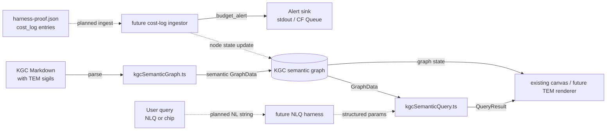
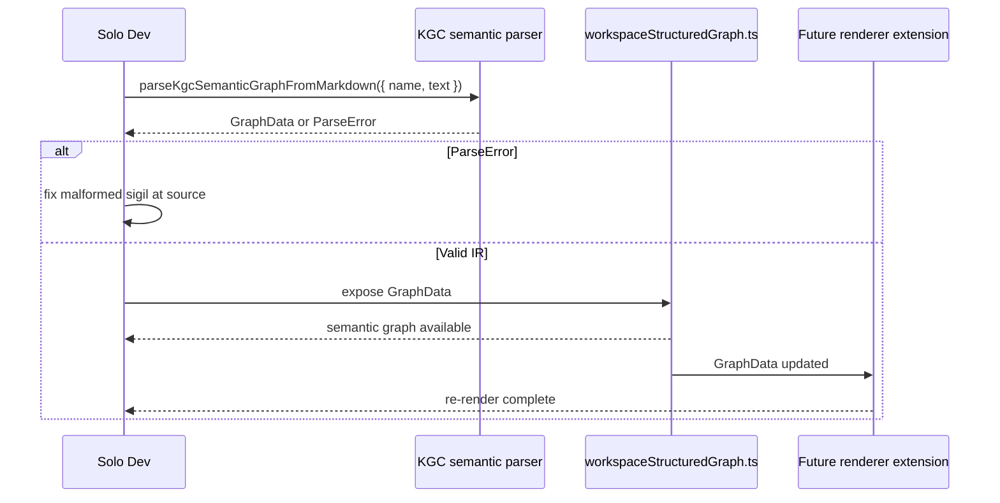
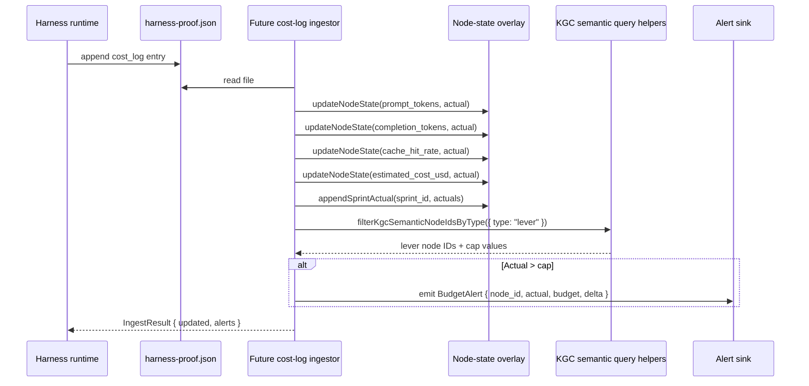
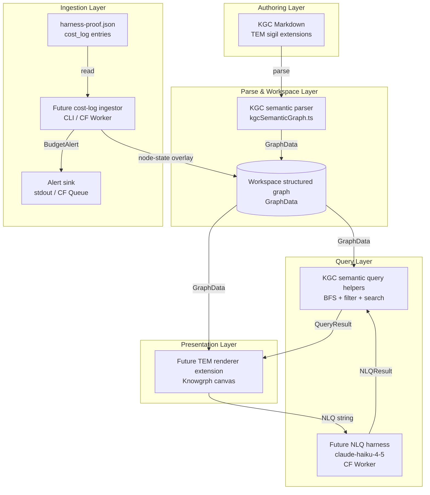

# Knowgrph Token Economics Model — TAD Companion

## Part 2 — TAD

---

### Architecture Overview

**From KGC Markdown authoring to live cost-observable graph**: the implemented baseline uses `kgcSemanticGraph.ts` to read TEM-extended Markdown into semantic-keyed GraphData, then `kgcSemanticQuery.ts` traverses that GraphData on demand. Cost-log ingestion, budget alerts, NLQ interpretation, and dedicated renderer features remain planned extensions and must consume the same KGC semantic graph owner.

### Journey → System Mapping

| Journey Stage | Workflow | Data Flow | Component |
|---|---|---|---|
| Trigger (cost overrun) | Cost log ingestion | `harness-proof.json` → planned ingestor → KGC semantic graph state | Future ingestor reusing `kgcSemanticGraph.ts` |
| Discover (open canvas) | Canvas mount + GraphData load | KGC semantic GraphData → existing canvas/future TEM renderer | `workspaceStructuredGraph.ts` |
| Engage (path trace) | BFS path query | User chip → query helper → canvas highlight | `kgcSemanticQuery.ts` |
| Engage (NLQ) | NLQ → structured query | NL string → future NLQ harness → query helper → canvas | Future harness reusing `kgcSemanticQuery.ts` |
| Complete (lever inspect) | Node detail panel | GraphData → node state → detail panel | Existing graph surfaces / future TEM renderer |
| Return (sprint review) | Actuals accumulation | `cost_log` → planned ingestor → `sprint_actuals[]` | Future ingestor; no separate parser |

---

### Component Specifications

---

**Component**: KGC semantic parser
**Responsibility**: Parses KGC Markdown files containing TEM sigil extensions into semantic-keyed GraphData.
**Interfaces**: `parseKgcSemanticGraphFromMarkdown({ name, text, strict? })` — synchronous, pure function
**Dependencies**: None (regex-based; no external library)
**Configuration**: `STRICT_MODE: boolean` — if true, reject unknown predicates (default: false, warn-only at MVP)
**FOSS / Vendor**: FOSS — pure TypeScript, zero dependencies
**`/goal` Conditions**:
- `npm --prefix canvas run test:ci:unit -- "parser.kgcSemantic.typedSigilsNoLegacyRemap" passes`

---

**Component**: Future node-state overlay
**Responsibility**: Adds accumulated sprint actuals to existing KGC semantic GraphData consumers without creating a second graph store or parser.
**Interfaces**:
- `readGraphData(): GraphData`
- `getNode(id: string): TNode | undefined`
- `updateNodeState(id: string, state: NodeState): void`
- `appendSprintActual(id: string, actual: SprintActual): void`
- `getNodeState(id: string): NodeState | undefined`
**Dependencies**: GraphData from `kgcSemanticGraph.ts`; existing workspace structured-graph bridge
**Configuration**: `MAX_SPRINT_HISTORY: number` (default: 12)
**FOSS / Vendor**: FOSS — pure TypeScript in-memory overlay; Cloudflare D1 optional for persistence (see ADR-1)
**`/goal` Conditions**:
- `node-state overlay tests prove updateNodeState and appendSprintActual preserve KGC semantic GraphData identity`

---

**Component**: KGC semantic query helpers
**Responsibility**: Executes BFS path queries, type-filter queries, label/ID search, ancestors, and descendants against KGC semantic GraphData; returns node ID arrays for callers.
**Interfaces**:
- `bfsKgcSemanticPath({ graphData, startId, endId, maxDepth? }): string[]`
- `filterKgcSemanticNodeIdsByType({ graphData, type }): string[]`
- `searchKgcSemanticNodeIds({ graphData, term }): string[]`
- `ancestorsKgcSemanticNodeIds({ graphData, nodeId, maxDepth? }): string[]`
- `descendantsKgcSemanticNodeIds({ graphData, nodeId, maxDepth? }): string[]`
**Dependencies**: GraphData from `kgcSemanticGraph.ts`
**Configuration**: `MAX_DEPTH: number` (default: 20; caps `ancestors`/`descendants` traversal depth)
**FOSS / Vendor**: FOSS — pure TypeScript; no graph library dependency
**`/goal` Conditions**:
- `npm --prefix canvas run test:ci:unit -- "parser.kgcSemantic.queryEnginePathFilterSearch" passes`

---

**Component**: Future cost-log ingestor
**Responsibility**: Reads `harness-proof.json`, extracts `cost_log` entries, maps values to metric node state updates on the KGC semantic graph overlay, appends sprint actuals, and emits `budget_alert` events when actuals exceed `token_budget` lever node caps.
**Interfaces**: `ingest(proofPath: string): IngestResult` — reads file, returns `{ updated: string[], alerts: BudgetAlert[] }`
**Dependencies**: KGC semantic GraphData; KGC semantic query helpers for lever lookup; Node.js `fs` (or Cloudflare R2 read)
**Configuration**: `PROOF_PATH: string`; `ALERT_SINK: 'stdout' | 'queue'` (default: `'stdout'`)
**FOSS / Vendor**: FOSS — Node.js stdlib; no external dependency
**`/goal` Conditions**:
- `cost-log ingestion and budget-alert tests reuse KGC semantic GraphData and add no second parser/query stack`

---

**Component**: Future NLQ harness
**Responsibility**: Accepts a natural-language query string and returns a structured `{ query_type, start_id?, end_id?, filter_type?, search_term? }` object for execution by KGC semantic query helpers; degrades to keyword search if model response is invalid.

**Interfaces**: `MCP tool: knowgrph.tem.query` — input: `{ query: string }` → output: `NLQResult`

**Dependencies**: Anthropic API (`claude-haiku-4-5-20251001`); KGC semantic graph summary (system prompt); KGC semantic query helpers (downstream consumer of output)
**Configuration**: `ANTHROPIC_API_KEY` (CF Worker secret); `MODEL: "claude-haiku-4-5-20251001"`
**FOSS / Vendor**: Anthropic API — proprietary (see ADR-4)

**Harness Contract**:
- Input schema: `{ query: string (max 200 chars), graph_schema: { node_ids: string[], edge_predicates: string[], node_types: string[] } }`
- Output schema: `{ query_type: "path" | "filter" | "search", start_id?: string, end_id?: string, filter_type?: NodeType, search_term?: string }`
- Cost log fields: `{ model, prompt_tokens, completion_tokens, cache_hits, estimated_cost_usd }`
- Fallback path: if API unavailable or output JSON invalid → return `{ query_type: "search", search_term: query }` (keyword search on raw query string); log fallback to `cost_log` with `estimated_cost_usd: 0`

**Token Budget**: 350 prompt tokens + 100 completion tokens @ 65% cache hit rate = ~$0.00028/call (Haiku pricing: $0.80/1M input, $4/1M output, ~90% cache discount on hits)
- Cache eligible: system prompt (200 tokens) + graph schema summary (100 tokens) = 300 tokens stable prefix
- Per-call variable: user query ≤ 50 tokens
- Monthly at 50 calls: ~$0.014/month

**Orchestration Topology**: Sequential — `[input validation] → [LLM call] → [output JSON parse + validation] → [QueryResult]`
Max iterations: 1 (no retry loop); circuit-breaker: N/A (no loop); on parse failure → fallback path, no second LLM call

**`/goal` Conditions**:
- `NLQ harness tests prove valid NLQResult for path, filter, and search fixture queries; fallback returns search-type on invalid model output; cost_log emitted per call; no duplicate query engine`

---

**Component**: Future TEM renderer extension
**Responsibility**: Renders the TEM graph as an interactive HTML Canvas widget with zoom/pan, type-colour-coded nodes and edges, BFS path query chips, type-filter bar, label search, and a node detail panel showing field values including actuals vs estimates.
**Interfaces**: Props: `{ graphData: GraphData, queryHelpers: KgcSemanticQueryHelpers, nlqEnabled: boolean }`
**Dependencies**: KGC semantic GraphData; KGC semantic query helpers for filter, search, and BFS; future NLQ harness (optional); HTML Canvas API
**Configuration**: `NLQ_ENABLED: boolean` (default: false at MVP); `ZOOM_MIN: 0.4`; `ZOOM_MAX: 2.5`
**FOSS / Vendor**: FOSS — HTML Canvas API (browser native); no charting library dependency
**`/goal` Conditions**:
- `renderer tests prove KGC semantic GraphData renders all nodes and edges; detail panel populates on click; filter and search use KGC semantic query helpers`

---

### Integration Contracts

| Interface | Protocol | Format | Auth | Errors |
|---|---|---|---|---|
| KGC semantic parser → KGC semantic GraphData | In-process function call | `GraphData` TypeScript object | N/A | Warns or throws strict-mode error on malformed typed sigil |
| Future cost-log ingestor → `harness-proof.json` | File read (fs / R2) | JSON | N/A | File not found → `IngestError`; malformed JSON → skip entry + warn |
| Future cost-log ingestor → node-state overlay | In-process function call | `NodeState` TypeScript object | N/A | Unknown node ID → warn + skip |
| Future NLQ harness → Anthropic API | HTTPS POST | JSON (`/v1/messages`) | Bearer API key | 429 → no retry; fallback to search; 5xx → fallback |
| Future NLQ harness → KGC semantic query helpers | In-process function call | `NLQResult` TypeScript object | N/A | Invalid `query_type` → fallback search |
| Canvas / future TEM renderer → KGC semantic query helpers | In-process function call | `string[]` (node ID array) | N/A | Empty result → show "no path found" in detail panel |
| `budget_alert` → Alert sink | stdout / CF Queue | JSON `BudgetAlert` | N/A | Queue unavailable → log to stdout; never block ingest |

---

### Architectural Decisions

#### ADR-1: In-Memory Map vs Cloudflare D1 for Graph Store

**Status**: Accepted
**Date**: 2026-05-29

**Context**: TEM graph has ≤ 50 nodes at current scale. Sprint actuals accumulate over time. A persistent store adds infrastructure cost and complexity; an in-memory store is zero-cost but ephemeral.

**Decision**: In-memory ES Map for MVP (< 100 nodes). Migrate to Cloudflare D1 (SQLite, free tier: 5M rows) if graph exceeds 100 nodes or sprint actuals require cross-session persistence.

**Alternatives Considered**:
1. **Cloudflare D1 from day 0**: Persistent; queryable via SQL; free tier sufficient. Adds schema migration overhead and wrangler binding config — premature at current scale.
2. **In-memory Map (chosen)**: Zero cost; zero config; sufficient for < 100 nodes and same-session sprint accumulation.
3. **Redis / Upstash**: Persistent; fast; $0.2/100k commands free tier. External dependency with egress cost; violates TCO-zero unless free tier holds.

**TCO Impact**:
| Dimension | In-memory Map | D1 (FOSS alt) | Delta / 12 months |
|---|---|---|---|
| Infra cost | $0/mo | $0/mo (free tier) | $0 |
| Egress cost | $0 | $0 | $0 |
| Token cost | $0 | $0 | $0 |
| Vendor risk | None | Low (CF native) | — |

**Consequences**:
- Positive: Zero config; zero cost; instant startup; no migration risk at MVP
- Negative: Sprint actuals lost on process restart; no cross-session query history
- Neutral: D1 migration is additive (same interface; swap store implementation); no API change needed

---

#### ADR-2: HTML Canvas vs SVG for Graph Renderer

**Status**: Accepted
**Date**: 2026-05-29

**Context**: TEM graph has 14 nodes and 22 edges at MVP. Rendering must support zoom/pan at 60fps. Two options: HTML Canvas (imperative, hardware-accelerated) vs SVG (declarative, DOM-based, accessible by default).

**Decision**: HTML Canvas for the interactive renderer. SVG for static export if needed (future).

**Alternatives Considered**:
1. **SVG (FOSS, browser native)**: Accessible; DOM-queryable; GitHub-renders natively; no canvas API required. Performance degrades above ~200 nodes; pan/zoom requires CSS transforms on the entire SVG element.
2. **HTML Canvas (chosen)**: Hardware-accelerated; 60fps pan/zoom at any node count; full control over hit-testing and rendering order.
3. **D3.js force graph (MIT)**: Auto-layout; widely used; 87kb bundle. Auto-layout conflicts with authored node positions from schema; bundle size increases artifact load time.
4. **react-force-graph (MIT)**: 3D capable; existing Knowgrph dependency. Heavyweight for a 14-node 2D graph; adds WebGL dependency.

**TCO Impact**:
| Dimension | HTML Canvas | D3.js | Delta / 12 months |
|---|---|---|---|
| Infra cost | $0 (browser native) | $0 (CDN) | $0 |
| Bundle size | 0kb added | +87kb | — |
| Vendor risk | None | Low (MIT) | — |

**Consequences**:
- Positive: Zero bundle overhead; smooth pan/zoom; full rendering control
- Negative: Not accessible by default (added `role="img"` + `<title>`/`<desc>` for screen readers)
- Neutral: Hit-testing must be implemented manually (done: distance-to-node-centre calculation)

---

#### ADR-3: BFS vs Dijkstra for Path Queries

**Status**: Accepted
**Date**: 2026-05-29

**Context**: Path queries need to trace causal chains between token economics nodes. Graph edges are currently unweighted. BFS finds shortest-hop paths; Dijkstra finds minimum-cost paths on weighted graphs.

**Decision**: BFS for MVP. Add edge weight field and Dijkstra as a Should-tier enhancement when edges carry cost-impact weights (e.g. `cache_hit_rate → estimated_cost_usd` weighted by 0.9 reduction factor).

**Alternatives Considered**:
1. **Dijkstra (FOSS, standard algorithm)**: Handles weighted edges; more general. Zero benefit on unweighted graph; adds code complexity now.
2. **BFS (chosen)**: Shortest-hop path on unweighted graph; O(V+E); trivially implementable in ~30 lines; sufficient for all current query patterns.
3. **DFS**: Finds a path but not the shortest; would produce misleading "causal chains" that skip closer nodes.

**TCO Impact**:
| Dimension | BFS | Dijkstra | Delta / 12 months |
|---|---|---|---|
| Infra cost | $0 | $0 | $0 |
| Build hours | 0.5h | 2h | -1.5h (saved) |
| Vendor risk | None | None | — |

**Consequences**:
- Positive: Minimal implementation; correct for unweighted graph; fast (O(V+E) < 1ms for ≤ 50 nodes)
- Negative: Cannot rank paths by cost-impact weight until edge weight field added
- Neutral: Upgrade path is additive — BFS stays for unweighted fallback when Dijkstra added

---

#### ADR-4: `claude-haiku-4-5` for Future NLQ Harness

**Status**: Accepted
**Date**: 2026-05-29

**Context**: The future NLQ harness converts a natural-language string into structured query params `{ query_type, start_id?, end_id?, ... }`. This is a classification + extraction task, not generation. The smallest, cheapest model that can extract structured JSON reliably is preferred.

**Decision**: `claude-haiku-4-5-20251001`. Fallback to keyword search on any parse failure; no retry loop.

**Alternatives Considered**:
1. **Rule-based NLQ parser (FOSS)**: Zero token cost; deterministic. Cannot handle open-ended phrasing ("what drives cost the most?"); would require maintaining a large pattern dictionary.
2. **`claude-haiku-4-5` (chosen)**: $0.80/1M input, $4/1M output; ~$0.014/month at 50 calls; JSON extraction is within model capability; prompt caching reduces marginal cost by ~90% on repeat queries.
3. **`claude-sonnet-4-6`**: Higher accuracy; ~10× cost. Over-specified for a JSON extraction task on a 14-node graph with a fixed schema.
4. **Local Ollama `qwen2.5:14b` (FOSS, zero token cost)**: Zero API cost; existing airvio stack. Requires local inference infra; not available in Cloudflare Worker context; latency unpredictable on shared hardware.

**TCO Impact**:
| Dimension | Haiku 4.5 | Ollama local | Delta / 12 months |
|---|---|---|---|
| Infra cost | $0/mo (CF Worker) | $0/mo (existing) | $0 |
| Token cost | ~$0.17/year | $0 | +$0.17/year |
| Vendor risk | Low (Anthropic) | None | — |

**Consequences**:
- Positive: Handles open-ended NLQ; ~$0.014/month at target volume; fallback preserves degraded-mode usefulness
- Negative: Anthropic API dependency; ~$0.17/year token cost (negligible but non-zero)
- Neutral: Model swap (Haiku → Sonnet) requires only config change; no interface change

---

### Workflow Specifications

#### Workflow: Schema Parse and Graph Load

**Trigger**: New or updated KGC Markdown file containing TEM sigil extensions is written (authoring, CI, or sprint update).
**Actors**: Solo Dev (author), KGC semantic parser, workspace structured-graph bridge.

**Happy Path**:
1. Solo Dev saves KGC Markdown file with `@node:metric:prompt_tokens`, `@edge:drives:prompt_tokens→estimated_cost_usd`, etc.
2. `parseKgcSemanticGraphFromMarkdown({ name, text })` runs; extracts all sigil blocks; returns semantic-keyed GraphData
3. `workspaceStructuredGraph.ts` exposes GraphData for active workspace consumers; node-state overlay preserves actuals for matching semantic IDs
4. Future renderer extension re-draws from updated GraphData

**Alternate Paths**:
- File contains unknown predicate in non-strict mode → warn logged; edge skipped; parse continues with remaining sigils

**Error Paths**:
- Malformed YAML frontmatter → `ParseError` thrown; downstream components not updated; Solo Dev fixes at source (guidelines: parser repair is recovery-only)
- Unknown node type sigil in strict mode → `ParseError` with line number; parse aborted

**Postconditions**: workspace graph consumers read updated GraphData; renderer re-renders within 100 ms; any alert from prior sprint actuals is preserved by node ID.

---

#### Workflow: Harness Run → Cost Log Ingest → Budget Alert

**Trigger**: A Knowgrph harness completes and appends a `cost_log` entry to `harness-proof.json`.
**Actors**: Harness runtime, future cost-log ingestor, node-state overlay, KGC semantic query helpers, Alert sink.

**Happy Path**:
1. Harness appends `{ model, prompt_tokens, completion_tokens, cache_hits, estimated_cost_usd }` to `harness-proof.json`
2. Future ingestor reads the file; extracts latest `cost_log` entries
3. Ingestor maps `prompt_tokens`, `completion_tokens`, `cache_hits`, `estimated_cost_usd` to semantic node state updates on the overlay
4. Ingestor appends sprint actuals for current sprint
5. Ingestor calls `filterKgcSemanticNodeIdsByType({ graphData, type: "lever" })` to get lever nodes; checks each against corresponding metric node actual
6. If any actual > lever cap → emits `BudgetAlert` to configured sink; ingest completes regardless

**Alternate Paths**:
- `harness-proof.json` contains multiple `cost_log` entries (batch run) → ingestor processes all entries; node state reflects aggregate actuals; one sprint actual appended per run

**Error Paths**:
- `harness-proof.json` not found → `IngestError` logged; graph store unchanged
- Individual `cost_log` entry malformed → entry skipped with warning; remaining entries processed

**Postconditions**: node-state overlay updated with actuals; `sprint_actuals[]` appended; `BudgetAlert` emitted if overrun; renderer re-renders updated node state within 100 ms.

---

#### Workflow: NLQ → Graph Query → Canvas Highlight

**Trigger**: User types a natural-language query string into the canvas NLQ input or clicks a pre-defined query chip.
**Actors**: Solo Dev (user), future NLQ harness, KGC semantic query helpers, future renderer extension.

**Happy Path**:
1. User enters "what levers reduce cost the most?" in NLQ input box
2. Canvas calls future NLQ harness with `{ query, graph_schema: { node_ids, edge_predicates, node_types } }`
3. Harness validates input schema; calls `claude-haiku-4-5`; receives `{ query_type: "filter", filter_type: "lever" }`
4. Harness validates output schema; emits `cost_log`; returns `NLQResult`
5. Canvas calls `filterKgcSemanticNodeIdsByType({ graphData, type: "lever" })`; receives lever node IDs
6. Canvas highlights lever nodes; dims non-lever nodes; populates detail panel with "5 lever nodes found"

**Alternate Paths**:
- User clicks pre-defined chip "Cache → Cost path" → canvas calls `bfsKgcSemanticPath({ graphData, startId: "cache_hit_rate", endId: "estimated_cost_usd" })` directly; NLQ harness not invoked; path highlighted within 10 ms

**Error Paths**:
- Anthropic API 429 (rate limit) → harness falls back to `{ query_type: "search", search_term: rawQuery }`; canvas runs keyword search; detail panel notes "NLQ fallback: keyword search"
- Model output not valid JSON → same fallback as above; `cost_log` emitted with `estimated_cost_usd: 0`; fallback event logged

**Postconditions**: Canvas shows query result highlight (path or type subset); detail panel updated; `cost_log` emitted (or fallback logged); no graph store state mutated (queries are read-only).

---

### Data Flows

#### Data Flow: KGC Markdown → KGC Semantic GraphData

| Stage | Component | Input Format | Output Format | Persistence | Error Handling |
|---|---|---|---|---|---|
| Ingest | KGC semantic parser | Raw Markdown string | Sigil token list | None | `ParseError` on malformed sigil; warn + skip in non-strict mode |
| Transform | `kgcSemanticGraph.ts` | Sigil token list | `GraphData { nodes, edges }` | None | Unknown predicate → warn + skip edge |
| Store | Workspace structured-graph bridge | `GraphData` | active GraphData reference | Existing workspace state | Duplicate node ID → canonical semantic-key merge policy |
| Serve | KGC semantic query helpers / future renderer extension | GraphData reference | node ID arrays or rendered graph | None (read-only) | Empty GraphData → return empty result; no throw |

#### Data Flow: Harness cost_log → Node State Update

| Stage | Component | Input Format | Output Format | Persistence | Error Handling |
|---|---|---|---|---|---|
| Ingest | Future cost-log ingestor | `harness-proof.json` (JSON array) | `CostLogEntry[]` | None | File not found → `IngestError`; entry malformed → skip |
| Transform | Future cost-log ingestor | `CostLogEntry[]` | `{ node_id: string, state: NodeState }[]` | None | Unknown node ID → warn + skip; never throw |
| Store | Node-state overlay | `NodeState` | Updated in-memory overlay | In-memory `sprint_actuals[]` (max 12) | Append capped at `MAX_SPRINT_HISTORY`; GraphData identity preserved |
| Serve | Future renderer extension | `getNodeState(id)` call | node plus optional state fields | None | Missing node → detail panel shows "no actuals yet" |

#### Data Flow: NLQ Query → Canvas Result

| Stage | Component | Input Format | Output Format | Persistence | Error Handling |
|---|---|---|---|---|---|
| Ingest | Future NLQ harness | `{ query: string, graph_schema: object }` | Validated input | None | Schema invalid → reject before model call; return fallback |
| Transform | Future NLQ harness | Validated input | `NLQResult { query_type, ... }` | None | API 429/5xx → fallback search; invalid JSON → fallback search |
| Store | N/A | N/A | N/A | None (queries are read-only; no graph mutation) | — |
| Serve | Future renderer extension | `NLQResult` | Highlighted node ID set + detail panel update | None | Empty result → "no nodes match" message in detail panel |

---

### Quality Attributes

| Attribute | Scenario | Pattern | Validation |
|---|---|---|---|
| Performance | 14-node graph → canvas render < 100 ms; BFS query < 10 ms; NLQ harness < 2 s | Canvas API; KGC semantic query helpers; Haiku model + prompt cache | Render time logged in JS; BFS timing asserted in test; NLQ latency measured in integration test |
| Scalability | Graph grows to 100 nodes → render remains < 200 ms | Canvas re-draw on IR update; O(V+E) BFS; D1 migration path from ADR-1 | Load test with synthetic 100-node IR fixture |
| Security | API key must not appear in canvas HTML or harness cost_log | `ANTHROPIC_API_KEY` stored as CF Worker secret; never written to proof or canvas | Secret scanning in CI; cost_log field audit in test |
| Observability | Every future NLQ harness call emits `cost_log` | Harness contract: cost log mandatory per call | `cost_log` presence asserted in focused harness tests |
| Token Cost | ≤ 450 tokens/NLQ call at 50 calls/month → ≤ $0.014/month | Haiku model; 65% cache hit on stable system prompt + schema summary; max 200-char query input | Cost log `prompt_tokens` + `completion_tokens` asserted in test; monthly actuals vs estimate reviewed each sprint |
| TCO | 12-month infra cost = $0 | In-memory store (ADR-1); browser-native Canvas (ADR-2); FOSS query engine | Monthly cost audit; no CF paid tier trigger at < 100 nodes and < 50 NLQ calls/month |

---

### Deployment Strategy

**KGC semantic parser and query helpers**: TypeScript modules (`canvas/src/features/parsers/kgcSemanticGraph.ts`, `canvas/src/lib/graph/kgcSemanticQuery.ts`) — importable in any consumer. No deployment unit; bundled with the app.

**Node-state overlay**: Future in-memory overlay instantiated by the consumer that needs actuals. No separate deployment.

**Future cost-log ingestor**: CLI script invoked post-harness-run, or Cloudflare Worker triggered by an explicit proof artifact event. Rollback: prior node state is in-memory; restart restores from latest proof file.

**Future NLQ harness**: Cloudflare Worker deployed through the repo's existing Worker conventions. Rollback: `wrangler rollback`. Secrets managed via `wrangler secret put ANTHROPIC_API_KEY`.

**Future TEM renderer extension**: Existing Knowgrph React/canvas surface or portable static artifact. No API key in browser. Deploy through the same Pages pipeline as the app.

**Migration path**: If `sprint_actuals` persistence across sessions is required → add Cloudflare D1 binding to the existing app/Worker owner and keep KGC semantic GraphData as the canonical graph contract.

---

### Architecture Diagram: Component Topology

### Component Inventory

| Layer | Component | File / Module | Status |
|---|---|---|---|
| Parse | KGC semantic parser | `canvas/src/features/parsers/kgcSemanticGraph.ts` | Implemented |
| Query | KGC semantic query helpers | `canvas/src/lib/graph/kgcSemanticQuery.ts` | Implemented |
| Workspace | Structured graph bridge | `canvas/src/hooks/active-graph-data/workspaceStructuredGraph.ts` | Implemented |
| Parser merge | Markdown parser merge | `canvas/src/features/parsers/default.ts` | Implemented |
| Test | KGC semantic parser/query tests | `canvas/src/__tests__/kgcSemanticGraph.test.ts` | Implemented |
| Future | Lever-reference linter | Reuse KGC semantic GraphData | Planned |
| Future | Cost-log ingestor | Reuse KGC semantic GraphData | Planned |
| Future | Node-state overlay | Reuse KGC semantic node IDs | Planned |
| Future | NLQ harness | Reuse `kgcSemanticQuery.ts` | Planned |
| Future | Renderer extension | Reuse existing Knowgrph canvas surfaces | Planned |
| Config | Worker/Pages config | Existing repo deployment owners | Planned only if future harness needs deployment |

---

## PRD ↔ TAD Traceability

| PRD Story | Acceptance Criterion | TAD Component | Interface | `/goal` Condition |
|---|---|---|---|---|
| TEM-E1-S1 | TEM-E1-S1-AC1 | KGC semantic parser | `parseKgcSemanticGraphFromMarkdown({ name, text })` | `parser.kgcSemantic.typedSigilsNoLegacyRemap` passes; GraphData contains typed nodes and edges |
| TEM-E1-S2 | TEM-E1-S2-AC1 | Future lever-reference linter | KGC semantic GraphData inspection | Planned tests prove lever references are validated without a second parser |
| TEM-E2-S1 | TEM-E2-S1-AC1 | KGC semantic query helpers | `bfsKgcSemanticPath({ graphData, startId, endId })` | `parser.kgcSemantic.queryEnginePathFilterSearch` passes; execution < 10ms logged |
| TEM-E2-S2 | TEM-E2-S2-AC1 | KGC semantic query helpers | `filterKgcSemanticNodeIdsByType`, `searchKgcSemanticNodeIds` | `parser.kgcSemantic.queryEnginePathFilterSearch` passes; filter and search cases pass |
| TEM-E3-S1 | TEM-E3-S1-AC1 | Future cost-log ingestor | `ingest(proofPath)` | Planned tests prove node state updated and `sprint_actuals` appended while preserving GraphData identity |
| TEM-E3-S2 | TEM-E3-S2-AC1 | Future cost-log ingestor | `BudgetAlert` emission | Planned tests prove alert emitted on overrun and not emitted under budget |
| TEM-E4-S1 | TEM-E4-S1-AC1 | Future TEM renderer extension | GraphData render + click | Planned tests prove render < 100ms and detail panel populates on click |
| TEM-E4-S2 | TEM-E4-S2-AC1 | Future NLQ harness + KGC semantic query helpers | structured NLQ result → query helper call | Planned tests prove round-trip < 2s, fallback on invalid output, and no duplicate query engine |

---

## Open Questions Register

| ID | Question | Owner | Target Resolution |
|---|---|---|---|
| OQ-1 | Should unknown edge predicates reject (strict) or warn (lenient) at MVP? Proposed: warn-only; strict as a config flag. | airvio | Sprint 1 |
| OQ-2 | `tem-lint` as pre-commit hook (husky) or CI step (GitHub Actions)? Proposed: both; CI is authoritative. | airvio | Sprint 1 |
| OQ-3 | Should `bfsPath` return all paths or shortest only? Proposed: shortest only (BFS guarantee); all-paths as Should-tier. | airvio | Sprint 2 |
| OQ-4 | `ancestors` / `descendants` depth limit — proposed `MAX_DEPTH: 20`; sufficient for current graph diameter? | airvio | Sprint 2 |
| OQ-5 | Ingestor trigger: file-system watcher (`chokidar`, MIT) vs Cloudflare Queue message? Proposed: chokidar for local dev; CF Queue for production. | airvio | Sprint 3 |
| OQ-6 | Sprint actuals retention: 12 sprints (3 months). Sufficient, or should it follow Git history as the audit trail? | airvio | Sprint 3 |
| OQ-7 | NLQ harness: Haiku vs local Ollama `qwen2.5:14b` for zero token cost? Proposed: Haiku with CF Worker (latency predictable); Ollama blocked by Worker runtime constraint. | airvio | Sprint 4 |
| OQ-8 | Renderer extension: portable static artifact vs embedded in Knowgrph React app? Proposed: embed first when it can reuse existing graph surfaces; export a portable artifact only through the same canonical renderer. | airvio | Sprint 4 |
