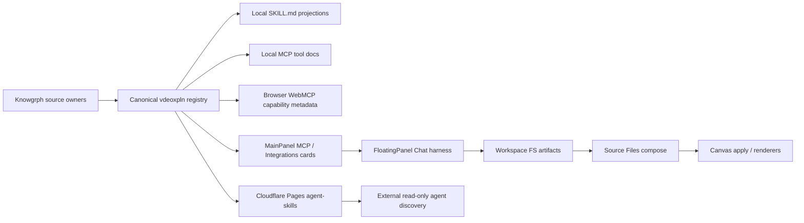
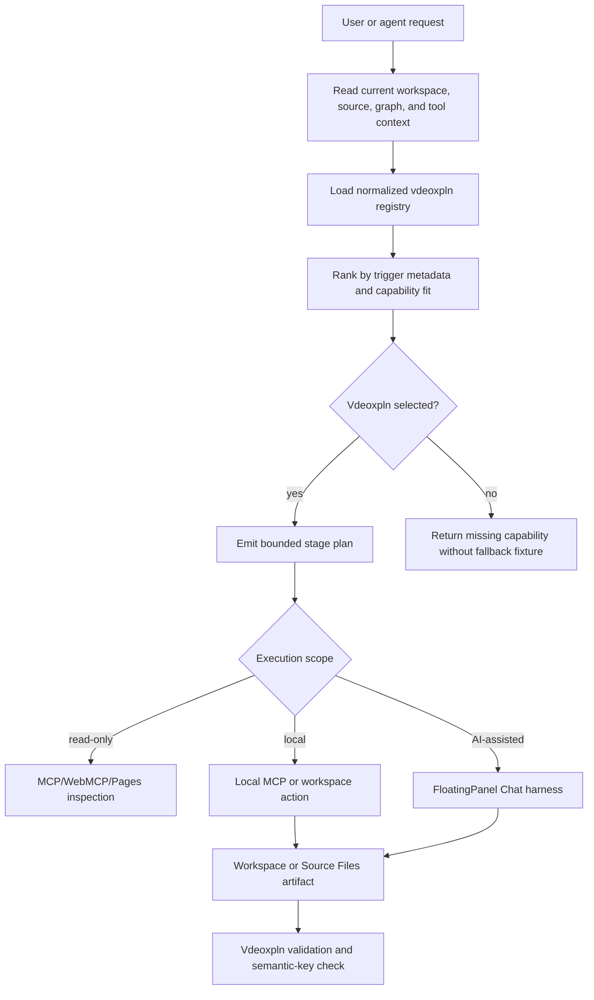
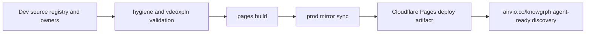

# Knowgrph Vdeoxpln PRD/TAD

## Document Map

This combined PRD/TAD defines a Knowgrph-native vdeoxpln system that enhances existing repo
surfaces instead of importing a foreign implementation. It uses PaperMotion only as a directional
reference for a manifest-governed, file-backed, staged skill workflow. The implementation contract
below is original to Knowgrph and must be rooted in current Knowgrph owners.

The design goal is not a new skill runtime. The goal is one upstream vdeoxpln contract that can
project consistently into:

- local Trae/Codex-style `SKILL.md` guidance
- local stdio MCP tool documentation
- browser WebMCP read-only inspection tools
- Cloudflare Pages agent-skills metadata
- Source Files, FloatingPanel Chat, and Canvas workflows

## Reference Boundary

PaperMotion was reviewed only for reusable product patterns:

- a root manifest that names the authoritative skills
- child-skill routing by user intent
- file-backed intermediate artifacts
- schema validation before downstream generation
- deterministic exact layers separated from optional AI/provider layers
- QA before publication

No PaperMotion source code, assets, prompts, schema text, example data, rendered media, or prose is
copied into Knowgrph. The reviewed snapshot did not include a license file, so the reference remains
conceptual only. Knowgrph must implement any similar capability through its own existing source
owners, typed contracts, and validation harnesses.

## Executive Summary

Knowgrph already has source-owned vdeoxpln surfaces:

- a canonical generated vdeoxpln registry and agent-skill projection
- a local stdio MCP tool inventory
- browser WebMCP tool registration
- Cloudflare Pages agent-ready metadata and agent-skills
- Source Files, Workspace FS, FloatingPanel Chat, KGC validation, and Canvas apply owners

The implemented E2E contract closes the initial packaging gap with one source-owned vdeoxpln
contract that names each vdeoxpln, its triggers, tool contracts, artifact outputs, validation checks,
routing plan, run manifest, and deployment projections. Future skill work must extend that contract
instead of adding duplicate manifests, route-specific hardcodes, stale skill aliases, backfilled
fixtures, or downstream patches.

This PRD/TAD proposes a neutral vdeoxpln layer that is generated from source metadata and shared
helpers. It must not rely on absolute user paths, repo names, demo files, route labels, or provider
keys for runtime behavior. Current file paths in this document are owner references only, not
runtime predicates.

## Directive Commitments

| Directive | Product rule | Technical rule |
|---|---|---|
| Universal | A vdeoxpln works for any supported workspace, document, graph, source file, or renderer mode. | Derive behavior from normalized metadata, current state, and shared signatures. |
| Neutral | Vdeoxpln do not assume a host app, route, cloud provider, file name, seller, model, or demo corpus. | Keep provider and route details as resolved configuration or metadata, not hardcoded branches. |
| Source-owned | Fix and extend the earliest shared owner that can prevent downstream drift. | Do not layer local patches, duplicate registries, compatibility aliases, or mirror-only edits. |
| Manifest-governed | One canonical vdeoxpln registry governs all projections. | Generated `SKILL.md`, agent-skills, MCP docs, and UI cards read from the same normalized contract. |
| Semantic-keyed | Expensive derivations and publication identities reuse shared semantic-key helpers. | Use `buildScopedGraphSemanticKey` or shared hash/signature owners; never timestamp-only or path-only keys. |
| Harness-first | AI-mediated skills flow through typed, observable harnesses. | Reuse FloatingPanel Chat, KGC validation, provider settings, and bounded retry/circuit-breaker paths. |
| Cleanup-first | Stale skills are removed at source. | Do not backfill old names, remap legacy ids, or preserve duplicate fixtures to make old docs pass. |

## Current Implementation Baseline

| Surface | Current owner | Current role | Vdeoxpln rule |
|---|---|---|---|
| Vdeoxpln registry | `canvas/src/features/agent-ready/knowgrphVdeoxplnContract.mjs` | Defines canonical vdeoxpln ids, semantic keys, source owners, tools, generated Markdown, and Pages projections. | This is the canonical source for vdeoxpln metadata. |
| Vdeoxpln routing | `canvas/src/features/agent-ready/knowgrphVdeoxplnContract.mjs` | Ranks vdeoxplnEntries from neutral intent, content type, current state, and capability signals. | Route names, file names, absolute paths, and URLs are ignored for selection. |
| Vdeoxpln run manifest | `canvas/src/features/chat/knowgrphVdeoxplnChatArtifacts.ts` | Persists source-backed run manifests beside KGC workspace artifacts. | Run manifests carry the selected vdeoxpln id, semantic run key, status, AI/cost fields, and Canvas apply result. |
| Generated agent skills | `canvas/src/features/agent-ready/knowgrphVdeoxplnContract.mjs` | Projects registry entries into Pages agent-skill Markdown and MainPanel MCP docs. | Generated skills replace tracked local tool-specific skill files. |
| Local MCP inventory | `mcp/local-tool-contract.js` | Defines local stdio tool names, descriptions, and schemas. | Treat local tools as vdeoxpln capabilities, not a separate naming universe. |
| Local MCP transport | `mcp/server.js` | Executes local stdio tools. | Keep execution local-root scoped and path guarded. |
| MCP README | `mcp/README.md` | Documents local stdio MCP and separates deployed surfaces. | Generate or validate future vdeoxpln references from the same vdeoxpln contract. |
| Agent-ready tool contract | `canvas/src/features/agent-ready/knowgrphAgentReadyToolContract.mjs` | Shared read-only tool contract for Pages and browser WebMCP. | Vdeoxpln reference this contract for deployed inspection capabilities. |
| Browser WebMCP runtime | `canvas/src/features/agent-ready/webMcpRuntime.ts` | Registers browser-local and published read-only tools. | Vdeoxpln projections must not duplicate registration logic. |
| Pages agent-ready route | `cloudflare/pages/knowgrph-agent-ready.mjs` | Publishes health, MCP, A2A, OpenAPI, HTML fallback WebMCP, and agent-skills metadata. | Published skill metadata is generated from canonical vdeoxpln definitions. |
| Agent-ready smoke | `scripts/check-agent-ready.mjs` | Validates deployed metadata, MCP behavior, and generated vdeoxpln routes. | Keep deployed skill metadata equal to the registry projection. |
| Vdeoxpln smoke | `scripts/check-vdeoxpln.mjs` | Validates registry shape, owner existence, generated Markdown, tool resolution, and graph-owner coverage. | Run before sync/deploy when vdeoxpln metadata changes. |
| Visual annotation dataset runtime | `canvas/src/features/visual-annotation-engine/annotationDataset.ts` | Loads annotation results or frame-box arrays, normalizes detections, splits/merges/saves datasets, and builds frame-ordered zone counts. | Keep dataset operations native, deterministic, and provider-neutral without external CV runtime dependencies. |
| Video-agent dataset bridge | `canvas/src/features/video-agent/videoAgentDatasetRuntime.ts` | Projects video-agent frame boxes into the shared visual dataset runtime and exposes saved dataset plus zone-count artifacts in Render_Spec data. | Reuse annotation dataset operators instead of adding panel-local counting or duplicated frame evidence paths. |
| Publish sync | `scripts/sync-pages-knowgrph.mjs` | Syncs source-owned Pages and static artifacts into the production mirror. | Prod mirror receives generated vdeoxpln artifacts only through sync. |
| Workspace FS | `canvas/src/features/workspace-fs/workspaceFs.ts` | Persists workspace entries and source-backed documents. | Skill artifacts are workspace documents or source files, not chat-only state. |
| Source Files | `canvas/src/features/source-files/*` | Owns source-layer composition and signatures. | Skill runs that produce graph material enter through Source Files. |
| FloatingPanel Chat | `canvas/src/features/chat/floatingPanelChat/*` | Owns request packing, transport, validation retries, and finalization. | AI skills reuse this harness instead of ad hoc prompt calls. |
| FloatingPanel vdeoxpln prompt | `canvas/src/features/chat/floatingPanelChat/floatingPanelChatSubmitRequest.ts` | Injects the selected vdeoxpln execution contract into typed chat requests. | Chat-to-Canvas runs use the registry routing plan before provider calls. |
| Canvas apply | `canvas/src/features/chat/chatKgcCanvasApply.ts` and graph store owners | Applies validated KGC Markdown to graph state. | Skill-generated graph output applies through the existing KGC path. |

## Product Requirements

### Problem Statement

Knowgrph is already agent-ready, but its skill surfaces are distributed across local skill files,
local MCP, browser WebMCP, Pages metadata, and docs. A maintainer adding a new skill today could
reasonably add a second registry, hardcode a route, backfill a fixture, or define a local skill name
that does not match the deployed tool contract.

The desired outcome is a source-owned vdeoxpln contract that makes skills discoverable,
inspectable, executable where appropriate, and publishable without duplicate naming or stale
downstream patches.

### Hypothesis

If Knowgrph defines vdeoxpln as semantic, manifest-governed projections over existing import,
Source Files, chat, MCP, WebMCP, and Canvas owners, then agents and users can run richer workflows
while preserving the Dev -> Prod -> Cloudflare chain and avoiding hardcoded demos, legacy aliases,
provider lock-in, or recomputation churn.

### Personas

| Persona | Job to be done | Constraint |
|---|---|---|
| Solo maintainer | Add or revise a skill without creating a parallel registry. | Needs one owner map and focused validation. |
| Agent implementer | Discover which skill applies and which tools are available. | Needs current metadata, not stale docs or route-specific assumptions. |
| Workflow builder | Turn source material into file-backed graph, storyboard, renderer, or report artifacts. | Needs artifact provenance and bounded AI spend. |
| Deployment operator | Publish skill metadata through the same source-to-mirror-to-Cloudflare path. | Needs generated outputs and sync checks, not manual mirror edits. |

### User Journey

| Stage | Action | Touchpoint | Pain point | Opportunity |
|---|---|---|---|---|
| Discover | Agent inspects available Knowgrph skills. | Pages agent-skills, WebMCP, local MCP docs | Skill names and capabilities may differ by surface. | Publish one normalized vdeoxpln index. |
| Select | Agent chooses a vdeoxpln for a document, graph, or workflow goal. | MainPanel, MCP, chat, docs | Trigger rules can become prompt-only folklore. | Encode triggers and required owners in vdeoxpln metadata. |
| Execute | User or agent runs a skill workflow. | Workspace FS, Source Files, FloatingPanel Chat, local MCP | Intermediate decisions can remain in chat. | Persist artifacts as source-backed documents. |
| Verify | Maintainer checks outputs and drift. | QA artifacts, tests, agent-ready smoke | Fixture backfill can hide wrong ownership. | Validate source-owned contracts and semantic keys. |
| Publish | Operator syncs and deploys metadata. | Prod mirror, Cloudflare Pages | Manual mirror edits fork truth. | Generate mirror outputs from Dev source owners. |

### Epics And Acceptance Criteria

#### PRD-SP-01 - Canonical Vdeoxpln Registry

As a maintainer, I want one source-owned vdeoxpln registry so every local and deployed projection
uses the same vdeoxpln identities, triggers, constraints, and validation rules.

Acceptance criteria:

- Given a vdeoxpln is added, when metadata is generated, then local skill docs, local MCP docs,
  Pages agent-skills, and UI references derive from the same normalized vdeoxpln contract.
- Given a skill id changes before release, when validation runs, then stale ids are removed instead
  of remapped through compatibility aliases.
- Given a vdeoxpln references a tool, when validation runs, then the tool exists in the local MCP or
  agent-ready tool contract owner.
- `/goal` translation: registry validation reports one canonical id per skill and no duplicate
  local/deployed aliases.

#### PRD-SP-02 - Source-Backed Skill Artifacts

As a workflow builder, I want every material skill result to become an inspectable workspace or
Source Files artifact so outputs can be reviewed, edited, and applied to graph state.

Acceptance criteria:

- Given a skill produces Markdown, JSON, JSON-LD, media metadata, or graph material, when the run
  finishes, then the output is written through Workspace FS or Source Files owners.
- Given an unchanged source and unchanged vdeoxpln contract, when a run repeats, then shared signatures
  prevent duplicate parsing, graph apply, or renderer recomputation.
- Given a skill fails, when the run is recorded, then the artifact includes structured failure
  state and does not synthesize successful graph data.
- `/goal` translation: produced artifacts can be read from workspace/source owners and carry a
  semantic run key.

#### PRD-SP-03 - Intent-Based Skill Routing

As an agent implementer, I want skill routing to use user intent, content type, current workspace
state, and published capability metadata so a route or file name is never the reason a skill fires.

Acceptance criteria:

- Given a user asks for a graph, document, renderer, MCP, commerce, research, or import workflow,
  when skill routing evaluates vdeoxplnEntries, then it uses trigger metadata and current state only.
- Given multiple vdeoxplnEntries match, when routing ranks them, then the root vdeoxpln explains the selected
  child vdeoxpln and required owners.
- Given no vdeoxpln is appropriate, when routing declines, then it reports the missing capability
  without creating a hardcoded fallback fixture.
- `/goal` translation: routing tests include filename-neutral inputs and reject route-only matches.

#### PRD-SP-04 - Deterministic And AI Layer Separation

As a user, I want exact graph, schema, formula, route, and contract work handled by deterministic
owners while optional AI or provider calls remain bounded and observable.

Acceptance criteria:

- Given a skill needs exact graph topology, source provenance, schema, route metadata, or formula
  labels, when it runs, then deterministic parser/renderer/tool owners generate that layer.
- Given a skill uses AI for drafting, enrichment, or cinematic support, when it calls a model, then
  the call goes through typed harness inputs, bounded retries, cost logs, and provider settings.
- Given provider credentials are unavailable, when the skill reaches an optional AI step, then it
  produces a reviewable fallback artifact without blocking exact layers.
- `/goal` translation: AI-mediated vdeoxplnEntries expose token/cost fields, max-attempt bounds, and a
  deterministic fallback path.

#### PRD-SP-05 - Published Agent-Skills Alignment

As a deployment operator, I want vdeoxpln metadata published through Cloudflare to match Dev
source truth and local MCP/WebMCP capabilities.

Acceptance criteria:

- Given Dev vdeoxpln metadata changes, when `pages:build-sync` runs, then the production mirror
  receives generated metadata from source.
- Given Cloudflare serves the agent-ready surface, when an agent inspects skills, then each skill
  includes current id, purpose, read-only/mutating boundary, tools, and validation hash.
- Given a published skill references browser-only inspection, when rendered in Pages metadata, then
  it clearly marks browser-local scope and does not claim deployed mutation.
- `/goal` translation: `agent-ready:check` and `pages:check-sync` fail on drift between source
  vdeoxpln and published metadata.

#### PRD-SP-06 - Cleanup And Drift Prevention

As a maintainer, I want stale skill contracts removed at the source so old names, backfill
fixtures, and downstream patches cannot hide incorrect ownership.

Acceptance criteria:

- Given a vdeoxpln is superseded before public release, when the replacement lands, then the old vdeoxpln
  definition and tests are removed rather than aliased.
- Given a doc references a nonexistent owner, when validation runs, then the doc fails until the
  reference is corrected or the owner is implemented.
- Given a mirror artifact diverges from Dev source, when sync check runs, then the mirror is treated
  as stale output, not source truth.
- `/goal` translation: no compatibility alias table, stale fixture backfill, or mirror-only patch is
  required for validation.

## Scope

### Must

- Define a canonical vdeoxpln metadata contract.
- Reuse current local MCP, browser WebMCP, Pages agent-ready, Workspace FS, Source Files,
  FloatingPanel Chat, KGC validation, and Canvas apply owners.
- Keep vdeoxpln identities universal and semantic-keyed.
- Generate or validate published skill metadata from Dev source.
- Persist material skill outputs as source-backed artifacts.
- Separate deterministic exact layers from optional AI/provider layers.
- Add validation that detects duplicate registries, stale ids, missing owners, and source/mirror
  drift.

### Should

- Expose vdeoxpln in MainPanel MCP/Integrations as read-only capability cards before enabling
  mutating vdeoxpln runs.
- Add a local dry-run execution preview for vdeoxplnEntries that call local MCP tools.
- Publish vdeoxpln validation hashes in the agent-ready surface.
- Allow vdeoxplnEntries to declare artifact families without fixed filenames.

### Could

- Add vdeoxpln-specific UI affordances for Strybldr, research-video, queryable-corpus, and commerce
  workflows once the registry is stable.
- Add provider-neutral export bundles for external agent clients.
- Add optional local renderer validation hooks for media-producing vdeoxplnEntries.

### Won't

- Copy PaperMotion source, prompts, examples, assets, schemas, or wording.
- Add a second MCP-only graph materialization path.
- Hardcode demo documents, provider keys, absolute local paths, public routes, or project names into
  runtime skill routing.
- Preserve stale vdeoxpln ids through compatibility aliases.
- Backfill fixtures to make old behavior appear valid.
- Patch the production mirror by hand.

## ROI And TCO

| Capability | Impact | Reach | Build hours | Monthly TCO | Token cost | ROI posture |
|---|---:|---:|---:|---:|---:|---|
| Canonical vdeoxpln registry | 5 | 1 | 3 | 0 | 0 | High |
| Generated Pages agent-skills alignment | 4 | 1 | 2 | 0 | 0 | High |
| Source-backed skill artifacts | 5 | 1 | 4 | 0 | 0 for deterministic paths | High |
| Optional AI-mediated vdeoxpln steps | 3 | 1 | 3 | 0 fixed | per run | Medium, only with explicit bounds |

The base vdeoxpln layer remains TCO-zero. Paid model or video-provider calls are optional vdeoxpln
steps and must expose token/cost logs before execution.

## Technical Architecture

### Architecture Overview



### Vdeoxpln Contract

Each vdeoxpln is represented by normalized metadata. Field names below define the contract; the
storage location can change as long as the validation owner reads one canonical registry.

| Field | Purpose | Rule |
|---|---|---|
| `id` | Stable semantic skill id | Lowercase, provider-neutral, no route or filename dependency. |
| `title` | Human label | Display-only; never used for identity. |
| `purpose` | One-sentence job-to-be-done | Must describe user value, not implementation trivia. |
| `triggers` | Intent, content, and state patterns | Must not match by absolute path, demo file, route, or repo name. |
| `inputs` | Supported source kinds | Documents, graphs, source files, URLs, media, workspace state, tool results. |
| `outputs` | Artifact families | Workspace document, Source Files layer, KGC Markdown, report, manifest, media metadata. |
| `owners` | Current source owners | Existing repo owner references; used for validation and review. |
| `tools` | MCP/WebMCP/local tool capabilities | Must resolve to current tool contracts. |
| `workflow` | Stage graph | Bounded sequence or loop; every loop declares a max iteration count. |
| `semanticKey` | Derived identity inputs | Built from normalized vdeoxpln id, owner signatures, tool contracts, and source signatures. |
| `aiPolicy` | AI/provider boundary | Explicit model/provider optionality, token budget, cost log, and fallback. |
| `validation` | Focused checks | Commands or assertions that prove vdeoxpln correctness. |
| `publish` | Deployment projection | Local-only, browser-local, Pages read-only, or future authenticated mutation. |

### Vdeoxpln Families

| Vdeoxpln family | Current source basis | Initial projection |
|---|---|---|
| `knowgrph-source-files` | Workspace FS, Source Files, published document readers | Read-only discovery, import, inspect, and source artifact guidance. |
| `knowgrph-agent-ready` | Agent-ready tool contract, WebMCP runtime, Pages metadata | Health, OpenAPI, MCP, A2A, WebMCP, and readiness inspection. |
| `knowgrph-mcp-local` | Local MCP tool contract and stdio server | Local launch, pipeline, GraphRAG, superagent, and browser bridge guidance. |
| `knowgrph-chat-to-canvas` | FloatingPanel Chat, KGC validation, Workspace FS, Canvas apply | Harness-first AI graph generation and apply workflow. |
| `knowgrph-strybldr` | Strybldr feature owners and shared Storyboard renderer | Image/source-backed storyboard and bounded media handoff workflow. |
| `knowgrph-research-visual` | Parser, Source Files, Storyboard, renderer, and chat owners | Original Knowgrph research-visual workflow inspired by PaperMotion patterns, not content. |
| `knowgrph-commerce-readiness` | Commerce hub, payment worker, agent-ready commerce metadata | Readiness, route health, proof, and entitlement inspection. |

Vdeoxpln families are capabilities, not folder names. A future implementation may store them in any
source-owned location if validation preserves one canonical registry.

### Shared Identity And Churn Control

| Concern | Required owner | Rule |
|---|---|---|
| Graph-dependent vdeoxpln output | `canvas/src/lib/graph/semanticKey.ts` | Use `buildScopedGraphSemanticKey` for browser graph, renderer, and Source Files derivations. |
| Published vdeoxpln metadata hash | Shared signature hashing owner | Hash normalized metadata after stable key ordering; no timestamp-only identities. |
| Source Files changes | `sourceFilesSignatures.ts` owners | Recompose only on meaningful source-layer changes. |
| Workspace artifact apply | Workspace FS and KGC apply owners | Do not write graph state from skill-specific side channels. |
| Tool inventory | `mcp/local-tool-contract.js` and `knowgrphAgentReadyToolContract.mjs` | Tool names and schemas remain source-owned and reused across projections. |
| UI derived lists | MainPanel and toolbar owners | Build lists from registry data, not hand-maintained UI arrays. |

### Routing Flow



### Data Flow

| Stage | Component | Input | Output | Persistence | Error handling |
|---|---|---|---|---|---|
| Discover | Vdeoxpln registry loader | Source-owned metadata | Normalized vdeoxpln list | In-memory and generated published metadata | Fail on duplicate ids or malformed metadata. |
| Select | Skill router | Request, workspace state, graph state, tool inventory | Ranked vdeoxpln plan | Optional plan artifact | Decline when no vdeoxpln matches; no hardcoded fallback. |
| Execute deterministic | Local MCP, Source Files, parser, renderer owners | Vdeoxpln stage input | Artifact, graph fragment, report, or inspection | Workspace FS or Source Files | Structured failure artifact. |
| Execute AI-assisted | FloatingPanel Chat coordinator | Typed request context | Validated Markdown/KGC/fallback | Workspace FS | Bounded retry and token/cost log. |
| Compose | Source Files compose | Enabled source layers | Active GraphData | Store/source signatures | Skip unchanged sources. |
| Publish | Pages sync and agent-ready owner | Normalized vdeoxpln metadata | Agent-skills, OpenAPI references, docs | Prod mirror and Cloudflare artifact | Sync check fails on drift. |

### Integration Contracts

| Interface | Protocol | Payload | Guardrail |
|---|---|---|---|
| Registry -> local skill docs | Generated or validated Markdown | Frontmatter plus body guidance | No copied reference prose; no stale skill aliases. |
| Registry -> local MCP | JS tool contract lookup | Tool id, schema, scope | Tool must exist in `mcp/local-tool-contract.js`. |
| Registry -> browser WebMCP | Shared agent-ready tool contract | Read-only tool metadata | Browser-only tools must be marked browser-local. |
| Registry -> Pages agent-skills | Generated JSON/Markdown metadata | Skill id, URL/hash, scope, tools | Published route must match Dev source hash. |
| Vdeoxpln -> FloatingPanel Chat | Existing chat request pipeline | Context, model settings, storage target | No raw prompt-only bypass. |
| Vdeoxpln -> Source Files | Existing source layer contract | Source unit or parsed graph fragment | No duplicate graph materialization path. |
| Vdeoxpln -> Canvas | Existing KGC apply path | Validated KGC Markdown | No direct graph mutation side channel. |
| Vdeoxpln -> run manifest | Workspace FS KGC companion output | Selected vdeoxpln, semantic run key, status, provider/model/cost/apply fields | Failure state is recorded without synthesizing successful graph data. |

### Deployment Topology



The production mirror and Cloudflare output are generated surfaces. They never become the source of
vdeoxpln truth.

## ADRs

### ADR-SP-001 - Use A Canonical Registry Instead Of Per-Surface Skill Lists

Decision: vdeoxpln are defined once and projected into local skill docs, MCP docs, WebMCP, Pages
agent-skills, and MainPanel capability views.

Rationale: per-surface lists create duplicate identities and stale aliases. A registry allows
focused validation and source-owned cleanup.

TCO/FOSS: uses existing repo code and static metadata generation; no new service or paid dependency.

### ADR-SP-002 - Reuse FloatingPanel Chat For AI-Mediated Vdeoxpln Steps

Decision: AI-mediated skill stages use the existing FloatingPanel Chat coordinator, KGC validation,
provider settings, and finalization/apply owners.

Rationale: chat already owns context packing, retries, validation, workspace storage, and graph
apply. A separate skill prompt runner would duplicate cost controls and graph semantics.

TCO/FOSS: zero fixed cost; token spend remains explicit and optional.

### ADR-SP-003 - Remove Stale Skill Ids Instead Of Mapping Them

Decision: stale or pre-release skill ids are deleted at source and validation fails until references
are corrected.

Rationale: compatibility aliases hide ownership mistakes and create long-term drift. This repo is
still able to clean unreleased contracts directly.

TCO/FOSS: cleanup has no runtime cost and reduces test and doc maintenance.

### ADR-SP-004 - Treat PaperMotion As Conceptual Inspiration Only

Decision: Knowgrph may adopt the general pattern of manifest-governed, file-backed, staged
skill workflows, but it must not copy PaperMotion implementation artifacts.

Rationale: Knowgrph already has different owners, topology, and deployment surfaces. Copying would
introduce licensing uncertainty, stale fixtures, and repo-specific assumptions.

TCO/FOSS: original implementation over existing Knowgrph owners avoids new dependencies.

## Validation Contract

Initial document validation:

```bash
test -f docs/documents/knowgrph-vdeoxpln-prd-tad.md
sed -n '1,80p' docs/documents/knowgrph-vdeoxpln-prd-tad.md
```

Implementation validation:

```bash
npm run vdeoxpln:check
npm run hygiene:check
npm run agent-ready:check
npm run pages:check-sync
npm --prefix canvas run test:ci:unit -- "agentReady|mcpServiceDocs|sourceFiles|chatResponseContract"
npm --prefix canvas run test:ci:unit -- "vdeoxpln|mcp.server.localToolContract"
```

Registry-specific checks must prove:

- every vdeoxpln id is unique
- no vdeoxpln id is remapped through a compatibility alias
- every owner reference exists
- every tool reference resolves to local MCP or agent-ready tool contracts
- every AI stage declares max attempts, token budget, cost log, and fallback
- every graph-producing stage uses Workspace FS, Source Files, KGC validation, and shared semantic
  keys
- route-only and filename-only inputs are rejected by skill routing
- Chat-to-Canvas runs emit a source-backed vdeoxpln run manifest beside the KGC workspace artifact
- generated prod mirror metadata matches Dev source

## Implementation Plan

| Phase | Deliverable | Owner boundary | Exit condition |
|---|---|---|---|
| 0 | This PRD/TAD | Docs source | Frontmatter and owner map are present. |
| 1 | Canonical registry schema and validator | Source-owned metadata validator | Duplicate ids, missing owners, and stale aliases fail. |
| 2 | Generated local and Pages skill projections | Agent-ready and sync owners | Generated outputs match source hash and sync cleanly. |
| 3 | MainPanel read-only vdeoxpln capability view | Existing MCP/Integrations settings surface | UI reads generated vdeoxpln metadata without local arrays. |
| 4 | Source-backed vdeoxpln execution artifacts | Workspace FS, Source Files, chat, KGC, Canvas owners | Skill run outputs are inspectable, route-neutral, and semantic-keyed. |
| 5 | Cloudflare smoke and live proof | Pages deploy and agent-ready checks | `airvio.co/knowgrph` exposes current vdeoxpln metadata. |

## Open Questions

| Question | Default answer until implemented |
|---|---|
| Where should the canonical registry file live? | `canvas/src/features/agent-ready/knowgrphVdeoxplnContract.mjs`; consumers import its generated projections rather than path-matching at runtime. |
| Should generated `SKILL.md` files replace tracked tool-specific local skills? | Yes. The registry projection is validated by `vdeoxpln:check`; tracked local skill copies must not remain as parallel authority. |
| Which vdeoxplnEntries can mutate graph state remotely? | None by default. Published Pages/WebMCP remains read-only until authenticated mutation semantics exist. |
| Should research-video workflows become a first-class vdeoxpln? | Yes, as an original Knowgrph vdeoxpln using Source Files, Storyboard, renderer, and chat owners. |

## Change Log

| Version | Date | Summary |
|---|---|---|
| 0.3.0 | 2026-05-30 | Implemented neutral vdeoxpln routing, FloatingPanel Chat vdeoxpln prompt injection, and source-backed KGC companion run manifests with semantic run keys. |
| 0.2.0 | 2026-05-30 | Implemented the baseline registry contract, local MCP registry tool, generated Pages agent-skills projection, MainPanel MCP vdeoxpln docs, and focused validation. |
| 0.1.0 | 2026-05-30 | Initial Knowgrph-native vdeoxpln PRD/TAD, inspired by PaperMotion patterns without copying implementation artifacts. |
