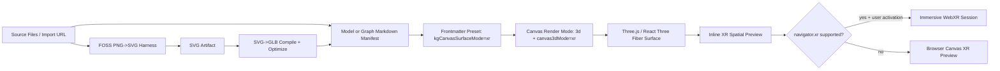

# Knowgrph XR Mode PRD & TAD

## Overview

Knowgrph XR Mode is a renderer and asset-pipeline extension that lets users inspect graph scenes and model assets spatially without leaving the existing Canvas, Source Files, Markdown Workspace, and Cloudflare delivery chain.

The min-viable-max-value scope is not a new immersive product shell. It is a first-class `xr` 3D mode that reuses the current Three.js / React Three Fiber renderer, GLB/GLTF workspace manifests, rich-media overlay ownership, and Source Files import path. Asset conversion defaults to deterministic FOSS tooling: `png -> svg` through VTracer or Potrace, then `svg -> glb` through the Dev headless GLB compiler, with optional Three.js/Blender exporters and glTF Transform optimization reserved for higher-fidelity follow-up profiles.

**Governing decision**: XR Mode must be useful before a headset session starts. A user should be able to import a `.glb`, `.gltf`, `.svg`, or `.png`, open the XR spatial inspection stage in the browser canvas, and only then enter WebXR when supported by the device and user consent.

**Current implementation baseline**:

- `kgCanvasSurfaceMode: "xr"` is already recognized as a Canvas surface preset.
- Local and URL `.glb` / `.gltf` imports already produce model asset Markdown manifests with `kgCanvasSurfaceMode: "xr"`.
- Three.js canvas rendering already parses model asset documents and renders GLB/GLTF assets without requiring an active WebXR session.
- XR Mode graph scenes already mount a distinct spatial stage instead of plain 3D globe effects.
- A FOSS PNG-to-SVG conversion harness exists in Dev with VTracer/Potrace command adapters, input/path-budget fallback gates, and zero-token cost logging.
- A deterministic SVG-to-GLB compiler exists in Dev with safe-SVG rejection, source provenance, XR manifest metadata, and GLB inspect metrics.

**External reference baseline**:

- WebXR Device API is the browser standard for VR/AR device access, using `navigator.xr.isSessionSupported()` and `navigator.xr.requestSession()` behind user activation and permission boundaries.
- Three.js supports WebXR rendering by enabling `renderer.xr.enabled`, setting an animation loop, and attaching XR session UI / controller inputs.
- glTF/GLB is the preferred runtime model format for Three.js delivery; glTF Transform supports `inspect`, `optimize`, Meshopt/Draco geometry compression, and WebP/KTX2 texture compression.
- VTracer is MIT-licensed FOSS for colored raster-to-vector conversion; Potrace is a mature FOSS bitmap tracer best suited to black/white or thresholded inputs.

---

# Part A - Product Requirements Document

## Phase 0 - Problem Discovery

### Problem Statement

Solo developers using Knowgrph can already generate, import, and render knowledge graphs, rich media, and 3D model assets, but spatial inspection remains fragmented. Graph topology, GLB/GLTF models, SVG diagrams, and raster references live in separate visual affordances, forcing repeated context switching and making it hard to evaluate whether an asset is suitable for immersive explanation, demo capture, or future AR/VR use.

The opportunity is to add a low-TCO XR inspection path that reuses existing Canvas state and FOSS conversion tools instead of buying a proprietary 3D authoring pipeline or building a new renderer.

### Problem Hypothesis

If Knowgrph exposes XR Mode as a first-class Canvas surface and adds a deterministic FOSS PNG-to-SVG-to-GLB conversion harness, then a solo developer can turn existing visual source material into spatially inspectable artifacts with near-zero monthly TCO, zero default token spend, and measurable asset performance gates.

### Personas

**Solo Dev / Founder** - builds investor demos, product walkthroughs, and AI-native knowledge graph prototypes; needs the smallest implementation that creates differentiated spatial value without paid tooling or ops burden.

**AI Orchestrator** - manages model/harness outputs and asset generation pipelines; needs typed validation, cost logs, and bounded orchestration so asset workflows do not become unmeasured token or GPU spend.

**Technical Reviewer** - verifies PRD/TAD compliance and implementation readiness; needs acceptance criteria that map to existing tests, source owners, and `/goal` conditions.

### Journey: Solo Dev - Convert A Visual Asset Into An XR Inspectable Scene

| Stage | Action | Touchpoint | Pain Point | Opportunity |
|---|---|---|---|---|
| Trigger | Has a PNG logo, diagram, screenshot, or GLB model to use in a spatial demo | Source Files / Import URL | Asset type decides behavior unpredictably | Normalize assets into explicit workspace manifests |
| Discover | Imports the asset into Knowgrph | Markdown Workspace / Source Files | Raster assets are not spatially meaningful by default | Offer deterministic FOSS vectorization for suitable PNGs |
| Engage | Opens Canvas XR Mode | Canvas View / Render Settings | WebXR support varies by browser/device | Render an inline XR inspection stage before session entry |
| Complete | Inspects graph/model in browser and optionally enters XR | Three.js canvas / WebXR entry panel | Headset support cannot be assumed | Use progressive enhancement with graceful fallback |
| Return | Exports or reuses optimized model artifacts | Workspace export / Source Files | Performance problems are discovered late | Gate assets through inspect/optimize metrics |

## Product Scope

### In Scope

- First-class `xr` surface mode in Canvas View and frontmatter.
- GLB/GLTF model asset manifests that open directly in XR Mode.
- Distinct graph XR spatial stage using the current display graph, not a separate derivation pipeline.
- Deterministic FOSS `png -> svg` vectorization harness with VTracer default and Potrace fallback.
- Deterministic `svg -> glb` compile path for vector assets that warrant 3D placement.
- GLB inspection gates for generated assets, with optional glTF Transform optimization/reporting profiles.
- TCO, token, and performance metrics emitted per conversion or optional AI-assisted step.

### Out Of Scope

- Proprietary image tracing, proprietary 3D SaaS conversion, or paid model hosting.
- Mandatory headset support before browser canvas preview works.
- Runtime conversion on every render frame.
- A separate XR graph derivation pipeline.
- Multi-user XR collaboration.
- Photorealistic 3D reconstruction from arbitrary PNGs.
- Deployment to Prod or Cloudflare as part of this document generation task.

## Epic KXR-E1 - XR Surface Mode

### User Story

**KXR-E1-S1**: As a Solo Dev, I want `xr` to be a first-class Canvas surface mode, so that I can switch from 2D/3D graph inspection to an XR-ready spatial stage without mutating GraphData.

### Acceptance Criteria

**KXR-E1-S1-AC1** - XR surface selection

Given a workspace document or toolbar action requests `kgCanvasSurfaceMode: "xr"`, when Canvas applies the view selection, then `canvasRenderMode` becomes `3d` and `canvas3dMode` becomes `xr` before the render surface is activated.

> **`/goal` translation**: `npm -C canvas run test:ci:unit -- "canvas.viewSelection.xrSurfaceMode" passes and no non-XR renderer option is removed`

**KXR-E1-S1-AC2** - Render Settings preserves XR

Given the Render Settings 3D mode select is open, when the user selects `xr`, then the setting preserves `xr` instead of coercing it to plain `3d`.

> **`/goal` translation**: `npm -C canvas run test:ci:unit -- "canvas.renderSettings.xrModeSelect" passes and RenderSettingsSection exposes option value "xr"`

**KXR-E1-S1-AC3** - Distinct graph spatial stage

Given XR Mode renders graph data, when the Three.js scene mounts, then it mounts the XR spatial stage and excludes plain 3D globe effects.

> **`/goal` translation**: `npm -C canvas run test:ci:unit -- "canvas.xrMode.graphSpatialStage" passes and XrGraphStage markers are present`

## Epic KXR-E2 - Model Asset Ingest And Render

### User Story

**KXR-E2-S1**: As a Solo Dev, I want imported `.glb` and `.gltf` files to open as XR-ready workspace documents, so that model inspection uses Source Files and Markdown Workspace rather than a separate asset manager.

### Acceptance Criteria

**KXR-E2-S1-AC1** - GLB manifest render gate

Given a valid `.glb` model asset document, when XR Mode renders it, then the Three.js canvas remains mounted even if the document has no graph nodes and the shared model component renders the asset.

> **`/goal` translation**: `npm -C canvas run test:ci:unit -- "canvas.xrMode.glbAssetRenderGate" passes and GLB magic validation is honored before loader input is built`

**KXR-E2-S1-AC2** - GLTF manifest render gate

Given a valid `.gltf` model asset document with source-relative external resources, when XR Mode renders it, then the GLTF payload preserves the source base path and the loader receives parseable JSON text.

> **`/goal` translation**: `npm -C canvas run test:ci:unit -- "canvas.xrMode.gltfAssetRenderGate" and "canvas.xrMode.gltfIngestParseRenderPipeline" pass`

**KXR-E2-S1-AC3** - Session-independent inspection

Given the browser does not support immersive WebXR sessions, when the user opens an XR model document, then the inline canvas still renders the spatial inspection stage and shows a non-blocking XR entry state.

> **`/goal` translation**: `the XR canvas renders model or graph content with data-kg-canvas-xr-status="unsupported" or "checking" and no "XR unavailable" hard-stop label blocks model rendering`

## Epic KXR-E3 - FOSS PNG To SVG To GLB Pipeline

### User Story

**KXR-E3-S1**: As a Solo Dev, I want a FOSS PNG-to-SVG conversion option before GLB compilation, so that logos, diagrams, icons, and UI snapshots can become lightweight vector geometry without paid design tools.

### Acceptance Criteria

**KXR-E3-S1-AC1** - FOSS vectorization harness

Given a PNG input marked for XR conversion, when the conversion harness runs, then it validates file type and byte limit, chooses VTracer for color inputs or Potrace for black/white thresholded inputs, emits an SVG artifact, and records a zero-token cost log.

> **`/goal` translation**: `npm -C canvas run test:ci:unit -- "canvas.xrAsset.pngToSvgHarness.vtracerZeroToken" passes with cost_log.model="none", prompt_tokens=0, completion_tokens=0, and no proprietary converter dependency`

**KXR-E3-S1-AC2** - SVG compile to GLB

Given an SVG artifact from the harness, when the compile step runs, then it produces a GLB workspace model manifest with source provenance, deterministic dimensions, draw-call metadata, and GLB container inspection metadata.

> **`/goal` translation**: `npm -C canvas run test:ci:unit -- "canvas.xrAsset.svgToGlbCompiler.manifestInspect" passes and produces kgAssetFormat="glb", kgCanvasSurfaceMode="xr", draw-call metadata, triangle-count metadata, and GLB container validation`

**KXR-E3-S1-AC3** - Raster fallback policy

Given a PNG is photographic, noisy, too large, or unsuitable for vector tracing, when the conversion harness evaluates it, then it stores the PNG as a texture-on-plane GLB candidate or keeps it as rich media instead of pretending the raster image became real geometry.

> **`/goal` translation**: `npm -C canvas run test:ci:unit -- "canvas.xrAsset.pngToSvgHarness.inputFallbacks" and "canvas.xrAsset.pngToSvgHarness.pathBudget" pass with fallback_reason and no path-count explosion`

## Epic KXR-E4 - Cost, Token, And Performance Observability

### User Story

**KXR-E4-S1**: As an AI Orchestrator, I want every XR conversion and optional AI-assisted step to emit cost, token, and performance logs, so that XR Mode remains ROI-positive and does not hide token or GPU spend.

### Acceptance Criteria

**KXR-E4-S1-AC1** - Deterministic default has zero token spend

Given the default PNG/SVG/GLB pipeline uses only local FOSS tools, when it completes, then token cost is logged as zero and monthly API cost remains zero.

> **`/goal` translation**: `npm -C canvas run test:ci:unit -- "canvas.xrAsset.pngToSvgHarness.vtracerZeroToken" and "canvas.xrAsset.svgToGlbCompiler.manifestInspect" pass with cost_log.estimated_cost_usd=0 and no external model call`

**KXR-E4-S1-AC2** - Optional AI steps are harnessed

Given a future AI-assisted asset step is enabled, when it calls a model, then input/output schemas are validated, token usage is logged, max iteration is one by default, and the circuit breaker rejects calls over budget.

> **Deferred `/goal` translation**: `AI-assisted XR step has schema validation, one-call max iteration, cost log fields, and a failing budget fixture returns structured error before model call`

**KXR-E4-S1-AC3** - Frame budget and asset budget gates

Given an XR scene is loaded on desktop or mobile, when the renderer runs the inline canvas preview, then p95 frame work remains within budget and generated GLB assets stay under configured byte/draw-call thresholds.

> **Deferred `/goal` translation**: `XR smoke proof captures nonblank canvas pixels and asset inspect metrics under configured size/draw-call budget`

## Success Metrics

| Metric | Baseline | Target | Timeline |
|---|---|---|---|
| XR surface activation | Partial tests present | `canvas.viewSelection.xrSurfaceMode` and `canvas.renderSettings.xrModeSelect` pass | MVP |
| GLB/GLTF model import to XR | Partial tests present | GLB and GLTF render gates pass without WebXR session | MVP |
| PNG->SVG conversion TCO | n/a | $0/month fixed cost using FOSS tooling | MVP |
| Token cost / deterministic conversion | n/a | 0 prompt tokens, 0 completion tokens, $0/request | MVP |
| Generated GLB inspection | n/a | GLB inspect metrics stored per generated model; glTF Transform remains the optional optimizer/reporting CLI | MVP |
| Inline XR preview support | Partial | Nonblank canvas proof on desktop; graceful unsupported state on non-WebXR browser | MVP |
| ROI Score | n/a | >= 20 for Must-tier features | MVP |

### ROI Calculation

Formula:

```
ROI Score = (User Impact x Reach) / (Build Hours + Monthly TCO + Token Cost / Month)
```

| Feature | Impact | Reach/mo | Build h | TCO/mo | Token/mo | ROI | Priority |
|---|---:|---:|---:|---:|---:|---:|---|
| XR surface mode reuse | 5 | 80 sessions | 6 | 0 | 0 | 66.7 | Must |
| GLB/GLTF model manifest render | 5 | 60 sessions | 8 | 0 | 0 | 37.5 | Must |
| FOSS PNG->SVG harness | 4 | 40 conversions | 8 | 0 | 0 | 20.0 | Must |
| SVG->GLB compile + inspect | 4 | 40 conversions | 10 | 0 | 0 | 16.0 | Should |
| Optional AI 3D reconstruction | 3 | 10 conversions | 24 | 30 | 15 | 0.4 | Won't for MVP |

## MoSCoW Priority

| Tier | Feature | ROI | Rationale |
|---|---|---:|---|
| Must | `xr` Canvas surface preset and Render Settings selection | 66.7 | Highest value per hour; already partially implemented |
| Must | GLB/GLTF workspace manifests render in XR Mode | 37.5 | Converts existing model import into immediate value |
| Must | FOSS PNG->SVG vectorization harness | 20.0 | Meets explicit FOSS and TCO requirement |
| Should | SVG->GLB compile with inspect metadata | 16.0 | Converts vectors into XR-ready model manifests with bounded runtime cost |
| Should | WebXR enter/exit panel with VR then AR support check | 12.0 | Progressive enhancement; inline preview remains primary |
| Could | KTX2 texture compression for heavy models | 7.0 | Valuable when texture-heavy assets appear |
| Could | Optional AI caption/layout suggestions | 1.5 | Only if user value is proven and token budget is capped |
| Won't | Proprietary tracing or 3D SaaS conversion | 0.5 | Violates FOSS/TCO-zero unless future ROI is extraordinary |
| Won't | Photoreal 3D reconstruction from arbitrary PNG | 0.4 | Too high TCO and low determinism for MVP |

## Min-Viable Scope

MVP is complete when:

- `kgCanvasSurfaceMode: "xr"` activates `canvasRenderMode="3d"` and `canvas3dMode="xr"`.
- Imported GLB/GLTF documents render in inline XR inspection mode without requiring a WebXR session.
- PNG conversion has a deterministic FOSS harness path to SVG with zero token spend.
- Generated or imported model assets carry inspectable metadata and a clear fallback reason when conversion is unsuitable.
- Existing renderer derivation remains the SSOT; XR Mode never forks GraphData.

## Dependencies

| Dependency | Type | TCO | FOSS / Vendor | Notes |
|---|---|---:|---|---|
| Three.js | Runtime library | $0 | FOSS | Existing dependency; WebXR and GLTFLoader path |
| React Three Fiber | Runtime library | $0 | FOSS | Existing dependency; preserve Canvas ownership |
| glTF Transform CLI | Optional build/conversion CLI | $0 | FOSS | Optional inspect/optimize profile for generated GLB artifacts |
| VTracer | Conversion CLI/library | $0 | FOSS MIT | Default color PNG->SVG vectorizer |
| Potrace | Conversion CLI | $0 | FOSS | Black/white or thresholded raster tracing fallback |
| Blender headless | Optional conversion CLI | $0 | FOSS GPL | Only if Three.js exporter cannot satisfy bevel/extrusion quality |
| Cloudflare Pages/R2/D1 | Delivery/storage | $0 target | Platform service | Existing topology; no new deploy in this task |

## Open Questions

| Question | Owner | Decision Needed By |
|---|---|---|
| Which higher-fidelity SVG geometry profile should follow the deterministic plane compiler: Three.js extrusion, Blender bevel/extrusion, or both? | Solo Dev | Before visual-fidelity expansion |
| Should the 8 MB PNG input default be adjusted for mobile-first or bulk-import profiles? | Technical Reviewer | Before export integration |
| Should generated GLB assets be committed, stored in workspace storage, or treated as ephemeral build artifacts? | Solo Dev | Before export integration |
| Which WebXR device/browser pair is the canonical smoke-test target? | Solo Dev | Before live XR validation |

---

# Part B - Technical Architecture Document

## Architecture Overview

**From source asset or graph to XR preview**: Source Files / Markdown Workspace -> frontmatter preset and model manifest parser -> shared graph/model payload -> Three.js scene -> inline XR spatial stage -> optional WebXR session.

XR Mode is a renderer variant over the existing display graph and model asset contracts. It does not own GraphData derivation, persistence, or deployment. It adds session entry, spatial staging, and asset-pipeline proof metadata around existing owners.



## Journey To System Mapping

| Journey Stage | Workflow | Data Flow | Component |
|---|---|---|---|
| Trigger | Asset import | Raw file/URL -> workspace candidate | `workspaceImport/localImport.ts`, `workspaceImport/urlContent.ts` |
| Discover | Manifest creation | GLB/GLTF bytes/text -> Markdown manifest | `workspaceImport/glbAsset.ts` |
| Engage | XR surface activation | Frontmatter -> store mode update | `canvasViewActions`, `canvas3dMode.ts`, `canvasFrontmatterPreset` |
| Complete | Inline render / optional session | Manifest or GraphData -> Three.js scene -> XR session | `ThreeGraph.impl.tsx`, `GlbAssetModel.tsx`, `ThreeGraphXr.tsx` |
| Return | Optimized artifact reuse | SVG/GLB + inspect report -> workspace/export | XR asset conversion harness |

## Component Specifications

### Component: XR Mode Resolver

**Responsibility**: Normalize and preserve `xr` as a first-class 3D mode.

**Interfaces**:

- Input: `raw: unknown`
- Output: `Canvas3dModeId = "3d" | "xr" | "voxel"`
- Errors: Unknown values normalize to `"3d"`.

**Dependencies**: `canvas/src/lib/canvas/canvas3dMode.ts`, config type owners.

**Configuration**: None.

**FOSS / Vendor**: Internal code; no vendor dependency.

**`/goal` Conditions**:

- `canvas.viewSelection.xrSurfaceMode` passes.
- `canvas.renderSettings.xrModeSelect` passes.

### Component: Model Asset Manifest Builder

**Responsibility**: Convert imported `.glb` and `.gltf` files into Markdown manifests with model metadata and XR surface activation.

**Interfaces**:

- Input: `{ name, sourceKind, sourceUrl?, buffer | text }`
- Output: Markdown with `kgAssetType: "model"`, `kgAssetFormat`, validation metadata, and `kgCanvasSurfaceMode: "xr"`.
- Errors: Invalid GLB magic or invalid GLTF JSON is recorded in frontmatter and rejected by payload helper before loader input.

**Dependencies**: `workspaceImport/glbAsset.ts`, `glbAssetDocument.ts`, `gltfFormat.ts`.

**Configuration**: Model format inferred from filename or caller.

**FOSS / Vendor**: Internal code plus glTF open format.

**`/goal` Conditions**:

- `canvas.xrMode.glbAssetRenderGate` passes.
- `canvas.xrMode.gltfAssetRenderGate` passes.
- `canvas.xrMode.gltfIngestParseRenderPipeline` passes.

### Component: XR Three.js Renderer Surface

**Responsibility**: Render graph or model payloads in inline XR Mode and optionally attach a WebXR session.

**Interfaces**:

- Input: `GraphData` or `GlbAssetDocument`, `Canvas3dModeId`, active/paused state.
- Output: Three.js canvas with spatial stage; optional `XRSession`.
- Errors: No WebGL or no renderable scene returns an empty bounded surface; no WebXR support returns a disabled entry state.

**Dependencies**: `ThreeGraph.impl.tsx`, `Scene.impl.tsx`, `XrGraphStage.tsx`, `GlbAssetModel.tsx`, `ThreeGraphXr.tsx`.

**Configuration**: Existing schema camera/layout settings; WebXR optional features `local-floor`, `bounded-floor`, and `hand-tracking`.

**FOSS / Vendor**: Three.js and React Three Fiber, both FOSS.

**`/goal` Conditions**:

- `canvas.xrMode.graphSpatialStage` passes.
- Browser smoke proves nonblank canvas for graph and model fixtures.

### Component: FOSS PNG To SVG Conversion Harness

**Responsibility**: Convert suitable PNG assets into vector SVG artifacts using local FOSS tools with typed validation and cost logging.

**Interfaces**:

- Input schema:
  - `source_path: string`
  - `source_mime: "image/png"`
  - `byte_length: number`
  - `mode: "auto" | "color" | "bw"`
  - `max_paths: number`
  - `max_output_bytes: number`
- Output schema:
  - `artifact_path: string`
  - `artifact_mime: "image/svg+xml"`
  - `tool: "vtracer" | "potrace"`
  - `path_count: number`
  - `fallback_reason?: string`
  - `cost_log: { model, prompt_tokens, completion_tokens, cache_hits, estimated_cost_usd }`
- Errors: Reject malformed input before tool execution; emit structured fallback for noisy, oversized, or photographic input.

**Dependencies**: VTracer, Potrace, optional ImageMagick/Netpbm preprocessing.

**Configuration**: Tool path, max input bytes, max output bytes, path-count budget, threshold policy.

**FOSS / Vendor**: FOSS only. VTracer is the default for color PNGs; Potrace is fallback for black/white or thresholded line art.

**Harness Contract**:

- Input schema validated before conversion.
- Output schema validated before artifact registration.
- Cost log fields: `{ model: "none", prompt_tokens: 0, completion_tokens: 0, cache_hits: 0, estimated_cost_usd: 0 }`.
- Fallback path: keep original PNG as rich media or texture-on-plane GLB candidate with explicit `fallback_reason`.

**Token Budget**: `0 + 0 @ 0 cache hits = $0/request`.

**Orchestration Topology**: Sequential; max 1 vectorization attempt plus max 1 fallback classification pass; circuit breaker on input bytes, output bytes, and path count.

**`/goal` Conditions**:

- `canvas.xrAsset.pngToSvgHarness.vtracerZeroToken` passes.
- `canvas.xrAsset.pngToSvgHarness.inputFallbacks` passes.
- `canvas.xrAsset.pngToSvgHarness.pathBudget` passes.

### Component: SVG To GLB Compile Harness

**Responsibility**: Compile vector SVG artifacts into GLB models suitable for XR placement, then inspect them and optionally optimize them.

**Interfaces**:

- Input schema:
  - `svg_path: string`
  - `extrude_depth: number`
  - `bevel_size: number`
  - `target_format: "glb"`
  - `optimization_profile: "web" | "xr-mobile"`
- Output schema:
  - `glb_path: string`
  - `manifest_path: string`
  - `inspect_report_path: string`
  - `byte_length: number`
  - `draw_calls: number`
  - `triangle_count: number`
  - `texture_bytes: number`
  - `cost_log`
- Errors: Reject unsafe SVG, invalid path geometry, or generated assets over budget.

**Dependencies**: Deterministic headless GLB compiler in Dev; optional Three.js `SVGLoader` + GLTF exporter or Blender headless for higher-fidelity geometry; optional glTF Transform CLI for optimize/reporting.

**Configuration**: Geometry precision, extrusion depth, bevel defaults, optimization profile.

**FOSS / Vendor**: FOSS only.

**Harness Contract**:

- Deterministic input/output schemas.
- No LLM call in MVP.
- Cost log model is `"none"` unless a future AI assist is explicitly enabled.

**Token Budget**: `0 + 0 = $0/request` for MVP.

**Orchestration Topology**: Sequential: sanitize SVG -> build mesh -> export GLB -> inspect -> manifest. Optional optimize profile may run after inspect with max 1 retry; circuit breaker if optimized GLB still exceeds budget.

## Data Flow: XR Surface Activation

| Stage | Component | Input Format | Output Format | Persistence | Error Handling |
|---|---|---|---|---|---|
| Ingest | Frontmatter reader | Markdown YAML | `kgCanvasSurfaceMode` string | Workspace text | Ignore missing field |
| Transform | Canvas frontmatter preset | `"xr"` | `{ canvasRenderMode: "3d", canvas3dMode: "xr" }` | Store state | Unknown modes normalize |
| Store | Zustand graph store | Mode values | Renderer state | Local/session persistence | Existing store guards |
| Serve | Canvas viewport | Renderer state | Mounted Three.js surface | None | Empty bounded surface on unsupported WebGL |
| Consume | User | Inline canvas / XR entry | Spatial inspection | None | Unsupported WebXR shows non-blocking state |

## Data Flow: Model Asset Ingest

| Stage | Component | Input Format | Output Format | Persistence | Error Handling |
|---|---|---|---|---|---|
| Ingest | Local/URL import | `.glb` bytes or `.gltf` text | Raw asset payload | Pending import buffer | Reject invalid fetch/file read |
| Transform | Manifest builder | Raw payload | Markdown manifest | Workspace document | Record validation flags |
| Store | Source Files / Markdown Workspace | Markdown text | Active document | Workspace storage | Pending materialization fallback |
| Serve | Model payload helper | Manifest | Loader input + base path | None | Reject invalid magic/JSON |
| Consume | `GlbAssetModel` | Loader input | Three.js scene object | Runtime only | Structured render fallback |

## Data Flow: FOSS PNG To SVG To GLB

| Stage | Component | Input Format | Output Format | Persistence | Error Handling |
|---|---|---|---|---|---|
| Ingest | Conversion harness | PNG file | Validated input schema | Temp workspace | Reject non-PNG/oversized input |
| Transform | VTracer/Potrace | PNG/thresholded bitmap | SVG | Artifact folder | Fallback for noisy/path-heavy output |
| Transform | SVG compiler | SVG | GLB | Artifact folder | Reject unsafe SVG/invalid geometry |
| Transform | GLB inspector / glTF Transform | GLB | Inspect metrics and optional optimized GLB + report | Artifact folder | Fail if over budget |
| Store | Manifest builder | GLB + report | Markdown model manifest | Workspace document | Preserve original PNG/SVG provenance |
| Serve | Three.js renderer | Manifest | XR spatial preview | Runtime only | Inline preview still works without WebXR |

## Integration Contracts

### Interface: XR Frontmatter Preset

| Field | Type | Required | Meaning |
|---|---|---|---|
| `kgCanvasSurfaceMode` | string | yes | `"xr"` activates XR surface intent |
| `kgCanvasRenderMode` | string | recommended | `"3d"` ensures 3D render surface |
| `kgCanvas3dMode` | string | recommended | `"xr"` preserves XR variant |

### Interface: Model Asset Manifest

| Field | Type | Required | Meaning |
|---|---|---|---|
| `kgAssetType` | string | yes | Must be `"model"` |
| `kgAssetFormat` | string | yes | `"glb"` or `"gltf"` |
| `kgAssetEncoding` | string | yes for embedded assets | `"base64-body"` or `"json-body"` |
| `kgAssetMimeType` | string | yes | `model/gltf-binary` or `model/gltf+json` |
| `kgAssetBytes` | number | recommended | Raw asset byte length |
| `kgAssetValidGltfJson` | boolean | recommended | JSON parse validation |
| `kgAssetValidGlbMagic` | boolean | GLB only | GLB container validation |
| `kgAssetUrl` | string | URL imports | Source-relative base path for external resources |

### Interface: WebXR Session Entry

| Operation | Protocol | Input | Output | Errors |
|---|---|---|---|---|
| `isSessionSupported` | Browser WebXR API | `"immersive-vr"` then `"immersive-ar"` | boolean | Unsupported -> disabled entry state |
| `requestSession` | Browser WebXR API | session mode + optional features | `XRSession` | Permission/session error -> retry state |
| `setSession` | Three.js renderer XR manager | `XRSession` | active XR renderer | Failure -> structured error state |

### Interface: Conversion Cost Log

| Field | Type | Required | MVP Value |
|---|---|---|---|
| `model` | string | yes | `"none"` |
| `prompt_tokens` | number | yes | `0` |
| `completion_tokens` | number | yes | `0` |
| `cache_hits` | number | yes | `0` |
| `estimated_cost_usd` | number | yes | `0` |

## Quality Attributes

| Attribute | Scenario | Pattern | Validation |
|---|---|---|---|
| Performance | Inline XR preview opens on existing docs | Lazy Three.js surface; no runtime conversion | Browser smoke + nonblank canvas proof |
| Performance | GLB asset is large | GLB inspect gate; optional glTF Transform optimize gate | Inspect report under byte/draw-call thresholds |
| Stability | Switch 2D/3D/XR repeatedly | View-only mode changes; no GraphData mutation | Existing canvas mode tests |
| Security | SVG input may contain unsafe content | Sanitize and compile offline; no script execution | Unsafe SVG fixture rejected |
| Privacy | WebXR device tracking requires consent | Request session only from user button | Manual/browser test of user activation |
| Observability | Conversion path hides cost | Harness emits cost log for every run | Cost-log fixture |
| Token Cost | Deterministic conversion | No model call | Token cost fields are zero |
| TCO | Solo-dev MVP | Reuse existing stack; FOSS conversion | ADR cost review |

## Deployment Strategy

This document is a source document only. Implementation should land in `knowgrph` Dev first, then follow the existing Dev -> Prod -> Cloudflare chain only when explicitly requested.

Release sequence:

1. Validate existing XR mode tests.
2. Add deterministic FOSS PNG->SVG harness behind explicit user action.
3. Add SVG->GLB compile and GLB inspect report; add glTF Transform optimize/reporting only when the artifact profile needs it.
4. Add focused browser smoke for inline XR graph/model preview.
5. Publish only after user approval and standard sync checks.

Rollback:

- Disable conversion menu action while preserving existing GLB/GLTF import manifests.
- Keep `xr` frontmatter normalization but fall back to plain 3D rendering if XR stage fails.
- Do not delete source PNG/SVG artifacts on failed conversion.

## Component Inventory

| Layer | Component | File / Module | Status |
|---|---|---|---|
| Mode resolution | XR/Voxel/3D mode normalization | `canvas/src/lib/canvas/canvas3dMode.ts` | Present |
| Toolbar | Canvas View XR selection | `canvas/src/components/toolbar/canvasViewActions.ts` | Present |
| Settings | 3D mode select | `canvas/src/lib/panels/views/RenderSettingsSection.impl.tsx` | Present |
| Import | GLB/GLTF manifest builder | `canvas/src/features/markdown-workspace/workspaceImport/glbAsset.ts` | Present |
| Parse | Model asset manifest parser | `canvas/src/lib/assets/glbAssetDocument.ts` | Present |
| Payload | GLB/GLTF loader payload | `canvas/src/lib/assets/modelAssetPayload.ts` | Present |
| Renderer | Three.js Canvas surface | `canvas/src/lib/three/ThreeGraph.impl.tsx` | Present |
| Renderer | Model asset scene | `canvas/src/lib/three/GlbAssetModel.tsx` | Present |
| Renderer | XR graph stage | `canvas/src/features/three/XrGraphStage.tsx` | Present |
| Renderer | WebXR entry panel | `canvas/src/lib/three/ThreeGraphXr.tsx` | Present |
| Harness | PNG->SVG conversion | `canvas/src/lib/xr/xrAssetConversion.ts` | Present |
| Harness | SVG->GLB compile + inspect | `canvas/src/lib/xr/xrAssetConversion.ts`, `canvas/src/features/markdown-workspace/workspaceImport/xrModelAsset.ts` | Present |
| Test | XR mode schema tests | `canvas/src/__tests__/canvas3dMode.test.ts` | Present |
| Test | XR asset conversion tests | `canvas/src/__tests__/xrAssetConversionHarness.test.ts` | Present |

---

# Architectural Decisions

## ADR-001: Reuse Existing Three.js WebXR Surface

**Status**: Accepted
**Date**: 2026-06-02

### Context

Knowgrph already ships Three.js and React Three Fiber, has lazy 3D chunk budgets, and has tests for XR mode normalization and model rendering. Adding a separate XR framework would increase bundle size, ownership complexity, and TCO.

### Decision

Reuse the existing Three.js / React Three Fiber surface and enable WebXR as progressive enhancement through `renderer.xr.enabled` and a session entry panel.

### Alternatives Considered

1. **Existing Three.js surface**: Lowest implementation cost; preserves current graph/model contracts; FOSS.
2. **A-Frame or Babylon.js**: FOSS and capable, but adds a parallel scene/rendering stack.
3. **Native OpenXR app**: Strong device support, but outside web deployment chain and high TCO.

### Rationale

The existing surface already renders graph and model data. XR Mode's highest ROI is to add spatial staging and session entry, not replatform rendering.

### TCO Impact

| Dimension | Chosen Option | Best FOSS Alternative | Delta / 12 months |
|---|---|---|---|
| Infra cost | $0/mo | $0/mo | $0 |
| Egress cost | Existing site delivery | Existing site delivery | $0 |
| Token cost | $0/mo | $0/mo | $0 |
| Build/ops cost | Low; existing owner | Medium; new framework owner | Lower TCO |
| Vendor risk | Low; FOSS | Low; FOSS | Neutral |

### Consequences

- **Positive**: Smallest viable path; current tests map directly to requirements.
- **Negative**: WebXR browser/device support remains uneven.
- **Neutral**: Later dedicated XR packages can be evaluated if interaction complexity exceeds Three.js-only ergonomics.

## ADR-002: GLB/GLTF Markdown Manifests Are The Workspace Contract

**Status**: Accepted
**Date**: 2026-06-02

### Context

Knowgrph Source Files and Markdown Workspace already use Markdown/frontmatter as the activation contract. Raw binary assets need validation, provenance, and renderer presets.

### Decision

Represent imported GLB/GLTF assets as Markdown model manifests containing validation metadata, embedded payload or source URL, and XR frontmatter presets.

### Alternatives Considered

1. **Markdown model manifest**: Reuses existing workspace, parser, Source Files, and renderer contracts.
2. **Raw asset table**: Cleaner binary storage, but creates a second workspace authority.
3. **External asset manager service**: Powerful, but high TCO and vendor/ops burden.

### Rationale

Manifests keep model assets queryable, inspectable, and compatible with existing Markdown/frontmatter workflows.

### TCO Impact

| Dimension | Chosen Option | Best FOSS Alternative | Delta / 12 months |
|---|---|---|---|
| Infra cost | $0/mo | $0/mo local asset table | $0 |
| Egress cost | Existing asset delivery | Existing asset delivery | $0 |
| Token cost | $0/mo | $0/mo | $0 |
| Build/ops cost | Low | Medium | Lower TCO |
| Vendor risk | Low | Low | Neutral |

### Consequences

- **Positive**: Model provenance and XR activation stay in one document.
- **Negative**: Large embedded base64 assets can make Markdown heavy.
- **Neutral**: Later storage can materialize large payloads while preserving manifest metadata.

## ADR-003: FOSS PNG To SVG Uses VTracer Default And Potrace Fallback

**Status**: Accepted
**Date**: 2026-06-02

### Context

The user explicitly requires FOSS `png -> svg`. PNG is raster; SVG is vector. Real conversion requires tracing, and the right tool differs by input type.

### Decision

Use VTracer as the default for color PNGs and Potrace as the fallback for black/white or thresholded line art. Reject proprietary tracing in MVP.

### Alternatives Considered

1. **VTracer default**: FOSS MIT; handles color images and produces compact SVG paths.
2. **Potrace fallback**: FOSS; excellent for black/white bitmap tracing; requires preprocessing for color/greyscale inputs.
3. **Adobe Illustrator Image Trace or online converters**: Can be convenient but violates TCO-zero and vendor-control goals.
4. **Embed PNG inside SVG**: Not acceptable as vectorization; it only wraps raster data.

### Rationale

VTracer covers the most useful solo-dev asset set: colored logos, diagrams, low-noise illustrations, and pixel art. Potrace remains valuable for monochrome or thresholded technical drawings.

### TCO Impact

| Dimension | Chosen Option | Best FOSS Alternative | Delta / 12 months |
|---|---|---|---|
| Infra cost | $0/mo local CLI | $0/mo Potrace-only | $0 |
| Egress cost | $0 | $0 | $0 |
| Token cost | $0 | $0 | $0 |
| Build/ops cost | Medium; two adapters | Low; one adapter | +small build scope accepted for color quality |
| Vendor risk | Low; FOSS | Low; FOSS | Neutral |

### Consequences

- **Positive**: Meets FOSS and TCO requirements while supporting color PNGs.
- **Negative**: Vectorization can produce too many paths for noisy images.
- **Neutral**: Harness must expose fallback reasons and path-count budgets.

## ADR-004: Default XR Asset Pipeline Is Deterministic And Zero-Token

**Status**: Accepted
**Date**: 2026-06-02

### Context

AI-native products can accidentally hide recurring token/API cost in asset workflows. XR Mode should support optional AI later, but MVP value does not require model calls.

### Decision

Default XR asset conversion uses deterministic local/FOSS tooling only. Optional AI steps are out of MVP and must use a schema-validated harness with explicit token budgets.

### Alternatives Considered

1. **Deterministic FOSS conversion**: Zero token spend; predictable; lower TCO.
2. **AI-assisted SVG/3D generation**: Potentially higher visual quality; higher cost and variance.
3. **Hosted 3D generation API**: Fast demos; high vendor and token/API TCO risk.

### Rationale

The MVP goal is to make existing assets spatially inspectable. That can be achieved with zero-token deterministic tooling, preserving AI budget for higher-value orchestration.

### TCO Impact

| Dimension | Chosen Option | Best FOSS Alternative | Delta / 12 months |
|---|---|---|---|
| Infra cost | $0/mo | $0/mo | $0 |
| Egress cost | $0 local conversion | $0 local conversion | $0 |
| Token cost | $0/mo | $0/mo | $0 |
| GPU/API cost | $0/mo | $0/mo | $0 |
| Vendor risk | Low | Low | Neutral |

### Consequences

- **Positive**: Cost behavior is easy to prove.
- **Negative**: Does not solve arbitrary photoreal 3D reconstruction.
- **Neutral**: AI generation can be added later behind explicit user opt-in and budget gates.

---

# Traceability And Goal Conditions

| PRD Requirement | TAD Component | Interface | `/goal` Condition |
|---|---|---|---|
| KXR-E1-S1-AC1 | XR Mode Resolver | Canvas View selection | `canvas.viewSelection.xrSurfaceMode` passes |
| KXR-E1-S1-AC2 | XR Mode Resolver | Render Settings select | `canvas.renderSettings.xrModeSelect` passes |
| KXR-E1-S1-AC3 | XR Three.js Renderer Surface | Scene mode mount | `canvas.xrMode.graphSpatialStage` passes |
| KXR-E2-S1-AC1 | Model Asset Manifest Builder | GLB manifest parser/payload | `canvas.xrMode.glbAssetRenderGate` passes |
| KXR-E2-S1-AC2 | Model Asset Manifest Builder | GLTF parser/payload | `canvas.xrMode.gltfAssetRenderGate` and `canvas.xrMode.gltfIngestParseRenderPipeline` pass |
| KXR-E2-S1-AC3 | XR Three.js Renderer Surface | WebXR entry panel | Browser smoke shows inline preview without session |
| KXR-E3-S1-AC1 | FOSS PNG To SVG Conversion Harness | Conversion schema | `canvas.xrAsset.pngToSvgHarness.vtracerZeroToken` passes |
| KXR-E3-S1-AC2 | SVG To GLB Compile Harness | Compile/inspect schema | `canvas.xrAsset.svgToGlbCompiler.manifestInspect` passes |
| KXR-E3-S1-AC3 | FOSS PNG To SVG Conversion Harness | Fallback schema | `canvas.xrAsset.pngToSvgHarness.inputFallbacks` and `canvas.xrAsset.pngToSvgHarness.pathBudget` pass |
| KXR-E4-S1-AC1 | Conversion Harness | Cost log | Cost log contains zero token and zero estimated cost |
| KXR-E4-S1-AC2 | Optional AI Harness | AI input/output schema | Deferred AI fixture rejects over-budget request before model call |
| KXR-E4-S1-AC3 | XR Renderer + Asset Optimizer | Smoke + inspect proof | Browser and inspect reports stay under budget |

# Validation Checklist

**PRD**:

- [x] Valid YAML frontmatter present.
- [x] Personas and user journey documented.
- [x] Acceptance criteria are Given/When/Then and trace to `/goal` conditions.
- [x] MoSCoW includes ROI and TCO rationale.
- [x] FOSS PNG-to-SVG requirement included.

**TAD**:

- [x] Components have clear responsibilities and interfaces.
- [x] Data flows specify formats, persistence, and error handling.
- [x] Harness contracts include schema validation, cost log, fallback, token budget, topology, and circuit breaker.
- [x] ADRs include FOSS alternatives and TCO comparisons.
- [x] Existing implementation owners are mapped.

# Reference Sources

- W3C WebXR Device API: `https://www.w3.org/TR/webxr/`
- Three.js WebXR examples and `GLTFLoader`: `https://github.com/mrdoob/three.js`
- glTF Transform CLI documentation: `https://gltf-transform.dev/`
- VTracer raster-to-vector converter: `https://github.com/visioncortex/vtracer`
- Potrace bitmap tracing documentation: `https://potrace.sourceforge.net/`
- PRD/TAD guideline source: `/Users/huijoohwee/Documents/GitHub/huijoohwee.github.io/guidelines/prd-tad-guidelines.md`
