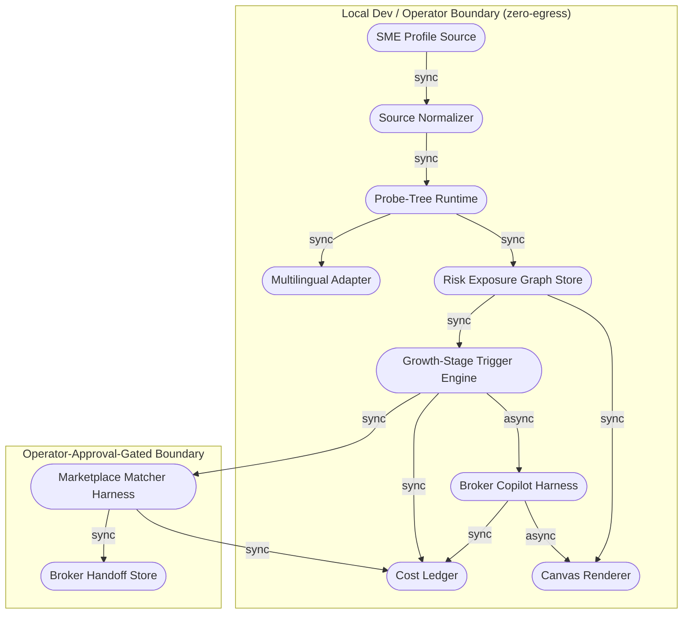

# SME Care-Agent — Growth-Stage Risk & Coverage Copilot

## Scope & Neutrality Contract

- **Universal**: this document specifies a capability — growth-stage risk-exposure mapping and coverage-gap coaching for a small/medium enterprise — independent of any specific insurer, broker, cloud vendor, or model provider.
- **Neutral**: capabilities are named by function (Risk Exposure Graph store, Probe-Tree harness, Multilingual Adapter, Marketplace Matcher harness) rather than by brand. Where a concrete tool is named (e.g. a knowledge-graph canvas, a local model runtime, a regional multilingual model), it appears only as a **non-binding reference implementation** and may be swapped for any FOSS or licensed equivalent that satisfies the same interface.
- **Agnosticism**: every requirement below is derived from this document's own content and frontmatter — never from a file name, directory layout, or a downstream mirror. Concrete identifiers (thread IDs, node IDs) are illustrative placeholders for a reference build, not hardcoded contracts.
- **Modular**: each `##` section below is self-contained and independently addressable; the PRD half (WHAT/WHY) and TAD half (HOW) can each be lifted into another document without rewriting internals, per `prd--tad-integration`.

---

# Part I — Product Requirements (PRD)

## Feature: SME Growth-Stage Risk & Coverage Copilot

### Problem Statement

Most SMEs do not know what they do not know. Coverage gaps against cyber, supply-chain, and asset risk accumulate silently as a business grows — a first hire, a first warehouse lease, a first customer-data tool, a first cross-border vendor — and each of these milestones can trigger a new statutory or practical coverage need that nobody flags. The gap surfaces only when a claim is denied or a loss hits, at which point it is too late and too expensive to close. The opportunity is to turn this into a visible, continuously-updated picture, anchored to actual business growth events rather than a one-time policy review.

### Personas

| Persona | Jobs-to-be-done |
|---|---|
| **SME Owner** *(primary)* | Understand current risk exposure in plain language; get proactively nudged when a growth event opens a new gap; avoid overbuying or underbuying coverage |
| **Licensed Broker** *(downstream consumer)* | Receive a pre-qualified, structured gap brief instead of a cold lead; avoid re-asking discovery questions the SME already answered |
| **Solo Founder / AI Orchestrator** *(operator)* | Ship and operate the copilot at near-zero TCO; keep every AI call inside an observable, cost-bounded harness |

### User Journey Stage

This feature addresses the **Discover → Engage → Complete** stages of the journey below. See `flow-patterns` (User Journey Flow) in the parent guidelines.

## Journey: SME Owner — Close My Coverage Gap Before It Costs Me

| Stage    | Action                                                   | Touchpoint                  | Pain Point                                   | Opportunity                                          |
|----------|-----------------------------------------------------------|------------------------------|-----------------------------------------------|-------------------------------------------------------|
| Trigger  | A growth event happens (hire, lease, new vendor, new data tool, new market) | Business operations, no insurance touchpoint | Owner has no reason to think about coverage right now | Detect the event from data the owner already has |
| Discover | Owner enters a redacted business profile once            | Local canvas / chat intake   | Owner doesn't know what "exposure" even means | Probe-tree asks 3 plain-language clarifying questions |
| Engage   | Copilot maps the Risk Exposure Graph (REG) and fires growth-stage triggers | Canvas storyboard, nudge message | Owner can't see the gap without a broker's manual review | Visual red (uncovered) vs green (covered) edges |
| Complete | Owner receives a plain-language gap explanation and, on approval, a matched-coverage handoff packet | Canvas + broker handoff export | Owner doesn't know which product or broker to approach | Ranked candidate matches, routed to a licensed broker, not a sales pitch |
| Return   | REG re-evaluates on the next detected growth-stage delta   | Same canvas, re-triggered     | Gaps silently reopen as the business keeps growing | Always-on nudge without recurring manual review |

### User Stories

**Epic A — Risk Exposure Graph & Source Intake**

- **As an** SME owner, **I want** to enter a redacted business profile once, **so that** the copilot can build a picture of my risk exposure without me filling out a broker's form.
- **As an** SME owner, **I want** the intake to reject anything that looks like a registry ID or financial account number, **so that** I never accidentally expose sensitive data to the copilot.

**Epic B — Probe-Tree Branching Intake**

- **As an** SME owner, **I want** to be asked a small number of plain-language clarifying questions, **so that** the copilot fills gaps in my profile without a long form.
- **As a** solo builder, **I want** every probe branch to be cost-logged and bounded, **so that** the intake conversation cannot run away in tokens or turns.

**Epic C — Growth-Stage Trigger Engine**

- **As an** SME owner, **I want** the copilot to recognize when a growth milestone (first hire, first lease, first cross-border vendor, first customer-data tool, first overseas market, fundraise) changes my exposure, **so that** I don't have to remember to check coverage myself.

**Epic D — Agentic Broker Copilot (Nudge)**

- **As an** SME owner, **I want** a proactive, plain-language nudge when a new gap is detected, **so that** I act on it before it becomes a denied claim.
- **As an** SME owner, **I want** the nudge to never auto-send anything on my behalf, **so that** I stay in control of who I talk to.

**Epic E — Coverage Marketplace Matcher**

- **As an** SME owner, **I want** to see which categories of coverage would close a flagged gap, **so that** I walk into a broker conversation already informed.
- **As a** licensed broker, **I want** to receive a structured, ranked gap brief, **so that** I can quote faster without re-running discovery.

**Epic F — Multilingual Adapter**

- **As an** SME owner in Singapore, Malaysia, Indonesia, or a Mandarin-speaking market, **I want** to interact in my working language, **so that** the copilot is usable without an English-only bottleneck.

### Acceptance Criteria

**Epic A**
**Given** a redacted business profile is submitted **When** `/source.normalize` runs **Then** a redacted source summary and a missing-field list are returned, and any registry ID, bank/financial account number, or credential is rejected before persistence.

> **VCC translation**: `Verify the normalize step's own output contains zero registry-ID-pattern or credential-pattern matches, and a missing-field list is present, with no other document mutated.`

**Epic B**
**Given** a normalized profile **When** `knowgrph.probe.generate` is called with `token_budget=1200` and `recall_top_k=0` **Then** at most 3 candidate clarification options are returned, no graph state is mutated, and the `cost_log` for the call reports local-zero cost.

> **VCC translation**: `Verify the generate call's own output shows option_count ≤ 3, cost_log.estimated_cost_usd == 0, and a before/after diff of data/probe-tree is empty.`

**Given** a selected option **When** `knowgrph.probe.select` runs **Then** exactly one fresh `type: probe` markdown node and one `branches-to` edge are written under `data/probe-tree`, and the call's own `cost_log` reports local-zero cost.

> **VCC translation**: `Verify select's own output reports exactly one new probe node id and one branches-to edge id, and cost_log.estimated_cost_usd == 0.`

**Epic C**
**Given** a Risk Exposure Graph with a new `@node`/`@edge` delta **When** the Growth-Stage Trigger Engine evaluates it **Then** it fires only against a declared row of the Growth-Stage Trigger Map and never an invented trigger.

> **VCC translation**: `Verify every fired trigger's id in the engine's own output matches a row id in the published Growth-Stage Trigger Map, with zero unmatched trigger ids.`

**Epic D**
**Given** a fired trigger **When** the Broker Copilot drafts a nudge **Then** the nudge is produced as a draft artifact only, and no outbound message is sent without a recorded `@operator` approval event.

> **VCC translation**: `Verify the copilot's own output contains a draft artifact id and an approval_state field equal to "pending" or "approved", with zero send-events logged when approval_state is "pending".`

**Epic E**
**Given** an `@operator`-approved gap **When** the Marketplace Matcher runs **Then** it returns a ranked list of catalog categories per gap and a broker-handoff packet, and it never returns a bindable quote or transaction id.

> **VCC translation**: `Verify the matcher's own output contains a ranked category list and a handoff packet id, and contains zero fields named quote_id, bind_id, or policy_number.`

**Epic F**
**Given** an intake in `ms`, `id`, or `zh` **When** the Multilingual Adapter is active **Then** probe questions and nudges are returned in the requested language, falling back to plain `en-SG` when the adapter is unavailable.

> **VCC translation**: `Verify the adapter's own output field lang matches the requested language, or equals "en-SG" with a fallback_reason populated when the requested language model is unreachable.`

### Success Metrics

| Metric | Baseline | Target | Timeline |
|--------|----------|--------|----------|
| SME owners who see a first REG visualization | 0 | ≥ 1 (solo demo) → 20 (pilot) | Hackathon → 4 weeks post |
| Gaps flagged that a broker confirms as real on first review | — | ≥ 70% precision | Pilot |
| Time-to-value (TTV steps) | est. 6 steps | ≤ 6 steps | Phase 0 |
| Time-to-value (TTV elapsed) | est. 8 min | ≤ 10 min | Phase 0 |
| Token cost / month (at 100 intakes/mo) | est. | ≤ US$5/mo | Pilot |
| Monthly TCO | est. | ≤ US$1.20/day (~US$36/mo), per existing Knowgrph TCO envelope | Pilot |
| ROI Score (Must-tier features) | — | ≥ team-defined threshold | Sprint 1 |

## Time-to-Value: SME Care-Agent (First REG + First Flagged Gap)

| Dimension          | Estimate      | Target ceiling | Validation method          |
|--------------------|---------------|----------------|-----------------------------|
| TTV steps          | 6 steps (open canvas → paste redacted profile → normalize → answer 3 probe questions → view REG → see first flagged gap) | ≤ 6 steps | Walk-through on clean local canvas |
| TTV elapsed time   | 8 min         | ≤ 10 min       | Timed first-run test        |
| First-value action | First red (uncovered) edge rendered on the REG with a plain-language explanation | —              | Observable Storyboard card   |
| Persona            | SME Owner     | —              | Defined above                |

### MoSCoW Priority

| Tier | Feature | ROI rationale |
|---|---|---|
| **Must** | Epic A — Source normalize + REG store | Zero-cost gate that everything else depends on; without it nothing downstream is trustworthy |
| **Must** | Epic B — Probe-tree branching intake | Reuses existing Knowgrph probe-tree runtime at near-zero build hours; high reach (every intake uses it) |
| **Must** | Epic C — Growth-Stage Trigger Engine | Deterministic rule engine, no model cost; directly produces the "aha" gap-visibility moment |
| **Should** | Epic D — Broker Copilot nudge | High owner-retention value, moderate build hours (Hermes-pattern reuse keeps this cheap) |
| **Should** | Epic F — Multilingual Adapter | Required for MY/ID/CN reach but can launch English-first for the SG pilot |
| **Could** | Epic E — Marketplace Matcher | High perceived value but carries regulatory-scope risk (licensed-activity boundary); ships behind an explicit approval gate |
| **Won't (this increment)** | Live insurer/broker API integration, binding quotes, underwriting | Out of scope until a licensed-broker partnership and compliance review exist |

### Min-Viable Scope

The smallest deliverable satisfying Must-tier acceptance criteria is: **redacted-profile intake → probe-tree clarification → Risk Exposure Graph with growth-stage triggers rendered as red/green edges on the Canvas**, with local-zero cost logs throughout. This explicitly excludes the Broker Copilot's outbound nudge automation and the Marketplace Matcher's catalog ranking, both of which are Should/Could tier.

### Out of Scope

- Binding insurance quotes, policy issuance, or underwriting decisions of any kind.
- Claims adjudication or dispute resolution.
- Storage of real business registry identifiers, bank/financial account data, or credentials.
- Live broker/insurer API calls without an explicit, recorded `@operator` approval event.
- Jurisdictions beyond Singapore (primary), Malaysia, Indonesia, and Mandarin-speaking China in this increment.

### Dependencies

- Existing Knowgrph KGC schema (`@node`/`@edge`/`@cluster` sigils, YAML-frontmatter SSOT) as the REG data model — FOSS, no new dependency.
- Existing MCP probe-tree runtime (`knowgrph.probe.generate/select/evolve`) — FOSS, reused unmodified.
- A local model runtime (e.g. Ollama) for zero-egress probe generation — FOSS.
- A regional multilingual model adapter (reference implementation: a SEA-language-capable open model) for Epic F — FOSS-first; see ADR-2.
- An open or mock coverage-category catalog to seed the Marketplace Matcher — see ADR-3; no live insurer contract required for this increment.

### Open Questions

- Which open/public coverage-category dataset (if any) is suitable to seed the Marketplace Matcher without implying an endorsement of a specific insurer?
- Does China market entry require a separate, locally-licensed-insurer connector track, and should that be scoped as a Follow-on rather than part of this increment?
- What precision threshold on flagged gaps is acceptable before broker trust in the handoff packet is at risk?

---

# Part II — Technical Architecture (TAD)

## Architecture: SME Care-Agent — Growth-Stage Risk & Coverage Copilot

### Overview

**From a redacted SME profile to a broker-ready gap brief**: Source intake → Risk Exposure Graph (REG) construction via probe-tree branching → Growth-Stage Trigger Engine evaluation → Broker Copilot nudge (Should-tier) → operator-approved Marketplace Matcher (Could-tier) → Canvas projection, all inside a zero-egress, cost-logged harness chain.

### Journey → System Mapping

| Journey Stage | Workflow | Data Flow | Orchestration/Harness Flow | Topology Node(s) | Component |
|---|---|---|---|---|---|
| Trigger | Growth-event detection | REG delta ingest | Growth-Stage Trigger Engine (sequential) | Trigger Engine | `TriggerEngineHarness` |
| Discover | Probe-tree intake | Profile → probe options → resolved path | Probe-Tree Intake (agentic loop) | Probe-Tree Runtime | `ProbeTreeHarness` |
| Engage | REG construction | Redacted profile → REG nodes/edges | Sequential (Source Normalize → REG Write) | REG Store, Source Normalizer | `SourceNormalizer`, `REGStore` |
| Complete | Broker Copilot nudge / Marketplace match | Trigger → draft nudge / gap → ranked catalog | Broker Copilot (sequential); Marketplace Matcher (fan-out/fan-in) | Broker Copilot Harness, Marketplace Matcher Harness | `BrokerCopilotHarness`, `MarketplaceMatcherHarness` |
| Return | Canvas projection | REG + trigger state → Storyboard cards | Canvas Projection (sequential, $0 render cost) | Canvas Renderer | `CanvasProjector` |

### Topology

**Version**: 1 — 2026-07-14
**Boundaries**: Local Dev / Operator boundary (default, zero-egress); Operator-Approval-Gated boundary (Marketplace Matcher and any broker-handoff export)

| Node | Role | Type | Connects to | Connection type | Data residency |
|------|------|------|------|----------------|----------------|
| SME Profile Source | Producer | Frontmatter doc | Source Normalizer | Sync | Local |
| Source Normalizer | Router | Local harness | Probe-Tree Runtime | Sync | Local |
| Probe-Tree Runtime | Router + Executor | MCP local harness | REG Store, Multilingual Adapter | Sync | Local |
| Multilingual Adapter | Executor | Local model runtime (or remote regional model) | Probe-Tree Runtime | Sync | Local (default) / Region (if remote adapter used, see ADR-2) |
| REG Store | Store | Markdown/frontmatter SSOT | Trigger Engine, Canvas Renderer | Sync | Local (git-backed) |
| Growth-Stage Trigger Engine | Router | Local harness (rule-based) | Broker Copilot Harness, Marketplace Matcher Harness, Cost Ledger | Sync | Local |
| Broker Copilot Harness | Executor | Local harness | Cost Ledger, Canvas Renderer | Async | Local |
| Marketplace Matcher Harness | Executor | Local harness | Cost Ledger, Broker Handoff Store | Sync | Local |
| Broker Handoff Store | Store | Markdown export | — | — | Local (exported only on operator approval) |
| Cost Ledger | Store | Local JSON/CSV | — | — | Local |
| Canvas Renderer | Consumer | KGC Canvas (existing shared renderer) | — | — | Local |



**Version notes**: Initial topology for this increment; no prior version to diff against.

### Orchestration/Harness Flows

**Pipeline**: Probe-Tree Intake
**Topology pattern**: Agentic loop | **Max iterations**: 5 branch resolutions | **Circuit-breaker**: thread reaches a leaf node (profile complete) or `token_budget` (1200) is exhausted
**Token budget**: ~250 prompt tokens + ~150 completion tokens @ target 40% cache hit rate = est. $0.00 (local model) / call

| Role | Component | Input schema | Output schema | Cost log | Fallback |
|------|-----------|-------------|--------------|----------|----------|
| Dispatcher | `ProbeTreeHarness.generate` | `{thread_root_id, current_node_id, k, recall_top_k, token_budget}` | `{options[]}` | — | Reject with typed error if token_budget missing |
| Executor | `ProbeTreeHarness.select` + local/regional model | `{selected_option_id}` | `{probe_node_id, branches_to_edge_id}` | ✓ required | Degraded: heuristic fallback question, no model call |
| Observer | Cost Ledger | `{cost_log stream}` | `{ledger_entry}` | — | Silent fail; log gap |
| Consumer | `ProbeTreeHarness.evolve` + REG Store | `{resolved_path}` | `{memory_exemplar, incomplete_parent_flag}` | ✓ required | Upstream error propagation |

**Happy path**: Trigger fires on new/incomplete profile → Dispatcher validates and calls `generate` → user selects an option → `select` writes probe node + edge → loop repeats until leaf or budget exhausted → `evolve` scores the path and writes one memory exemplar.
**Alternate paths**: Selected option ambiguous → re-probe once, then default to lowest-risk-assumption branch.
**Error paths**: Local model unreachable → heuristic fallback question bank activates; `estimated_cost_usd` stays 0.
**Postconditions**: exactly one new probe node + edge per selection; cost log persisted; no unbounded loop past 5 iterations or the token budget.

---

**Pipeline**: Growth-Stage Trigger Engine
**Topology pattern**: Sequential | **Max iterations**: 1 (deterministic rule match, no loop) | **Circuit-breaker**: n/a (bounded rule set)
**Token budget**: 0 prompt + 0 completion = $0.00 / call (rule-based; optional plain-language explanation step may add ~100 completion tokens)

| Role | Component | Input schema | Output schema | Cost log | Fallback |
|------|-----------|-------------|--------------|----------|----------|
| Dispatcher | `TriggerEngineHarness` | `{reg_delta}` | `{matched_rule_id or none}` | — | Reject with typed error if `reg_delta` schema invalid |
| Executor | Rule matcher against Growth-Stage Trigger Map | `{matched_rule_id}` | `{trigger_event}` | ✓ required (even at $0) | No match → no-op, not an error |
| Observer | Cost Ledger | `{cost_log stream}` | `{ledger_entry}` | — | Silent fail; log gap |
| Consumer | Broker Copilot Harness, Marketplace Matcher Harness | `{trigger_event}` | `{downstream_action}` | — | Upstream error propagation |

**Postconditions**: every fired `trigger_event.id` maps to a published Growth-Stage Trigger Map row; unmatched deltas produce no invented trigger.

---

**Pipeline**: Broker Copilot Nudge (Should-tier)
**Topology pattern**: Sequential | **Max iterations**: 1 per trigger event | **Circuit-breaker**: n/a
**Token budget**: ~150 prompt tokens + ~120 completion tokens @ 30% cache hit rate = est. $0.00–$0.001 / call (local model)

| Role | Component | Input schema | Output schema | Cost log | Fallback |
|------|-----------|-------------|--------------|----------|----------|
| Dispatcher | `BrokerCopilotHarness` | `{trigger_event}` | `{draft_request}` | — | Reject if trigger_event unmatched |
| Executor | Local/regional model draft generator | `{draft_request}` | `{nudge_draft, approval_state: "pending"}` | ✓ required | Degraded: template-based nudge, no model call |
| Observer | Cost Ledger | `{cost_log stream}` | `{ledger_entry}` | — | Silent fail; log gap |
| Consumer | Canvas Renderer | `{nudge_draft}` | `{storyboard_card}` | — | Upstream error propagation |

**Postconditions**: nudge stays `approval_state: "pending"` until an `@operator` approval event is recorded; no outbound send occurs otherwise.

---

**Pipeline**: Coverage Marketplace Matcher (Could-tier, approval-gated)
**Topology pattern**: Fan-out / Fan-in | **Max iterations**: 1 fan-out round per approved gap; **Circuit-breaker**: bounded by catalog size (no recursive matching)
**Token budget**: ~200 prompt tokens + ~100 completion tokens per candidate @ 50% cache hit rate, capped at 10 candidates/gap = est. $0.00–$0.01 / gap (local model)

| Role | Component | Input schema | Output schema | Cost log | Fallback |
|------|-----------|-------------|--------------|----------|----------|
| Dispatcher | `MarketplaceMatcherHarness` | `{approved_gap_id}` | `{candidate_set}` | — | Reject if `@operator` approval missing |
| Executor | Fan-out scorer over catalog entries | `{candidate_set}` | `{scored_candidates[]}` | ✓ required | Degraded: rule-based category match only, no model call |
| Observer | Cost Ledger | `{cost_log stream}` | `{ledger_entry}` | — | Silent fail; log gap |
| Consumer | Broker Handoff Store | `{scored_candidates[], ranked}` | `{handoff_packet}` | — | Upstream error propagation |

**Postconditions**: output contains a ranked category list and a handoff packet id; contains zero `quote_id`, `bind_id`, or `policy_number` fields.

### Component Specifications

**Component**: `SourceNormalizer`
**Responsibility**: Reject or redact unsafe fields from an SME profile before any downstream persistence or model call.
**Interfaces**: `/source.normalize #frontmatter #no-hardcode @source.frontmatter @source.body`
**Dependencies**: none (pure validation/transform)
**Configuration**: forbidden-field pattern list (registry ID, bank account, credential patterns)
**FOSS / Vendor**: FOSS (in-repo validation logic)
**VCC Conditions**: see Epic A acceptance criteria above

**Component**: `ProbeTreeHarness`
**Responsibility**: Generate, select, and evolve growth-stage clarification branches without mutating graph state on `generate`.
**Interfaces**: `knowgrph.probe.generate` / `.select` / `.evolve` (MCP tool contract)
**Dependencies**: local model runtime or `MultilingualAdapter`; `REGStore` for `evolve` checkpoint reads
**Configuration**: `token_budget`, `option_count`, `recall_top_k`
**FOSS / Vendor**: FOSS (existing Knowgrph probe-tree runtime, reused unmodified)
**Harness Contract**:
  - Input schema: `{thread_root_id, current_node_id, k, recall_top_k, token_budget}`
  - Output schema: `{options[]}` (generate) / `{probe_node_id, branches_to_edge_id}` (select) / `{memory_exemplar, incomplete_parent_flag}` (evolve)
  - Cost log fields: `{ model, prompt_tokens, completion_tokens, cache_hits, estimated_cost_usd }`
  - Fallback path: heuristic local question bank when the model adapter is unreachable
**Token Budget**: ~250 prompt + ~150 completion @ 40% cache hit rate = est. $0.00/call
**Orchestration Topology**: Agentic loop, max 5 iterations, circuit-breaker: leaf node reached or token budget exhausted
**VCC Conditions**: see Epic B acceptance criteria above

**Component**: `REGStore`
**Responsibility**: Own the Risk Exposure Graph as the frontmatter-backed source of truth (`@node`/`@edge`/`@cluster`).
**Interfaces**: existing KGC `kgc-computing-flow/v1` schema read/write
**Dependencies**: git-backed file store
**Configuration**: none beyond existing KGC schema conventions
**FOSS / Vendor**: FOSS (existing Knowgrph schema, reused unmodified)
**VCC Conditions**: every REG delta traces to exactly one source-normalized profile field; no orphaned nodes

**Component**: `TriggerEngineHarness`
**Responsibility**: Evaluate REG deltas against the Growth-Stage Trigger Map and fire only declared triggers.
**Interfaces**: `/harness.define #harness @local-harness @mcp-gateway`
**Dependencies**: `REGStore`
**Configuration**: Growth-Stage Trigger Map (versioned table, see PRD Epic C)
**FOSS / Vendor**: FOSS (in-repo rule engine)
**Harness Contract**:
  - Input schema: `{reg_delta}`
  - Output schema: `{trigger_event}` or `{none}`
  - Cost log fields: `{ model: "n/a", prompt_tokens: 0, completion_tokens: 0, cache_hits: 0, estimated_cost_usd: 0 }`
  - Fallback path: no match is a valid no-op, never an invented trigger
**Token Budget**: $0.00/call (rule-based)
**Orchestration Topology**: Sequential, 1 iteration
**VCC Conditions**: see Epic C acceptance criteria above

**Component**: `BrokerCopilotHarness`
**Responsibility**: Draft a plain-language nudge on a fired trigger; never send without recorded operator approval.
**Interfaces**: `/harness.define #ttv @local-harness @operator`
**Dependencies**: `TriggerEngineHarness`, `MultilingualAdapter`
**Configuration**: nudge template set; approval-state machine (`pending` → `approved` → `sent`)
**FOSS / Vendor**: FOSS (local model or template fallback)
**Harness Contract**:
  - Input schema: `{trigger_event}`
  - Output schema: `{nudge_draft, approval_state}`
  - Cost log fields: `{ model, prompt_tokens, completion_tokens, cache_hits, estimated_cost_usd }`
  - Fallback path: template-based nudge, no model call
**Token Budget**: ~150 prompt + ~120 completion @ 30% cache hit rate = est. $0.00–$0.001/call
**Orchestration Topology**: Sequential, 1 iteration per trigger
**VCC Conditions**: see Epic D acceptance criteria above

**Component**: `MarketplaceMatcherHarness`
**Responsibility**: Rank coverage-category candidates against an operator-approved gap and produce a broker-handoff packet; never a bindable transaction.
**Interfaces**: `/mcp.capabilities #approval-gate @mcp-gateway @operator`
**Dependencies**: `TriggerEngineHarness` output, coverage-category catalog (open/mock, see ADR-3)
**Configuration**: catalog source, max candidates per gap (10)
**FOSS / Vendor**: FOSS (rule-based fallback); model-assisted ranking optional
**Harness Contract**:
  - Input schema: `{approved_gap_id}`
  - Output schema: `{scored_candidates[], handoff_packet}`
  - Cost log fields: `{ model, prompt_tokens, completion_tokens, cache_hits, estimated_cost_usd }`
  - Fallback path: rule-based category match only, no model call
**Token Budget**: ~200 prompt + ~100 completion per candidate, capped at 10 candidates @ 50% cache hit rate = est. $0.00–$0.01/gap
**Orchestration Topology**: Fan-out/Fan-in, bounded by catalog size, no recursion
**VCC Conditions**: see Epic E acceptance criteria above

**Component**: `MultilingualAdapter`
**Responsibility**: Serve probe questions and nudges in `en`/`ms`/`id`/`zh`, falling back to `en-SG` when unavailable.
**Interfaces**: local model runtime call or regional-model API call (reference implementation only)
**Dependencies**: none beyond model runtime
**Configuration**: `coverage[]`, `fallback` language
**FOSS / Vendor**: FOSS-first; see ADR-2 for deployment-model comparison
**Harness Contract**:
  - Input schema: `{text, target_lang}`
  - Output schema: `{text, lang, fallback_reason?}`
  - Cost log fields: `{ model, prompt_tokens, completion_tokens, cache_hits, estimated_cost_usd }`
  - Fallback path: `en-SG` plain language with `fallback_reason` populated
**Token Budget**: workload-dependent; bounded by the calling harness's own budget (Probe-Tree or Broker Copilot)
**Orchestration Topology**: Sequential, invoked inline by calling harness
**VCC Conditions**: see Epic F acceptance criteria above

**Component**: `CanvasProjector`
**Responsibility**: Render REG, trigger state, and nudge drafts as Storyboard cards using the existing shared Canvas renderer.
**Interfaces**: `/canvas.project #canvas @canvas @runtime-proof`
**Dependencies**: `REGStore`, `TriggerEngineHarness`, `BrokerCopilotHarness`
**Configuration**: existing shared renderer contract (no new renderer fork)
**FOSS / Vendor**: FOSS (existing Knowgrph Canvas, reused unmodified)
**VCC Conditions**: Storyboard renders red/green edges matching REG state 1:1; zero token cost on render

### Integration Contracts

| Interface | Protocol | Format | Errors |
|---|---|---|---|
| `knowgrph.probe.generate/select/evolve` | MCP tool call | JSON | Typed error on invalid schema or missing `token_budget` |
| REG frontmatter read/write | File I/O (git-backed) | YAML frontmatter + Markdown body | Parser fails closed on malformed YAML (no silent repair) |
| `TriggerEngineHarness` evaluate | In-process function call | Typed struct | Unmatched delta returns `none`, not an error |
| Broker handoff export | File export (Markdown) | Markdown + KTV fields | Export blocked without `@operator` approval event |

### Architectural Decisions

See ADR-1, ADR-2, ADR-3 below.

## ADR-1: Reuse the Existing Probe-Tree Runtime for Growth-Stage Intake

**Status**: Accepted
**Date**: 2026-07-14

### Context
The intake conversation needs branching clarification (headcount band, lease status, vendor footprint, data tools, target markets) without a long static form.

### Decision
Reuse the existing Knowgrph probe-tree MCP runtime (`generate`/`select`/`evolve`) unmodified, pointed at a new `risk-copilot-demo` thread root, instead of building a bespoke dialogue engine.

### Alternatives Considered
1. **Bespoke risk-dialogue state machine**: Pros — full control over branching logic. Cons — duplicate build effort, no reuse of existing memory-exemplar scoring, higher build hours.
2. **FOSS alternative — generic open-source conversational-form library** (e.g. a form-flow FOSS package): Pros — mature, widely used. Cons — no native graph-store integration; would require a second checkpoint datastore, violating the existing "no native checkpointer datastore" constraint.

### Rationale
The probe-tree runtime already satisfies the harness contract (typed input/output, cost log, non-idempotent process semantics) and writes directly into the same Markdown/frontmatter SSOT the REG uses — zero integration cost, zero new dependency.

### TCO Impact

| Dimension | Chosen Option (reuse, self-managed) | Best FOSS Alternative (bespoke build, self-managed) | Delta / 12 months |
|---|---|---|---|
| Infra cost | $0/mo (existing Oracle ARM / local) | $0/mo | $0 |
| Egress cost | $0/mo | $0/mo | $0 |
| Token cost | ~$0–2/mo at pilot volume | ~$0–2/mo (same model calls) | $0 |
| Ops burden | Low (already operated) | High (new component to maintain) | − build hours saved |
| Vendor risk | Low (in-repo) | Low (in-repo) | — |

### Consequences
- **Positive**: near-zero build hours; consistent memory/exemplar scoring across all Knowgrph probe-tree use cases (care-agent, risk-copilot, future domains).
- **Negative**: any future probe-tree schema change affects both the care-agent and risk-copilot demos; requires coordinated versioning.
- **Neutral**: risk-copilot becomes a second production consumer of the probe-tree contract, increasing its reuse value.

---

## ADR-2: Multilingual Adapter — Local Model vs Regional Managed API

**Status**: Accepted
**Date**: 2026-07-14

### Context
SG/MY/ID/CN reach requires `ms`/`id`/`zh` support in addition to `en`. A regional multilingual model (reference implementation: an open SEA-language-capable model) is the natural fit, but it can be served either as a self-hosted local model or via a managed regional API.

### Decision
Default to a **self-hosted, Ollama-served** open multilingual model for the pilot; treat a managed regional API as a Follow-on option only if self-hosted output quality proves insufficient for `zh`/`id` at pilot scale.

### Alternatives Considered
1. **Managed/Serverless regional API**: Pros — no local GPU/CPU provisioning, scales automatically. Cons — per-call egress and token cost, external dependency for a core language-coverage feature.
2. **FOSS alternative — self-hosted open multilingual model (Provisioned/Self-Managed)**: Pros — zero egress, reuses existing Oracle Always Free ARM allocation, aligns with existing zero-TCO discipline. Cons — full ops burden (model updates, capacity headroom on the already-flagged reduced Ampere A1 allocation).
3. **Hybrid/Consolidated**: run the multilingual adapter on the same self-managed runtime already serving the probe-tree's local model calls, amortizing one provisioned host across both workloads.

### Rationale
Self-hosted keeps token cost at $0 and matches the existing zero-egress infrastructure posture; consolidating onto the existing Oracle ARM host (already used for unmetered inference) avoids provisioning a second runtime.

### TCO Impact

| Dimension | Chosen Option [Provisioned/Self-Managed, Hybrid/Consolidated] | Best Alternative [Managed/Serverless regional API] | Delta / 12 months |
|---|---|---|---|
| Infra cost | $0/mo incremental (shares existing Oracle ARM host) | $0/mo base + per-call fee | Potentially +$/mo at scale for Managed |
| Egress cost | $0/mo | Non-zero (API egress) | + for Managed |
| Token cost | $0/mo | Non-zero per call | + for Managed |
| Ops burden | Medium (shared host capacity planning, especially given the June 2026 Ampere A1 allocation reduction flagged elsewhere) | Low | − for self-managed |
| Vendor risk | Low (open model, swappable) | Medium (API-dependent) | — |

### Consequences
- **Positive**: zero incremental token/egress cost; consistent with existing FOSS-first, zero-TCO posture.
- **Negative**: shared-host capacity planning is now a real constraint given the flagged Oracle allocation reduction — this ADR's exit criterion should be re-evaluated if that audit shows insufficient headroom.
- **Neutral**: a managed-API fallback remains available as a Follow-on if self-hosted quality is insufficient for `zh`/`id`.

---

## ADR-3: Coverage Catalog Source — Open/Mock Catalog vs Live Insurer API

**Status**: Accepted
**Date**: 2026-07-14

### Context
The Marketplace Matcher needs a coverage-category catalog to rank candidates against a flagged gap. A live insurer/broker API would give real product data but crosses into licensed-intermediary territory in SG/MY/ID/China; an open or mock catalog avoids that boundary for this increment.

### Decision
Seed the Marketplace Matcher with an open or operator-curated **mock coverage-category catalog** (category-level only — e.g. "cyber liability," "public liability" — never a specific insurer product or premium) for this increment. Live insurer/broker API integration is explicitly Follow-on and gated on a licensed-broker partnership.

### Alternatives Considered
1. **Live insurer/broker API (Managed/Serverless)**: Pros — real, actionable product data. Cons — regulated-activity risk (recommending specific insurance products may require a licensed-intermediary status in SG/MY/ID and especially China); non-zero integration cost; out of reach for a hackathon-scoped build.
2. **FOSS alternative — open/mock category catalog (self-managed, in-repo)**: Pros — zero licensing risk, zero egress cost, sufficient to demonstrate the gap-to-category mapping value proposition. Cons — not directly bindable; still requires a licensed broker for the next step.

### Rationale
Keeping the matcher at category-level output (not specific products, premiums, or insurers) preserves the "informational aid, not licensed advice" boundary stated in the safety policy, while still delivering the core "guide them to the right protection" value proposition from the problem statement.

### TCO Impact

| Dimension | Chosen Option [self-managed, mock catalog] | Best Alternative [Managed/Serverless live insurer API] | Delta / 12 months |
|---|---|---|---|
| Infra cost | $0/mo | Integration + subscription fee (varies) | + for live API |
| Egress cost | $0/mo | Non-zero | + for live API |
| Token cost | ~$0–1/mo | ~$0–1/mo (similar ranking calls) | ~$0 |
| Ops burden | Low (static catalog maintenance) | High (compliance review, licensing) | + for live API |
| Vendor risk | Low | Medium–High (regulatory dependency) | — |

### Consequences
- **Positive**: ships inside the hackathon/pilot window with no licensing blocker.
- **Negative**: output is directional, not a bindable quote — must be clearly labeled as such to avoid misleading the SME owner.
- **Neutral**: this ADR should be revisited once a licensed-broker partnership exists, per the Follow-on track below.

### Quality Attributes

| Attribute       | Scenario                                      | Pattern                   | Validation              |
|-----------------|-----------------------------------------------|---------------------------|-------------------------|
| Performance     | 100 concurrent intakes → probe response < 2s   | Local model, small context window | Load test on local runtime |
| Scalability     | Pilot 20 SMEs → 500 SMEs without re-architecture | Stateless harnesses, git-backed REG store | Capacity review at 500-SME mark |
| Security        | Redacted profile must never leak a registry ID or credential downstream | `SourceNormalizer` reject-pattern gate | Adversarial test inputs with embedded IDs |
| Observability   | Every AI call must be traceable to a cost log entry | Cost Ledger append-only log | Cost log completeness audit |
| Token Cost      | 100 intakes/mo → ≤ $5/mo total token spend      | Local model + token budget ceilings per harness | Cost log sampling; alert on p95 overrun |
| TCO             | 12-month projected spend ≤ existing $1.20/day Knowgrph envelope | FOSS-first + zero-egress; self-managed vs managed compared per ADR-2 | Monthly cost audit; ADR review |

### Deployment Strategy

Local-first rollout: ship to the existing Knowgrph clean-canvas demo mode first (`VITE_KNOWGRPH_RUN_READY_DEMO=risk-copilot`), validate on a clean environment, then promote read-only Canvas projection to a shared environment only after `/validation.run` passes. Rollback is a git revert of the frontmatter-owned REG and probe-tree data directories — no database migration risk since state is file-backed.

### Architecture Diagrams

See Topology diagram above (`flowchart TB`) and per-pipeline flow tables under Orchestration/Harness Flows.

### Component Inventory

| Layer | Component | File / Module | Status |
|-------|-----------|---------------|--------|
| Source | `SourceNormalizer` | `knowgrph/mcp/source-normalize.js` (reference path) | Planned |
| Intake | `ProbeTreeHarness` | `knowgrph/mcp/probe-tree-runtime.js` | Reused (existing) |
| Store | `REGStore` | `knowgrph/canvas/schema/kgc-computing-flow` | Reused (existing) |
| Trigger | `TriggerEngineHarness` | `knowgrph/mcp/trigger-engine.js` (reference path) | Planned |
| Copilot | `BrokerCopilotHarness` | `knowgrph/mcp/broker-copilot.js` (reference path) | Planned (Should-tier) |
| Matcher | `MarketplaceMatcherHarness` | `knowgrph/mcp/marketplace-matcher.js` (reference path) | Planned (Could-tier, gated) |
| Adapter | `MultilingualAdapter` | `knowgrph/mcp/multilingual-adapter.js` (reference path) | Planned |
| Canvas | `CanvasProjector` | `knowgrph/canvas/src/features/agent-ready` | Reused (existing) |

---

## Agent-Platform Readiness

This increment scopes **Agentic OS** and **AI Agent** discovery as Must-tier; **MCP Gateway** federation is satisfied by reusing the existing probe-tree MCP transport (no new proxy). Spend safety, live orchestration proof, and operator-UI projection are **Follow-on**.

### Agentic OS: SME Care-Agent

**Tool surface**: a single combined `sme_care_agent_status` tool with a typed `view` argument (documented choice; avoids a separate tool per view)
**Read views**: `capabilities | cost_summary | gate_catalog | circuit_breakers`
**Aggregation rule**: read-time only over existing harness/cost-ledger state; zero new persistent datastore
**Token budget**: 0 prompt + 0 completion = $0.00/call
**Partial failure**: `unavailableSources[]` surfaced explicitly; call still succeeds

> **VCC**: `Verify the status view's response shape matches schema and a before/after snapshot diff of every read harness-state source is empty.`

### AI Agent-Ready

Discovery chain reuses the existing Knowgrph MCP discovery metadata; the Probe-Tree, Trigger Engine, and (gated) Marketplace Matcher tools are each discoverable with zero token spend before any optional model call executes.

### MCP Gateway-Ready

No new proxy tier. Existing local-host and control-plane transports already used by the care-agent demo are federated for the risk-copilot tools under the same capabilities-union rule (dedup by tool id/name).

### Readiness Gap Matrix

| Workstream | Current state | Gap | Priority | Exit criteria (VCC) |
|---|---|---|---|---|
| OS Status Surface (local) | Not yet built | Needs `sme_care_agent_status` tool | P0 | Status view returns typed JSON at $0, no state mutation |
| Gateway discovery | Reuses existing transport | None expected | P1 | Discovery check exits 0 with zero token spend |
| Spend safety (approval tokens for Broker Copilot / Matcher) | Not yet built | Durable, single-use, TTL-bound approval token store | P1 (Follow-on) | Token survives restart within TTL; reuse fails closed |
| Live orchestration proof | Not yet built | One golden-path run with all four pipelines chained | P1 (Follow-on) | Run manifest persisted; blocked-run cost == 0 |
| Operator UI projection | Not yet built | Dashboard doc via existing UI bridge | P2 (Follow-on) | Renders through existing bridge; no duplicate pipeline |

---

## Validation Checklist (applied)

- [x] User journey mapped before stories written; every story anchored to a journey stage.
- [x] Every acceptance criterion translated to a VCC with end state, stated check, and constraint.
- [x] Features prioritized via MoSCoW with ROI rationale per feature.
- [x] Min-viable scope explicitly stated for Must-tier features.
- [x] Token budget estimated for every AI-powered pipeline.
- [x] Monthly TCO estimated; FOSS-first decisions recorded in ADR-1/2/3.
- [x] Deployment-model variants separated in ADR-2 and ADR-3 TCO tables.
- [x] Time-to-value estimated in Phase 0 and recorded as a PRD success metric.
- [x] Orchestration/Harness Flow documented for all four AI-powered pipelines with dispatcher/executor/observer/consumer roles and cost log fields.
- [x] Every agentic loop (Probe-Tree Intake) carries a max-iteration bound and circuit-breaker condition.
- [x] Topology documented with all connection types labelled and data residency stated per storage node.
- [x] Every AI component has a harness contract: typed input/output schema, cost log fields, fallback path.
- [x] PRD-to-TAD traceability established (Epic ↔ Component below).
- [x] No implementation detail in Part I (PRD); no business/domain logic in Part II (TAD) beyond what's needed to specify structure.
- [x] Agent-platform readiness documented with tier (Must/Follow-on) and readiness gap matrix.
- [x] Gateway federation compared against the unified-proxy alternative implicitly by reuse (no new proxy introduced; ADR not required since no candidate proxy was considered).

### Traceability

```
PRD-EpicA-SourceIntake       ↔ TAD-SourceNormalizer-Interface
PRD-EpicB-ProbeTree          ↔ TAD-ProbeTreeHarness-Interface
PRD-EpicC-TriggerEngine      ↔ TAD-TriggerEngineHarness-Interface
PRD-EpicD-BrokerCopilot      ↔ TAD-BrokerCopilotHarness-Interface
PRD-EpicE-MarketplaceMatcher ↔ TAD-MarketplaceMatcherHarness-Interface
PRD-EpicF-Multilingual       ↔ TAD-MultilingualAdapter-Interface
```

---

## Role—Action—Outcome

**Solo Founder / AI Orchestrator** *(collapses all roles for this build)* → validates ROI before writing this document, applies min-viable-max-value to the MoSCoW above, designs the four harness contracts, sets token budgets per pipeline, maintains FOSS-first ADRs, tracks TCO actuals each sprint → ships an SME risk copilot at near-zero infrastructure cost with every AI pipeline observable and cost-bounded.

**Licensed Broker** *(external stakeholder, not a document author)* → reviews the broker-handoff packet format, confirms it is usable without re-running discovery → validates that Epic E's output genuinely accelerates a real quote, without the copilot ever acting as an unlicensed intermediary.

---

## Mantra Application

**"CID frames PRD/TAD standards · Flow patterns anchor stories to reality · Agent-platform readiness sequences Must before Follow-on · RAO aligns team responsibilities · SVO clarifies requirement semantics · VCC closes the loop from criterion to verified implementation"**

Applied here: the Scope & Neutrality Contract and CID-style acceptance criteria frame this document; the five flow patterns (journey, workflow, data, orchestration/harness, topology) trace every epic from the SME owner's growth-stage trigger to a rendered REG edge; Agentic OS/AI Agent readiness ship Must-tier this increment while spend safety, live orchestration proof, and operator UI wait for Follow-on; the Role—Action—Outcome table keeps the solo-dev accountability explicit even with one person in every role; every acceptance criterion above is written so its VCC translation is directly evaluable from the harness's own surfaced output — not a narrative claim of completeness.