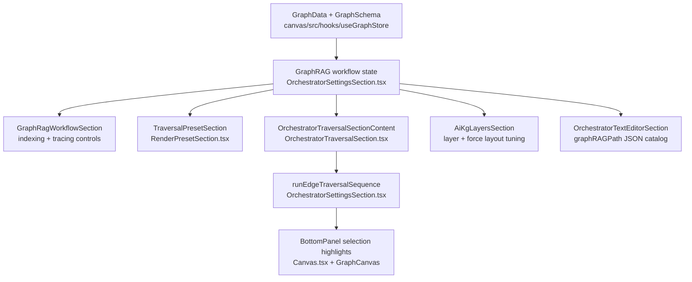

Orchestrator tab surfaces AgenticRAG traversal over the current in-memory GraphData, grounded in schema and selection state.

- UI Editor mode hosts structured controls for traversal presets:
  - Agentic GraphRAG path: reads `graphRAGPath` from node properties, parses it into `ParsedAgenticGraphRagTraversePath` (`query`, `traverse[]`, `multiHop[]`) and `ParsedAgenticGraphRagExamplePath` (`example`, `hops[]`), and derives edge ids in `runGraphRagTraversal` using `buildEdgeIdsForPath` with a fallback to `findGraphRagTraversalEdgeIds` when no explicit `traverse[]` sequence is present (canvas/src/lib/graph/types.ts, canvas/src/lib/graph/graphragTraversal.ts, canvas/src/features/panels/utils/orchestratorTraversal.ts, canvas/src/features/panels/views/OrchestratorSettingsSection.tsx).
  - Neighborhood preset: seeds start node from the current selection, uses depth 2, and leaves edge label filters blank for a local neighborhood walk (canvas/src/features/panels/views/RenderPresetSection.tsx:287).
  - Requires/enables chain preset: seeds start node from the current selection, uses depth 4, and filters to `requires,enables` labels so multi-hop dependency chains stay interpretable (canvas/src/features/panels/views/RenderPresetSection.tsx:287).

- Text Editor mode exposes the Agentic GraphRAG metadata as a read-only JSON catalog plus a traversal legend:
  - Scans all nodes for `graphRAGPath` properties, parses them into `ParsedAgenticGraphRagTraversePath` and `ParsedAgenticGraphRagExamplePath`, and builds a small catalog of AgenticRAG traversal/summary paths (canvas/src/features/panels/views/OrchestratorTextEditorSection.tsx:1-118, canvas/src/lib/graph/graphragTraversal.ts:1-42).
  - Prefers the currently selected node as the active path when it owns `graphRAGPath`; otherwise falls back to the first available path.
  - Serializes `{ activePath, availablePaths[] }`, where each entry includes `ownerNodeId`, `ownerNodeLabel`, lightweight flags describing whether `query`, `example`, `traverse`, `multiHop`, or `hops` are present, and a derived `pathType` field that distinguishes `traverse`, `example`, or `mixed` paths for visual interpretation (canvas/src/features/panels/views/OrchestratorTextEditorSection.tsx:86-111).
  - Renders a compact traversal step legend derived from the current `lastTraversalSummary.edgeIds`, showing human-readable steps such as `Step 1: src/main.py contains run → Step 2: run calls load_data → … → Step N: load_data hasRuntimeEvent runtime:event:aiap22:main`, aligned with the canvas edge playback sequence (canvas/src/features/panels/views/OrchestratorTextEditorSection.tsx:156-227, canvas/src/features/panels/views/OrchestratorSettingsSection.tsx:256-355, canvas/src/hooks/useGraphStore.ts:151-196).
  - Exposes small numeric controls under the legend to tune how many steps are shown in full for GraphRAG traversals versus generic traversals, and how many tail steps are kept when truncating; these thresholds persist across sessions via dedicated LocalStorage keys (`LS_KEYS.orchestratorTraversalLegendGraphRagMaxFull`, `LS_KEYS.orchestratorTraversalLegendGraphRagHead`, `LS_KEYS.orchestratorTraversalLegendGenericMaxFull`, `LS_KEYS.orchestratorTraversalLegendGenericHead`, `LS_KEYS.orchestratorTraversalLegendTail`), keeping semantics aligned with the shared AgenticRAG config surface (canvas/src/features/panels/views/OrchestratorTextEditorSection.tsx:120-127, canvas/src/lib/config.ts:23-95, canvas/src/lib/persistence.ts:113-152).

- Traversal sequence panel adds explicit CRUD for Agentic GraphRAG chains:
  - Path chain renders the owner node plus `traverse[]` node ids with per-node selection controls, derived from branded `AgenticRagNodeId[]` stored on the `GraphRagTraversalSummary` and mapped to labels via `OrchestratorTraversalSectionViewModel.graphNodesById` (canvas/src/features/panels/views/OrchestratorTraversalSectionModel.ts:1-69, canvas/src/features/panels/views/OrchestratorTraversalSequenceSection.tsx:1-141).
  - Edge list shows ordered edges with select and remove controls, allowing users to replay sequences or prune specific edges from the current traversal summary without mutating underlying GraphData (canvas/src/features/panels/views/OrchestratorTraversalSequenceSection.tsx:71-141, canvas/src/features/panels/views/OrchestratorTraversalSection.tsx:1-46).
  - Hops section surfaces both `hops[]` and `multiHop[]` from parsed AgenticRAG paths, with per-entry remove buttons and inline inputs to append new hops or multiHop steps to the in-memory traversal summary for “what-if” exploration (canvas/src/features/panels/views/TraversalSequenceGraphRagEditors.tsx:1-120, canvas/src/features/panels/views/TraversalSequenceGraphRagEditorsLists.tsx:1-120).

- Traversal playback uses shared selection state and timing controls:
  - `runEdgeTraversalSequence` steps through edge ids, toggling edge selection over time and clearing selection when complete (canvas/src/features/panels/views/OrchestratorSettingsSection.tsx:233-261).
  - `traversalDelayMs` in `AiKgLayersSection` tunes playback speed while reusing existing force layout and layer opacity heuristics (canvas/src/features/panels/views/AiKgLayersSection.tsx:1, canvas/src/features/panels/views/OrchestratorSettingsSection.tsx:67-98).

- GraphRAG workflow editor keeps indexing and tracing parameters aligned with the offline pipeline:
  - `GraphRagWorkflowSection` renders a summary card plus collapsible sections for dataset paths, chunking strategy, embedding provider/model, `maxHops`, and AgenticRAG context/ignore filters (canvas/src/features/panels/views/GraphRagWorkflowSection.tsx:1-284).
  - Changes in the UI update the `graphRagWorkflowJsonText` JSON-LD document in the store, validated by `validateGraphRagWorkflowJsonLdObject` and hydrated from `buildGraphRagWorkflowFromGraphData` when no explicit workflow is loaded (canvas/src/features/panels/views/OrchestratorSettingsSection.tsx:100-158, canvas/src/features/panels/utils/graphragConfig.ts:1-120, canvas/src/features/panels/utils/workflowJsonLd.ts:271-295).
  - Tracing options display the last traversal summary beside explanations that reuse the shared `traversalDelayMs` timing control, so AgenticRAG exploration speed stays consistent across presets and free-form traversals (canvas/src/features/panels/views/GraphRagWorkflowSection.tsx:276-337, canvas/src/features/panels/views/OrchestratorSettingsSection.tsx:67-98).

- Guided workflow and help copy align with AgenticRAG semantics:
  - Workflow Step 6 “Agentic reasoning” opens the bottom panel Orchestrator tab and anchors AgenticRAG traversal over the indexed store in the 8‑step pipeline (canvas/src/features/panels/views/WorkflowSection.tsx:377, canvas/src/features/panels/config.ts:58).
  - Spotlight Step 4 links to the Orchestrator tab for AgenticRAG-style traversal, and Step 5 describes Render as the visualization surface for traversal highlights (canvas/src/features/spotlight/config.ts:1).
  - Help “Panel tour” lists Orchestrator between Schema and Render so the pipeline reflects schema → orchestration → render (canvas/src/features/panels/views/HelpView.tsx:377) and reuses the centralized Orchestrator section list from `getOrchestratorSectionListLabel` (`canvas/src/features/panels/config.ts:127`).

End-to-end Orchestrator workflow:

- Typical usage pattern:
  - Start from a validated codebase index and schema. Use the Workflow tab to run the indexing pipeline so `GraphData` and `GraphSchema` are loaded into the canvas store.
  - Open the Orchestrator tab and use the UI Editor view. The header card shows the active `GraphRAGWorkflowJsonLd`, either loaded from the Workflow exports or generated from the current graph.
  - Adjust dataset paths, chunking, embedding model, and `maxHops` in `GraphRagWorkflowSection` until they match the offline GraphRAG CLI configuration.
  - Use traversal presets to explore: the Neighborhood preset gives a local “what is near here?” view, while the Requires/Enables preset walks dependency chains through `requires,enables` edges.
  - When AgenticRAG paths are embedded in node properties via `graphRAGPath`, use the traversal sequence panel to inspect `traverse[]`, `multiHop[]`, and `hops[]`, edit steps inline, and replay the updated path with controlled timing.
  - Switch to Text Editor mode to inspect the full JSON catalog of available AgenticRAG paths, copy snippets into CLI configs, or verify that the UI changes produce the expected JSON-LD structure.
  - When a graph has an associated DuckDB configuration, use the DuckDB query presets in the Orchestrator UI to copy SQL for call graphs and diagnostics, then adapt them to your dataset. For example, the AIAP22 codebase index ships with presets for compliance, model selection, and training-pipeline call graphs that mirror the `duckdb_queries` block in `configs/graphrag/aiap22-codebase-config.yaml`, so the UI and external GraphRAG CLI share the same DuckDB query vocabulary. Switching datasets or importing a new GraphRAG YAML rehydrates `workflowDoc.duckdbQueries` from configuration and resets the active DuckDB preset and SQL editor contents to match the new configuration, so the presets dropdown and textarea never show stale SQL from a previous dataset (`canvas/src/features/panels/utils/graphragConfig.ts:35-50,52-137`, `canvas/src/features/panels/views/OrchestratorSettingsSection.tsx:119-165,525-571`, `canvas/src/features/panels/views/OrchestratorTraversalPanels.tsx:16-29,258-304`).

The Orchestrator role, traversal tooltips, and traversal preset UI are also captured as AgenticRAG `rag:RoleActionOutcome` JSON-LD fixtures. See `knowgrph-raci-document.md` under “JSON‑LD RoleActionOutcome fixtures for RACI roles” for the Orchestrator row, and `knowgrph-semantics-document.md` for the Orchestrator and traversal tooltip helpers (`ORCHESTRATOR_TRAVERSAL_TOOLTIP`, `WORKFLOW_STEP6_ORCHESTRATOR_TOOLTIP`, `TRAVERSAL_PRESET_UI_TOOLTIP`, and related fixtures in `schema-config/*.jsonld`) that the UI and tests treat as the single source of truth for Role → Actions → Outcome semantics.

Config layers and Tool Menu import:

- Orchestrator config files under `orchestrator-config/...` bind a specific pipeline: they point the parser to a codebase root, declare the index JSON-LD and schema artifacts, and optionally reference a GraphRAG workflow JSON-LD via a `graph.workflow_json` path.
- GraphRAG config files under `configs/graphrag/...` are CLI-first configs: they are treated as the single source of truth for dataset paths, chunking, embeddings, and traversal rules. They are referenced from orchestrator configs via fields like `graph.graphrag_workflow` and from offline entrypoints such as `python -m knowgrph_parser graphrag-pipeline` and `canvas/src/cli/graphrag-config-to-workflow.ts`.
- The Toolbar Tools menu “Orchestrator → Import GraphRAG config” entry loads either a JSON-LD workflow document or a GraphRAG CLI YAML file. When a YAML file is chosen (for example `configs/graphrag/aiap22-codebase-config.yaml`), the importer uses the same YAML→JSON-LD mapping as the CLI (`parseGraphragCliConfigYamlToJsonLd`) to hydrate `graphRagWorkflowJsonText` in the Workflow tab and the Orchestrator settings store.
- For AIAP22, the recommended flow is:
  - Keep `configs/graphrag/aiap22-codebase-config.yaml` as the canonical GraphRAG configuration for the external CLI and DuckDB queries.
  - Wire the AIAP22 orchestrator config to that YAML via its `graph.graphrag_workflow` field and to a generated workflow JSON-LD via `graph.workflow_json`.
  - Use the Tool Menu to import `configs/graphrag/aiap22-codebase-config.yaml` into the Workflow tab so the Main Panel GraphRAG workflow editor reflects the same configuration that drives the offline GraphRAG pipeline.
  - See `docs/knowgrph-ci-cd-document.md` for the AIAP22 GitHub Actions CI pipeline that regenerates the same index, schema, orchestrator config, and GraphRAG workflow artifacts used by the Orchestrator UI.
