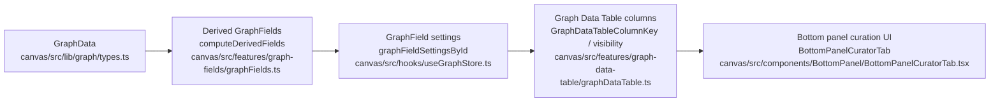

# User Flow Catalog

See also: [Parser Catalog](knowgrph-parsers-catalog.md), [Visualization Catalog](knowgrph-viz-catalog.md), [Workflow Catalog](knowgrph-workflow-catalog.md).

This catalog walks concrete user journeys that sit on top of the same parser/dataset/schema workflow described in the Workflow catalog, using datasets under `test-data/` and schema configs under `schema-config/` rendered through the `canvas/` app.

## AI Engineering Knowledge Graph Traversal

- Scenario: a user wants to explore how an AI Engineering “concept” connects to techniques, components, and challenges using the curated AI‑KG JSON‑LD dataset (`test-data/ai-kg-viz.json`).
- Click path: `Canvas → Panel → Parser tab → Data section → Workflows → "Demo: AI KG Visualization" → Load Data → choose "test-data/ai-kg-viz.json" → Schema tab → import "schema-config/ai-kg-viz-schema.json" → Render tab → "AI KG Traversal" → Data section → Export JSON-LD`
- Flow:
-  1. User opens the canvas (`Canvas` route) and the unified Panel bottom bar.
-  2. User opens the Panel view and clicks the `Demo: AI KG Visualization` workflow button to apply the JSON‑LD parser and record the `(parserSpecId, datasetFileName, schemaFileName)` triple to workflow preset storage (`canvas/src/features/panels/views/ParserSections.tsx:337–350`, `canvas/src/features/parsers/useParserWorkflowState.ts:285–318`).
-  3. User clicks `Load Data` and chooses `test-data/ai-kg-viz.json`; the parser normalizes the JSON‑LD into `{nodes,edges}` with predicates such as `enables`, `requires`, `addresses`, `optimizes`, `extends`, `implements` (`canvas/src/features/parsers/registry.ts:29–47`, `canvas/src/lib/graph/jsonld.ts:25–68`).
-  4. In **Step 3.1. Apply presets from schema-config/** and nested **Step 3.1.1. Apply and manage schema-config presets** inside the Schema tab, the user follows the zero‑to‑one schema flow intro from `SCHEMA_FLOW_INTRO` (“Zero-to-one schema flow for applying presets, tuning rules, and customizing UI.”) and imports the AI‑KG schema config from `schema-config/ai-kg-viz-schema.json`, applying type‑based colors and edge styles tuned to the D3 prototype (`schema-config/ai-kg-viz-schema.json`). The Schema header and Parser tab Schema section reuse the same directive Subject‑Verb‑Object Workflow copy for **Step 3. Apply schema-config** via `SchemaStepCopyAndStatus`, so the user sees identical wording when moving between Workflow and Schema views. The `span` badges for **Step 3**, **Step 3.1**, and **Step 3.1.1.** in the Parser Schema tab, together with the Advanced **Types**/**Properties**/**Styles** subsections, follow the three phases in the Step 3.* S‑V‑O table (presets → rules → UI) from the Workflow catalog.
-  5. User switches to the bottom panel **Render** tab and uses the `AI KG Layers & Traversal` block to:
-   - nudge `Layer 1/2/3 Opacity` so that the inner concept/technique layer is most prominent, mid‑field components slightly softened, and outer challenges faint but still visible (driven by `schema.three.layerOpacityByLayer`);
-   - increase `Force Separation` so address/challenge nodes sit further from the core concept cluster without changing per‑label link distances;
-   - switch `Layer mode` between `property`, `document-structure`, and `semantic` so polygons either reflect JSON-LD array-based groupings, document structure (Document/Section/Paragraph/CodeBlock/List/ListItem/Table), or PMI/cosine-based semantic communities without hard-coding dataset-specific presets;
-   - optionally adjust semantic controls (`schema.layers.semantic.similarityMetric`, `schema.layers.semantic.topKEdgesPerNode`, `schema.layers.semantic.minSimilarity`) to tune how dense semantic edges and communities appear while keeping the configuration metadata-driven and dataset-agnostic;
-   - slow down or speed up `Traversal Delay (ms)` depending on how closely they want to inspect each hop.
-  6. User clicks `AI KG Traversal`; the app uses `findGraphRagTraversalEdgeIds` to read `graphRAGPath.traverse` from the graph and derive the edge ids, then automatically selects each edge along that path in sequence, using the shared selection state to highlight the active path and dim unrelated nodes/edges (`canvas/src/lib/graph/graphragTraversal.ts:1–49`, `canvas/src/features/panels/views/RenderSettingsSection.tsx`, `canvas/src/features/three/ThreeGraph.tsx:215–297`).
-  7. User exports the traversed graph as JSON‑LD/JSON/CSV for downstream GraphRAG tooling via the Panel → Data actions, and exports the AI‑KG schema config for reuse; both export paths align with the Workflow tab’s end‑to‑end steps and the Schema tab’s **Step 3.2. Tune node, edge, and layout rules**, **Step 3.2.1. Refine schema behavior and layout**, **Step 3.3. Customize node and edge UI**, and **Step 3.3.1. Customize node and edge UI with Schema UI Editor** so presets, tuning, and exports stay in a single zero‑to‑one schema setup flow. `SchemaInlineStatus` mirrors this by showing inline schema catalog status next to data status in the Parser and Render sections, reinforcing that Step 3.* is complete before advanced render presets are tuned (`canvas/src/features/panels/ui/SchemaSummary.tsx`).
-  8. On first load, a config‑driven Launch spotlight in the canvas (`SPOTLIGHT_STEPS` in `canvas/src/features/spotlight/config.ts`) adapts its copy to the AI‑KG context and anchors its card near the Parser, Data, Schema, and Render controls via `targetSelector`. Step 1 uses the primary intro variant with longer workflow copy, while Steps 2–4 use secondary, shorter variants that guide users through loading data, applying schema‑config, and tuning AI‑KG 3D render settings, including the `AI KG Layers & Traversal` block.
-  9. The same tour gates progression using `requires` keys mapped to store signals in `LaunchSpotlight` (`canvas/src/pages/Canvas.tsx:21–110`): Step 2 waits for the Parser tab to be open (`'parserOpen'`), Step 3 waits for the Render tab to be open (`'renderOpen'`), and Step 4 waits until the AI‑KG traversal highlight has run (`'traversalRan'`) before marking the exploration phase complete. Users can drag the card, minimize it to a compact pill with `Dismiss` / `Reopen` actions, replay it from the Panel Help tab (`Launch`), toggle it on or off in the Panel Settings tab via the `enableLaunchSpotlight` setting, or invoke it directly from the canvas with Cmd/Ctrl+Shift+G.
-
-Outcome: the user experiences a guided, query‑like traversal over the AI‑KG knowledge graph without learning a new animation API; the behavior is expressed entirely in terms of existing parser, schema, selection, and workflow preset layers.

## Universal Lean Startup Decision Graph

- Scenario: a user wants to explore Lean Startup concepts, decision points, and RAG/GraphRAG workflows using the Universal Lean Startup JSON‑LD dataset (`test-data/universal-lean-startup-kg.json`) and its schema (`schema-config/universal-lean-startup-schema.json`).
- Click path: `Canvas → Panel → Parser tab → Data section → Workflows → "Demo: Universal Lean Startup Knowledge Graph" → Load Data → choose "test-data/universal-lean-startup-kg.json" → Schema tab → import "schema-config/universal-lean-startup-schema.json" → Render tab → explore 2D/3D → Data section → Validate Graph → Export JSON-LD`
- Flow:
-  1. User opens the canvas (`Canvas` route) and the unified Panel bottom bar.
-  2. In the Panel → Data section, the user clicks the `Demo: Universal Lean Startup Knowledge Graph` workflow button (`universal-lean-startup-kg` preset) to:
   - apply the JSON‑LD parser via `parserId: toParserId('jsonld')`;
-   - record the `(parserSpecId, datasetFileName, schemaFileName)` triple for this preset in workflow preset storage (`canvas/src/features/panels/views/ParserSections.tsx:337–350`, `canvas/src/features/parsers/useParserWorkflowState.ts:285–318`);
   - update Parser UI state with a “Preset: Universal Lean Startup Knowledge Graph” status.
-  3. User clicks `Load Data` and chooses `test-data/universal-lean-startup-kg.json`; the loader calls `loadDataViaParser`, which:
   - uses `bestMatch` to select the JSON‑LD parser;
   - hands the filename/text into `parseGraph`/`parseJsonLd` to normalize the JSON‑LD into `{nodes,edges}` where nodes represent Lean Startup entities (Hypothesis, Experiment, MVP, PivotDecision, InnovationAccounting) and decision‑tree nodes (DecisionNode, ConditionNode, ActionNode) (`canvas/src/lib/graph/jsonld.ts`, `schema-config/universal-lean-startup-schema.json`).
-  4. User opens the Schema tab and imports `schema-config/universal-lean-startup-schema.json` as a schema‑config preset:
   - `validateSchema` parses and validates the schema JSON;
   - the schema attaches type/label‑based styles plus validation rules for Lean Startup node/edge types, while remaining data‑driven (no hardcoded Lean‑specific logic in the validator).
-  5. User switches to the Render tab and tunes any Lean‑specific visualization presets encoded in the schema (for example, emphasizing Build‑Measure‑Learn phases, decision nodes, and RAG workflow subgraphs via `schema.three`), using the same generic Render controls as other demos.
-  6. User optionally runs structure validation from the Data section:
   - clicks `Validate Graph`;
   - `validateGraphDataWithSchema` walks the Lean Startup graph, computing metrics (node/edge counts, duplicate IDs, dangling edges, nodes without type, edges without label) and applying schema‑driven rules for Lean node/edge types; results surface as generic errors/warnings in the Data panel.
-  7. User exports the Lean Startup graph via the Data export actions:
   - JSON‑LD: `saveGraphFile` uses the last applied preset’s dataset filename (`test-data/universal-lean-startup-kg.json`) as a branded suggestion while still allowing the user to override it;
   - JSON: `exportGraphAsJSON` uses the same suggested base name;
   - combined CSV: `exportGraphAsCombinedCSV` produces nodes/edges CSV for analysis, again defaulting to the preset‑derived name.
-  8. The user reuses the same schema and presets in future sessions by re‑applying the `universal-lean-startup-kg` workflow button; the core Loader/Parser/Validator/Exporter modules remain unchanged.

- Outcome: the user can treat the Universal Lean Startup graph as a first‑class decision/RAG/GraphRAG dataset while the core pipeline stays RACI‑clean and domain‑agnostic; all Lean‑specific behavior is expressed through data, schema, and presets, not through core code branches.

## Venture Capital Portfolio Exploration

- Scenario: a user wants to explore a venture capital portfolio slice with companies and investors using a raw nodes/edges JSON dataset (`test-data/graph_202512091600.json`) and a shared investors schema (`schema-config/a0-schema.json`).
- Click path: `Canvas → Panel → Parser tab → Data section → Workflows → "Demo: Venture Capital Portfolio" → Load Data → choose "test-data/graph_202512091600.json" → Schema tab → import "schema-config/a0-schema.json" → Data section → Validate Graph → Export JSON / CSV Combined`
- Flow:
-  1. User opens the canvas and Panel bottom bar.
-  2. In the Panel → Data section, the user clicks the `Demo: Venture Capital Portfolio` workflow button (`venture-capital-portfolio` preset), which:
   - selects the JSON parser via `parserId: toParserId('json')`;
-   - stores the `(parserSpecId, datasetFileName, schemaFileName)` triple for this preset (`canvas/src/features/panels/views/ParserSections.tsx:337–350`, `canvas/src/features/parsers/useParserWorkflowState.ts:285–318`);
   - updates Parser UI state with a “Preset: Venture Capital Portfolio” status message.
-  3. User clicks `Load Data` and chooses `test-data/graph_202512091600.json`; the loader:
   - calls `loadDataViaParser` and `applyParserAsync` with the JSON parser;
   - normalizes the raw nodes/edges into `GraphData` where nodes are companies and investors, and edges capture investment relationships; layout‑specific fields (x, y, vx, vy, degree) remain generic properties (`test-data/graph_202512091600.json`, `canvas/src/lib/graph/rawToGraph.ts`).
-  4. User opens the Schema tab and imports `schema-config/a0-schema.json`, the same schema used for the A0 investors JSON‑LD graph:
   - `validateSchema` parses and validates the schema;
   - node and edge styles/validation rules apply uniformly across both A0 and portfolio datasets, confirming that the schema stays domain‑generic and data‑driven.
-  5. User inspects the portfolio structure in the Bottom panel:
   - Nodes table: lists companies and investors with types and properties (for example, degree, name, optional metadata);
   - Edges table: shows investment edges, allowing quick checks of portfolio breadth and co‑investment patterns.
-  6. User runs `Validate Graph` from the Data section:
   - `validateGraphDataWithSchema` computes metrics for the portfolio graph (node/edge counts, duplicate IDs, dangling edges, degree histogram);
   - schema‑driven rules enforce structural constraints (required properties, types) without encoding portfolio‑specific semantics in validation code.
-  7. User exports the portfolio graph:
   - JSON‑LD: `saveGraphFile` suggests `test-data/graph_202512091600.json` (via the last applied preset) as the base name and writes JSON‑LD suitable for GraphRAG/semantic tooling;
   - JSON: `exportGraphAsJSON` provides a raw JSON export with the same suggested base;
   - combined CSV: `exportGraphAsCombinedCSV` generates a unified CSV for downstream BI tooling; all functions accept the branded `DatasetPath` derived from the preset (`canvas/src/__tests__/workflowPresetPipeline.test.ts:94–126`).
-  8. The user can toggle between A0 and portfolio demos by switching presets; both reuse the same schema and pipeline, demonstrating that the Loader/Parser/Validator/Exporter/Renderer roles stay domain‑agnostic even as new portfolio datasets are added.
-
- Outcome: the user can inspect, validate, and export a venture capital portfolio graph using the same workflow as other demos. The example stresses the RACI guarantees by introducing a new dataset that shares schema and export paths with A0 investors while confirming—via tests and presets—that no new domain logic is added to the core pipeline.

### Graph Fields ↔ Graph Data Table pipeline

